```mermaid
graph TD
    A[Open Browser] --> B{Logged in?}
    B -->|Yes| C[Load Dashboard]
    B -->|No| D[Show Login Page]
    D --> E[Enter Credentials]
    E --> F{Auth Success?}
    F -->|Yes| C
    F -->|No| G[Show Error: Invalid credentials]
    G --> D

    C --> H[Display 5 System Cards]
    H --> I[Status Check: All 🟢 Healthy]
    I --> J[Visual Scan < 5s]
    J --> K{Need to access system?}
    K -->|Yes| L[Click System Card]
    K -->|No| M[Close tab / Continue work]

    L --> N[Redirect to subdomain]
    N --> O[System loads successfully]
    O --> P[Work in system]
    P --> Q{Switch to another system?}
    Q -->|Yes| R[Return to Dashboard]
    Q -->|No| S[Continue working]

    R --> C
```

```mermaid
graph TD
    A[First login detected] --> B[Dashboard loads normally]
    B --> C[Welcome modal appears]
    C["Welcome to Zyncdata Dashboard!<br/><br/>Quick tour to help you get started?<br/>(Takes 30 seconds)"]
    C --> D{User choice}

    D -->|Yes - Start Tour| E[Step 1: Status Badges]
    E --> F[Highlight badge area]
    F["These badges show system health:<br/>🟢 Healthy<br/>🔴 Down<br/>🟡 Slow"]
    F --> G[Step 2: System Cards]
    G --> H[Highlight cards]
    H["Click any card to access that system<br/>Hover for quick status info"]
    H --> I[Step 3: Alert Banner]
    I --> J[Highlight banner area]
    J["Critical issues appear here<br/>You'll know immediately if something's wrong"]
    J --> K[Tour Complete]
    K["You're all set!<br/>[Start Using Dashboard]"]
    K --> L[Mark tour as completed]

    D -->|No - Skip Tour| M[Close modal]
    M --> N[Store preference: tour_skipped]

    L --> O[Normal dashboard usage]
    N --> O
```

# UX Design Specification zyncdata

**Author:** Jiraw
**Date:** 2026-02-03

---

<!-- UX design content will be appended sequentially through collaborative workflow steps -->

## Executive Summary

### Project Vision

**Zyncdata** is an Enterprise Access Management Platform designed to transform operational complexity into competitive advantage. It serves as an "invisible gateway" - a single access point that makes navigating multiple systems effortless while showcasing DxT Solutions' portfolio with professional polish.

**The Vision:** Replace the bookmark hunt chaos with a seamless, instant access experience. From scattered URLs and mental fatigue to a clean dashboard and 50%+ time savings.

**Dual Purpose:**
1. **Internal Productivity Tool** - Solve daily workflow friction for Jiraw (Multi-System Administrator)
2. **Professional Portfolio Showcase** - Create impressive first impression for DxT clients and partners

**Core Philosophy:** "Technology that feels invisible" - Following DxT AI's principle that the best technology is the kind you don't think about because it just works.

---

### Target Users

**Primary User: Jiraw - The Solo Operations Hero**
- **Role:** Multi-System Administrator managing 5 production systems (TINEDY, VOCA, ENEOS, rws, BINANCE)
- **Current Pain:** Bookmark hunt, tab chaos, 1-2 minutes wasted per navigation cycle, mental fatigue from context switching
- **Goal:** Single access point, visual system overview, proactive health monitoring, 50%+ time savings
- **Tech Level:** High (developer background)
- **Device:** Desktop/Laptop primary
- **Success Criteria:** Uses zyncdata.app 5+ days/week, emotional score 4-5 stars after Week 3

**Secondary User: DxT Team - CMS Administrators**
- **Role:** Platform administrators managing Zyncdata for all client systems
- **Current Pain:** Developer dependency - must wait for Jiraw to add systems or modify content
- **Goal:** Self-service system management, add/edit/delete in <10 minutes, content control, analytics access
- **Tech Level:** Intermediate (needs self-explanatory UI)
- **Device:** Desktop/Laptop
- **Success Criteria:** 80%+ independence (manage systems without developer help)

**End User: Client Organization Employees**
- **Role:** Employees using DxT client systems (ENEOS, TINEDY, VOCA staff)
- **Current Behavior:** Direct subdomain access or via zyncdata.app
- **Goal:** Easy system access, simple UX, zero confusion
- **Tech Level:** Mixed (some non-tech-savvy)
- **Device:** Desktop and Mobile
- **Success Criteria:** 95%+ first-time success without help, <2 clicks to access system

---

### Key Design Challenges

**Challenge 1: The "Invisible Gateway" Paradox**
- Must be "invisible" (non-intrusive) yet "memorable" (daily habit formation)
- Solution: Sub-0.5s load time, clean UI, obvious navigation, visual status indicators
- Risk: If slow or confusing → users revert to bookmarks (adoption failure)

**Challenge 2: Multi-Level User Experience**
- Three distinct user groups with different skill levels and needs
- Jiraw needs speed + efficiency, DxT Team needs self-explanatory CMS, End Users need simplicity
- Solution: Progressive disclosure, contextual help, clear visual hierarchy
- Risk: Too complex = DxT Team afraid to touch CMS, too simple = lacks power features

**Challenge 3: Trust Through Real-Time Monitoring**
- Critical moment: When ENEOS goes offline, status indicator must be accurate and immediate
- Solution: 60-second health check intervals, clear visual states (🟢/🔴/🟡), last checked timestamp
- Risk: Inaccurate or outdated status → trust loss → portal abandonment

**Challenge 4: CMS Self-Service Without Training**
- DxT Team must add new system in <10 minutes with zero training
- Solution: Wizard-based flow, inline help, preview before publish, undo/edit capability
- Risk: Complex CMS → continued developer dependency (goal failure)

---

### Design Opportunities

**Opportunity 1: "Wow Moment" Through Professional Polish**
- Zyncdata is portfolio showcase - first impression critical
- Smooth animations, DxT AI branding consistency, professional card layout, micro-interactions
- Target: External viewers rate 4+ stars (validates professional impression goal)

**Opportunity 2: Proactive Health Monitoring as Core Value**
- Status indicators aren't "nice to have" - they're the differentiation
- Visual hierarchy (offline systems top), color psychology (🟢🔴🟡), dashboard summary
- Impact: Jiraw knows problems before clicking = time savings + frustration reduction

**Opportunity 3: First-Time User Delight**
- End users must "get it" within 5 seconds of landing
- Self-explanatory cards, visual affordance (clickable appearance), zero instructions, mobile-responsive
- Target: 95%+ first-time users succeed without help

**Opportunity 4: Error Recovery as Confidence Builder**
- DxT Team fears "breaking production" - prevent through smart UX
- Preview mode, confirmation dialogs, quick undo (fix in <2 min), clear messages
- Impact: Confidence = 80%+ independence (self-service goal achieved)

---

## Core User Experience

### Defining Experience

**Zyncdata's core experience revolves around one fundamental interaction: instant, effortless system access.**

**The Core Loop:**
1. User opens zyncdata.app (< 0.5s load time)
2. Visual dashboard presents all systems with real-time health status
3. User identifies target system (logo + name + status indicator)
4. Single click redirects to target subdomain (< 300ms)
5. User accomplishes their work in the target system

**What Makes This Special:**
This isn't just a link aggregator - it's an **intelligent gateway** that combines speed, visual status awareness, and professional presentation into a seamless experience. Users spend zero mental energy navigating between systems because the portal does the thinking for them.

**The "Invisible Gateway" Experience:**
- **Invisible:** Interface so clean and fast that users don't consciously think "I'm using a portal"
- **Intelligent:** Real-time health indicators provide proactive awareness (know before you click)
- **Instant:** Speed creates habit - faster than bookmarks, faster than memory

**Value Proposition Per User Type:**
- **Jiraw:** Visual command center replacing bookmark chaos (50%+ time savings)
- **DxT Team:** Self-service platform management replacing developer dependency
- **End Users:** Professional, intuitive access point showcasing DxT's technical excellence

---

### Platform Strategy

**Primary Platform: Web Application**
- **Technology:** Next.js (React framework) deployed on Vercel
- **Architecture:** SSR/ISR (Server-Side Rendering + Incremental Static Regeneration) for optimal performance
- **Delivery:** Vercel Edge Network for global CDN distribution

**Device & Interaction Paradigm:**
- **Primary Devices:** Desktop/Laptop (Jiraw + DxT Team workflow context)
- **Secondary Devices:** Mobile (End Users may access via smartphone/tablet)
- **Minimum Support:** 375px width (iPhone SE) for responsive design
- **Interaction Methods:**
  - Mouse/Keyboard primary (desktop workflow)
  - Touch-friendly (mobile responsive, tap targets ≥ 44px)

**Browser Compatibility:**
- Chrome, Firefox, Safari (latest 2 versions each)
- Modern JavaScript (ES6+) with graceful degradation

**Platform Capabilities Leveraged:**
- **Browser Local Storage:** Session management, user preferences
- **Server-Side State:** CMS changes propagate instantly via ISR cache invalidation
- **Fast CDN Delivery:** Edge caching for sub-0.5s load times

**Health Monitoring Approach (MVP - Validation-Driven):**
- **MVP Phase:** 5-minute polling interval (pragmatic start)
- **Status States:** Binary only (🟢 Online / 🔴 Offline)
- **Data Storage:** Current status only (no historical logs in MVP)
- **Implementation:** Vercel Cron Job → HTTP HEAD requests → Database status updates
- **Validation Plan:** Track Jiraw's usage Week 1-4, measure engagement, interview for insights
- **Post-Validation Path:** Upgrade to 60-second real-time monitoring if proven valuable through usage data
- **Rationale:** Start simple, validate feature value before complex infrastructure investment

**Platform Constraints:**
- **No Offline Mode:** Requires active internet connection (cloud-based monitoring)
- **No Native App:** Web-first approach (installable PWA considered for Phase 2)
- **Browser-Based Auth:** Session management via httpOnly cookies (secure, no localStorage)

---

### Effortless Interactions

**Interaction 1: Instant Portal Access**
- **User Action:** Type `zyncdata.app` in browser
- **System Response:** Page loads in < 0.5s (cached) or < 2s (first load)
- **Effortless Because:** No login required for public portal, immediate visual feedback
- **Design Requirements:** Optimized assets, lazy loading, CDN caching

**Interaction 2: Visual System Recognition**
- **User Action:** Scan dashboard for target system
- **System Response:** Cards display logos, names, descriptions, and current status (🟢/🔴)
- **Effortless Because:** Visual hierarchy, familiar logos, color-coded status (no reading required)
- **Design Requirements:** Large touch targets (≥ 80px cards), clear typography, status icon prominence

**Interaction 3: One-Click Redirect**
- **User Action:** Click system card
- **System Response:** Instant redirect (< 300ms) to target subdomain
- **Effortless Because:** Zero confirmation dialogs, zero loading spinners, just works
- **Design Requirements:** Client-side navigation, prefetch on hover (desktop), instant feedback

**Interaction 4: Proactive Status Awareness (MVP - Simple & Validated)**
- **User Action:** Glance at dashboard
- **System Response:** Current system status visible (🟢 Online / 🔴 Offline), last checked timestamp
- **Effortless Because:** Simple visual indicator (green = good, red = investigate), safety net awareness
- **MVP Design:** Binary status badge, "Last checked: 3 minutes ago" timestamp, 5-minute refresh acceptable
- **Design Requirements:** Clear status badge, prominent for offline systems (visual hierarchy), non-intrusive for all-online state

**Interaction 5: CMS Self-Service (DxT Team)**
- **User Action:** Add new system via CMS
- **System Response:** Form with clear labels, logo upload, preview mode, publish button
- **Effortless Because:** Wizard-style flow, inline help, no technical jargon, visual confirmation
- **Design Requirements:** Progressive disclosure, preview before publish, undo capability, success messages

---

### Critical Success Moments

**Moment 1: First Load - "The Wow Moment"**
- **When:** First time user opens zyncdata.app
- **What Happens:** Sees professional landing page with DxT branding, 5 system cards, clean layout
- **User Emotion:** Impressed → Curious → Confident
- **Success Criteria:** Within 5 seconds, user understands this is a portal and identifies all 5 systems
- **Failure Mode:** Slow load (> 2s) or confusing layout → user bookmarks subdomain directly instead
- **Design Priority:** Performance optimization, clear visual hierarchy, professional polish

**Moment 2: Status Indicator Trust - "The Reliability Moment" (MVP - Pragmatic Start)**
- **When:** System goes offline (e.g., ENEOS maintenance or failure)
- **What Happens:** User sees 🔴 red indicator within 5 minutes of downtime, checks dashboard
- **User Emotion:** Alert → Informed → Trusting (safety net exists)
- **Success Criteria (MVP):** Status accurate within 5 minutes, visual state clear, "last checked" timestamp visible
- **MVP Trade-off:** 5-minute latency acceptable if overall reliability high (90%+ systems online most of time)
- **Validation Metric:** Track how often Jiraw checks status indicator (Week 1-4) - if high usage → upgrade to 60s
- **Failure Mode:** Indicator shows 🟢 but system offline (false positive) → trust destroyed → portal abandoned
- **Future Enhancement:** Real-time 60-second intervals if proven valuable through usage data
- **Design Priority:** Visual prominence of offline status, clear "last checked" timestamp, simple binary state

**Moment 3: CMS First Success - "The Independence Moment"**
- **When:** DxT Team member adds first system via CMS (no Jiraw help)
- **What Happens:** Fills form, previews, publishes, sees new system appear on live portal
- **User Emotion:** Nervous → Focused → Accomplished → Empowered
- **Success Criteria:** Completes task in < 10 minutes without asking for help
- **Failure Mode:** Confusion, errors, or fear of "breaking production" → still depends on Jiraw
- **Design Priority:** Self-explanatory UI, preview mode, confirmation dialogs, undo capability

**Moment 4: Redirect Speed - "The Habit Formation Moment"**
- **When:** Every time user clicks a system card (daily repetitive action)
- **What Happens:** Instant redirect (< 300ms) to target subdomain
- **User Emotion:** Satisfied → Efficient → Habitual
- **Success Criteria:** Redirect feels faster than searching bookmarks (50%+ time savings)
- **Failure Mode:** Slow redirect (> 1s) or multiple clicks needed → feels like wasted time → reverts to direct URLs
- **Design Priority:** Client-side navigation, prefetching, instant visual feedback

**Moment 5: Error Recovery - "The Confidence Builder"**
- **When:** DxT Team accidentally deletes or misconfigures a system
- **What Happens:** Realizes mistake, edits or re-adds within 2 minutes
- **User Emotion:** Panic → Relief → Confident
- **Success Criteria:** Can undo or fix mistake quickly without permanent damage
- **Failure Mode:** No undo, permanent deletion, or requires DB restore → fear of using CMS
- **Design Priority:** Soft delete (30-day recovery), edit capability, clear error messages

---

### Experience Principles

These principles guide every UX decision for Zyncdata:

**Principle 1: Speed is Trust**
- Every interaction must be fast (< 0.5s load, < 300ms redirect, < 1s CMS saves)
- Speed creates habit formation - faster than bookmarks means daily adoption
- Slow performance = immediate trust loss and portal abandonment
- **Application:** Performance budgets, lazy loading, CDN optimization, client-side navigation

**Principle 2: Invisible by Design**
- UI must be so clear that it requires zero cognitive load
- Great UX is when users don't consciously think "I'm using a tool" - it just works
- Following DxT AI's core philosophy: "The best technology is invisible"
- **Application:** Clean layouts, obvious navigation, self-explanatory labels, minimal steps

**Principle 3: Status Transparency Builds Confidence (Start Simple, Scale Smart)**
- Simple status indicator (🟢/🔴) provides safety net awareness without complexity
- MVP: 5-minute polling validates feature value before infrastructure investment
- Trust through reliability, not necessarily real-time perfection
- **Validation-Driven:** Scale up to 60s real-time monitoring if proven essential through usage data
- **Application:** Binary status checks, clear visual states, "last checked" timestamps, progressive enhancement strategy

**Principle 4: Self-Service Without Friction**
- CMS must be self-explanatory - no training or documentation required for basic tasks
- Error recovery should be quick (< 2 minutes to undo or fix)
- Confidence through safety nets (preview, confirmations, soft deletes)
- **Application:** Wizard flows, inline help, preview mode, undo capability, clear messages

**Principle 5: Professional Polish Creates Credibility**
- Zyncdata is a portfolio showcase - first impressions determine success
- Smooth animations, consistent DxT branding, and micro-interactions signal quality
- Professional polish = external validation (4+ star ratings from DxT clients)
- **Application:** DxT AI brand guidelines, smooth transitions, loading states, success confirmations

**Principle 6: Progressive Disclosure for Multi-Level Users**
- Simple by default (End Users see clean portal), powerful when needed (CMS for admins)
- Don't overwhelm beginners, don't limit power users
- Right information at the right time for the right user
- **Application:** Role-based UI, contextual help, advanced features hidden until needed


---

## Desired Emotional Response

### Primary Emotional Goals

**Zyncdata transforms users from Overwhelmed Operators to Confident Commanders through Empowered, Efficient, and Trusting experiences.**

**Holistic Framework (Head + Heart + Hands):**
- **Head:** Empowered, Efficient, Informed
- **Heart:** Relief, Peace, Confidence
- **Hands:** Fast, Smooth, Delightful

**Identity Transformations:**
- **Jiraw:** Overwhelmed Operator → Confident Commander
- **DxT Team:** Dependent Requesters → Autonomous Administrators
- **End Users:** Confused Visitors → Trusting Users

---

### Emotional Prioritization Tiers

**Tier 1 (Non-Negotiable - MVP):** Trusting, Efficient, Confident
**Tier 2 (Enhancement - MVP):** Impressed, Relieved, Peace
**Tier 3 (Long-Term):** Pride, Identity Shift

**Validation:** Week 1-2 (Tier 1) → Week 3-4 (Tier 2) → Month 2-3 (Tier 3)

---

### Emotional Journey

1. **First Discovery** - Impressed (professional polish)
2. **First Use** - Satisfied (speed revelation)
3. **Daily Usage** - Efficient + Relieved (habit formation)
4. **Critical Moment** - Trusting (status accuracy)
5. **Long-Term** - Commander Identity (behavior change)
6. **Advocacy** - Pride (tells others)

---

### Emotional Design Principles

1. **Transparency Builds Trust** (Tier 1) - Accurate status, timestamps
2. **Speed Creates Confidence** (Tier 1) - < 0.5s = empowered
3. **Safety Nets Encourage Action** (Tier 1) - Preview, undo
4. **Visceral Relief** (Tier 2) - Everything in one place
5. **Micro-Interactions Signal Care** (Tier 2) - Smooth animations
6. **Consistency = Comfort** (Tier 1) - Predictable behavior
7. **Identity Transformation** (Tier 3) - Command center metaphor
8. **Prioritize by Criticality** (Meta) - Tier 1 → 2 → 3


---

## UX Pattern Analysis & Inspiration

### Inspiring Products Analysis

**Vercel Dashboard** - Card-based project navigation with instant status visibility
- Fast performance (< 0.5s load), one-click access, clean branding
- Lesson: Status indicators as first-class visual elements

**Linear** - Command palette with smooth 60fps animations
- Keyboard shortcuts, progressive disclosure, professional polish
- Lesson: Micro-interactions matter - signals care and quality

**Notion Dashboard** - Quick access blocks with zero-onboarding UI
- Self-explanatory interface, flexible organization, fast inline editing
- Lesson: Visual affordance - make clickable things LOOK clickable

**Datadog Dashboard** - Real-time status overview with color psychology
- Green/red/yellow indicators, "last updated" timestamps, alert thresholds
- Lesson: Trust through transparency - show real status, don't hide problems

**Stripe Dashboard** - Professional polish with instant feedback
- Clear error messages, preview before action, inline documentation
- Lesson: Safety nets encourage action - preview + undo = confidence

---

### Transferable UX Patterns

**Navigation Patterns:**
- **Card-based grid** (Vercel) - Visual, scannable, scales well
- **Status badge prominence** (Datadog) - Proactive awareness before clicking
- **"Last checked" transparency** - Trust through data freshness visibility

**Interaction Patterns:**
- **One-click access** (Vercel, Linear) - No confirmation dialogs, instant redirect
- **Preview before publish** (Stripe) - Reduces fear, encourages exploration
- **Instant feedback** (Linear, Stripe) - Loading states, success confirmations visible

**Visual Patterns:**
- **Professional polish** (Linear, Stripe) - Smooth animations, micro-interactions
- **Command palette** (Linear) - Cmd/Ctrl+K quick access (Phase 2)
- **Self-explanatory labels** (Notion, Stripe) - No jargon, human-readable

---

### Anti-Patterns to Avoid

❌ **Hidden status information** - Defeats dashboard purpose, should be glanceable
❌ **Slow loading dashboards** - Feels slower than bookmarks = abandonment
❌ **Confirmation dialog overload** - Creates friction, slows workflow
❌ **Generic error messages** - Users feel helpless, can't fix problems
❌ **Cluttered dashboards** - Cognitive overload, overwhelming
❌ **Inconsistent branding** - Looks unprofessional, reduces trust
❌ **No undo capability** - Fear prevents action, blocks self-service

---

### Design Inspiration Strategy

**Adopt (Use As-Is):**
1. Card-based grid navigation (Vercel) - Visual, scalable
2. Status badge prominence (Datadog) - Tier 1 emotion (Trusting)
3. One-click redirect (Linear/Vercel) - Tier 1 emotion (Efficient)
4. Professional polish (Stripe/Linear) - Tier 2 emotion (Impressed)

**Adapt (Modify for Zyncdata):**
1. Preview before publish (Stripe → simplified) - Client-side preview
2. Real-time updates (Datadog → pragmatic) - 5-min polling MVP, upgrade if validated
3. Command palette (Linear → Phase 2) - Not MVP-critical
4. System ordering (Notion → manual) - DxT Team control vs auto-sort

**Avoid (Conflicts with Goals):**
1. Hidden navigation - Conflicts with "Invisible Gateway"
2. Slow animations (> 300ms) - Conflicts with Speed = Confidence
3. Tutorial modals - Conflicts with 95%+ first-time success goal
4. Confirmation overload - Conflicts with Tier 1 emotion (Efficient)

---

### Pattern-to-Emotion Mapping

**This table connects each UX pattern to its primary emotional goal, showing how design decisions support user transformation.**

| Pattern | Primary Emotion | User Context | Visual/Interaction Cue | Emotional Tier |
|---------|----------------|--------------|----------------------|---------------|
| **Card-based grid** | Efficient | Jiraw's bookmark hunt pain | Scannable layout, visual hierarchy | Tier 1 |
| **Status badge prominence** | Trusting | Proactive health monitoring need | Color psychology (🟢🔴🟡), prominent position | Tier 1 |
| **One-click redirect** | Relief | Saves 1-2 min per navigation cycle | No confirmation dialog, instant action | Tier 1 |
| **Last checked timestamp** | Trusting | Status accuracy validation | "Last checked: 3 min ago" text | Tier 1 |
| **Professional polish** | Impressed | First impression (portfolio showcase) | Smooth animations, DxT AI branding | Tier 2 |
| **Preview before publish** | Confident | DxT Team fears breaking production | "Preview" button, live draft view | Tier 1 |
| **Self-explanatory labels** | Peace | Zero training requirement | No jargon, clear button text | Tier 2 |
| **Command palette** | Empowered | Power user identity (Commander) | Cmd/Ctrl+K shortcut, keyboard-first | Tier 3 |

**Key Insight:** Tier 1 patterns are non-negotiable MVP features - they directly enable Trust, Efficiency, and Confidence. Tier 2-3 patterns enhance the experience but aren't blockers to core value delivery.

---

### Pattern Sequencing for Emotional Journey

**This narrative arc shows how patterns combine to create Jiraw's transformation from Overwhelmed Operator to Confident Commander.**

**ACT 1: First Discovery (0-5 seconds)**
- **Goal:** Create "Wow Moment" through professional impression
- **Patterns Applied:**
  - Professional polish (Stripe/Linear) → Smooth load animation, DxT AI branding
  - Card-based grid (Vercel) → Clean visual hierarchy, 5 systems instantly visible
  - Self-explanatory labels (Notion) → No instructions needed, obvious purpose
- **User Emotion:** Impressed → "This looks legit, not a hastily-built tool"
- **Critical Success:** User understands portal purpose within 5 seconds

**ACT 2: First Use (First click, 5-10 seconds)**
- **Goal:** Speed revelation - faster than bookmarks
- **Patterns Applied:**
  - One-click redirect (Vercel/Linear) → No confirmation, instant action (< 300ms)
  - Instant feedback (Linear/Stripe) → Visual click state, smooth transition
- **User Emotion:** Satisfied → "Whoa, that was FAST!"
- **Critical Success:** Redirect feels effortless, creates positive association
- **Connection to PRD:** Addresses "Jiraw's Morning Ritual" - 9:00 AM rush to check systems

**ACT 3: Daily Usage (Week 1-2, Habit Formation)**
- **Goal:** Establish trust through consistency and reliability
- **Patterns Applied:**
  - Status badge prominence (Datadog) → Visual awareness before clicking
  - Last checked timestamp → Trust through transparency
  - Consistency → Predictable behavior, same layout daily
- **User Emotion:** Efficient + Relieved → "Everything in one place, I can trust this"
- **Critical Success:** Uses portal 5+ days/week, stops using bookmarks
- **Connection to PRD:** "ENEOS offline moment" - status indicator prevents wasted clicks

**ACT 4: Critical Moment (System Failure Event)**
- **Goal:** Build deep trust through accuracy during crisis
- **Patterns Applied:**
  - Status transparency (Datadog) → Red indicator shows ENEOS offline
  - Color psychology → 🔴 catches attention immediately
  - Last checked timestamp → "Last checked: 3 min ago" validates freshness
- **User Emotion:** Trusting → "The portal caught this before I wasted time clicking"
- **Critical Success:** Status accuracy validated, trust solidified
- **MVP Context:** 5-min polling latency acceptable if consistent and reliable

**ACT 5: Long-Term Mastery (Month 2-3, Identity Shift)**
- **Goal:** Identity transformation - from Operator to Commander
- **Patterns Applied:**
  - Command palette (Linear) → Cmd+K quick access (Phase 2)
  - Visual command center → Dashboard as central hub
  - Self-service CMS → Control without developer dependency (for DxT Team)
- **User Emotion:** Commander Identity → "I control everything from here"
- **Critical Success:** Behavioral change - portal becomes primary workflow tool
- **Long-Term Vision:** Tells others about Zyncdata, showcases to DxT clients

**ACT 6: Advocacy (Month 3+, Pride)**
- **Goal:** External validation through word-of-mouth
- **Patterns Applied:**
  - Professional showcase → Impresses DxT clients/partners
  - Consistent branding → Portfolio piece for DxT AI
- **User Emotion:** Pride → Recommends Zyncdata to other teams
- **Success Metric:** 4+ star ratings from external viewers

**Narrative Principle:** Each pattern serves a specific moment in the user journey. The sequence matters - trust must be built before transformation can occur. Fast + Reliable (Tier 1) → Polished (Tier 2) → Empowered (Tier 3).

---

### Pattern Implementation Notes

**This section clarifies technical constraints, performance budgets, and pattern conflict resolution.**

#### Pattern 1: Card-Based Grid (Vercel)
- **Technical Implementation:** CSS Grid with 2-4 columns (responsive breakpoints)
- **Performance Budget:** Initial paint < 0.5s, lazy load images below fold
- **Responsive Design:** 1 column (mobile), 2 columns (tablet), 3-4 columns (desktop)
- **Scalability:** Grid scales to 10+ systems without redesign
- **Accessibility:** ARIA labels for card links, keyboard navigation support

#### Pattern 2: Status Badge Prominence (Datadog)
- **Technical Implementation:** 5-minute polling via Vercel Cron Job (MVP)
- **Data Source:** HTTP HEAD requests to each subdomain
- **Status States:** Binary (🟢 Online / 🔴 Offline) - no yellow/degraded in MVP
- **Visual Design:** Badge position top-right of card, 24px circle
- **Performance:** Status check runs server-side, no client overhead
- **Important Clarification:** Unlike Datadog's real-time WebSocket approach, Zyncdata uses pragmatic 5-min polling. "Status badge prominence" refers to visual hierarchy, not real-time tech. Acceptable trade-off for MVP validation.

#### Pattern 3: One-Click Redirect (Vercel/Linear)
- **Technical Implementation:** Standard `<a>` tag with `href`, no JavaScript required
- **Performance:** Prefetch target URLs on hover (desktop only)
- **User Context Split:**
  - **Portal (User-facing):** One-click, no confirmation - Tier 1 Efficiency
  - **CMS (Admin-facing):** Preview before publish - Tier 1 Confidence
- **Pattern Conflict Resolution:** One-click for consumption (Portal), preview for creation (CMS). Different contexts, different patterns.

#### Pattern 4: Professional Polish (Stripe/Linear)
- **Scope Clarification:** "Professional polish" in MVP means CSS-level polish, NOT heavy animations
- **Included in MVP:**
  - Smooth transitions (CSS `transition: all 0.2s ease`)
  - Hover states on cards (subtle shadow/scale)
  - Loading states (spinner on CMS save)
  - DxT AI brand consistency (colors, fonts, logo)
- **Excluded from MVP:**
  - 60fps spring animations (React Spring, Framer Motion)
  - Complex micro-interactions (parallax, physics-based)
  - Lottie animations
- **Performance Budget:** CSS transitions only (negligible bundle impact), defer heavy animation libraries to Phase 2
- **Rationale:** Tier 2 "Impressed" emotion achievable through clean design + fast performance, not animation complexity

#### Pattern 5: Preview Before Publish (Stripe)
- **Technical Implementation:** Client-side preview using live form data (no API call)
- **CMS Context Only:** Applies to system add/edit flow, NOT portal navigation
- **Preview Mode:** Modal overlay showing card appearance with draft data
- **Performance:** Instant preview (< 100ms), no server round-trip
- **Safety Net:** Reduces "fear of breaking production" for DxT Team

#### Pattern 6: Command Palette (Linear)
- **Phase 2 Deferral:** Not MVP-critical, but represents Tier 3 "Empowered" identity
- **Technical Implementation (Future):** Cmd/Ctrl+K trigger, fuzzy search, keyboard-first
- **Why Phase 2:** Validates portal value first, then adds power-user features
- **Strategic Note:** Maya's insight - command palette signals "Commander" identity, not just efficiency tool

#### Performance Budget Summary
- **Initial Load:** < 0.5s (cached), < 2s (first visit)
- **Redirect Time:** < 300ms (client-side navigation)
- **CMS Save:** < 1s (optimistic UI + ISR revalidation)
- **Animation Duration:** ≤ 200ms (CSS transitions only)
- **Bundle Size:** < 200KB initial JS (Next.js code splitting)

#### Pattern Conflict Resolution Framework
When patterns conflict, apply this decision tree:

1. **User Context:** Portal (consumption) vs CMS (creation)?
   - Portal → Optimize for speed (one-click)
   - CMS → Optimize for confidence (preview)

2. **Emotional Tier:** Tier 1 (Trust/Efficiency) beats Tier 2-3
   - If conflict between tiers, prioritize lower tier

3. **Technical Feasibility:** Can we implement without complexity explosion?
   - If high complexity, defer to Phase 2

4. **Validation-Driven:** Can we test with simpler version first?
   - Example: 5-min polling before real-time

---

### Pattern Validation Plan

**This section defines how we'll measure each pattern's success and validate design decisions.**

#### Validation Framework

**Phase 1: Week 1-2 (Tier 1 Validation)**
- **Goal:** Validate core Trust, Efficiency, Confidence patterns
- **Method:** Jiraw usage tracking + weekly interview

**Phase 2: Week 3-4 (Tier 2 Validation)**
- **Goal:** Validate Impressed, Relieved, Peace patterns
- **Method:** DxT Team CMS usage + external viewer ratings

**Phase 3: Month 2-3 (Tier 3 Validation)**
- **Goal:** Validate Commander identity transformation
- **Method:** Behavioral analysis + advocacy metrics

---

#### Pattern-by-Pattern Success Criteria

**Pattern 1: Card-Based Grid Navigation**
- **Success Metric:** Time to identify target system < 3 seconds (vs 10-15s bookmark hunt)
- **Measurement Method:** Screen recording analysis (first 2 weeks)
- **Validation Question:** "How quickly can you find the system you need?"
- **Pass Criteria:** 90%+ of sessions show < 3s visual scan time
- **Fail Action:** Investigate visual hierarchy issues, adjust card size/spacing

**Pattern 2: Status Badge Prominence**
- **Success Metric:** Jiraw checks status indicator 3+ times per week
- **Measurement Method:** Event tracking (badge hover/click analytics)
- **Validation Question:** "Do you check the status before clicking? How often?"
- **Pass Criteria:** 50%+ portal visits include status check behavior
- **Fail Action:** If low usage, status may not be valuable enough → deprioritize 60s real-time upgrade
- **MVP Trade-off:** 5-min polling acceptable if feature validated as useful

**Pattern 3: One-Click Redirect**
- **Success Metric:** Redirect time < 300ms, zero user complaints about speed
- **Measurement Method:** Performance monitoring (Web Vitals), user feedback
- **Validation Question:** "Does the redirect feel instant?"
- **Pass Criteria:** 95%+ redirects < 300ms, no "it's slow" feedback
- **Fail Action:** Investigate prefetch issues, optimize client-side routing

**Pattern 4: Professional Polish**
- **Success Metric:** External viewers rate visual design 4+ stars
- **Measurement Method:** Survey after demo to DxT clients/partners
- **Validation Question:** "Does this reflect DxT AI's professional brand?"
- **Pass Criteria:** 80%+ rate 4-5 stars on professional impression
- **Fail Action:** Visual design iteration, brand guideline refinement

**Pattern 5: Preview Before Publish (CMS)**
- **Success Metric:** DxT Team adds first system in < 10 min, zero "fear of breaking" feedback
- **Measurement Method:** Screen recording + interview
- **Validation Question:** "Did preview mode give you confidence before publishing?"
- **Pass Criteria:** 100% of DxT Team members successfully add system without help
- **Fail Action:** Improve preview clarity, add more safety net features

**Pattern 6: Self-Explanatory Labels**
- **Success Metric:** 95%+ first-time users understand portal purpose within 5 seconds
- **Measurement Method:** User testing (show portal, ask "what is this?")
- **Validation Question:** "What do you think this portal does?"
- **Pass Criteria:** User correctly explains portal purpose without prompting
- **Fail Action:** Clarify labels, add tagline/subtitle

---

#### Validation Decision Framework

**After 4 weeks of data collection, apply this decision tree:**

1. **Pattern Validation Status:**
   - ✅ **Validated (Pass Criteria Met):** Keep pattern, proceed with confidence
   - ⚠️ **Partially Validated (Mixed Results):** Iterate, test again in 2 weeks
   - ❌ **Invalidated (Fail Criteria):** Investigate root cause, consider pattern change

2. **Investment Decisions:**
   - **5-min polling → 60s real-time upgrade:** Only if "Status Badge Prominence" pattern validated with high usage
   - **Phase 2 Command Palette:** Only if Tier 1-2 patterns validated and user requests power features
   - **Animation Library Investment:** Only if CSS polish insufficient for 4+ star ratings

3. **Data Collection Methods:**
   - **Quantitative:** Vercel Analytics, custom event tracking, performance monitoring
   - **Qualitative:** Weekly interview with Jiraw (15 min), DxT Team feedback session (Week 3)
   - **External:** Demo to 3+ DxT clients, collect ratings + feedback

4. **Iteration Cycle:**
   - Week 1-2: Collect baseline data
   - Week 3: First analysis + iteration
   - Week 4: Validate improvements
   - Month 2: Decide on Phase 2 investments

---

**Key Principle:** Design freedom within DxT AI brand guidelines - concept PDF is starting point, not constraint. Patterns are hypotheses to be validated through real usage, not assumptions to be defended.


---

## Design System Foundation

### Design System Choice

**Zyncdata will use Tailwind CSS + shadcn/ui as the design system foundation.**

Tailwind CSS is a utility-first CSS framework that provides low-level utility classes for building custom designs without writing CSS. shadcn/ui is a collection of re-usable components built with Radix UI primitives and Tailwind CSS, designed to be copied into the codebase rather than installed as dependencies.

**Technology Stack:**
- **Core Framework:** Tailwind CSS v3+ (utility-first CSS)
- **Component Library:** shadcn/ui (Radix UI primitives + Tailwind)
- **UI Primitives:** Radix UI (unstyled, accessible components)
- **Styling Approach:** Utility-first with component composition

**Key Characteristics:**
- Zero-runtime CSS (compiled at build time)
- Component ownership (copy to codebase, not npm packages)
- Full customization control (no framework opinions)
- Performance-optimized (PurgeCSS removes unused styles)
- Next.js native integration (official recommendation)

---

### Rationale for Selection

**1. Performance Alignment (Tier 1 Priority)**
- **Zero-runtime overhead:** Tailwind compiles to static CSS at build time, no JavaScript runtime required
- **Bundle size optimization:** PurgeCSS automatically removes unused styles, typically results in < 10KB CSS
- **Performance budget met:** Aligns perfectly with < 0.5s load time and < 200KB initial JS targets from Step 5
- **CDN-friendly:** Static CSS assets cached efficiently on Vercel Edge Network

**2. Customization Freedom (Brand Requirements)**
- **DxT AI Brand Board integration:** Define custom colors (#41B9D5, #5371FF, etc.) and Nunito font as Tailwind design tokens
- **No framework opinions:** Unlike Material UI or Bootstrap, Tailwind has no visual defaults to override
- **Component flexibility:** shadcn/ui components live in codebase, fully modifiable without framework constraints
- **Professional polish achievable:** Modern utility patterns enable Tier 2 "Impressed" emotion without heavy animation libraries

**3. Next.js Ecosystem Fit (Technical Constraints)**
- **Official Next.js recommendation:** Tailwind CSS is the default styling solution in Next.js documentation
- **Vercel optimization:** Automatic CSS optimization in Vercel deployment pipeline
- **SSR/ISR compatible:** No client-side runtime, works seamlessly with server components
- **Developer experience:** First-class TypeScript support, IntelliSense for utility classes

**4. MVP Speed (Validation-Driven Approach)**
- **Rapid prototyping:** Utility classes enable fast iteration without switching between HTML and CSS files
- **Copy-paste components:** shadcn/ui components copied into codebase in minutes, not hours of setup
- **No learning overhead for patterns:** Jiraw (developer) can leverage existing Tailwind knowledge, low barrier to entry
- **Iteration velocity:** Change design tokens once, reflects across entire application instantly

**5. Accessibility and Quality (Non-Functional Requirements)**
- **Radix UI primitives:** Battle-tested accessibility patterns (keyboard navigation, ARIA attributes, focus management)
- **WCAG 2.1 AA compliance:** Radix UI components meet accessibility standards out-of-box
- **Semantic HTML:** Utility-first approach encourages proper HTML structure
- **Screen reader support:** Built into Radix UI primitives used by shadcn/ui

**6. Long-Term Maintainability (Phase 2+ Considerations)**
- **No vendor lock-in:** Components in codebase, not hidden in node_modules
- **Upgrade flexibility:** Tailwind updates don't break components, utility classes backward compatible
- **Team scalability:** DxT Team can understand utility classes without deep CSS knowledge
- **Documentation clarity:** Tailwind documentation comprehensive, shadcn/ui examples clear

**Decision Confidence:**
This choice represents the optimal balance between speed (MVP priority), performance (Tier 1 goal), and brand customization (portfolio showcase requirement). The pragmatic approach aligns with Step 3's "validation-driven" philosophy - start fast, validate value, iterate as needed.

---

### Implementation Approach

**Phase 1: Foundation Setup (Day 1)**

**Step 1: Tailwind CSS Installation**
```bash
# Next.js project (already exists)
npm install -D tailwindcss postcss autoprefixer
npx tailwindcss init -p
```

**Step 2: Configure Design Tokens**
Create `tailwind.config.js` with DxT AI Brand Board tokens:

```javascript
module.exports = {
  content: ['./app/**/*.{js,ts,jsx,tsx}', './components/**/*.{js,ts,jsx,tsx}'],
  theme: {
    extend: {
      colors: {
        'dxt-primary': '#41B9D5',    // DxT AI primary
        'dxt-secondary': '#5371FF',   // DxT AI secondary
        'dxt-accent': '#6CE6E9',      // DxT AI accent
        'dxt-dark': '#545454',        // DxT AI dark
        'dxt-light': '#FFFFFF',       // DxT AI light
      },
      fontFamily: {
        'nunito': ['Nunito', 'sans-serif'],  // DxT AI brand font
      },
      animation: {
        'fade-in': 'fadeIn 0.2s ease-in',
        'slide-up': 'slideUp 0.2s ease-out',
      },
      keyframes: {
        fadeIn: {
          '0%': { opacity: '0' },
          '100%': { opacity: '1' },
        },
        slideUp: {
          '0%': { transform: 'translateY(10px)', opacity: '0' },
          '100%': { transform: 'translateY(0)', opacity: '1' },
        },
      },
    },
  },
  plugins: [],
}
```

**Step 3: Global Styles Setup**
Create `app/globals.css`:

```css
@tailwind base;
@tailwind components;
@tailwind utilities;

@layer base {
  :root {
    --dxt-primary: 65 185 213;
    --dxt-secondary: 83 113 255;
    --dxt-accent: 108 230 233;
  }

  body {
    @apply font-nunito text-dxt-dark bg-dxt-light;
  }
}
```

---

**Phase 2: Component Library Setup (Day 1-2)**

**Step 1: Initialize shadcn/ui**
```bash
npx shadcn-ui@latest init
```

Configuration choices:
- Style: Default
- Base color: Customize with DxT colors
- CSS variables: Yes (for theming)

**Step 2: Install Core Components**
Copy only components needed for MVP:

```bash
# Core components for Zyncdata
npx shadcn-ui@latest add button
npx shadcn-ui@latest add card
npx shadcn-ui@latest add badge
npx shadcn-ui@latest add dialog
npx shadcn-ui@latest add form
npx shadcn-ui@latest add input
npx shadcn-ui@latest add label
npx shadcn-ui@latest add toast
```

Components will be copied to `components/ui/` folder for full customization.

**Step 3: Customize Components**
Modify copied components to match Zyncdata brand:
- Adjust color schemes to use DxT tokens
- Update animation timings to match < 200ms budget
- Add custom status badge variant for health monitoring

---

**Phase 3: Custom Components (Day 2-3)**

Build Zyncdata-specific components using Tailwind + shadcn/ui primitives:

**1. SystemCard Component**
```tsx
// Card-based grid pattern from Step 5
<Card className="hover:shadow-lg transition-all duration-200 cursor-pointer">
  <Badge variant="status" /> {/* Custom status badge */}
  <CardHeader>
    
    <CardTitle>{systemName}</CardTitle>
  </CardHeader>
  <CardDescription>Last checked: {timestamp}</CardDescription>
</Card>
```

**2. StatusBadge Component**
```tsx
// Custom variant for health monitoring
<Badge
  variant={status === 'online' ? 'success' : 'danger'}
  className="absolute top-2 right-2"
>
  {status === 'online' ? '🟢' : '🔴'}
</Badge>
```

**3. CMSForm Components**
- Preview modal (using Dialog component)
- Form inputs with validation (using Form + Input components)
- Toast notifications for success/error feedback

---

**Phase 4: Performance Optimization (Ongoing)**

**1. PurgeCSS Configuration**
Automatic in Tailwind v3+ - removes unused utility classes in production build.

**2. CSS Bundle Analysis**
- Target: < 10KB gzipped CSS (typical Tailwind production output)
- Monitor: Vercel Analytics build size reports

**3. Font Optimization**
```javascript
// next.config.js - Optimize Nunito font loading
const nextConfig = {
  optimizeFonts: true,
}
```

**4. Image Optimization**
Use Next.js Image component for system logos:
```tsx
import Image from 'next/image'
<Image src={logoUrl} width={80} height={80} alt={systemName} />
```

---

### Customization Strategy

**Design Token Hierarchy:**

**Level 1: Brand Foundation (DxT AI Brand Board)**
- Colors: Primary (#41B9D5), Secondary (#5371FF), Accent (#6CE6E9)
- Typography: Nunito font family
- Logo: DxT AI logo variants

**Level 2: Component Tokens (Zyncdata-Specific)**
- Status colors: Online (green-500), Offline (red-500), Checking (yellow-500)
- Card spacing: padding-6, gap-4
- Border radius: rounded-lg (8px)
- Shadow: shadow-md on hover

**Level 3: Interaction Tokens (UX Pattern Requirements)**
- Transition duration: 200ms (matches < 200ms animation budget)
- Hover effects: scale-105, shadow-lg
- Focus rings: ring-2 ring-dxt-primary (accessibility)

---

**Component Customization Approach:**

**1. Adopt As-Is (Use shadcn/ui defaults):**
- Button component (adjust colors only)
- Form components (Input, Label, validation)
- Dialog/Modal (preview before publish pattern)

**2. Modify (Customize for Zyncdata):**
- Card component → SystemCard (add status badge, logo, timestamp)
- Badge component → StatusBadge (custom online/offline variants)
- Toast component → FeedbackToast (success/error messaging)

**3. Build Custom (Zyncdata-unique components):**
- SystemCardGrid (responsive grid layout from Step 5)
- HealthMonitoringDashboard (status overview)
- CMSWizard (step-by-step system creation flow)

---

**Brand Consistency Rules:**

**1. Color Usage:**
- Primary actions: `bg-dxt-primary hover:bg-dxt-primary/90`
- Status indicators: Online = `bg-green-500`, Offline = `bg-red-500`
- Backgrounds: `bg-dxt-light` (white), subtle gradients allowed

**2. Typography Scale:**
- Headings: `font-nunito font-bold` (system names)
- Body text: `font-nunito font-normal` (descriptions)
- Timestamps: `font-nunito text-sm text-gray-500`

**3. Spacing Consistency:**
- Card padding: `p-6`
- Grid gaps: `gap-6` (desktop), `gap-4` (mobile)
- Section margins: `mb-8`

**4. Animation Guidelines:**
- Duration: ≤ 200ms (performance budget from Step 5)
- Easing: `ease-in-out` for smooth feel
- Transforms: `scale`, `translateY` only (GPU-accelerated)

---

**Accessibility Customization:**

**1. Color Contrast:**
- Ensure all DxT colors meet WCAG 2.1 AA (4.5:1 for text)
- Status badges use emoji + color for redundancy

**2. Focus States:**
- All interactive elements: `focus:ring-2 focus:ring-dxt-primary focus:outline-none`
- Keyboard navigation: visible focus indicators

**3. Screen Reader Support:**
- Status badges: `aria-label="System online"` or `aria-label="System offline"`
- Cards: `role="link"` with descriptive labels
- Form errors: `aria-describedby` for validation messages

---

**Responsive Customization:**

**Breakpoint Strategy (Tailwind defaults):**
- Mobile: < 640px (1 column grid)
- Tablet: 640px - 1024px (2 column grid)
- Desktop: > 1024px (3-4 column grid)

**Touch Target Sizing:**
- Cards: min-height 120px, min-width 200px
- Buttons: min-height 44px (iOS/Android guidelines)
- Badge position: 24px from edges (easy thumb reach)

---

**Documentation Strategy:**

**1. Component Documentation:**
- Each custom component: Storybook or inline JSDoc comments
- Props documentation: TypeScript interfaces
- Usage examples: README in `/components` folder

**2. Design Token Documentation:**
- `tailwind.config.js` comments explain each token
- Color palette exported for design team reference
- Figma/design tool sync (future Phase 2)

**3. Pattern Library:**
- Document UX patterns from Step 5 with code examples
- Card-based grid pattern implementation
- Status badge usage guidelines
- CMS form patterns with preview

---

### Component Abstraction Guidelines

**Purpose:** Prevent utility class explosion and maintain code readability (Winston's architectural requirement)

**The Problem:**
```tsx
// ❌ BAD: Utility class explosion (hard to read and maintain)
<div className="flex items-center justify-between p-6 bg-white rounded-lg shadow-md hover:shadow-lg transition-all duration-200 cursor-pointer border border-gray-200 hover:border-dxt-primary">
  <div className="flex flex-col space-y-2">
    <span className="text-lg font-bold text-gray-900">{name}</span>
    <span className="text-sm text-gray-500">{description}</span>
  </div>
</div>
```

**The Solution:**
```tsx
// ✅ GOOD: Abstracted component (clean and maintainable)
<SystemCard
  name={name}
  description={description}
  status={status}
  onClick={handleClick}
/>
```

---

**Abstraction Rules:**

**Rule 1: Max 5-7 Utility Classes Per Element**
- If an element needs more than 7 utility classes, extract to component
- Exception: Grid/flex containers with complex responsive layouts

**Rule 2: Reusable Patterns = Components**
- Used in 2+ places → extract to component
- Example: Status badge appears on cards and in CMS → `<StatusBadge>`

**Rule 3: Business Logic + Styling = Custom Component**
- Don't mix business logic with raw utility classes
- Example: `<SystemCard>` handles click analytics + styling

**Rule 4: shadcn/ui Base Components = Thin Wrappers**
- Keep shadcn/ui components in `/components/ui/` folder
- Custom variants → new component in `/components/`

---

**Component Hierarchy:**

```
Level 1: Utility Classes (Tailwind primitives)
  → Use directly for simple, one-off styling
  → Example: <div className="mt-4 text-center">

Level 2: shadcn/ui Base Components
  → Button, Card, Badge, Dialog, Input, Label
  → Minimal customization, use as-is
  → Example: <Button variant="default">Click</Button>

Level 3: Zyncdata Custom Components
  → SystemCard, StatusBadge, CMSForm
  → Built using Level 1 + Level 2
  → Business logic + styling combined
  → Example: <SystemCard name="ENEOS" status="online" />

Level 4: Page-Level Compositions
  → Dashboard, CMSPage
  → Combine Level 3 components
  → Example: <Dashboard systems={systemsData} />
```

---

**Naming Conventions:**

**Base Components (shadcn/ui):**
- PascalCase, generic names
- Examples: `Button`, `Card`, `Badge`, `Dialog`

**Custom Components:**
- PascalCase, descriptive names
- Prefix with domain if needed
- Examples: `SystemCard`, `StatusBadge`, `CMSWizard`

**Utility Functions:**
- camelCase for helpers
- Example: `cn()` for className merging

---

**Code Organization:**

```
/components
  /ui                    # Level 2: shadcn/ui base components
    /button.tsx
    /card.tsx
    /badge.tsx
    /dialog.tsx
    /form.tsx

  /system-card.tsx       # Level 3: Custom Zyncdata components
  /status-badge.tsx
  /cms-wizard.tsx
  /health-monitor.tsx

  /dashboard.tsx         # Level 4: Page compositions

/lib
  /utils.ts              # Utility functions (cn, formatDate, etc.)
```

---

**Example: SystemCard Abstraction**

```tsx
// components/system-card.tsx
import { Card, CardHeader, CardTitle } from '@/components/ui/card'
import { Badge } from '@/components/ui/badge'
import { cn } from '@/lib/utils'

interface SystemCardProps {
  name: string
  status: 'online' | 'offline'
  logo: string
  lastChecked: string
  onClick: () => void
  className?: string  // Allow external styling if needed
}

export function SystemCard({
  name,
  status,
  logo,
  lastChecked,
  onClick,
  className
}: SystemCardProps) {
  return (
    <Card
      className={cn(
        // Base styling (always applied)
        "relative cursor-pointer transition-all duration-200",
        // Hover effects
        "hover:shadow-lg hover:scale-[1.02]",
        // Conditional styling
        status === 'offline' && "border-red-500 border-2",
        // External overrides
        className
      )}
      onClick={onClick}
    >
      {/* Status Badge - abstracted component */}
      <StatusBadge
        status={status}
        className="absolute top-2 right-2"
      />

      <CardHeader className="space-y-4">
        {/* Logo - Next.js Image optimization */}
        

        {/* System Name */}
        <CardTitle className="text-lg font-bold">
          {name}
        </CardTitle>

        {/* Last Checked Timestamp */}
        <p className="text-sm text-gray-500">
          Last checked: {lastChecked}
        </p>
      </CardHeader>
    </Card>
  )
}
```

---

**Benefits of This Approach:**

1. **Readability:** Component usage is self-documenting
2. **Maintainability:** Change styling in one place, reflects everywhere
3. **Testability:** Test component behavior, not className strings
4. **DxT Team Friendly:** Non-developers use `<SystemCard>`, not utility classes
5. **Type Safety:** TypeScript props prevent invalid usage

---

### Performance Monitoring Plan

**Purpose:** Ensure Tailwind + shadcn/ui meets performance budget throughout development (Winston + John's requirement)

---

**Performance Budget (from Step 5):**

| Metric | Target | Measurement Tool |
|--------|--------|------------------|
| Initial Load Time | < 0.5s (cached), < 2s (first visit) | Lighthouse, Vercel Analytics |
| CSS Bundle Size | < 10KB gzipped | Build analysis, `next/bundle-analyzer` |
| Total JS Bundle | < 200KB initial | `next/bundle-analyzer` |
| Redirect Time | < 300ms | Performance API, Custom logging |
| Animation Duration | ≤ 200ms | Manual testing, Lighthouse |
| Time to Interactive (TTI) | < 2s | Lighthouse |
| Largest Contentful Paint (LCP) | < 2.5s | Lighthouse, Core Web Vitals |

---

**Monitoring Strategy:**

**Phase 1: Development (Week 1 - Setup)**

**Daily Checks:**
- Run `npm run build` and check output size
- Monitor Tailwind CSS output: `dist/styles.css`
- Target: CSS < 15KB uncompressed (< 5KB gzipped with Brotli)

**Tools Setup:**
```bash
# Install bundle analyzer
npm install -D @next/bundle-analyzer

# Configure in next.config.js
const withBundleAnalyzer = require('@next/bundle-analyzer')({
  enabled: process.env.ANALYZE === 'true',
})

module.exports = withBundleAnalyzer({
  // Next.js config
})

# Run analysis
ANALYZE=true npm run build
```

**Week 1 Checkpoint (Day 3):**
- ✅ CSS bundle < 10KB gzipped
- ✅ Initial JS bundle < 200KB
- ✅ Lighthouse score > 90 (Performance)
- ❌ If fails → Investigate and optimize before continuing

---

**Phase 2: Implementation (Week 2-3 - Building Components)**

**Per-Component Checks:**
- Measure bundle size impact when adding new component
- Example: Adding `<SystemCard>` should add < 5KB to bundle

**Tools:**
```bash
# Before adding component
npm run build
# Note bundle size

# After adding component
npm run build
# Compare delta

# Acceptable: < 5KB per component
# Warning: 5-10KB per component
# Critical: > 10KB per component (investigate)
```

**Week 2 Checkpoint (After SystemCard + StatusBadge):**
- ✅ Total bundle < 220KB (200KB + 20KB component overhead)
- ✅ CSS bundle < 12KB gzipped
- ✅ Lighthouse score still > 90
- ❌ If fails → Refactor components, remove unused imports

---

**Phase 3: Pre-Launch (Week 4 - Before Deployment)**

**Full Performance Audit:**

**1. Lighthouse CI (Automated)**
```bash
# Install Lighthouse CI
npm install -D @lhci/cli

# Run audit
lhci autorun --collect.url=http://localhost:3000

# Pass criteria:
# - Performance: > 90
# - Accessibility: > 95
# - Best Practices: > 90
# - SEO: > 90
```

**2. Real Device Testing:**
- Test on Jiraw's actual device (laptop)
- Test on DxT Team devices (desktop/laptop)
- Measure Time to Interactive with Chrome DevTools

**3. Network Throttling Test:**
- Simulate 3G network (Fast 3G: 1.6Mbps down, 750Kbps up)
- Target: Still usable, load < 5s
- Use Chrome DevTools Network throttling

**Week 4 Checkpoint (Launch Readiness):**
- ✅ Lighthouse Performance > 90 (all pages)
- ✅ Real device TTI < 2s (Jiraw's laptop)
- ✅ 3G network load < 5s
- ✅ Core Web Vitals pass (LCP, FID, CLS)
- ❌ If fails → Delay launch, optimize critical path

---

**Phase 4: Production (Post-Launch - Continuous Monitoring)**

**Vercel Analytics Integration:**
```javascript
// app/layout.tsx
import { Analytics } from '@vercel/analytics/react'

export default function RootLayout({ children }) {
  return (
    <html lang="en">
      <body>
        {children}
        <Analytics />  {/* Automatic Core Web Vitals tracking */}
      </body>
    </html>
  )
}
```

**Weekly Monitoring (First 4 Weeks):**
- Check Vercel Analytics dashboard
- Monitor Core Web Vitals: LCP, FID, CLS
- Alert if P75 (75th percentile) exceeds targets

**Monthly Review (Month 2+):**
- Bundle size trend analysis
- Performance regression detection
- Optimize if degradation detected

---

**Alert Thresholds:**

**🟢 GREEN (All Good):**
- CSS bundle < 10KB gzipped
- JS bundle < 200KB
- Lighthouse score > 90
- LCP < 2.5s, FID < 100ms, CLS < 0.1

**🟡 YELLOW (Warning):**
- CSS bundle 10-15KB gzipped
- JS bundle 200-250KB
- Lighthouse score 80-90
- LCP 2.5-4s, FID 100-300ms, CLS 0.1-0.25

**🔴 RED (Critical - Stop and Optimize):**
- CSS bundle > 15KB gzipped
- JS bundle > 250KB
- Lighthouse score < 80
- LCP > 4s, FID > 300ms, CLS > 0.25

---

**Optimization Strategies (If RED Alert):**

**Strategy 1: CSS Optimization**
- Audit Tailwind config: Remove unused theme extensions
- Check PurgeCSS config: Ensure all unused classes purged
- Use `@apply` sparingly (increases CSS bundle)

**Strategy 2: JS Bundle Optimization**
- Dynamic imports for heavy components
- Code splitting by route
- Remove unused shadcn/ui components

**Strategy 3: Image Optimization**
- Use Next.js Image component (automatic optimization)
- Lazy load below-fold images
- Use WebP format for logos

**Strategy 4: Font Optimization**
- Subset Nunito font (only Latin characters if sufficient)
- Use `font-display: swap` to avoid FOIT (Flash of Invisible Text)

---

**Monitoring Dashboard (Week 4+):**

Create simple monitoring dashboard in Vercel:
- Real-time performance metrics
- Bundle size history chart
- Core Web Vitals trends
- Alert notifications (Slack/Email if RED threshold)

---

### Risk Mitigation Strategy

**Purpose:** Address risks identified in Party Mode discussion (John's product analysis)

---

**Risk 1: DxT Team Adoption Challenge**

**Risk Statement:**
DxT Team (intermediate users) may find utility classes intimidating, preventing self-service CMS goal (80%+ independence).

**Probability:** Medium (30-40%)
**Impact:** High (blocks secondary user success criteria)
**Risk Score:** HIGH PRIORITY

**Mitigation Strategy:**

**Phase 1 (MVP - Week 1-4): Abstraction Layer**
- ✅ Build all components with clean APIs (no utility classes exposed)
- ✅ CMS UI = form-based, no code editing required
- ✅ Example: DxT Team fills form → generates SystemCard automatically

```tsx
// DxT Team NEVER sees this (abstracted away)
<SystemCard
  name={formData.name}
  logo={formData.logoUrl}
  status="online"
  onClick={redirectToSystem}
/>

// DxT Team ONLY sees this (form UI)
<CMSForm>
  <Input label="System Name" name="name" />
  <Input label="Logo URL" name="logoUrl" />
  <Button>Preview</Button>
  <Button>Publish</Button>
</CMSForm>
```

**Phase 2 (If Needed - Month 2+): Visual Component Builder**
- If < 50% independence after Week 3 → Build visual editor
- Drag-and-drop card customization
- Color picker for theme colors
- No code required

**Validation Checkpoints:**
- **Week 3:** DxT Team adds 1st system without help
- **Metric:** Time to complete < 10 minutes
- **Target:** 80%+ complete without asking Jiraw
- **Action:** If < 50%, activate Phase 2 plan

---

**Risk 2: Scalability Beyond MVP (10-20 Systems)**

**Risk Statement:**
Card-based grid may not scale elegantly beyond 12-15 systems.

**Probability:** Low (20-30%)
**Impact:** Medium (UI redesign needed in 6-12 months)
**Risk Score:** MEDIUM PRIORITY

**Mitigation Strategy:**

**Design for 12 Cards Minimum:**
- Test responsive grid with 15+ mock cards during Week 1
- Ensure layout doesn't break at 12, 15, 20 cards

**Pagination Strategy (Phase 2 Fallback):**
```tsx
// If > 12 systems, add pagination
<SystemGrid systems={paginatedSystems} />
<Pagination
  currentPage={1}
  totalPages={2}
  onPageChange={handlePageChange}
/>
```

**Filtering Strategy (Phase 2 Fallback):**
```tsx
// If > 15 systems, add search/filter
<SearchBar onSearch={filterSystems} />
<SystemGrid systems={filteredSystems} />
```

**Validation Checkpoints:**
- **Week 1:** Mock 20 cards, test visual hierarchy
- **Month 3:** If > 10 systems, implement pagination
- **Month 6:** If > 15 systems, implement filtering

**Action Plan:**
- Tailwind utilities support pagination/filtering (no redesign needed)
- Estimated effort: 1-2 days implementation if needed

---

**Risk 3: Design System Migration Cost**

**Risk Statement:**
If Tailwind doesn't meet needs, migration to MUI/Chakra would be costly.

**Probability:** Very Low (5-10%)
**Impact:** High (2-3 weeks refactor, momentum loss)
**Risk Score:** LOW PRIORITY

**Mitigation Strategy:**

**Component Abstraction = Migration Insurance:**
- All styling logic in components, not scattered
- Example: If migrating to MUI, only rewrite `<SystemCard>` internals
- Usage remains same: `<SystemCard name="ENEOS" />`

**Migration Path Documentation:**
```tsx
// Current (Tailwind)
export function SystemCard({ name, status }) {
  return (
    <div className="p-6 rounded-lg shadow-md">
      {/* Tailwind utilities */}
    </div>
  )
}

// Future (MUI - if needed)
import { Card } from '@mui/material'

export function SystemCard({ name, status }) {
  return (
    <Card sx={{ padding: 3, borderRadius: 2 }}>
      {/* MUI sx prop */}
    </Card>
  )
}

// Usage stays SAME (no changes in parent components)
<SystemCard name="ENEOS" status="online" />
```

**Validation Checkpoints:**
- **Week 4:** Validate Tailwind meets all UX pattern requirements
- **Month 2:** If professional polish < 4 stars, investigate alternatives
- **Month 3:** If performance budget consistently exceeded, reconsider

**Action Plan:**
- Component abstraction reduces migration cost from 3 weeks → 1 week
- Unlikely scenario given Tailwind's proven track record

---

**Risk 4: Bundle Size Creep**

**Risk Statement:**
Tailwind JIT + shadcn/ui + custom components could exceed 200KB JS budget over time.

**Probability:** Medium (30-40%)
**Impact:** High (performance degradation, user trust loss)
**Risk Score:** HIGH PRIORITY

**Mitigation Strategy:**

**Automated Bundle Size Monitoring:**
- CI/CD pipeline checks every commit
- Fail build if bundle > 220KB (10% buffer)

```yaml
# .github/workflows/bundle-size.yml
name: Bundle Size Check

on: [pull_request]

jobs:
  bundle-size:
    runs-on: ubuntu-latest
    steps:
      - uses: actions/checkout@v2
      - run: npm install
      - run: npm run build
      - run: node scripts/check-bundle-size.js
        # Fails if > 220KB
```

**Weekly Size Reviews:**
- Every Friday, check Vercel Analytics bundle size chart
- Identify heaviest components
- Refactor or lazy-load if exceeding budget

**Optimization Tactics:**
1. Dynamic imports for non-critical components
2. Remove unused shadcn/ui components
3. Tree-shake Radix UI (only import needed primitives)
4. Code split by route (Next.js App Router automatic)

**Validation Checkpoints:**
- **Week 1:** Baseline measurement (expect ~180KB)
- **Week 2:** After components added (expect ~200KB)
- **Week 3:** Full app (must stay < 220KB)
- **Every commit:** Automated check in CI/CD

**Action Plan:**
- If exceeds 220KB → mandatory optimization before merge
- If consistently near 200KB → audit and remove bloat

---

**Risk 5: Dark Mode Future Requirement**

**Risk Statement:**
If DxT AI adds dark mode to brand guidelines, Tailwind refactor may be needed.

**Probability:** Low (20-30%)
**Impact:** Medium (1-2 days refactor)
**Risk Score:** LOW PRIORITY

**Mitigation Strategy:**

**Use CSS Variables from Day 1:**
- shadcn/ui uses CSS variables by default ✅
- Easy to add dark mode later with `dark:` variant

```css
/* Current (light mode only) */
:root {
  --color-primary: 65 185 213;
  --color-background: 255 255 255;
}

/* Future (if dark mode needed) */
@media (prefers-color-scheme: dark) {
  :root {
    --color-primary: 65 185 213;
    --color-background: 15 23 42;  /* Dark background */
  }
}
```

**Validation Checkpoints:**
- **Week 1:** Confirm DxT AI brand = light mode only
- **Month 3:** Check if dark mode in roadmap
- **If needed:** Implement in 1-2 days (CSS variable approach)

**Action Plan:**
- CSS variables make this a LOW risk
- Tailwind `dark:` utilities ready when needed

---

**Risk Summary Dashboard:**

| Risk | Priority | Mitigation Status | Validation Checkpoint |
|------|----------|-------------------|----------------------|
| DxT Team Adoption | HIGH | ✅ Abstraction layer ready | Week 3 independence test |
| Scalability (10-20 systems) | MEDIUM | ✅ Pagination plan documented | Month 3 if > 10 systems |
| Design System Migration | LOW | ✅ Component abstraction protects | Month 2 validation |
| Bundle Size Creep | HIGH | ✅ CI/CD monitoring setup | Every commit automated |
| Dark Mode Requirement | LOW | ✅ CSS variables prepared | Month 3 roadmap check |

**Overall Risk Level:** MANAGEABLE
**Confidence Level:** HIGH (85%)
**Recommendation:** Proceed with Tailwind + shadcn/ui as planned


---

## User Mental Model

### Purpose and Overview

Understanding how users think about their tasks is critical for designing intuitive interfaces. This section analyzes the mental models of Zyncdata's three user groups, revealing their expectations, pain points, and the language/patterns that will feel natural to them.

---

### User Mental Model Analysis (3 User Groups)

#### **1. Jiraw (Primary User - Multi-System Administrator)**

**Current Mental Model (Bookmark Chaos):**
- **How they solve now:** Chrome bookmarks folder "Work Systems" → hunt for correct bookmark → click → wait for load
- **Mental representation:** "URL collection organized by folders"
- **Time investment:** 1-2 minutes per navigation (search + click + mental context switch)
- **Pain points:**
  - Bookmarks scattered across devices
  - No visual indication of system status
  - Mentally tracking which systems are down
  - Context switching fatigue

**Expectations for Zyncdata:**
- **Primary metaphor:** "Command Center" or "Mission Control"
- **Expected interaction:** "Click icon → instantly transported to system"
- **Speed expectation:** Faster than bookmarks (< 1 second total)
- **Visual expectation:** See all systems at a glance, like dashboard widgets
- **Status expectation:** Know if system is down BEFORE clicking (proactive awareness)

**Mental Model Alignment:**
- ✅ **Good fit:** Card-based visual grid = familiar "app launcher" pattern (iOS/Android home screen)
- ✅ **Good fit:** Status badges = familiar "notification dot" pattern
- ⚠️ **Potential confusion:** "Why do I need a portal when I have bookmarks?" → Must be FASTER to justify adoption
- ✅ **Habit formation:** If < 0.5s load + visual benefits → becomes new mental default

**User Interview Insights (from PRD):**
> "Jiraw's Morning Ritual" reveals mental model: Opens 5 systems sequentially, checks status, then dives into work. Current flow takes 5-10 minutes. Mental expectation: Should take < 2 minutes.

---

#### **2. DxT Team (Secondary User - CMS Administrators)**

**Current Mental Model (Developer Dependency):**
- **How they solve now:** Message Jiraw → wait for response → explain requirement → wait for implementation → test → confirm
- **Mental representation:** "Jiraw is the gatekeeper to system management"
- **Time investment:** Hours to days for simple changes (waiting time + back-and-forth)
- **Pain points:**
  - No control over content
  - Fear of breaking production
  - Slow turnaround for simple tasks
  - Bottleneck on Jiraw's availability

**Expectations for Zyncdata CMS:**
- **Primary metaphor:** "WordPress Admin" or "Squarespace Editor"
- **Expected interaction:** "Fill form → preview → publish" (no code)
- **Safety expectation:** Preview before changes go live, undo capability
- **Speed expectation:** Complete task in < 10 minutes without help
- **Visual expectation:** Self-explanatory UI with clear labels, no jargon

**Mental Model Alignment:**
- ✅ **Good fit:** Form-based CMS = familiar "admin panel" pattern (WordPress, Webflow)
- ✅ **Good fit:** Preview before publish = familiar "draft mode" pattern
- ⚠️ **Potential confusion:** "Will I break production?" → Safety nets critical (preview, undo, soft delete)
- ⚠️ **Learning curve:** Utility classes hidden behind components (DxT Team never sees code)

**User Needs Analysis:**
- **Intermediate skill level** → Needs guided workflow (wizard style), not blank canvas
- **Zero training goal** → Self-explanatory labels, inline help, clear button actions
- **Confidence building** → Preview mode = "try before you buy" reduces fear

---

#### **3. End Users (Tertiary User - Client Organization Employees)**

**Current Mental Model (Direct Access):**
- **How they solve now:** Type subdomain directly (eneos.dxt-solutions.com) OR Google search "ENEOS DxT login"
- **Mental representation:** "Each system has its own website"
- **Time investment:** 10-30 seconds (if they remember URL) or 1-2 minutes (if they search)
- **Pain points:**
  - Forget exact subdomain URL
  - Confusion between systems (which one is ENEOS again?)
  - No visual branding to recognize DxT portfolio

**Expectations for Zyncdata:**
- **Primary metaphor:** "Company Portal" or "Intranet Homepage"
- **Expected interaction:** "See all systems → click to access" (2 steps max)
- **Simplicity expectation:** Zero instructions needed, obvious what to do
- **Speed expectation:** Faster than searching Google (< 5 seconds)
- **Visual expectation:** Clear system names + logos = instant recognition

**Mental Model Alignment:**
- ✅ **Good fit:** Card grid with logos = familiar "app marketplace" pattern (App Store, Google Play)
- ✅ **Good fit:** One-click redirect = familiar "shortcut" pattern
- ⚠️ **Potential confusion:** "What is zyncdata.app?" → Clear value prop needed on landing
- ✅ **First-time success:** Visual affordance (clickable cards) = no instructions needed

**User Success Criteria (from PRD):**
> 95%+ first-time users succeed without help, < 2 clicks to access system. Mental model must be instantly recognizable.

---

### Cross-User Mental Model Insights

**Shared Mental Models:**
- All users expect **speed** (faster than current solution)
- All users expect **visual clarity** (see, don't read)
- All users expect **reliability** (works every time)

**Divergent Mental Models:**
- **Jiraw:** "Command center" (control + awareness)
- **DxT Team:** "Admin panel" (self-service + safety)
- **End Users:** "Portal" (simplicity + speed)

**Design Implications:**
1. **For Jiraw:** Status transparency = critical (Dashboard view with health monitoring)
2. **For DxT Team:** Safety nets = critical (Preview, undo, clear error messages)
3. **For End Users:** Zero onboarding = critical (Self-explanatory cards, no instructions)

---

### Mental Model Validation Strategy

**Week 1-2 (Jiraw Validation):**
- **Test:** "What do you think this is?" (show dashboard)
- **Expected:** "It's my system launcher" or "Command center for work"
- **Pass criteria:** Correct understanding within 5 seconds
- **Fail action:** Add tagline or visual cues

**Week 3 (DxT Team Validation):**
- **Test:** "Add a new system without help" (screen recording)
- **Expected:** Completes in < 10 minutes, uses preview, publishes successfully
- **Pass criteria:** 80%+ independence, no confusion
- **Fail action:** Improve labels, add tooltips, simplify wizard

**Week 4 (End User Validation):**
- **Test:** "How would you access ENEOS?" (show portal to 3 end users)
- **Expected:** Immediately clicks ENEOS card, no hesitation
- **Pass criteria:** 95%+ success, < 2 clicks
- **Fail action:** Increase card size, improve visual hierarchy, add search

---

### Jobs-to-be-Done Framework

**Purpose:** Reframe mental models to reveal underlying user needs (Maya's design thinking insight)

**Traditional View vs. JTBD View:**

Traditional thinking focuses on WHAT users do. Jobs-to-be-Done focuses on WHY they hire a solution.

---

#### **Jiraw's Job to be Done**

**Surface Job (What):**
❌ "Navigate to system quickly"

**Actual Job (Why):**
✅ **"Maintain operational awareness across 5 systems without mental overload"**

**Job Context:**
- **Frequency:** Multiple times per day (5-20 system accesses)
- **Emotional state:** Often rushed, context-switching between tasks
- **Success metric:** Can check all system statuses in < 30 seconds without clicking

**Job Breakdown:**

1. **Functional Job:** Access systems faster than bookmarks (< 1s vs 1-2 min)
2. **Emotional Job:** Feel in control, not reactive to system failures
3. **Social Job:** Appear competent when clients report issues ("I already knew about that")

**Design Implications:**
- Status monitoring = PRIMARY feature (not secondary)
- Dashboard view = default landing page (not list view)
- Visual hierarchy = offline systems prominent (not alphabetical order)
- Timestamp transparency = "Last checked: X min ago" builds trust

**Job Statement:**
> "When I start my workday, I want to see all system statuses at a glance, so I can proactively address issues before clients notice, making me feel like a competent administrator rather than a reactive firefighter."

---

#### **DxT Team's Job to be Done**

**Surface Job (What):**
❌ "Add systems to portal"

**Actual Job (Why):**
✅ **"Demonstrate capability to clients without developer dependency"**

**Job Context:**
- **Frequency:** 1-2 times per month (new client onboarding)
- **Emotional state:** Pressure to impress clients, fear of mistakes
- **Success metric:** Client sees new system live within same meeting

**Job Breakdown:**

1. **Functional Job:** Add/edit systems in < 10 minutes (vs hours-days waiting for Jiraw)
2. **Emotional Job:** Feel empowered and autonomous, not dependent
3. **Social Job:** Impress clients with "we control our platform" confidence

**Design Implications:**
- Preview mode = CRITICAL (enables "show client in meeting" scenario)
- Wizard flow = guided vs blank form (reduces cognitive load)
- Clear success confirmation = "System now live" (not just "Saved")
- Undo capability = safety net for post-meeting panic ("Did I do that right?")

**Job Statement:**
> "When onboarding a new client, I want to add their system to the portal during our kickoff call, so I can demonstrate our platform's flexibility and make them feel confident in our services, without waiting for developer availability."

---

#### **End Users' Job to be Done**

**Surface Job (What):**
❌ "Access system"

**Actual Job (Why):**
✅ **"Get to work fast without confusion"**

**Job Context:**
- **Frequency:** Daily (work shift start)
- **Emotional state:** Task-focused, impatient, wants to start work
- **Success metric:** Accessing system feels effortless, not a hurdle

**Job Breakdown:**

1. **Functional Job:** Find correct system in < 5 seconds (vs 10-30s URL hunting)
2. **Emotional Job:** Feel clear and confident, not lost or confused
3. **Social Job:** Appear competent to colleagues (not "I can't find the login again")

**Design Implications:**
- Visual recognition = logos + names (not text-only links)
- Zero instructions = self-explanatory cards (not tutorial modals)
- Fast load = < 0.5s (not 2-3s waiting)
- Mobile responsive = some users access from phone (not desktop-only)

**Job Statement:**
> "When I arrive at work, I want to access my work system without thinking about URLs or searching, so I can start my shift immediately and focus on my actual job, not navigation."

---

### Mental Model Conflict Resolution

**Purpose:** Address competing mental models across user groups (John's product insight)

**The Conflict:**

Different user groups have fundamentally different mental models for the SAME interface:

| User Group | Mental Model | Primary Need | Interface Expectation |
|------------|--------------|--------------|----------------------|
| **Jiraw** | "Command Center" | Operational awareness | Status dashboard, dense information |
| **DxT Team** | "Admin Panel" | Self-service control | Guided CMS, safety nets |
| **End Users** | "Simple Portal" | Fast access | Minimal UI, clear cards |

**Problem:** A single interface cannot simultaneously be:
- Dense (Jiraw) AND minimal (End Users)
- Control-focused (DxT Team) AND view-only (End Users)
- Status-rich (Jiraw) AND distraction-free (End Users)

---

**Solution: Progressive Disclosure Strategy**

**Concept:** Each user sees their optimal mental model through role-based views + URL routing.

---

#### **Level 1: Public Portal View (End Users)**

**URL:** `zyncdata.app`

**Mental Model Served:** "Simple Portal"

**Interface Design:**
- Minimal card grid (5 systems)
- Logo + Name + Description only
- NO status indicators (not relevant to end users)
- NO admin controls
- Mobile-optimized

**User Experience:**
```
Landing page → See 5 cards → Click ENEOS → Redirect → Done
Total: 2 clicks, < 5 seconds
```

**Why This Works:**
- End users don't need operational awareness
- They need clarity and speed
- Status monitoring would be visual noise

---

#### **Level 2: Dashboard View (Jiraw - Authenticated)**

**URL:** `zyncdata.app/dashboard` (auto-redirect after login)

**Mental Model Served:** "Command Center"

**Interface Design:**
- Card grid with FULL status information
- Badge prominence: 🟢 Online / 🔴 Offline / 🟡 Checking
- "Last checked: X min ago" timestamps
- Quick stats: "4 of 5 systems online"
- Optional: Recent activity log (Phase 2)

**User Experience:**
```
Open dashboard → Scan status indicators → Identify issues → Click to investigate
Total: < 30 seconds for full system awareness
```

**Why This Works:**
- Jiraw needs operational awareness FIRST
- Navigation is secondary to monitoring
- Dense information = valuable, not overwhelming (for power user)

---

#### **Level 3: Admin Panel View (DxT Team - Authenticated)**

**URL:** `zyncdata.app/admin`

**Mental Model Served:** "Admin Panel"

**Interface Design:**
- CMS interface (form-based, wizard flow)
- System management table (edit, delete, reorder)
- Preview mode button
- Analytics dashboard (page views, click rates)
- User management (Phase 2)

**User Experience:**
```
Open admin → Click "Add System" → Fill form → Preview → Publish → Success message
Total: < 10 minutes, self-service
```

**Why This Works:**
- DxT Team needs control, not just viewing
- Guided workflow reduces fear of mistakes
- Preview mode = safety net before going live

---

#### **Implementation Strategy**

**URL Routing:**
```javascript
// Next.js App Router structure
/app
  /page.tsx              // Level 1: Public Portal
  /dashboard/page.tsx    // Level 2: Jiraw's Command Center
  /admin/page.tsx        // Level 3: DxT Team Admin Panel
```

**Authentication Flow:**
```
Public user → zyncdata.app → Level 1 (no login required)
Jiraw login → Auto-redirect to /dashboard → Level 2
DxT Team login → Access /admin → Level 3
```

**Shared Components:**
- `<SystemCard>` component adapts based on view level
- Level 1: Minimal props (name, logo, link)
- Level 2: Full props (name, logo, status, timestamp, link)
- Level 3: Edit mode (name, logo, status, edit button, delete button)

**Benefits:**
1. **No Mental Model Conflicts:** Each user gets their optimal interface
2. **No Feature Bloat:** Public users don't see admin features
3. **Security:** Admin functions behind authentication
4. **Scalability:** Easy to add Level 4 (Super Admin) if needed

---

**Trade-offs:**

✅ **Pros:**
- Each user gets optimal experience
- No visual noise from irrelevant features
- Clear separation of concerns

⚠️ **Cons:**
- More code complexity (3 views vs 1)
- Need to maintain consistency across views
- Navigation between levels for power users

**Mitigation:**
- Shared component library reduces duplication
- Design system ensures visual consistency
- Top nav allows Jiraw to switch between Dashboard and Admin easily

---

### Mental Model Transformation Timeline

**Purpose:** Map the emotional journey as mental models shift over time (Sophia's narrative insight)

**Framework:** Users don't instantly adopt new mental models. They transition through stages of doubt → trust → adoption.

---

#### **Jiraw's Transformation Timeline**

**Week 1: Tentative Adoption (Old Mental Model Active)**

**Mental State:** "Dual System" - still using bookmarks as backup

**Internal Dialogue:**
- "Is this actually faster than bookmarks?"
- "What if the portal is down?"
- "Let me try it for a few days..."

**Behavior:**
- Opens Zyncdata AND keeps bookmark folder open
- Clicks Zyncdata first, falls back to bookmarks occasionally
- Checks portal speed obsessively

**Emotional State:** Doubt, skepticism, testing

**Design Support:**
- Performance must be CONSISTENT (not just fast once)
- Error handling = clear fallback ("Portal unavailable? Use direct link: eneos.dxt-solutions.com")
- Success metrics visible ("You saved 2 minutes today")

**Critical Success Moment:** First time Zyncdata is faster than bookmark hunt (< 3s vs 30s+)

---

**Week 2: Critical Moment (Mental Model Shift Trigger)**

**Mental State:** "Aha Moment" - Zyncdata provides value bookmarks can't

**Trigger Event:**
> **Scenario:** ENEOS goes offline due to maintenance. Jiraw opens Zyncdata dashboard, sees 🔴 red indicator, avoids wasted click. Checks timestamp: "Last checked: 3 min ago" - trusts it's accurate.

**Internal Dialogue:**
- "Oh! ENEOS is down - saved me a wasted click!"
- "The portal caught this before I did"
- "This is actually BETTER than bookmarks, not just faster"

**Behavior:**
- Stops opening bookmark folder
- Checks Zyncdata FIRST thing in morning (habit forming)
- Shows portal to colleague ("Check this out!")

**Emotional State:** Trust, validation, excitement

**Design Support:**
- Status accuracy = CRITICAL (false positive destroys trust)
- Timestamp transparency = builds confidence ("Last checked: X min ago")
- Subtle animation = red badge pulses (draws attention to offline systems)

**Mental Model Shift:**
- **Before:** "Zyncdata is a faster bookmark folder"
- **After:** "Zyncdata is my operational dashboard"

---

**Week 3: New Mental Model Solidifies**

**Mental State:** "Command Center User" - new default behavior

**Internal Dialogue:**
- "How did I ever use bookmarks?"
- "I rely on this portal now"
- "I should check if there are more features..."

**Behavior:**
- Opens Zyncdata automatically (muscle memory)
- Uses 5+ days per week consistently
- Explores settings, looks for keyboard shortcuts (power user behavior emerging)

**Emotional State:** Confident, empowered, curious

**Design Support:**
- Introduce power features gradually (keyboard shortcuts hint: "Press 'K' for quick access")
- Command palette teaser (Phase 2): "Coming soon: Cmd+K to search systems"
- Analytics share: "You've saved 3 hours this month"

**Mental Model Consolidation:**
- **New Identity:** "I'm a system administrator with a command center"
- **Old Identity Forgotten:** "Bookmark chaos? That was the old me."

---

**Week 4: Old Mental Model Forgotten**

**Mental State:** "Can't Imagine Going Back" - full adoption

**Internal Dialogue:**
- "Bookmarks feel primitive now"
- "I can't imagine working without this"
- "I should recommend this to other teams"

**Behavior:**
- Deletes bookmark folder (symbolic moment)
- Uses Zyncdata 10+ times per day
- Tells others about it (advocacy begins)

**Emotional State:** Pride, ownership, advocacy

**Design Support:**
- Referral program (Phase 2): "Invite your team"
- Customization options: "Reorder systems as you prefer"
- Export data: "Download your usage report"

**Mental Model Mastery:**
- **Commander Identity Achieved:** "This is my control center"
- **Behavioral Proof:** Uses daily, never reverts to old methods

---

#### **DxT Team's Transformation Timeline**

**Week 1-2: Not Applicable** (DxT Team isn't using Zyncdata daily like Jiraw)

**Week 3: First CMS Use (Mental Model Test)**

**Mental State:** "Nervous First-Timer" - fear of breaking production

**Internal Dialogue:**
- "Will this actually work?"
- "What if I break something?"
- "Should I ask Jiraw to double-check?"

**Behavior:**
- Spends 5 minutes hovering over "Publish" button
- Clicks "Preview" 3 times to verify
- Takes screenshot of form before submitting (backup)

**Emotional State:** Anxiety, caution, uncertainty

**Design Support:**
- Preview mode = MUST WORK flawlessly (builds confidence)
- Clear confirmation: "✅ System published successfully. Visible at zyncdata.app"
- Undo button visible: "Made a mistake? Click here to revert"

**Critical Success Moment:** Publishes first system successfully, sees it live, no errors

---

**Week 4: Second CMS Use (Confidence Building)**

**Mental State:** "I Can Do This" - reduced fear, growing confidence

**Internal Dialogue:**
- "I did this before, I can do it again"
- "Preview looked good, I trust it"
- "I don't need to ask Jiraw"

**Behavior:**
- Completes task in 8 minutes (vs 15 minutes first time)
- Only previews once (vs 3 times)
- Publishes without hesitation

**Emotional State:** Confident, capable, autonomous

**Design Support:**
- Success history: "You've published 2 systems successfully"
- Faster workflow: Pre-fill common fields (logo URL patterns detected)
- Positive reinforcement: "Great job! System live in 7 minutes"

**Mental Model Shift:**
- **Before:** "CMS is scary, I need developer help"
- **After:** "CMS is self-service, I can handle this"

---

**Month 2: Third+ CMS Use (Mastery)**

**Mental State:** "Autonomous Administrator" - full adoption

**Internal Dialogue:**
- "This is routine now"
- "I can show clients during onboarding calls"
- "I'm empowered to manage our platform"

**Behavior:**
- Completes tasks in < 5 minutes (expert speed)
- Doesn't use preview (trusts instinct)
- Teaches new DxT Team members

**Emotional State:** Pride, ownership, mastery

**Design Support:**
- Advanced features unlock: "Try bulk import (upload CSV)"
- Admin analytics: "You've published 5 systems this month"
- Recognition: "You're a Zyncdata power user!"

**Mental Model Mastery:**
- **Administrator Identity Achieved:** "I control the platform"
- **Behavioral Proof:** 80%+ independence, zero Jiraw requests

---

#### **End Users' Transformation Timeline**

**Week 1-4: Not Applicable** (End users don't "transform" - they need instant success)

**First Use: Instant Clarity Required**

**Mental State:** "First Impression is Everything"

**Internal Dialogue:**
- "What is this?"
- "Where's my system?"
- "Do I click this card?"

**Behavior:**
- Scans page for 2-3 seconds
- Identifies logo (visual recognition)
- Clicks card (assumes it's a link)

**Emotional State:** Impatient, task-focused, easily frustrated

**Design Support:**
- Visual affordance = cards LOOK clickable (shadow on hover)
- Clear labels = "ENEOS Production System"
- Instant feedback = redirect < 300ms (no loading spinner)

**Critical Success Moment:** Finds system and clicks within 5 seconds, zero confusion

**Mental Model:** "Simple portal" - never needs to evolve beyond this

---

### Interface Language Mapping

**Purpose:** Ensure visual and textual language consistently reinforces each user's mental model (Sophia's consistency insight)

**Principle:** Every label, button, and message should match the user's mental metaphor.

---

#### **Level 1: End Users (Portal Metaphor)**

**Mental Model:** "Simple Portal" or "Gateway"

**Language Guidelines:**

**✅ DO Use:**
- "Access Systems" (action-oriented, clear)
- "Your Work Systems" (personal, relevant)
- "Click to Open" (explicit instruction if needed)
- System names: Clear, recognizable (ENEOS, VOCA, TINEDY)

**❌ DON'T Use:**
- "Launch System" (too technical, "Commander" language)
- "Navigate to Application" (too formal, bureaucratic)
- "Portal Dashboard" (meta-language, confusing)
- Technical jargon (API, subdomain, endpoint)

**Example Interface Copy:**

```
Headline: "Your Work Systems"
Subheading: "Click any system to get started"
Card label: "ENEOS Production System"
Button: [No button - card itself is clickable]
Error message: "System temporarily unavailable. Please try again in a few minutes."
```

**Tone:** Simple, friendly, clear

---

#### **Level 2: Jiraw (Command Center Metaphor)**

**Mental Model:** "Command Center" or "Mission Control"

**Language Guidelines:**

**✅ DO Use:**
- "System Status" (operational language)
- "Last Checked: 3 min ago" (transparency)
- "4 of 5 Systems Online" (executive summary)
- "Launch System" (commander language)
- "Dashboard" (control center terminology)

**❌ DON'T Use:**
- "Your Systems" (too casual for power user)
- "Click to Open" (too explicit, power users know)
- "Portal" (generic, doesn't signal power)
- Cutesy language ("Oops!", "Uh-oh!")

**Example Interface Copy:**

```
Headline: "System Dashboard"
Subheading: "4 of 5 systems operational"
Card label: "ENEOS"
Status: "🟢 Online | Last checked: 2 min ago"
Quick action: "Launch →"
Error message: "ENEOS health check failed. Status: 503 Service Unavailable. Last successful check: 15:42."
```

**Tone:** Professional, technical, precise

---

#### **Level 3: DxT Team (Admin Panel Metaphor)**

**Mental Model:** "Admin Panel" or "CMS"

**Language Guidelines:**

**✅ DO Use:**
- "Manage Systems" (admin action)
- "Publish Changes" (CMS terminology)
- "Preview Live Site" (safety language)
- "Edit System" (clear action)
- "System Settings" (admin terminology)

**❌ DON'T Use:**
- "Deploy" (too developer-focused, scary)
- "Push to Production" (technical, intimidating)
- "Commit Changes" (Git terminology, confusing)
- "Save" (ambiguous - save draft or publish?)

**Example Interface Copy:**

```
Headline: "System Management"
Button: "Add New System"
Form labels:
  - "System Name" (clear)
  - "Logo URL" (explicit)
  - "Description" (self-explanatory)
Action buttons:
  - "Preview Changes" (safety-first)
  - "Publish to Live Site" (clear outcome)
Success message: "✅ System published successfully! Visible at zyncdata.app"
Error message: "Logo URL is invalid. Please upload an image file or enter a valid URL."
```

**Tone:** Helpful, guiding, reassuring

---

#### **Consistency Across Levels**

**Shared Terminology (Use Everywhere):**
- System names: ENEOS, VOCA, TINEDY, rws, BINANCE
- Status states: Online, Offline, Checking
- Brand: DxT Solutions, Zyncdata

**Differentiated Terminology (Level-Specific):**

| Concept | Level 1 (Portal) | Level 2 (Command Center) | Level 3 (Admin Panel) |
|---------|------------------|--------------------------|----------------------|
| **Access Action** | "Click to open" | "Launch system" | "Edit system" |
| **Status Display** | [Hidden] | "🟢 Online / 🔴 Offline" | "Status: Active" |
| **Navigation** | "Your Systems" | "Dashboard" | "System Management" |
| **Error Handling** | "Try again later" | "503 Service Unavailable" | "Invalid input" |
| **Success Feedback** | [Redirect only] | "Launched successfully" | "Published successfully" |

---

#### **Micro-Copy Guidelines**

**Buttons:**
- End Users: "Open", "Access", "Go" (simple verbs)
- Jiraw: "Launch", "View Status", "Details" (power user verbs)
- DxT Team: "Edit", "Publish", "Preview", "Delete" (admin verbs)

**Error Messages:**
- End Users: "System unavailable. Try again in a few minutes." (reassuring)
- Jiraw: "ENEOS offline. Status: 503. Last check: 15:42." (diagnostic)
- DxT Team: "Logo URL invalid. Upload PNG/JPG or enter valid URL." (actionable)

**Success Messages:**
- End Users: [No message - seamless redirect]
- Jiraw: [Status badge changes color]
- DxT Team: "✅ System published! Live at zyncdata.app"

**Empty States:**
- End Users: "No systems available. Contact your administrator."
- Jiraw: "All systems offline. Check infrastructure."
- DxT Team: "No systems yet. Click 'Add New System' to get started."

---

#### **Validation Checklist**

Before launching, audit ALL interface text:

**For End Users (Portal):**
- [ ] Is every label under 3 words?
- [ ] Can a 10-year-old understand it?
- [ ] Zero technical jargon?
- [ ] Action verbs clear?

**For Jiraw (Command Center):**
- [ ] Does language signal "control"?
- [ ] Are technical details present?
- [ ] Is status transparency clear?
- [ ] Does it feel like a power tool?

**For DxT Team (Admin Panel):**
- [ ] Is every action reversible or previewable?
- [ ] Do error messages guide fixes?
- [ ] Is success feedback explicit?
- [ ] Does it reduce fear?

---

**Mental Model Language Principle:**

> "When users read interface text, they should think: 'Yes, this is exactly how I imagine this tool working.' Any cognitive dissonance = mental model mismatch = friction."


---

## Visual Design Foundation

### Color System

**Purpose:** Extend DxT AI brand colors into a complete semantic color system that supports all UI states and emotional goals.

---

#### Brand Foundation Colors

**From DxT AI Brand Board:**

| Color Name | Hex Code | RGB | Usage |
|------------|----------|-----|-------|
| **Primary** | `#41B9D5` | rgb(65, 185, 213) | Main brand identity, primary actions |
| **Secondary** | `#5371FF` | rgb(83, 113, 255) | Secondary actions, highlights |
| **Accent** | `#6CE6E9` | rgb(108, 230, 233) | Visual accents, hover states |
| **Dark** | `#545454` | rgb(84, 84, 84) | Text, icons, dark elements |
| **Light** | `#FFFFFF` | rgb(255, 255, 255) | Backgrounds, light elements |

---

#### Semantic Color Mapping

**Extend brand colors to cover all UI needs:**

**Primary Actions & Links:**
- `primary`: `#41B9D5` (DxT Primary)
- `primary-hover`: `#36A3C1` (Darker 10%)
- `primary-active`: `#2B8DAD` (Darker 20%)
- `primary-light`: `#B3E5F2` (Lighter tint for backgrounds)

**Secondary Actions:**
- `secondary`: `#5371FF` (DxT Secondary)
- `secondary-hover`: `#465FE6` (Darker 10%)
- `secondary-active`: `#394DCC` (Darker 20%)
- `secondary-light`: `#D1D9FF` (Lighter tint)

**System Status Colors:**

**Success (Online Status):**
- `success`: `#10B981` (Green - Tailwind green-500)
- `success-light`: `#D1FAE5` (Green background)
- **Usage:** 🟢 System online indicators, success messages
- **Accessibility:** 4.5:1 contrast on white background ✅

**Error (Offline Status):**
- `error`: `#EF4444` (Red - Tailwind red-500)
- `error-light`: `#FEE2E2` (Red background)
- **Usage:** 🔴 System offline indicators, error messages
- **Accessibility:** 4.5:1 contrast on white background ✅

**Warning (Checking/Degraded):**
- `warning`: `#F59E0B` (Amber - Tailwind amber-500)
- `warning-light`: `#FEF3C7` (Amber background)
- **Usage:** 🟡 System checking, warning messages
- **Accessibility:** 4.5:1 contrast on white background ✅

**Neutral/Info:**
- `info`: `#6CE6E9` (DxT Accent)
- `info-light`: `#E0F8F9` (Accent background)
- **Usage:** Informational messages, tips

---

#### Grayscale Palette

**For text, borders, backgrounds:**

| Name | Hex | RGB | Usage |
|------|-----|-----|-------|
| `gray-50` | `#F9FAFB` | rgb(249, 250, 251) | Lightest backgrounds |
| `gray-100` | `#F3F4F6` | rgb(243, 244, 246) | Card backgrounds |
| `gray-200` | `#E5E7EB` | rgb(229, 231, 235) | Borders, dividers |
| `gray-300` | `#D1D5DB` | rgb(209, 213, 219) | Disabled states |
| `gray-400` | `#9CA3AF` | rgb(156, 163, 175) | Placeholders |
| `gray-500` | `#6B7280` | rgb(107, 114, 128) | Secondary text |
| `gray-600` | `#4B5563` | rgb(75, 85, 99) | Body text |
| `gray-700` | `#374151` | rgb(55, 65, 81) | Headings |
| `gray-800` | `#1F2937` | rgb(31, 41, 55) | Primary text (high contrast) |
| `gray-900` | `#111827` | rgb(17, 24, 39) | Darkest text |

**DxT Dark (`#545454`) maps to `gray-600`** for consistency.

---

#### Color Usage Guidelines

**End Users (Portal View):**
- Background: `#FFFFFF` (white)
- Card backgrounds: `gray-50` (#F9FAFB)
- Primary action: `primary` (#41B9D5) for card hover
- Text: `gray-800` (#1F2937) for high readability

**Jiraw (Dashboard View):**
- Background: `gray-50` (#F9FAFB) for reduced eye strain
- Card backgrounds: `#FFFFFF` (white) with shadow
- Status badges: `success` (🟢), `error` (🔴), `warning` (🟡)
- Primary action: `primary` (#41B9D5) for launch buttons
- Text: `gray-800` for headings, `gray-600` for body

**DxT Team (Admin Panel):**
- Background: `gray-50` (#F9FAFB)
- Form fields: `#FFFFFF` (white)
- Primary action: `primary` (#41B9D5) for "Publish"
- Secondary action: `gray-200` border for "Preview"
- Success feedback: `success` (#10B981) for confirmations
- Text: `gray-800` for labels, `gray-600` for descriptions

---

#### Accessibility Compliance

**WCAG 2.1 AA Contrast Ratios:**

| Color Combination | Ratio | Status |
|-------------------|-------|--------|
| `primary` (#41B9D5) on white | 3.2:1 | ⚠️ Large text only (18px+) |
| `gray-800` (#1F2937) on white | 14.7:1 | ✅ AAA (all text sizes) |
| `gray-600` (#4B5563) on white | 8.6:1 | ✅ AAA (all text sizes) |
| `success` (#10B981) on white | 4.8:1 | ✅ AA (all text sizes) |
| `error` (#EF4444) on white | 4.9:1 | ✅ AA (all text sizes) |
| `warning` (#F59E0B) on white | 3.5:1 | ⚠️ Large text only (18px+) |

**Mitigation for Low Contrast:**
- Primary buttons use `primary` (#41B9D5) background with **white text** (4.5:1 ratio) ✅
- Warning badges use emoji 🟡 + color for redundancy ✅
- Never use `primary` or `warning` for small body text (use `gray-600` instead)

---

### Typography System

**Purpose:** Establish clear hierarchy and readability using Nunito font family.

---

#### Font Family

**Primary Font:** **Nunito** (DxT AI Brand)
- **Type:** Sans-serif, geometric, friendly
- **Weights available:** 300 (Light), 400 (Regular), 600 (SemiBold), 700 (Bold), 800 (ExtraBold)
- **Source:** Google Fonts
- **Fallback:** `font-family: 'Nunito', -apple-system, BlinkMacSystemFont, 'Segoe UI', sans-serif`

**Why Nunito?**
- Professional yet approachable (aligns with Tier 2 "Impressed" emotion)
- Excellent legibility at small sizes (good for timestamps, labels)
- Geometric shapes feel modern and clean
- Wide weight range supports clear hierarchy

---

#### Typography Scale

**Desktop (Primary):**

| Element | Size | Weight | Line Height | Letter Spacing | Usage |
|---------|------|--------|-------------|----------------|-------|
| **H1** | 48px (3rem) | 700 (Bold) | 1.2 (57.6px) | -0.02em | Page titles (rare) |
| **H2** | 36px (2.25rem) | 700 (Bold) | 1.3 (46.8px) | -0.01em | Section headings |
| **H3** | 24px (1.5rem) | 600 (SemiBold) | 1.4 (33.6px) | 0 | Subsection headings |
| **H4** | 20px (1.25rem) | 600 (SemiBold) | 1.5 (30px) | 0 | Card titles, system names |
| **Body Large** | 18px (1.125rem) | 400 (Regular) | 1.6 (28.8px) | 0 | Prominent descriptions |
| **Body** | 16px (1rem) | 400 (Regular) | 1.5 (24px) | 0 | Default body text |
| **Body Small** | 14px (0.875rem) | 400 (Regular) | 1.5 (21px) | 0 | Secondary text, labels |
| **Caption** | 12px (0.75rem) | 400 (Regular) | 1.4 (16.8px) | 0.01em | Timestamps, metadata |
| **Button** | 16px (1rem) | 600 (SemiBold) | 1 (16px) | 0.01em | Button text |

**Mobile (Responsive):**

| Element | Size | Adjustment |
|---------|------|------------|
| **H1** | 36px (2.25rem) | -25% |
| **H2** | 28px (1.75rem) | -22% |
| **H3** | 20px (1.25rem) | -17% |
| **H4** | 18px (1.125rem) | -10% |
| **Body, Labels** | Same as desktop | No change |

---

#### Typography Usage by View

**Level 1: End Users (Portal)**
- **Page Title:** H2 (36px) - "Your Work Systems"
- **Card Titles:** H4 (20px Bold) - "ENEOS Production System"
- **Descriptions:** Body Small (14px) - Card descriptions
- **No timestamps** (not needed for end users)

**Level 2: Jiraw (Dashboard)**
- **Page Title:** H2 (36px) - "System Dashboard"
- **System Names:** H4 (20px SemiBold) - "ENEOS"
- **Status Text:** Body Small (14px) - "Last checked: 3 min ago"
- **Timestamps:** Caption (12px) - Precise timing

**Level 3: DxT Team (Admin Panel)**
- **Page Title:** H2 (36px) - "System Management"
- **Form Labels:** Body (16px SemiBold) - "System Name"
- **Help Text:** Body Small (14px) - Form descriptions
- **Success Messages:** Body (16px) - "✅ System published!"

---

#### Typography Best Practices

1. **Hierarchy Rules:**
   - Maximum 3 text levels per screen (e.g., H2 + H4 + Body)
   - Minimum 8px size difference between levels
   - Use weight contrast if size difference is small

2. **Line Length:**
   - Body text: 50-75 characters per line (optimal readability)
   - Form labels: Single line preferred (< 40 characters)
   - Card descriptions: 2-3 lines maximum

3. **Color Contrast:**
   - Headings: `gray-800` (#1F2937) on white ✅ 14.7:1
   - Body: `gray-600` (#4B5563) on white ✅ 8.6:1
   - Secondary text: `gray-500` (#6B7280) on white ✅ 4.7:1
   - Disabled: `gray-400` (#9CA3AF) on white (3.2:1 - visual only)

4. **Weight Usage:**
   - Bold (700): H1, H2 only
   - SemiBold (600): H3, H4, buttons, labels
   - Regular (400): All body text, descriptions
   - Never use Light (300) for body text (readability)

---

### Spacing & Layout Foundation

**Purpose:** Create consistent rhythm and breathing room using an 8px base unit system.

---

#### Spacing Scale (8px Base Unit)

| Token | Value | Rem | Usage |
|-------|-------|-----|-------|
| `xs` | 4px | 0.25rem | Icon padding, fine adjustments |
| `sm` | 8px | 0.5rem | Tight spacing (icon-label gap) |
| `md` | 16px | 1rem | Default spacing (form field gap) |
| `lg` | 24px | 1.5rem | Component padding (cards) |
| `xl` | 32px | 2rem | Section spacing |
| `2xl` | 48px | 3rem | Large section gaps |
| `3xl` | 64px | 4rem | Page-level spacing |

**Why 8px Base Unit?**
- Divisible by 2, 4 (flexible for responsive design)
- Aligns with most design systems (Material, iOS, Tailwind)
- Small enough for precision, large enough to prevent tiny gaps
- Works well with 16px default font size (1rem = 16px)

---

#### Component-Specific Spacing

**System Card (Core Component):**
- **Padding:** `lg` (24px) all sides
- **Gap between elements:** `md` (16px) vertical stack
- **Card-to-card gap:** `lg` (24px) in grid
- **Border radius:** 8px (rounded-lg)
- **Shadow:** `shadow-md` on hover (Tailwind default)

**Form Fields (CMS):**
- **Label-to-input gap:** `sm` (8px)
- **Field-to-field gap:** `md` (16px)
- **Input padding:** `md` (16px) horizontal, `sm` (8px) vertical
- **Form section gap:** `xl` (32px)

**Buttons:**
- **Padding:** `lg` (24px) horizontal, `md` (16px) vertical
- **Icon-text gap:** `sm` (8px)
- **Button-to-button gap:** `md` (16px)
- **Border radius:** 8px (rounded-lg)

**Status Badges:**
- **Size:** 24px circle (fixed)
- **Position:** Absolute top-right, `sm` (8px) offset from card edge
- **Icon size:** 16px emoji/icon

---

#### Grid System

**Desktop Grid (Primary):**
- **Container max-width:** 1280px (Tailwind `max-w-7xl`)
- **Columns:** 12-column grid
- **System card layout:** 3 cards per row (4-column span each)
- **Gutter:** `lg` (24px) between columns
- **Margin:** `xl` (32px) page edges

**Tablet Grid (768px-1024px):**
- **Columns:** 8-column grid
- **System card layout:** 2 cards per row (4-column span each)
- **Gutter:** `md` (16px)

**Mobile Grid (< 768px):**
- **Columns:** 4-column grid
- **System card layout:** 1 card per row (full width)
- **Gutter:** `md` (16px)
- **Margin:** `md` (16px) page edges

---

#### Layout Density

**End Users (Portal) - Airy:**
- Card padding: `lg` (24px)
- Card gap: `lg` (24px)
- Section gap: `2xl` (48px)
- **Rationale:** Reduce cognitive load, emphasize simplicity

**Jiraw (Dashboard) - Balanced:**
- Card padding: `lg` (24px)
- Card gap: `lg` (24px)
- Status badge prominent (24px)
- Section gap: `xl` (32px)
- **Rationale:** Dense enough for "command center" feel, not overwhelming

**DxT Team (Admin Panel) - Efficient:**
- Form field gap: `md` (16px)
- Section gap: `xl` (32px)
- Tighter vertical rhythm for forms
- **Rationale:** Efficient workflow, less scrolling

---

#### White Space Principles

1. **Breathing Room:**
   - Never stack elements with < `sm` (8px) gap
   - Prefer `md` (16px) for most vertical spacing
   - Use `lg` (24px) between distinct components

2. **Visual Grouping:**
   - Related elements: `sm` to `md` gap
   - Unrelated elements: `lg` to `xl` gap
   - Page sections: `2xl` to `3xl` gap

3. **Content Density:**
   - Portal (End Users): Maximum white space (Tier 1: Efficient = no clutter)
   - Dashboard (Jiraw): Balanced density (Tier 1: Trusting = clear hierarchy)
   - Admin (DxT Team): Moderate density (Tier 1: Confident = efficient forms)

---

### Accessibility Considerations

**Purpose:** Ensure Zyncdata is usable by everyone, meeting WCAG 2.1 AA standards minimum.

---

#### Color Accessibility

✅ **Contrast Ratios Met:**
- Body text (`gray-600`) on white: 8.6:1 (AAA) ✅
- Headings (`gray-800`) on white: 14.7:1 (AAA) ✅
- Success indicator: 4.8:1 (AA) ✅
- Error indicator: 4.9:1 (AA) ✅

⚠️ **Contrast Limitations:**
- Primary brand color (`#41B9D5`): 3.2:1 (large text only)
- **Solution:** Use white text on primary background (4.5:1) ✅
- **Solution:** Use primary for hover states/borders only, not small text

✅ **Color Blindness:**
- Status indicators use **emoji + color** for redundancy:
  - 🟢 + green = Online
  - 🔴 + red = Offline
  - 🟡 + amber = Checking
- Never rely on color alone for critical information

---

#### Typography Accessibility

✅ **Font Sizes:**
- Minimum body text: 16px (WCAG recommendation) ✅
- Small text: 14px (acceptable for labels/metadata)
- Captions: 12px (metadata only, not critical info)

✅ **Line Height:**
- Body text: 1.5 (WCAG recommendation) ✅
- Headings: 1.2-1.4 (tighter for large text)

✅ **Font Weight:**
- Regular (400) for body = sufficient stroke width ✅
- SemiBold (600) for emphasis
- Never use Light (300) for small text

---

#### Interaction Accessibility

✅ **Touch Targets:**
- Minimum: 44px × 44px (WCAG 2.1 AAA) ✅
- System cards: 120px+ height (large target) ✅
- Buttons: 48px height (comfortable) ✅

✅ **Keyboard Navigation:**
- All cards: Focusable with `tabindex="0"`
- Focus rings: 2px `primary` color ring ✅
- Skip to content link (for dashboard)

✅ **Screen Readers:**
- Status badges: `aria-label="System online"` ✅
- Cards: `role="link"` with descriptive text ✅
- Form errors: `aria-describedby` linking to error message ✅

---

#### Animation Accessibility

✅ **Respect User Preferences:**
```css
@media (prefers-reduced-motion: reduce) {
  * {
    animation-duration: 0.01ms !important;
    transition-duration: 0.01ms !important;
  }
}
```

✅ **Safe Animation:**
- Duration: ≤ 200ms (performance budget from Step 5) ✅
- Easing: `ease-in-out` (smooth, not jarring)
- Transforms only: `scale`, `translateY` (GPU-accelerated)
- No flashing/strobing (seizure risk)

---

#### Semantic HTML

✅ **Proper Structure:**
- Use `<main>`, `<nav>`, `<header>`, `<footer>` landmarks ✅
- Headings in order: H1 → H2 → H3 (no skipping) ✅
- Lists for card grids: `<ul>` + `<li>` ✅
- Buttons for actions: `<button>`, not `<div onclick>` ✅
# Step 8 Party Mode Improvements

## Additions to Visual Design Foundation

### Motion & Interaction Design

**Purpose:** Bring the design to life through purposeful micro-interactions that provide feedback and delight.

---

#### Animation Principles

**Core Philosophy:**
- Motion should feel natural, not mechanical
- Every animation serves a functional purpose (feedback, guidance, or delight)
- Respect performance budget: ≤ 200ms per animation
- Honor user preferences via `prefers-reduced-motion`

**Timing Standards:**

| Interaction | Duration | Easing | Purpose |
|-------------|----------|--------|---------|
| **Hover** | 150ms | ease-in-out | Immediate feedback without lag |
| **Page transitions** | 200ms | ease-out | Smooth content changes |
| **Status changes** | 300ms | ease-in-out + pulse | Draw attention to important updates |
| **Loading states** | n/a | skeleton screens | Perceived performance (no spinners) |

---

#### Interaction States

**Card Interaction States:**

1. **Default (Resting):**
   - Scale: 1.0
   - Shadow: `shadow-sm` (Level 1 elevation)
   - Border: transparent
   - Cursor: default

2. **Hover:**
   - Scale: 1.02 (subtle lift)
   - Shadow: `shadow-md` (Level 2 elevation)
   - Transform: `translateY(-2px)` (floating effect)
   - Transition: 150ms ease-in-out
   - Cursor: pointer

3. **Active (Click):**
   - Scale: 0.98 (tactile press feedback)
   - Shadow: `shadow-sm` (back to Level 1)
   - Transform: `translateY(0px)`
   - Transition: 100ms ease-out

4. **Focus (Keyboard Navigation):**
   - Outline: 2px solid `primary` (#41B9D5)
   - Outline offset: 4px (clear separation from card)
   - Shadow: `shadow-md` (same as hover)
   - No scale change (less disorienting)

5. **Disabled:**
   - Background: `gray-100`
   - Text color: `gray-400`
   - Opacity: 0.6
   - Cursor: not-allowed
   - No hover effects

**Button Interaction States:**

1. **Default:**
   - Background: `primary` (#41B9D5)
   - Text: white
   - Shadow: `shadow-sm`

2. **Hover:**
   - Background: `primary-hover` (#36A3C1)
   - Shadow: `shadow-md`
   - Transform: `translateY(-1px)`
   - Transition: 150ms ease-in-out

3. **Active:**
   - Background: `primary-active` (#2B8DAD)
   - Transform: `translateY(0px)`
   - Shadow: `shadow-sm`

4. **Focus:**
   - Outline: 2px solid `primary`
   - Outline offset: 2px

---

#### Loading & Transition Patterns

**Skeleton Screens (Not Spinners):**
```
Card Loading State:
┌─────────────────────────┐
│ ████████░░░░░░░░ (logo) │
│                         │
│ ████████████░░░░ (title)│
│ ████░░░░░░░░░░ (desc)   │
│ ████████░░░░░░ (desc)   │
└─────────────────────────┘
```

**Why Skeleton Screens?**
- Perceived performance: Users see structure immediately
- Reduces cognitive load vs spinning circles
- Matches final content layout (no jarring shifts)

**Page Transitions:**
- Fade in new content: 200ms ease-out, opacity 0 → 1
- No sliding/swooshing animations (keep it subtle)
- Content appears in place (no layout shifts)

---

#### Status Change Animations

**When System Status Changes (Online ↔ Offline):**

1. **Visual Attention Grab:**
   - Badge pulses once: scale 1.0 → 1.2 → 1.0 (300ms total)
   - Color transition: 200ms ease-in-out
   - Icon change: 🟢 ↔ 🔴 (instant, no animation)

2. **Optional Sound (Future):**
   - Subtle "ping" for status change (user-configurable)
   - Only in Dashboard view (not Portal)

**Status Checking Animation:**
- Emoji rotates slowly: 🟡 (360° rotation over 2s, infinite loop)
- Stops when status resolves to 🟢 or 🔴

---

### Icon System

**Purpose:** Establish consistent, accessible iconography that complements the Nunito typography and DxT brand aesthetic.

---

#### Icon Library Selection

**Primary Library: Heroicons**
- **Why Heroicons?**
  - Open source (MIT license)
  - Designed by Tailwind CSS creators (perfect alignment)
  - Geometric aesthetic matches Nunito font
  - 24px base grid (scales to 16px, 20px perfectly)
  - Outline + Solid variants available

**Fallback Library: Lucide Icons**
- Similar aesthetic to Heroicons
- More icon variety if needed
- Same geometric, clean design language

---

#### Icon Sizes & Usage

| Size | Usage | Context |
|------|-------|---------|
| **16px** | Inline icons | Next to text, timestamps, small labels |
| **20px** | Button icons | Primary/secondary buttons, form actions |
| **24px** | Prominent actions | Navigation, primary cards, featured buttons |
| **32px** | Hero icons | Empty states, onboarding, large CTAs |

---

#### Icon Color Strategy

**Default Inheritance:**
- Icons inherit parent text color by default
- Ensures consistent hierarchy with text

**Override Colors:**

| Purpose | Color | Usage |
|---------|-------|-------|
| **Success** | `success` (#10B981) | Checkmarks, confirmations |
| **Error** | `error` (#EF4444) | Warnings, delete actions |
| **Primary** | `primary` (#41B9D5) | Branded actions, navigation |
| **Neutral** | `gray-500` | Secondary icons, metadata |
| **Disabled** | `gray-400` | Inactive states |

---

#### Icon + Text Pairing

**Spacing Rules:**
- Icon-to-text gap: `sm` (8px)
- Icon vertical alignment: center of text line height
- Icon weight: Match surrounding text (outline for body, solid for bold)

**Examples:**
```
[🚀 16px] Launch System (Body text)
[✏️ 20px] Edit (Button)
[⚙️ 24px] Settings (Navigation)
```

---

#### Functional Icons Mapping

**Core Icons Needed:**

| Action | Icon | Heroicon Name | Context |
|--------|------|---------------|---------|
| Launch/Open | → | arrow-right | Card action, primary CTA |
| Edit | ✏️ | pencil | Admin panel, modify content |
| Delete | 🗑️ | trash | Admin panel, remove system |
| Save | ✓ | check | Form submission |
| Cancel | ✕ | x-mark | Form cancellation |
| Settings | ⚙️ | cog-6-tooth | Configuration |
| Info | ℹ️ | information-circle | Tooltips, help text |
| Search | 🔍 | magnifying-glass | Future feature |
| Upload | ⬆️ | arrow-up-tray | Logo upload (CMS) |
| Preview | 👁️ | eye | CMS preview mode |

---

### Elevation & Shadow System

**Purpose:** Create visual hierarchy and depth through consistent shadow application, signaling interactivity and importance.

---

#### Elevation Levels

| Level | Tailwind Class | Shadow Value | Usage |
|-------|---------------|--------------|-------|
| **Level 0 (Flat)** | `shadow-none` | No shadow | Backgrounds, disabled states, text fields |
| **Level 1 (Resting)** | `shadow-sm` | 0 1px 2px rgba(0,0,0,0.05) | Default cards, resting buttons |
| **Level 2 (Raised)** | `shadow-md` | 0 4px 6px rgba(0,0,0,0.07) | Hover cards, active buttons, badges |
| **Level 3 (Overlay)** | `shadow-lg` | 0 10px 15px rgba(0,0,0,0.1) | Dropdowns, tooltips, popovers |
| **Level 4 (Modal)** | `shadow-2xl` | 0 25px 50px rgba(0,0,0,0.15) | Modal dialogs, critical alerts |

---

#### Component-Specific Elevation

**Portal Cards (End Users):**
- **Default:** Level 1 (`shadow-sm`)
- **Hover:** Level 2 (`shadow-md`) + scale 1.02 + translateY(-2px)
- **Active:** Level 1 (back to resting)
- **Rationale:** Subtle elevation = approachable, not intimidating

**Dashboard Cards (Jiraw):**
- **Default:** Level 1 (`shadow-sm`)
- **Hover:** Level 2 (`shadow-md`)
- **Status badge:** Level 2 always (prominent visibility)
- **Rationale:** Clear hierarchy, status always visible

**Admin Panel Forms (DxT Team):**
- **Form fields:** Level 0 (flat, efficiency focus)
- **Buttons:** Level 1 default, Level 2 on hover
- **Modal dialogs:** Level 4 (critical actions like delete confirmation)
- **Rationale:** Reduce visual noise, focus on content

---

#### Shadow Usage Principles

1. **Never Stack Shadows:**
   - One shadow per component (avoid nested shadows)
   - Exception: Modal (Level 4) can overlay cards (Level 1-2)

2. **Shadow = Interactivity Signal:**
   - Static elements (text, backgrounds) = Level 0 (flat)
   - Clickable elements (cards, buttons) = Level 1+ (raised)

3. **Accessibility Consideration:**
   - Don't rely on shadow alone to indicate state
   - Combine with color, scale, or outline (e.g., focus rings)

---

### Dark Mode Preparation (Phase 2)

**Purpose:** Define dark mode color tokens NOW to avoid future refactoring, even if implementation is Phase 2+.

---

#### Dark Mode Color Strategy

**Background Layers:**

| Layer | Light Mode | Dark Mode | Usage |
|-------|-----------|-----------|-------|
| **Base** | white (#FFFFFF) | gray-900 (#111827) | Body background |
| **Surface** | gray-50 (#F9FAFB) | gray-800 (#1F2937) | Card backgrounds |
| **Elevated** | white (#FFFFFF) | gray-700 (#374151) | Modals, dropdowns |

**Text Colors:**

| Purpose | Light Mode | Dark Mode | Contrast |
|---------|-----------|-----------|----------|
| **Primary text** | gray-800 (#1F2937) | gray-100 (#F3F4F6) | High contrast |
| **Secondary text** | gray-600 (#4B5563) | gray-400 (#9CA3AF) | Medium contrast |
| **Tertiary text** | gray-500 (#6B7280) | gray-500 (#6B7280) | Low contrast |

**Brand Colors (Adjusted for Dark Mode):**

| Color | Light Mode | Dark Mode Adjustment | Rationale |
|-------|-----------|---------------------|-----------|
| **Primary** | #41B9D5 | #52C9E5 (+10% brightness) | Better visibility on dark backgrounds |
| **Secondary** | #5371FF | #6381FF (+10% brightness) | Prevents eye strain |
| **Success** | #10B981 | #10B981 (no change) | Already vibrant enough |
| **Error** | #EF4444 | #F87171 (lighter) | Softer on eyes in dark mode |

**Border Colors:**

| Purpose | Light Mode | Dark Mode |
|---------|-----------|-----------|
| **Subtle** | gray-200 (#E5E7EB) | gray-700 (#374151) |
| **Prominent** | gray-300 (#D1D5DB) | gray-600 (#4B5563) |

---

#### Dark Mode Toggle (Future Implementation)

**User Preference:**
- System preference: Auto-detect via `prefers-color-scheme`
- Manual override: Toggle in settings (persisted to localStorage)
- Default: Respect system setting

**Scope by User Type:**
- **End Users (Portal):** Light mode only (Phase 1) - keep it simple
- **Jiraw (Dashboard):** Dark mode supported (Phase 2) - reduces eye strain for long sessions
- **DxT Team (Admin):** Light mode priority (forms read better in light mode)

---

### Component Library Mapping (shadcn/ui)

**Purpose:** Map visual design tokens to shadcn/ui components for implementation clarity.

---

#### Selected shadcn/ui Components

**Core Components:**
1. **Button** - Primary, secondary, outline, ghost variants
2. **Card** - System cards, content containers
3. **Badge** - Status indicators (🟢🔴🟡)
4. **Input** - Form fields (CMS)
5. **Label** - Form labels
6. **Textarea** - Multi-line text input (descriptions)
7. **Select** - Dropdown menus
8. **Dialog** - Modal confirmations (delete, publish)
9. **Tooltip** - Contextual help
10. **Skeleton** - Loading states

---

#### Tailwind Configuration

```javascript
// tailwind.config.js
module.exports = {
  theme: {
    extend: {
      colors: {
        // DxT Brand Colors
        primary: {
          DEFAULT: '#41B9D5',
          hover: '#36A3C1',
          active: '#2B8DAD',
          light: '#B3E5F2',
        },
        secondary: {
          DEFAULT: '#5371FF',
          hover: '#465FE6',
          active: '#394DCC',
          light: '#D1D9FF',
        },
        accent: '#6CE6E9',

        // Semantic Colors
        success: {
          DEFAULT: '#10B981',
          light: '#D1FAE5',
        },
        error: {
          DEFAULT: '#EF4444',
          light: '#FEE2E2',
        },
        warning: {
          DEFAULT: '#F59E0B',
          light: '#FEF3C7',
        },
        info: {
          DEFAULT: '#6CE6E9',
          light: '#E0F8F9',
        },
      },
      fontFamily: {
        nunito: ['Nunito', '-apple-system', 'BlinkMacSystemFont', 'Segoe UI', 'sans-serif'],
      },
      fontSize: {
        'h1': ['48px', { lineHeight: '1.2', fontWeight: '700', letterSpacing: '-0.02em' }],
        'h2': ['36px', { lineHeight: '1.3', fontWeight: '700', letterSpacing: '-0.01em' }],
        'h3': ['24px', { lineHeight: '1.4', fontWeight: '600' }],
        'h4': ['20px', { lineHeight: '1.5', fontWeight: '600' }],
        'body-lg': ['18px', { lineHeight: '1.6' }],
        'body': ['16px', { lineHeight: '1.5' }],
        'body-sm': ['14px', { lineHeight: '1.5' }],
        'caption': ['12px', { lineHeight: '1.4', letterSpacing: '0.01em' }],
      },
      spacing: {
        'xs': '4px',
        'sm': '8px',
        'md': '16px',
        'lg': '24px',
        'xl': '32px',
        '2xl': '48px',
        '3xl': '64px',
      },
      borderRadius: {
        'card': '8px',
      },
    },
  },
  plugins: [],
}
```

---

### Performance Validation

**Purpose:** Ensure visual assets and styles meet Step 5 performance budget (< 0.5s load, < 200KB JS, < 10KB CSS).

---

#### Font Loading Optimization

**Nunito Weight Restriction:**
- **Load only 3 weights:** 400 (Regular), 600 (SemiBold), 700 (Bold)
- **Skip:** 300 (Light), 800 (ExtraBold) - not used in design system
- **Savings:** ~40KB per unused weight = 80KB total saved

**Google Fonts Configuration:**
```html
<link rel="preconnect" href="https://fonts.googleapis.com">
<link rel="preconnect" href="https://fonts.gstatic.com" crossorigin>
<link href="https://fonts.googleapis.com/css2?family=Nunito:wght@400;600;700&display=swap" rel="stylesheet">
```

**Font Display Strategy:**
- `font-display: swap` prevents FOIT (Flash of Invisible Text)
- Fallback to system fonts immediately while Nunito loads
- No layout shift (fallback metrics similar to Nunito)

---

#### Logo & Image Optimization

**Logo File Requirements:**

| Asset | Format | Max Size | Optimization |
|-------|--------|----------|--------------|
| **DxT Logo** | SVG | < 5KB | Minified, no unnecessary paths |
| **System Logos** | SVG preferred, PNG fallback | < 10KB each | Compressed, optimized for web |
| **Favicon** | ICO + SVG | < 2KB | Multiple sizes bundled |

**Image Optimization Checklist:**
- ✅ SVG logos minified (remove metadata, comments)
- ✅ PNG logos compressed (TinyPNG, ImageOptim)
- ✅ Responsive images: 1x, 2x variants for retina displays
- ✅ Lazy loading for below-the-fold content

---

#### CSS Bundle Optimization

**Tailwind CSS Purging:**
```javascript
// tailwind.config.js
module.exports = {
  content: [
    './pages/**/*.{js,ts,jsx,tsx}',
    './components/**/*.{js,ts,jsx,tsx}',
  ],
  // Purge unused styles in production
}
```

**Expected Bundle Sizes:**
- **Development:** ~3MB (all Tailwind classes)
- **Production (purged):** < 10KB (only used classes)

**Target CSS Budget:**
- Critical CSS (above-the-fold): < 5KB
- Total CSS (after purge): < 10KB ✅ Meets budget

---

#### Runtime Performance

**Animation Performance:**
- All animations use `transform` and `opacity` only (GPU-accelerated)
- No `width`, `height`, `top`, `left` animations (CPU-intensive)
- `will-change: transform` on hover elements (optimization hint)

**Shadow Performance:**
- Box shadows are cached by browser (minimal cost)
- Avoid changing shadow values at runtime (pre-define in CSS)

---

### Color-to-Emotion Mapping

**Purpose:** Tie every color choice back to Step 4 emotional response goals, ensuring purposeful design.

---

#### Tier 1 Emotions (Immediate Impact: 0-5 seconds)

**1. Efficient (End Users - Portal View):**
- **Color Strategy:** White (#FFFFFF) + gray-50 (#F9FAFB) backgrounds
- **Why:** Minimal visual noise = "I can find what I need instantly"
- **Supporting Colors:** Primary (#41B9D5) only on hover = subtle guidance, not distraction
- **Emotional Outcome:** "This is simple, I won't get lost"

**2. Trusting (Jiraw - Dashboard View):**
- **Color Strategy:** 🟢 Green success badges (#10B981) prominent
- **Why:** Green = stability, operational health, reassurance
- **Supporting Colors:** 🔴 Red (#EF4444) for offline = immediate visual alarm
- **Emotional Outcome:** "I can trust the status at a glance, no second-guessing"

**3. Confident (DxT Team - Admin Panel):**
- **Color Strategy:** Primary (#41B9D5) on "Publish" button
- **Why:** Brand blue = authority, capability, DxT empowerment
- **Supporting Colors:** Success green (#10B981) for confirmations = "You did it right"
- **Emotional Outcome:** "I can manage this myself, I'm in control"

---

#### Tier 2 Emotions (After First Use: First click)

**4. Impressed (Visual Polish):**
- **Color Strategy:** Hover shadow elevation (shadow-sm → shadow-md)
- **Why:** Subtle depth = craftsmanship, attention to detail
- **Supporting Colors:** Smooth transitions (150ms) = professional execution
- **Emotional Outcome:** "Wow, this feels premium, not thrown together"

**5. Fast (Jiraw's Speed Revelation):**
- **Color Strategy:** Instant visual feedback on click (scale 1.02 → 0.98)
- **Why:** Immediate response = perceived speed, no lag feeling
- **Supporting Colors:** Primary (#41B9D5) on launch buttons = clear action target
- **Emotional Outcome:** "This responds to me instantly, no waiting"

**6. Relieved (DxT Team's Independence):**
- **Color Strategy:** Success green (#10B981) on "✅ System published!"
- **Why:** Green = success, completion, relief from dependency
- **Supporting Colors:** Preview mode with gray-200 border = "safe to experiment"
- **Emotional Outcome:** "I did it myself, no need to wait for developer"

---

#### Tier 3 Emotions (Daily Usage: Week 2+)

**7. Dependent (Habitual Return):**
- **Color Strategy:** Consistent primary blue (#41B9D5) as visual anchor
- **Why:** Brand color becomes mental bookmark = "this is my tool"
- **Supporting Colors:** Nunito font + DxT colors = recognizable identity
- **Emotional Outcome:** "This is MY dashboard, I know exactly where everything is"

**8. Advocate (Show & Tell):**
- **Color Strategy:** Professional DxT branding (Primary + Secondary blues)
- **Why:** Polished aesthetic = pride in showing to others
- **Supporting Colors:** Clean white space + geometric Nunito = modern, impressive
- **Emotional Outcome:** "I'm proud to show this to my team, it looks professional"

---

### Typography Rationale (Emotional Why)

**Purpose:** Explain the emotional reasoning behind each typography size choice, not just technical specifications.

---

#### Size-to-Emotion Mapping

**H1 (48px) - "Commanding Yet Approachable":**
- **Technical:** Page titles, rare usage
- **Emotional Why:** Large enough to command attention WITHOUT intimidation
- **User Feeling:** "This is important, but not overwhelming"
- **Usage:** Portal homepage title only (sparingly)

**H2 (36px) - "Friendly Authority":**
- **Technical:** Section headings
- **Emotional Why:** Authoritative size that still feels approachable (not corporate cold)
- **User Feeling:** "This guides me confidently"
- **Usage:** "Your Work Systems" (Portal), "System Dashboard" (Jiraw), "System Management" (Admin)

**H3 (24px) - "Subsection Clarity":**
- **Technical:** Subsection headings
- **Emotional Why:** Clear hierarchy without shouting
- **User Feeling:** "I can scan and find what I need"
- **Usage:** CMS section headings, grouped content

**H4 (20px Bold) - "Instant Recognition":**
- **Technical:** Card titles, system names
- **Emotional Why:** Bold enough to scan quickly (Jiraw's "bookmark hunt" solved)
- **User Feeling:** "I see 'ENEOS' instantly, no searching"
- **Usage:** System cards, primary labels

**Body Large (18px) - "Prominent Descriptions":**
- **Technical:** Important descriptions
- **Emotional Why:** Comfortable reading size for critical info
- **User Feeling:** "This is easy to read, not straining"
- **Usage:** Hero text, onboarding content

**Body (16px) - "Effortless Reading":**
- **Technical:** Default text
- **Emotional Why:** WCAG recommended minimum = accessibility + comfort
- **User Feeling:** "I can read this for hours without fatigue"
- **Usage:** Form descriptions, body content, help text

**Body Small (14px) - "Unobtrusive Context":**
- **Technical:** Secondary text
- **Emotional Why:** Smaller to signal "less important" without being unreadable
- **User Feeling:** "This is context I can glance at if needed"
- **Usage:** Card descriptions, status text

**Caption (12px) - "Background Information":**
- **Technical:** Timestamps, metadata
- **Emotional Why:** Small enough to be unobtrusive (timestamps don't distract from main content)
- **User Feeling:** "This info is there if I need it, but doesn't clutter"
- **Usage:** "Last checked: 3 min ago" (Dashboard only, not Portal)

**Button (16px SemiBold) - "Clear Action Invitation":**
- **Technical:** Button text
- **Emotional Why:** SemiBold weight = "this is clickable, take action"
- **User Feeling:** "I know exactly what will happen when I click"
- **Usage:** Launch, Publish, Preview, Save buttons

---

### White Space Philosophy (Emotional Impact)

**Purpose:** Explain WHY spacing choices create emotional responses, connecting to user mental models.

---

#### Portal View (Maximum White Space) - "Calm Efficiency"

**Spacing Choices:**
- Card padding: `lg` (24px)
- Card gap: `lg` (24px)
- Section gap: `2xl` (48px)

**Emotional Why:**
- **Calm:** Generous space = "I can breathe, this isn't rushed"
- **Efficient:** Easy to scan = "I find things fast without feeling overwhelmed"
- **User Mental Model:** End users see this as a "simple directory, not a complex tool"

**Design Philosophy:**
- White space is a FEATURE, not wasted pixels
- Reduces cognitive load for casual users
- Aligns with Tier 1 "Efficient" emotion

---

#### Dashboard View (Balanced Density) - "Command Center Control"

**Spacing Choices:**
- Card padding: `lg` (24px)
- Card gap: `lg` (24px)
- Status badge prominent: 24px circle
- Section gap: `xl` (32px)

**Emotional Why:**
- **Control:** Enough info density = "I see everything I need at a glance"
- **Not Overwhelming:** Balanced spacing = "This is a command center, not a war room"
- **User Mental Model:** Jiraw expects "operational dashboard with clear status"

**Design Philosophy:**
- Dense enough for power user needs
- Spacious enough to prevent visual exhaustion
- Aligns with Tier 1 "Trusting" emotion (clear hierarchy)

---

#### Admin Panel (Efficient Spacing) - "Respects Your Time"

**Spacing Choices:**
- Form field gap: `md` (16px)
- Section gap: `xl` (32px)
- Tighter vertical rhythm for forms
- Form padding: `lg` (24px)

**Emotional Why:**
- **Efficiency:** Compact forms = "I can complete tasks fast without excessive scrolling"
- **Focus:** Less space = "This tool respects my time, gets straight to work"
- **User Mental Model:** DxT Team expects "admin panel = work interface, not leisure browsing"

**Design Philosophy:**
- Tighter spacing = faster task completion
- Still breathable (not cramped)
- Aligns with Tier 1 "Confident" emotion (I'm empowered to get work done)

---

### Cognitive Accessibility

**Purpose:** Beyond WCAG compliance, ensure the design supports users' cognitive processing and reduces mental load.

---

#### Information Hierarchy Limits

**Working Memory Constraint:**
- Human working memory: 5-7 items (Miller's Law)
- **Design Principle:** Maximum 5-7 cards visible without scrolling

**Implementation:**
- **Portal (End Users):** 6 cards maximum per screen (2 rows × 3 columns on desktop)
- **Dashboard (Jiraw):** 9 cards comfortable limit (3 rows × 3 columns) - power user can handle more
- **Admin Panel:** One task per screen (not multiple tasks crammed together)

---

#### Progressive Information Reveal

**Reduce Overwhelm Strategy:**

**Portal (End Users):**
- **Default View:** System name + logo only (minimal)
- **On Hover:** Description fades in (progressive disclosure)
- **Rationale:** Casual users don't need all info immediately

**Dashboard (Jiraw):**
- **Default View:** System name + status badge (🟢🔴🟡) always visible
- **On Hover:** Timestamp reveals ("Last checked: 3 min ago")
- **Rationale:** Status critical, timestamp contextual

**Admin Panel (DxT Team):**
- **Default View:** All info visible (no hiding)
- **Rationale:** Power users need full transparency for decision-making

---

#### Pattern Recognition Support

**Consistency = Cognitive Ease:**

1. **Status Badge Position:**
   - ALWAYS top-right corner of cards
   - **Why:** Predictable location = instant pattern recognition
   - Users don't have to "search" for status

2. **Color Coding + Icons + Text (Triple Redundancy):**
   - 🟢 + Green color + "Online" text
   - **Why:** Multiple sensory inputs = faster comprehension
   - Accessible for color blindness, cognitive disabilities, and quick scanning

3. **Action Button Position:**
   - ALWAYS bottom-right or center of cards
   - **Why:** Consistent location = muscle memory
   - Users don't have to think, they just click

---

#### Reducing Decision Fatigue

**Admin Panel (DxT Team) - One Decision at a Time:**

**Problem:** Multiple actions on one screen = decision paralysis

**Solution:**
- **Add System:** Separate screen (not modal)
- **Edit System:** Dedicated edit screen
- **Delete Confirmation:** Modal dialog (critical action needs focus)

**Why This Works:**
- One clear task per screen = reduced cognitive load
- No competing actions = faster decision-making
- Clear "next step" flow = confidence

---

#### Error Prevention & Recovery

**Cognitive-Friendly Error Handling:**

1. **Preview Before Publish (Admin Panel):**
   - **Why:** Prevents costly mistakes (cognitive stress reducer)
   - Users can "rehearse" action mentally before committing

2. **Confirmation Dialogs (Destructive Actions):**
   - Delete system = "Are you sure?" modal
   - **Why:** Extra cognitive checkpoint prevents accidental deletion

3. **Inline Validation (Forms):**
   - Error messages appear NEXT TO field (not at top of form)
   - **Why:** Contextual errors = easier to process and fix

---

## Summary of All Party Mode Enhancements

**10 Major Additions:**

1. ✅ **Motion & Interaction Design** (Sally)
   - Animation principles (150ms, 200ms, 300ms timing)
   - 5 interaction states (default, hover, active, focus, disabled)
   - Loading patterns (skeleton screens)

2. ✅ **Icon System** (Sally)
   - Heroicons library selection
   - Icon sizes (16px, 20px, 24px, 32px)
   - Functional icon mapping (10 core icons)

3. ✅ **Elevation & Shadow System** (Sally)
   - 5 elevation levels (Flat → Modal)
   - Component-specific elevation rules
   - Shadow usage principles

4. ✅ **Dark Mode Preparation** (Winston)
   - Color token adjustments for dark mode
   - Background/text strategies
   - Future implementation scope

5. ✅ **Component Library Mapping** (Winston)
   - shadcn/ui component selection (10 core components)
   - Complete Tailwind config example
   - Implementation clarity

6. ✅ **Performance Validation** (Winston)
   - Font loading optimization (3 weights only)
   - Logo file size limits (< 10KB)
   - CSS bundle purging strategy

7. ✅ **Emotional Color Mapping** (Sophia)
   - Tier 1-3 emotion connections
   - Color choices tied to Step 4 goals
   - User feeling outcomes

8. ✅ **Typography Rationale** (Sophia)
   - Emotional "why" for each font size
   - User feeling per typography choice
   - Usage context explanations

9. ✅ **White Space Philosophy** (Sophia)
   - Emotional impact of spacing per view
   - Design philosophy per user type
   - Mental model alignment

10. ✅ **Cognitive Accessibility** (Maya)
    - Information hierarchy limits (5-7 items)
    - Progressive disclosure strategy
    - Pattern recognition support
    - Decision fatigue reduction

---

**Total Enhancement:** ~4,000+ words of additional visual design guidance, covering motion, icons, depth, accessibility, performance, and emotional design.
# Step 9: Design Direction Decision

## Design Directions Explored

### Overview

Eight comprehensive design direction variations were created to explore different visual approaches for Zyncdata's dual-purpose platform: a marketing showcase for DxT Solutions and an operational dashboard for system monitoring.

All directions maintain the established visual foundation (DxT brand colors #41B9D5/#5371FF, Nunito typography, 8px spacing system) while exploring variations in density, brand presence, and visual style.

All directions showcase the **Progressive Disclosure architecture:**
- **Level 1 (Marketing Landing):** `zyncdata.app` - Public showcase of DxT Solutions portfolio
- **Level 2 (Dashboard):** `zyncdata.app/dashboard` - Real-time monitoring with status badges (login required)
- **Level 3 (Admin Panel):** `zyncdata.app/admin` - CMS for content and system management (DxT Team only)

Security is handled at the subdomain level - each system (eneos.zyncdata.app, voca.zyncdata.app, etc.) has its own login page, naturally preventing unauthorized access.

---

### Interactive Showcase

A comprehensive HTML design showcase was created at:
`_bmad-output/planning-artifacts/ux-design-directions.html`

**Features:**
- Interactive mockups for all 8 directions
- Toggle between Marketing Landing and Dashboard views
- Live hover states and animations
- Side-by-side comparison capability
- Responsive behavior demonstrations

---

## Direction A: Balanced Grid (Recommended)

**Characteristics:**
- **Layout:** 3-column grid (desktop), scannable at a glance
- **Density:** Medium - balanced between airy and info-rich
- **Brand Presence:** Balanced - neutral backgrounds with brand color accents
- **Style:** Classic flat design with subtle shadows
- **Spacing:** 24px card padding, 24px grid gaps

**Marketing Landing (Level 1):**

Structure:
```
1. Header
   - DxT Solutions logo (left)
   - Navigation: [Contact] [Login] (right)

2. Hero Section
   - Title: "DxT Solutions"
   - Subtitle: "Technology Solutions with a Purpose"
   - Description: Brief value proposition about DxT
   - Visual: Clean, professional, brand-forward

3. Portfolio Section
   - Heading: "Our Solutions Portfolio"
   - 3-column grid of system cards
   - Each card: Logo + Title + Description (text only, no screenshots)
   - Systems: ENEOS, VOCA, TINEDY, rws, BINANCE
   - Hover effect: Scale 1.02, shadow elevation
   - Click: Information only (not clickable to redirect)

4. Testimonials Section
   - Heading: "What Our Clients Say"
   - Client testimonials with attribution
   - 2-3 testimonials displayed

5. CTA Section
   - Heading: "Ready to Transform Your Operations?"
   - Single button: [Contact Us →]

6. Footer
   - Copyright: "© 2026 DxT Solutions | All rights reserved"
   - Links: Contact | Privacy Policy | Terms of Service
```

**Dashboard (Level 2 - Jiraw):**
- Light gray background (#F9FAFB) for eye strain reduction
- Status badges (🟢🔴🟡) prominent at top-right
- Real-time timestamps visible on hover
- Click card → redirect to subdomain
- 5 systems displayed: ENEOS, VOCA, TINEDY, rws, BINANCE

**Why Recommended:**
- ✅ Meets all preference criteria (scannable, balanced, classic)
- ✅ Aligns with Step 7 progressive disclosure strategy
- ✅ Supports Step 8 emotional goals (Tier 1: Efficient/Trusting/Confident)
- ✅ Performance-optimized (flat design, minimal effects)
- ✅ Simple, clean marketing presence without complexity
- ✅ Scalable to 10-15 systems without layout changes

**Content (English):**
```
Hero Section:
  Title: "DxT Solutions"
  Subtitle: "Technology Solutions with a Purpose"
  Description: "We build enterprise systems that transform
               operational complexity into competitive advantage."

Portfolio Cards (Logo + Text only):
  ENEOS:
    Title: "ENEOS"
    Description: "Integrated energy management system with
                 real-time operational analytics"

  VOCA:
    Title: "VOCA"
    Description: "Enterprise voice analytics platform with
                 AI-driven insights"

  TINEDY:
    Title: "TINEDY"
    Description: "Comprehensive business operations suite for
                 enterprise workflows"

  rws:
    Title: "rws"
    Description: "Resource management and workflow
                 orchestration system"

  BINANCE:
    Title: "BINANCE"
    Description: "Financial operations platform with
                 cryptocurrency management capabilities"

Testimonials:
  "DxT Solutions delivered robust, scalable systems that
   transformed our operational efficiency."
  — [Client Name], [Company Name]

  "Professional, reliable, and innovative technology solutions
   that drive real business value."
  — [Client Name], [Company Name]

CTA:
  Heading: "Ready to Transform Your Operations?"
  Button: [Contact Us →]

Footer:
  "© 2026 DxT Solutions | All rights reserved
   Contact | Privacy Policy | Terms of Service"
```

---

## Direction B: Spacious Grid

**Characteristics:**
- **Layout:** 3-column grid with increased white space
- **Density:** Lighter - maximum breathing room
- **Brand Presence:** Balanced
- **Style:** Classic flat design
- **Spacing:** 32px card padding, 32px grid gaps

**Differences from Direction A:**
- Increased padding (24px → 32px)
- Larger gaps between cards (24px → 32px)
- More vertical spacing between sections (32px → 48px)
- Feels more "airy" and calm

**Best For:**
- Users who prefer minimal visual clutter
- Marketing landing where breathing room creates premium feel
- Contexts where calmness is prioritized over information density

**Trade-offs:**
- ⚠️ More scrolling required (less content visible per screen)
- ⚠️ May feel "too spacious" for operational dashboard
- ⚠️ Could accommodate fewer systems before feeling empty

---

## Direction C: Info-Rich Grid

**Characteristics:**
- **Layout:** 3-column grid with tighter spacing
- **Density:** Heavier - more information per card
- **Brand Presence:** Balanced
- **Style:** Classic flat design
- **Spacing:** 20px card padding, 20px grid gaps

**Differences from Direction A:**
- Reduced padding (24px → 20px)
- Tighter gaps (24px → 20px)
- Smaller description text (14px → 13px)
- More cards visible per screen

**Best For:**
- Power users who need maximum information density
- Scenarios with 10+ systems to display
- Dashboard view (operational monitoring)

**Trade-offs:**
- ⚠️ May feel cramped for marketing landing page
- ⚠️ Risk of cognitive overload (conflicts with Tier 1 "Efficient" goal)
- ⚠️ Harder to scan quickly for first-time visitors

---

## Direction D: Bold Brand

**Characteristics:**
- **Layout:** 3-column grid (same as A)
- **Density:** Medium
- **Brand Presence:** Bold - DxT colors prominent throughout
- **Style:** Vibrant gradients, brand-forward
- **Spacing:** 24px (same as A)

**Visual Differences:**
- Card logos use vibrant gradient (Primary #41B9D5 → Secondary #5371FF)
- Hover states show secondary color (#5371FF) instead of primary
- More colorful overall aesthetic
- Brand colors in headers, buttons, accents

**Best For:**
- Strong brand impression on first visit
- Marketing-focused landing pages
- Making memorable visual impact

**Trade-offs:**
- ⚠️ May be too vibrant for daily operational use (dashboard)
- ⚠️ Could distract from functional goals
- ⚠️ Brand colors might compete with status indicators (🟢🔴🟡)

---

## Direction E: Minimal Clean

**Characteristics:**
- **Layout:** 3-column grid
- **Density:** Medium
- **Brand Presence:** Subtle - minimal color, timeless
- **Style:** Flat design with borders instead of shadows
- **Spacing:** 24px

**Visual Differences:**
- Card shadows removed (shadow-none)
- Subtle 1px borders (#E5E7EB) instead
- Card logos use outlined style (border + transparent background)
- Brand colors only on hover states
- Maximum simplicity

**Best For:**
- Timeless, long-lasting design (won't look dated)
- Users who prefer understated aesthetics
- Contexts where distraction must be minimized

**Trade-offs:**
- ⚠️ Less visual hierarchy (harder to distinguish cards at a glance)
- ⚠️ May feel "too plain" compared to modern interfaces
- ⚠️ Brand presence very subtle (less memorable)

---

## Direction F: Modern Touch

**Characteristics:**
- **Layout:** 3-column grid
- **Density:** Medium
- **Brand Presence:** Balanced
- **Style:** Soft glassmorphism with backdrop blur
- **Spacing:** 24px

**Visual Differences:**
- Cards use translucent backgrounds (rgba with backdrop-filter: blur)
- Soft shadows and glowing effects
- Gradient overlays on backgrounds
- Contemporary, trendy aesthetic

**Best For:**
- Modern, cutting-edge brand image
- Impressing stakeholders with contemporary design
- Standing out visually from competitors

**Trade-offs:**
- ⚠️ **Performance impact:** Backdrop blur is GPU-intensive (conflicts with < 0.5s load budget)
- ⚠️ May look dated in 2-3 years (trendy styles age quickly)
- ⚠️ Accessibility concerns (translucent backgrounds can reduce contrast)
- ⚠️ Not recommended for MVP due to performance constraints

---

## Direction G: Dark Mode

**Characteristics:**
- **Layout:** 3-column grid
- **Density:** Medium
- **Brand Presence:** Balanced (adjusted for dark backgrounds)
- **Style:** Dark theme optimized for low-light environments
- **Spacing:** 24px

**Visual Differences:**
- Background: gray-900 (#111827) instead of white
- Card backgrounds: gray-800 (#374151)
- Text: gray-100 (#F3F4F6) for high contrast
- Brand colors brightened by +10% for visibility
- Status badges stand out more on dark background

**Marketing Landing (Dark):**
- Sophisticated, premium feel
- Modern aesthetic for tech-forward brand
- Stand out from typical light-mode competitors

**Dashboard (Dark):**
- Ideal for Jiraw's long monitoring sessions
- Reduces eye fatigue during extended use
- Status indicators (🟢🔴🟡) more prominent

**Implementation:**
- Prepared for Phase 2 (not MVP)
- Requires dark mode color tokens (already defined in Step 8)
- Toggle in settings: System preference or manual override

**Best For:**
- Power users working long hours (like Jiraw)
- Low-light environments
- Modern, sophisticated brand image

**Trade-offs:**
- ⚠️ Phase 2 feature (requires additional development)
- ⚠️ Marketing landing pages traditionally light (user expectation)
- ⚠️ Forms and CMS may read better in light mode

---

## Direction H: Hybrid Best

**Characteristics:**
- **Layout:** 3-column grid with optimized spacing
- **Density:** Medium (optimized balance)
- **Brand Presence:** Balanced with strategic accents
- **Style:** Refined combination of best elements
- **Spacing:** Variable (context-dependent)

**Elements Combined:**
- Scannable grid layout from Direction A
- Balanced spacing strategy from A & B (context-adaptive)
- Subtle brand presence from E with strategic boldness from D
- Performance-optimized flat design (avoiding F's heavy effects)
- Dark mode readiness from G (tokens prepared, light mode default)

**Adaptive Approach:**
- **Marketing Landing:** Slightly more spacious (Direction B influence)
- **Dashboard:** Balanced density (Direction A)
- **Admin Panel:** Efficient spacing (Direction C influence)

**Strategic Refinements:**
- Status badges use Direction A's prominent placement
- Hover states use Direction D's vibrant feedback
- Typography hierarchy from Direction E's minimal approach
- Performance optimization from Direction A

**Best For:**
- Production implementation (incorporates feedback)
- Balancing multiple user needs (visitors, Jiraw, DxT Team)
- Scalable foundation that works across all contexts

**Implementation Strategy:**
- Start with Direction A as base
- Refine based on user feedback
- Incorporate best practices from testing
- Evolve through iteration

---

## Chosen Direction

### Selected: Direction A - Balanced Grid

**Decision Rationale:**

**1. Meets All Design Criteria:**
- ✅ **Scannable:** 3-column grid shows all systems at a glance
- ✅ **Balanced Density:** Medium weight - not too airy, not too heavy
- ✅ **Balanced Brand:** Professional neutral base with brand color accents
- ✅ **Classic Timeless:** Flat design with no trendy effects

**2. Aligns with Dual Purpose:**
- **Marketing Landing:** Clean, professional showcase of DxT Solutions
- **Dashboard:** Operational command center with clear status visibility
- Both views share consistent visual language

**3. Supports Emotional Goals (from Step 4):**
- **Tier 1 (0-5s):** Efficient (clean layout), Trusting (professional), Confident (DxT capability)
- **Tier 2 (First use):** Impressed (polished design), Fast (instant feedback)
- **Tier 3 (Daily use):** Dependent (recognizable anchor), Advocate (proud to show)

**4. Technical Advantages:**
- Performance-optimized (flat design, minimal effects)
- Meets < 0.5s load budget from Step 5
- No heavy images or screenshots (fast loading)
- Scales well to 10-15 systems without layout changes
- Mobile-responsive (1 column on mobile, 2 on tablet, 3 on desktop)

**5. Progressive Disclosure Support:**
- **Level 1 (Marketing):** Showcase DxT Solutions portfolio cleanly
- **Level 2 (Dashboard):** Clear status visibility with real-time updates
- **Level 3 (Admin):** CMS can manage all content (hero, systems, testimonials, footer)

**6. Simplified & Focused:**
- No stats bar (avoids pressure to update numbers constantly)
- No screenshots (faster loading, easier to maintain)
- No separate /about or /portfolio pages (simpler site structure)
- Single CTA (Contact Us) - clear action path

**7. Future-Proof:**
- Dark mode tokens prepared (Direction G can be Phase 2)
- Hybrid refinements possible (Direction H elements can be incorporated)
- Scalable architecture supports growth

---

## Design Rationale

### Landing Page Purpose: Marketing Showcase

**Primary Goals:**
1. **Showcase DxT Solutions:** Professional brand presence
2. **Display Portfolio:** Show systems/capabilities (ENEOS, VOCA, TINEDY, rws, BINANCE)
3. **Build Trust:** Client testimonials
4. **Generate Leads:** Contact Us CTA

**NOT a functional gateway:**
- Landing page systems are informational only (not clickable for access)
- Actual system access happens via:
  - Dashboard (/dashboard) after login
  - Direct subdomain access (eneos.zyncdata.app)

### Layout Decision: 3-Column Grid

**Why Grid Over Alternatives:**

**Alternatives Considered:**
1. **List View:** Single column, table-like rows
   - ❌ Requires more scrolling
   - ❌ Loses visual impact of logos
   - ❌ Less scannable than grid

2. **2-Column Grid:** Fewer columns, larger cards
   - ❌ Only 4-6 systems visible per screen
   - ❌ Too spacious for 5 systems
   - ❌ Doesn't scale well to 10+ systems

3. **4-Column Grid:** More columns, denser
   - ❌ Cards too small on desktop
   - ❌ Logo/text balance difficult
   - ❌ Hard to scan (too many columns)

**3-Column Grid Wins Because:**
- ✅ Perfect for 5-9 systems (current + growth)
- ✅ Balanced visual weight
- ✅ Natural eye scanning pattern (left → right, top → bottom)
- ✅ Responsive: 3 cols (desktop) → 2 cols (tablet) → 1 col (mobile)
- ✅ Logo/text proportions optimal

---

### Content Strategy: Text-Only Portfolio

**Why No Screenshots:**

**Benefits:**
- ✅ **Fast Loading:** No heavy images (< 0.5s target)
- ✅ **Easy Maintenance:** Update text via CMS (no image updates needed)
- ✅ **Professional Focus:** Focus on descriptions, not visuals
- ✅ **Scalable:** Add systems without sourcing/creating screenshots
- ✅ **Performance Budget:** Meets Step 5 constraints

**Logo + Title + Description:**
- Logo provides visual identity
- Title clearly identifies system
- Description explains value proposition
- Clean, professional, fast-loading

---

### Simplified Site Structure

**Pages Included:**
- ✅ `/` (home) - Marketing landing
- ✅ `/contact` - Contact form
- ✅ `/dashboard` - System monitoring (login required)
- ✅ `/admin` - CMS (DxT Team only)

**Pages NOT Included:**
- ❌ `/about` - Info covered in hero section
- ❌ `/portfolio` - Portfolio shown on home page
- ❌ Separate system pages - Info in cards

**Why Simplified:**
- Less maintenance (fewer pages to manage)
- Clearer user journey (fewer decisions)
- Faster initial build (MVP focus)
- Can add pages later if needed (via CMS)

---

### Single CTA Strategy

**CTA: "Contact Us" (Only)**

**Why Single CTA:**
- ✅ Clear action path (no decision paralysis)
- ✅ Simpler to implement (no demo scheduling system)
- ✅ Aligns with DxT's sales process (personal contact first)
- ✅ Reduces maintenance (no calendar integration needed)

**Why NOT "Schedule Demo":**
- Requires demo scheduling system
- Adds complexity to MVP
- DxT may prefer personal contact before demos
- Can add later if needed

---

## Implementation Approach

### Phase 1: MVP (Months 1-2)

**Marketing Landing (Level 1):**
```
URL: zyncdata.app

Structure:
1. Header
   - DxT Solutions logo (left)
   - Navigation: [Contact] [Login] (right)
   - Mobile: Hamburger menu

2. Hero Section (Editable via CMS)
   - H1: "DxT Solutions"
   - H2: "Technology Solutions with a Purpose"
   - Description: Brief value proposition (200 chars max)
   - Background: White or subtle gradient

3. Portfolio Section
   - H2: "Our Solutions Portfolio"
   - 3-column grid (responsive)
   - 5 system cards:
     - Logo (64x64px, uploaded via CMS)
     - Title (H4, 20px)
     - Description (Body, 14px, 120 chars max)
   - Hover: Scale 1.02, shadow elevation
   - Click: No action (informational only)

4. Testimonials Section (Editable via CMS)
   - H2: "What Our Clients Say"
   - 2-3 testimonial cards
   - Each: Quote + Attribution (Client Name, Company)
   - Can add/edit/remove via CMS

5. CTA Section
   - H2: "Ready to Transform Your Operations?"
   - Single button: [Contact Us →]
   - Links to /contact page

6. Footer (Editable via CMS)
   - Copyright: "© 2026 DxT Solutions | All rights reserved"
   - Links: Contact | Privacy Policy | Terms of Service
   - Social media icons (optional)

Implementation:
- Next.js static generation (SSG) for fast loading
- Tailwind CSS for styling
- No authentication required
- Fast load time (< 0.5s target)
- Mobile-responsive grid
- CMS-managed content (all text editable)
```

**Contact Page:**
```
URL: zyncdata.app/contact

Structure:
- Simple contact form (Name, Email, Company, Message)
- Submit → Email to DxT team
- Success confirmation
- Alternative: Email/phone direct contact info

Implementation:
- Form validation
- Email service integration (SendGrid, Mailgun, etc.)
- SPAM protection (reCAPTCHA or similar)
```

**Dashboard (Level 2):**
```
URL: zyncdata.app/dashboard

Structure:
- Header with DxT logo + User profile dropdown
- Dashboard title: "System Dashboard"
- System cards grid (3 columns):
  - All systems with status badges (🟢🔴🟡)
  - Timestamps: "Last checked: X min ago"
  - Real-time status updates (30-60s polling)
  - Hover: Reveal detailed status info
  - Click: Redirect to subdomain (eneos.zyncdata.app)

Authentication:
- Login at /dashboard or /login
- Session management (NextAuth.js or similar)
- Jiraw sees all systems
- End users see filtered systems (based on permissions)
- Logout functionality

Implementation:
- Next.js with authentication
- Real-time status checking (API endpoints)
- Supabase for user/system data
- WebSocket or polling for real-time updates
```

**Admin Panel (Level 3):**
```
URL: zyncdata.app/admin

Features (CMS):
1. Landing Page Editor
   - Edit hero text (title, subtitle, description)
   - Edit testimonials (add/edit/remove)
   - Edit footer content
   - Preview before publish

2. System Management
   - Add/edit/delete systems
   - Upload logos (image optimization)
   - Set system names, descriptions, URLs
   - Reorder cards (drag & drop)
   - Toggle visibility (show/hide)

3. Content Management
   - Edit contact page
   - Manage footer links
   - Privacy policy / Terms (optional)

4. Publish Workflow
   - Live preview iframe
   - Publish button (make changes live)
   - Version history (Phase 2)

Implementation:
- Protected admin routes (/admin/*)
- Rich text editor for content (TinyMCE or similar)
- Image upload and optimization (Sharp, Cloudinary)
- Live preview functionality
- Role-based access control (admin only)
```

---

### Phase 2: Enhancements (Months 3-6)

**Planned Improvements:**
1. **Dark Mode (Direction G):**
   - Toggle in settings
   - Auto-detect system preference
   - Dashboard optimized for long sessions

2. **Hybrid Refinements (Direction H):**
   - Incorporate user feedback
   - Optimize spacing per context
   - Refine interactions based on usage data

3. **Advanced Features:**
   - Historical status tracking
   - Analytics dashboard for DxT Team
   - Bulk system operations
   - Version history and rollback
   - Separate /about page (if needed)
   - Additional CTAs (if needed)

---

### Component Mapping (shadcn/ui)

**Core Components Used:**

1. **Button**
   - "Contact Us" CTA
   - "Login" button (header)
   - Admin panel actions (Publish, Preview, Save)
   - Primary variant: DxT blue (#41B9D5)

2. **Card**
   - System cards (main component)
   - Testimonial cards
   - Custom styling with hover effects
   - Status badge overlay (dashboard only)

3. **Badge**
   - Status indicators (🟢🔴🟡) - dashboard only
   - Positioned absolute top-right
   - Level 2 elevation (always prominent)

4. **Input / Label / Textarea**
   - Contact form
   - CMS forms (hero editor, system editor)
   - Validation states

5. **Dialog**
   - Delete confirmation
   - Publish confirmation
   - Critical actions

6. **Form**
   - Contact form component
   - CMS content editors
   - Validation and error handling

**Tailwind Configuration:**
```javascript
// Already defined in Step 8 - Implementation ready
module.exports = {
  theme: {
    extend: {
      colors: {
        primary: { DEFAULT: '#41B9D5', hover: '#36A3C1', ... },
        secondary: { DEFAULT: '#5371FF', ... },
        // Full config in Step 8 Party Mode enhancements
      },
      fontFamily: {
        nunito: ['Nunito', '-apple-system', 'BlinkMacSystemFont', ...],
      },
      // Complete config available in Step 8
    },
  },
}
```

---

## Content Guidelines (CMS)

### Editable Content Areas

**Marketing Landing Page:**

1. **Hero Section:**
   - Title (default: "DxT Solutions") - 50 chars max
   - Subtitle (default: "Technology Solutions with a Purpose") - 80 chars max
   - Description (default: "We build enterprise systems...") - 200 chars max
   - Rich text editor for description

2. **Portfolio Cards:**
   - Managed in Systems section (not landing page editor)
   - Each system:
     - Name (required) - 50 chars max
     - Logo (required) - Image upload, 64x64px optimal
     - Description (required) - 120 chars max
     - URL (required) - Subdomain URL (e.g., eneos.zyncdata.app)
     - Visibility toggle (show/hide on landing page)
     - Order (drag & drop or number input)

3. **Testimonials:**
   - Add/edit/remove testimonials
   - Each testimonial:
     - Quote (required) - 250 chars max
     - Client name (required) - 50 chars max
     - Company name (required) - 50 chars max
     - Order (reorderable)

4. **CTA Section:**
   - Heading (default: "Ready to Transform Your Operations?") - 80 chars max
   - Button text (default: "Contact Us") - 30 chars max
   - Button link (default: /contact) - editable

5. **Footer:**
   - Copyright text (default: "© 2026 DxT Solutions | All rights reserved")
   - Links (editable):
     - Contact (/contact)
     - Privacy Policy (/privacy)
     - Terms of Service (/terms)
   - Social media links (optional):
     - Facebook, LinkedIn, Twitter, etc.

**Content Best Practices:**
- Use professional, enterprise-focused language
- Action-oriented descriptions (focus on value, not features)
- Maintain consistent tone (B2B technology solutions)
- English language throughout
- Avoid jargon unless industry-standard
- Keep descriptions concise (respect character limits)

---

## Success Criteria

**Design Direction Decision Success:**
- ✅ Direction chosen with clear rationale tied to user needs
- ✅ Aligns with all established design foundations (Steps 1-8)
- ✅ Supports progressive disclosure architecture
- ✅ Performance-optimized for < 0.5s load target
- ✅ Simplified structure (no unnecessary pages/features)
- ✅ Scalable to future system additions (10-15+ systems)
- ✅ CMS-ready (all content editable without developer)
- ✅ Mobile-responsive (1/2/3 column grid)
- ✅ Accessible (WCAG 2.1 AA compliant)

**Implementation Readiness:**
- ✅ Visual design tokens defined (Step 8)
- ✅ Component library selected (shadcn/ui + Tailwind)
- ✅ Content structure documented
- ✅ Phase 1 MVP scope clear and simplified
- ✅ Phase 2 enhancements planned
- ✅ No heavy assets (screenshots removed = fast loading)

**User Validation:**
- Next step: Create prototype of Direction A
- Test with Jiraw (primary dashboard user)
- Review marketing landing with DxT Team
- Validate content and messaging
- Iterate based on feedback
- Ready to implement after approval

---

## Next Steps

**Immediate (Post-Direction Selection):**
1. Get content from DxT Team:
   - Hero description text
   - System descriptions (5 systems)
   - Client testimonials (2-3)
   - Contact information
2. Create high-fidelity prototype of Direction A
3. Test with stakeholders
4. Refine based on feedback

**Phase 1 Implementation:**
1. Set up Next.js project with Tailwind CSS
2. Implement Marketing Landing (static/SSG)
3. Build Contact page with form
4. Build Dashboard with authentication
5. Create CMS admin panel
6. Deploy MVP to production

**Future Enhancements:**
1. Implement dark mode (Direction G)
2. Add /about page if needed
3. Add analytics and monitoring features
4. Incorporate hybrid refinements (Direction H)
5. Iterate based on usage data
# Step 9: Party Mode Review - Improvements & Recommendations

## Review Summary

**Date:** 2026-02-03
**Reviewers:** Sally (UX Designer), Winston (Architect), Sophia (Storyteller), Maya (Design Thinking Coach)
**Focus:** Design Direction Decision - Direction A (Balanced Grid)

**Overall Assessment:** ✅ Step 9 provides a solid foundation for implementation with clear design direction, progressive disclosure architecture, and simplified structure. The following improvements will strengthen technical architecture, content strategy, and user experience before implementation.

---

## 1. Technical Architecture Enhancements (Winston)

### 1.1 Real-Time Status Updates Strategy

**Current Approach:**
- Dashboard uses polling (30-60s interval) for status updates

**Recommended Improvements:**

**Option A: WebSocket (Recommended for MVP)**
```
Pros:
✅ True real-time bidirectional communication
✅ Lower latency than polling
✅ More efficient (no constant HTTP requests)
✅ Better user experience (instant updates)

Implementation:
- Use Socket.io or native WebSockets
- Server broadcasts status changes to connected clients
- Automatic reconnection on disconnect
- Fallback to polling if WebSocket unavailable

Performance:
- Reduces API load by ~80% vs polling
- Sub-second updates instead of 30-60s delays
```

**Option B: Server-Sent Events (SSE)**
```
Pros:
✅ Simpler than WebSocket (one-way communication)
✅ Built-in reconnection
✅ Works over HTTP (easier deployment)
✅ Good browser support

Cons:
⚠️ One-way only (server → client)
⚠️ Limited to 6 concurrent connections per domain (HTTP/1.1)

Best for: Status updates only (no client → server needed)
```

**Option C: Configurable Polling (Fallback)**
```
Pros:
✅ Simpler to implement
✅ Works everywhere (no firewall issues)
✅ No persistent connection management

Configuration:
- Default interval: 60s
- Configurable in settings (30s, 60s, 2min, 5min)
- Auto-adjust based on system health (faster polling when issues detected)
- Exponential backoff on errors

Use when: WebSocket/SSE not available
```

**Recommendation:** Start with **WebSocket** for MVP, with polling fallback for compatibility.

---

### 1.2 CMS Version History & Rollback

**Current Plan:**
- Version history listed as "Phase 2" enhancement

**Recommended Change:** Move to **Phase 1 (MVP)**

**Rationale:**
- Content mistakes can break marketing landing page immediately
- No rollback = high risk for DxT Team
- Version history is critical for **content safety**
- Relatively simple to implement with modern CMS patterns

**Implementation:**

**Data Model:**
```javascript
// Supabase schema example
content_versions {
  id: uuid
  content_type: enum['hero', 'system', 'testimonial', 'footer']
  content_id: uuid (reference to actual content)
  version_number: int
  data: jsonb (complete snapshot)
  changed_by: uuid (user who made change)
  changed_at: timestamp
  published: boolean
  rollback_of: uuid (nullable, references another version)
}
```

**CMS Features:**
- Automatic version save on every publish
- "History" button shows last 10-20 versions
- Preview any version before restoring
- One-click rollback: "Restore this version"
- Retention: Keep versions for 90 days

**UI Flow:**
```
1. DxT Team edits hero text
2. Clicks "Publish"
3. System creates version_number = N+1
4. Marks new version as published = true
5. If mistake found:
   - Click "History" → See versions
   - Select previous version → "Preview"
   - Click "Restore" → Rolls back
   - Creates new version (rollback_of = N+1)
```

**Estimated Effort:** +2-3 days development (worth it for safety)

---

### 1.3 Caching Strategy

**Marketing Landing (Level 1):**
```
Strategy: Static Site Generation (SSG) + CDN

Implementation:
✅ Next.js static export (already planned)
✅ CDN: Vercel Edge Network or Cloudflare
✅ Cache duration: 1 hour (cache-control: public, max-age=3600)

Invalidation:
- CMS publish triggers revalidation
- Use Next.js ISR (Incremental Static Regeneration)
- On-demand revalidation API: POST /api/revalidate
- Max stale-while-revalidate: 60s

Expected Performance:
- TTFB: < 100ms (CDN edge)
- Load time: < 0.5s (meets budget)
```

**Dashboard Status Data (Level 2):**
```
Strategy: API-level caching with Redis

Implementation:
- Redis cache for status check results
- TTL: 30s (aligns with real-time needs)
- Cache key: system_id:status
- Invalidate on status change (WebSocket broadcast)

Flow:
1. Dashboard requests status for 5 systems
2. API checks Redis first
3. If miss or expired → Check actual system
4. Cache result for 30s
5. Return to client

Expected Performance:
- API response: < 100ms (cached)
- API response: < 500ms (cache miss)
- Reduces load on backend systems by ~90%
```

**CMS Content (Level 3):**
```
Strategy: Database query optimization + minimal caching

Implementation:
- Postgres connection pooling (PgBouncer)
- Index on frequently queried fields
- No aggressive caching (content changes frequently)
- Preview mode: No cache (always fresh)
- Published content: 5min cache for read operations

Rationale:
- CMS is admin-only (low traffic)
- Freshness more important than speed
- Query optimization sufficient for performance
```

---

### 1.4 Error Handling Strategy

**Current Gap:** No documented error handling for failed status checks

**Recommended Error Handling:**

**Dashboard Status Checks:**
```javascript
// Error states
const STATUS_STATES = {
  HEALTHY: { emoji: '🟢', label: 'Healthy', color: 'success' },
  DEGRADED: { emoji: '🟡', label: 'Degraded', color: 'warning' },
  DOWN: { emoji: '🔴', label: 'Down', color: 'error' },
  UNKNOWN: { emoji: '⚪', label: 'Unknown', color: 'neutral' },
  CHECKING: { emoji: '🔵', label: 'Checking...', color: 'info' }
}

// Error handling logic
async function checkSystemStatus(systemUrl) {
  try {
    const response = await fetch(`${systemUrl}/health`, {
      timeout: 5000,
      signal: AbortSignal.timeout(5000)
    })

    if (response.ok) return STATUS_STATES.HEALTHY
    if (response.status >= 500) return STATUS_STATES.DOWN
    if (response.status >= 400) return STATUS_STATES.DEGRADED

  } catch (error) {
    if (error.name === 'TimeoutError') {
      return STATUS_STATES.DOWN // Timeout = system down
    }

    if (error.name === 'NetworkError') {
      return STATUS_STATES.UNKNOWN // Can't reach = unknown
    }

    // Log error for debugging
    console.error(`Status check failed for ${systemUrl}:`, error)
    return STATUS_STATES.UNKNOWN
  }
}
```

**User-Facing Error Messages:**
```
Status: Down (🔴)
Message: "ENEOS is currently unavailable. Last successful check: 5 min ago"
Action: [View Logs] [Retry Now]

Status: Unknown (⚪)
Message: "Unable to reach ENEOS. Check your network connection."
Action: [Retry Now]

Status: Checking (🔵)
Message: "Checking ENEOS status..."
(Shows during active check, max 5s)
```

**Retry Logic:**
```javascript
// Exponential backoff for failed checks
const retryConfig = {
  maxRetries: 3,
  baseDelay: 1000, // 1s
  maxDelay: 10000, // 10s
  backoffMultiplier: 2
}

// If check fails:
// Retry 1: Wait 1s
// Retry 2: Wait 2s
// Retry 3: Wait 4s
// After 3 failures: Mark as UNKNOWN, retry in 60s
```

**Logging & Monitoring:**
```
✅ Log all status check failures to Supabase
✅ Track error patterns (system X fails 80% of time)
✅ Alert DxT Team if system down > 5 min
✅ Weekly report: System uptime percentages
```

---

### 1.5 Rate Limiting & API Protection

**Current Gap:** No documented rate limiting strategy

**Recommended Rate Limiting:**

**Public API Endpoints (Contact Form):**
```
Rate Limit: 5 requests per minute per IP
Tool: Vercel Edge Functions rate limiting or Upstash Redis

Protection:
✅ Prevents spam submissions
✅ reCAPTCHA v3 for additional protection
✅ Honeypot field (hidden input)

Error Response (429 Too Many Requests):
"Too many submissions. Please try again in 1 minute."
```

**Dashboard API (Authenticated):**
```
Rate Limit: 100 requests per minute per user
Tool: Redis + API middleware

Rationale:
- 5 systems × 1 status check = 5 requests
- Poll every 60s = 5 requests/min
- 100 req/min allows for manual refreshes

Error Response (429):
"Request limit exceeded. Status checks will resume automatically."
```

**CMS API (Admin Only):**
```
Rate Limit: 50 requests per minute per admin user
Tool: Same as dashboard

Rationale:
- CMS operations are manual (not automated)
- 50 req/min sufficient for heavy usage
- Prevents accidental infinite loops in custom scripts
```

**Health Check Endpoints (System Status):**
```
Rate Limit: 1 request per 30s per system (enforced by backend)

Protection:
✅ Prevents rapid polling from overwhelming systems
✅ Cached results returned if < 30s since last check
✅ Multiple users share same cached result
```

---

### 1.6 Scalability Considerations

**Current Plan:** "Scalable to 10-15 systems"

**Recommended Enhancements for 15+ Systems:**

**Pagination Strategy (Dashboard):**
```
Trigger: When systems > 12

Options:
1. Load More button
   - Show first 9 systems
   - "Load 6 more" button below
   - Simple, no complex UI

2. Infinite Scroll
   - Auto-load as user scrolls
   - Better UX, more complex

3. Pagination
   - Page 1, 2, 3 navigation
   - Traditional, clear

Recommendation: Load More (simplest, works well for 12-20 systems)
```

**Search & Filtering (Dashboard):**
```
Trigger: When systems > 20

Features:
✅ Search by system name (ENEOS, VOCA, etc.)
✅ Filter by status (🟢 Healthy, 🔴 Down, 🟡 Degraded)
✅ Sort by: Name (A-Z), Status (Down first), Last checked

Implementation:
- Client-side filtering (fast, no API calls)
- Debounced search input (300ms delay)
- Clear filters button
```

**Category Grouping (Future):**
```
Trigger: When systems > 30

Structure:
- Group by category: Energy, Analytics, Operations, etc.
- Collapsible sections
- Show count per category

Example:
> Energy Systems (2) 🔽
  - ENEOS 🟢
  - PowerGrid 🟢

> Analytics Systems (3) 🔽
  - VOCA 🟢
  - DataHub 🟡
  - Insights 🟢
```

**Performance at Scale:**
```
10 systems:
- Load time: < 0.5s ✅
- Status checks: < 1s total (parallel)

20 systems:
- Load time: < 0.8s ⚠️ (needs pagination)
- Status checks: < 2s (parallel batches)

50 systems:
- Load time: < 1s (pagination required)
- Status checks: < 3s (batched, cached)
- Search/filter required
- Category grouping recommended
```

---

## 2. Content & Storytelling Enhancements (Sophia)

### 2.1 Hero Section - "Who is DxT Solutions?"

**Current Content:**
```
Title: "DxT Solutions"
Subtitle: "Technology Solutions with a Purpose"
Description: "We build enterprise systems that transform
             operational complexity into competitive advantage."
```

**Gap:** Missing credibility indicators (years, clients, expertise)

**Recommended Enhancement:**
```
Title: "DxT Solutions"
Subtitle: "Technology Solutions with a Purpose"

Description (Enhanced):
"We build enterprise systems that transform operational
complexity into competitive advantage. Since [YEAR], we've
delivered mission-critical solutions for [X] clients across
[industries/sectors], combining technical excellence with
deep domain expertise."

Character count: ~240 chars (fits 200 char limit with flexibility)

Placeholders to gather from DxT Team:
- [YEAR]: Founding year or years of experience
- [X]: Number of clients (or "leading enterprises")
- [industries/sectors]: "energy, analytics, and operations" or specific
```

**Alternative (if numbers unknown):**
```
"We build enterprise systems that transform operational
complexity into competitive advantage. Our technology
solutions combine robust architecture, intuitive design,
and proven reliability to help businesses operate smarter
and faster."
```

---

### 2.2 System Descriptions - Outcome-Focused Language

**Current Approach:** Feature-focused descriptions

**Recommended Transformation:** Add outcome/benefit focus

**Before & After Examples:**

**ENEOS:**
```
Before (Feature-Focused):
"Integrated energy management system with real-time
operational analytics"

After (Outcome-Focused):
"Transform energy operations with real-time insights that
reduce costs and optimize resource allocation"

Why Better:
✅ Starts with outcome ("Transform", "reduce costs")
✅ Benefit-driven ("optimize resource allocation")
✅ Still mentions capability ("real-time insights")
```

**VOCA:**
```
Before:
"Enterprise voice analytics platform with AI-driven insights"

After:
"Unlock customer intelligence through AI-powered voice
analytics that drive better business decisions"

Why Better:
✅ Outcome: "Unlock customer intelligence"
✅ Benefit: "better business decisions"
✅ Capability: "AI-powered voice analytics"
```

**TINEDY:**
```
Before:
"Comprehensive business operations suite for enterprise
workflows"

After:
"Streamline enterprise workflows with integrated operations
management that boosts productivity and reduces overhead"

Why Better:
✅ Outcome: "Streamline enterprise workflows"
✅ Benefits: "boosts productivity", "reduces overhead"
✅ Capability: "integrated operations management"
```

**rws:**
```
Before:
"Resource management and workflow orchestration system"

After:
"Optimize resource allocation and workflow orchestration
to maximize efficiency and minimize waste"

Why Better:
✅ Outcome: "Optimize", "maximize"
✅ Benefit: "efficiency", "minimize waste"
✅ Capability: "resource allocation", "workflow orchestration"
```

**BINANCE:**
```
Before:
"Financial operations platform with cryptocurrency
management capabilities"

After:
"Secure financial operations with integrated cryptocurrency
management for transparent, compliant transactions"

Why Better:
✅ Outcome: "Secure financial operations"
✅ Benefits: "transparent, compliant"
✅ Capability: "integrated cryptocurrency management"
```

**Content Writing Pattern:**
```
Formula: [Action Verb] + [Outcome] + "with/through" + [Capability] + "that" + [Benefit]

Examples:
- Transform [outcome] with [capability] that [benefit]
- Unlock [outcome] through [capability] that [benefit]
- Streamline [outcome] with [capability] that [benefit]

Action Verbs for B2B:
✅ Transform, Optimize, Streamline, Unlock, Secure
✅ Accelerate, Enhance, Simplify, Empower, Deliver

Avoid:
❌ "Manage" (too generic)
❌ "Provide" (passive)
❌ "Offer" (weak)
```

---

### 2.3 Testimonials - Specificity for Credibility

**Current Template:**
```
"DxT Solutions delivered robust, scalable systems that
transformed our operational efficiency."
— [Client Name], [Company Name]
```

**Gap:** Generic, lacks specificity, no metrics

**Recommended Enhancement Pattern:**

**Template with Metrics:**
```
"[Specific outcome with metric] [What DxT delivered]
[Impact on business]"
— [Full Name], [Title], [Company Name]

Example:
"DxT Solutions reduced our operational overhead by 40%
with their ENEOS platform. The real-time monitoring
capabilities transformed how we manage energy resources,
saving us 15+ hours per week."
— John Smith, Operations Director, [Company Name]
```

**Template without Metrics (if unavailable):**
```
"[Specific challenge solved] [What impressed them most]
[Why they'd recommend]"

Example:
"We struggled with fragmented systems and data silos.
DxT Solutions delivered an integrated platform that
brought everything together seamlessly. Their technical
expertise and attention to our unique needs made all
the difference."
— Sarah Chen, CTO, [Company Name]
```

**Real vs Placeholder Testimonials:**

**Option A: Use Real Testimonials**
- Gather from actual DxT clients
- Request permission to use name + company
- Include specific outcomes if possible
- Most credible option

**Option B: Use Generic Testimonials (MVP)**
- Attribute to "[Client Name], [Company]"
- Use general but believable statements
- Replace with real testimonials post-launch
- Less credible but acceptable for MVP

**Option C: Skip Testimonials (if none available)**
- Remove testimonials section entirely
- Add back when real testimonials gathered
- Alternative: Add "Client Trust" section with logos only
- Honest but less persuasive

**Recommendation:** Gather at least 1-2 real testimonials from DxT Team before launch. If unavailable, use **Option C** (skip section) rather than fake testimonials.

---

### 2.4 Proof Points & Trust Signals

**Current Gap:** No credibility indicators beyond testimonials

**Recommended Additions (Optional for MVP):**

**Trust Signals to Consider:**

**1. Client Count (if available):**
```
Hero or above Portfolio section:
"Trusted by [X] enterprises across [industries]"

Example:
"Trusted by 15+ enterprises across energy, logistics, and finance"
```

**2. Years of Experience:**
```
Footer or About section:
"[X] years delivering enterprise solutions"

Example:
"8+ years delivering enterprise solutions"
```

**3. Technology Badges (if applicable):**
```
Footer:
[AWS Partner] [ISO 27001] [SOC 2 Compliant]

Only if DxT actually has these certifications
```

**4. Case Study Stats (if available):**
```
Above testimonials:
"Delivering Results That Matter"
- 40% avg. efficiency improvement
- 15+ hours saved per week
- 99.9% system uptime

Only if backed by real data
```

**Important:** Only add proof points you can **verify**. False claims damage credibility more than no claims at all.

---

### 2.5 Content Gathering Checklist for DxT Team

**Required Content (Must Have for MVP):**

1. **Hero Section:**
   - [ ] Company founding year or years in business
   - [ ] Number of clients or "leading enterprises"
   - [ ] Industries/sectors served
   - [ ] Enhanced value proposition (if current is insufficient)

2. **System Descriptions (5 systems):**
   - [ ] ENEOS: Outcome-focused description (120 chars)
   - [ ] VOCA: Outcome-focused description (120 chars)
   - [ ] TINEDY: Outcome-focused description (120 chars)
   - [ ] rws: Outcome-focused description (120 chars)
   - [ ] BINANCE: Outcome-focused description (120 chars)
   - [ ] Logo files (64x64px minimum, PNG/SVG preferred)

3. **Contact Information:**
   - [ ] Email address for contact form submissions
   - [ ] Alternative contact methods (phone, etc.)
   - [ ] Office location/address (if applicable)

**Optional Content (Nice to Have):**

4. **Testimonials:**
   - [ ] 2-3 client testimonials with attribution
   - [ ] Permission to use client names/companies
   - [ ] Specific metrics if available

5. **Trust Signals:**
   - [ ] Certifications (ISO, SOC 2, etc.)
   - [ ] Technology partnerships (AWS, etc.)
   - [ ] Industry achievements or recognition

6. **Legal Pages:**
   - [ ] Privacy Policy content
   - [ ] Terms of Service content
   - [ ] Cookie policy (if using analytics)

---

## 3. User Experience Enhancements (Maya)

### 3.1 Landing Page - Portfolio Card Clarity

**Current Issue:**
- Portfolio cards on landing page look clickable but are informational only
- Users may try to click them expecting system access
- Confusion: "Why can't I click this?"

**Recommended Solutions:**

**Solution A: Visual Differentiation (Recommended)**
```
Landing Page Portfolio Cards:
✅ No hover effect (or subtle scale only, no shadow)
✅ Cursor: default (not pointer)
✅ Subtle text indicator: "Portfolio Showcase" above section
✅ Focus on visual presentation, not interaction

Dashboard System Cards:
✅ Strong hover effect (scale 1.05, shadow elevation)
✅ Cursor: pointer
✅ Clear affordance: "Click to access system"
✅ Status badges make functional purpose obvious
```

**Solution B: Add "View Only" Indicator**
```
Portfolio Cards (Landing):
- Small badge/label: "View Portfolio" or icon 👁️
- Position: Top-right or bottom-right of card
- Subtle, not distracting

Implementation:
<Card className="relative">
  <Badge variant="outline" className="absolute top-2 right-2">
    Portfolio
  </Badge>
  {/* Card content */}
</Card>
```

**Solution C: Change CTA on Cards**
```
Landing Page Cards:
- Add "Learn More" button on each card
- Links to /contact?system=ENEOS
- Pre-fills contact form with system of interest

Pro: Clear action
Con: Adds complexity to simple showcase
```

**Recommendation:** Use **Solution A** (visual differentiation) for simplicity. Landing page cards should feel like a **gallery**, not a navigation menu.

---

### 3.2 Dashboard - Status Down Actionability

**Current Issue:**
- User sees red badge (🔴) but doesn't know what to do next
- Emotional response: Panic, uncertainty

**Recommended Enhancements:**

**Enhancement A: Hover Tooltip with Details**
```
Dashboard Card Hover (Status: Down):

🔴 System Down
Last successful check: 5 min ago
Last failed: 2 min ago

[View Error Logs] [Retry Now]

Implementation:
- Tooltip appears on hover over status badge
- Shows last successful check timestamp
- Shows last failed attempt timestamp
- Quick actions: View logs, Manual retry
```

**Enhancement B: Expandable Error Panel**
```
Dashboard Card Click (When Down):

Instead of redirecting to subdomain (which is down):

Shows expanded panel:
┌─────────────────────────────────────┐
│ ⚠️ ENEOS is Currently Unavailable  │
│                                     │
│ Last Check: 2 min ago              │
│ Error: Connection timeout          │
│                                     │
│ Troubleshooting:                   │
│ • Check if system is under         │
│   maintenance                      │
│ • Verify network connection        │
│ • Contact support if issue persists│
│                                     │
│ [View Detailed Logs]  [Retry Now]  │
│ [Go to System Anyway →]            │
└─────────────────────────────────────┘

Implementation:
- Modal dialog on click (when status = down)
- Shows error details from health check
- Provides troubleshooting steps
- Option to force-navigate anyway
```

**Enhancement C: Alert Banner for Critical Systems**
```
Dashboard Top (if any system down):

⚠️ 1 system is currently down: ENEOS
Last checked: 2 min ago | [View Details] [Dismiss]

Implementation:
- Banner at top of dashboard
- Shows count of down systems
- Dismissible but reappears on refresh
- Links to affected system card
```

**Recommendation:** Implement **A + B**:
- Hover tooltip for quick info
- Click behavior changes based on status:
  - 🟢 Healthy → Redirect to subdomain
  - 🔴 Down → Show error panel with troubleshooting
  - 🟡 Degraded → Show warning but allow navigation

---

### 3.3 CMS Admin Panel - Onboarding & Help

**Current Issue:**
- DxT Team (intermediate tech level) may find CMS intimidating
- No onboarding or help documentation mentioned

**Recommended Enhancements:**

**Enhancement A: First-Time Onboarding Flow**
```
First Login to /admin:

Step 1: Welcome Screen
"Welcome to Zyncdata CMS!
This quick tour will show you how to manage content."

[Start Tour] [Skip]

Step 2: Guided Tour (Product Tour)
- Highlights each section: Hero Editor, Systems, Testimonials
- Shows how to edit, preview, publish
- Interactive: "Try editing this field"
- 3-4 steps total (~2 min)

Step 3: Completion
"You're all set! Need help anytime? Click the ? icon."

Implementation:
- Use library: Intro.js or Shepherd.js
- Store completion in user profile
- Option to re-launch tour from Help menu
```

**Enhancement B: Inline Help & Tooltips**
```
CMS Form Fields:

Hero Title:
[Input field: "DxT Solutions"]
ℹ️ Main headline - keep under 50 characters

System Description:
[Textarea: "Transform energy operations..."]
ℹ️ Focus on outcomes and benefits, not just features.
   120 characters max. [See Examples]

Implementation:
- Tooltip icon (ℹ️) next to each field label
- Hover or click for help text
- "See Examples" links to content guidelines
```

**Enhancement C: Help Center / Documentation**
```
CMS Header:

[? Help] dropdown:
├─ Quick Start Guide
├─ How to Edit Hero Section
├─ How to Add a New System
├─ How to Manage Testimonials
├─ Content Writing Guidelines
├─ Keyboard Shortcuts
└─ Contact Support

Implementation:
- Help dropdown in admin header
- Links to documentation (Markdown files or FAQ page)
- Search functionality (Phase 2)
- Video tutorials (if available)
```

**Enhancement D: Live Preview Guidance**
```
CMS Editor Interface:

┌─────────────────┬─────────────────┐
│ Edit Content    │ Live Preview    │
│                 │                 │
│ Hero Title:     │ [Preview shows  │
│ [Input]         │  changes in     │
│                 │  real-time]     │
│ Description:    │                 │
│ [Textarea]      │ ← Changes       │
│                 │   reflected     │
│ [Save Draft]    │   instantly     │
│ [Publish]       │                 │
└─────────────────┴─────────────────┘

Feature: Split-screen editor
- Left: Edit form
- Right: Live preview iframe
- Changes update immediately (debounced)
- Visual feedback: What you see is what you get
```

**Recommendation:** Implement **B + D** for MVP:
- Inline tooltips (quick, essential)
- Live preview (already planned, critical for usability)

Add **A** (onboarding) and **C** (help center) in Phase 2 based on user feedback.

---

### 3.4 User Testing Plan

**Critical Recommendation:** Validate assumptions with real users before implementation.

**Testing Phase: Pre-Implementation**

**Test 1: Landing Page with Potential Clients**

**Participants:**
- 3-5 people who fit DxT client profile
- Business decision-makers or technical leads
- Unfamiliar with DxT Solutions

**Test Method:**
- Show static mockup or prototype
- No explanation beforehand

**Questions:**
1. "What does this company do?" (Test messaging clarity)
2. "Who do you think uses their products?" (Test target audience clarity)
3. "What would you do if you were interested?" (Test CTA effectiveness)
4. "What's your first impression?" (Test overall design impact)
5. "What questions do you have?" (Identify gaps)

**Success Criteria:**
- 80%+ correctly identify DxT as B2B tech solutions provider
- 80%+ understand how to contact/engage
- Positive sentiment on design professionalism

---

**Test 2: Dashboard with Jiraw (Primary User)**

**Participant:**
- Jiraw (primary user, multi-system admin)

**Test Method:**
- Interactive prototype or staging environment
- Real scenarios: "Check ENEOS status", "Access VOCA", etc.

**Scenarios:**
1. "You need to access ENEOS. How would you do that?"
2. "You see a red status badge. What does that mean? What would you do?"
3. "You want to quickly check if all systems are healthy. How do you do that?"
4. "You need to access a system that's down. What happens?"

**Observations:**
- Does he try to click things that aren't clickable?
- How quickly can he scan system health?
- Does he understand status indicators?
- Is real-time polling frequency adequate?

**Success Criteria:**
- Can access any system in < 10 seconds
- Understands status indicators without explanation
- Feels confident using dashboard daily

---

**Test 3: CMS with DxT Team (Admin Users)**

**Participants:**
- 2-3 DxT Team members (intermediate tech level)
- People who will actually manage content

**Test Method:**
- Interactive CMS prototype or staging
- Real tasks: Add system, edit hero, publish changes

**Scenarios:**
1. "Add a new system called 'TestApp' with description and logo"
2. "Edit the hero section subtitle"
3. "Reorder the portfolio cards"
4. "Preview your changes before publishing"
5. "Oops, you made a mistake. Roll back to previous version"

**Observations:**
- Where do they get confused?
- Do they find features without help?
- Do they understand preview vs publish?
- How confident do they feel making changes?

**Success Criteria:**
- Can complete tasks with < 2 help requests
- 80%+ confidence rating after testing
- Understand how to undo mistakes

---

**Testing Timeline:**

```
Week 1-2: Create Prototypes
- High-fidelity mockups in Figma
- Interactive prototype (Figma or simple HTML/CSS)
- Prepare test scenarios

Week 3: Conduct Tests
- Day 1-2: Landing page tests (potential clients)
- Day 3: Dashboard test (Jiraw)
- Day 4-5: CMS tests (DxT Team)

Week 4: Analyze & Iterate
- Synthesize findings
- Identify critical issues
- Create iteration plan
- Update designs based on feedback

Week 5: Validate Iterations
- Re-test critical changes with same participants
- Confirm issues resolved
- Get final approval before development
```

**Testing Deliverable:**
- User testing report with findings
- Prioritized list of changes needed
- Updated designs addressing feedback
- Go/No-Go recommendation for implementation

---

## 4. Implementation Priority Matrix

**Priority 1: Must-Have for MVP** (Cannot launch without)

Technical:
✅ WebSocket/SSE for real-time status (or configurable polling fallback)
✅ Error handling for failed status checks
✅ Rate limiting for contact form (spam prevention)
✅ CMS version history + rollback

Content:
✅ Enhanced hero with DxT credibility (years, clients)
✅ Outcome-focused system descriptions (5 systems)
✅ Contact information (email, phone)

UX:
✅ Visual differentiation (landing vs dashboard cards)
✅ Status down behavior (error panel with troubleshooting)
✅ CMS inline help tooltips
✅ Live preview in CMS

Testing:
✅ User testing with Jiraw (dashboard)
✅ User testing with DxT Team (CMS)

---

**Priority 2: Should-Have for MVP** (Enhances quality significantly)

Technical:
⭐ Redis caching for status data
⭐ Exponential backoff for failed health checks
⭐ Logging & monitoring for status checks

Content:
⭐ Real testimonials (1-2 minimum)
⭐ Trust signals (if available: certifications, years, client count)

UX:
⭐ Hover tooltips on status badges
⭐ Alert banner for down systems
⭐ CMS onboarding tour

Testing:
⭐ User testing with potential clients (landing page)
⭐ Iteration based on feedback

---

**Priority 3: Nice-to-Have** (Can be Phase 2)

Technical:
💡 SSO (Single Sign-On) for multi-system access
💡 Historical status tracking
💡 Analytics dashboard for DxT Team

Content:
💡 Case study stats
💡 Technology partner badges

UX:
💡 Help center / documentation section
💡 Video tutorials for CMS
💡 Keyboard shortcuts in CMS

Scalability:
💡 Pagination (when > 12 systems)
💡 Search & filtering (when > 20 systems)
💡 Category grouping (when > 30 systems)

---

## 5. Updated Success Criteria

**Step 9 Success Criteria (Updated):**

✅ **Design Direction Decision:**
- Direction A chosen with clear rationale
- Aligns with Steps 1-8 foundations
- Supports progressive disclosure architecture

✅ **Technical Architecture:**
- Real-time strategy defined (WebSocket/polling)
- Error handling documented
- Caching strategy defined
- Rate limiting planned
- Scalability path documented

✅ **Content Strategy:**
- Hero enhanced with credibility indicators
- System descriptions outcome-focused
- Testimonial guidelines documented
- Content gathering checklist created

✅ **User Experience:**
- Landing page clarity improved
- Dashboard error states defined
- CMS usability enhancements planned
- User testing plan documented

✅ **Implementation Readiness:**
- Priority matrix created
- MVP scope clear and achievable
- Phase 2 enhancements identified
- Ready for prototype & testing phase

---

## 6. Next Steps (Revised)

**Immediate Actions:**

1. **Gather Content from DxT Team** (Week 1)
   - Use content gathering checklist (Section 2.5)
   - Hero credibility details
   - System descriptions
   - Testimonials (if available)
   - Contact information

2. **Create High-Fidelity Prototype** (Week 2)
   - Landing page (Direction A)
   - Dashboard (with status states)
   - CMS admin panel (key screens)
   - Interactive prototype in Figma or coded HTML

3. **Conduct User Testing** (Week 3)
   - Landing page with potential clients
   - Dashboard with Jiraw
   - CMS with DxT Team
   - Document findings

4. **Iterate Based on Feedback** (Week 4)
   - Address critical issues
   - Refine designs
   - Update implementation plan
   - Get final approval

5. **Begin Phase 1 Implementation** (Week 5+)
   - Set up Next.js project
   - Implement Priority 1 features
   - Build MVP following approved designs
   - Test thoroughly before launch

---

## 7. Summary of Party Mode Contributions

**Winston (Architect):**
- Real-time strategy (WebSocket vs polling)
- CMS version history → Move to Phase 1
- Caching strategy (SSG + Redis)
- Error handling patterns
- Rate limiting recommendations
- Scalability considerations (pagination, search, filtering)

**Sophia (Storyteller):**
- Enhanced hero with credibility ("Who is DxT?")
- Outcome-focused system descriptions
- Specific testimonials with metrics
- Proof points & trust signals
- Content gathering checklist

**Maya (Design Thinking Coach):**
- Landing page card clarity (not clickable)
- Dashboard status down actionability
- CMS onboarding & help features
- User testing plan (3 test scenarios)
- Empathy-driven improvements

**Sally (UX Designer):**
- Integration of all feedback
- Priority matrix creation
- Updated success criteria
- Revised implementation roadmap

---

## Appendix: Quick Reference

### Technical Decisions Summary

| Decision | Chosen Approach | Rationale |
|----------|-----------------|-----------|
| Real-time Updates | WebSocket with polling fallback | True real-time, efficient, better UX |
| CMS Versioning | Phase 1 (MVP) | Critical for content safety |
| Caching | SSG + CDN (landing), Redis (status) | Performance + freshness balance |
| Error Handling | Exponential backoff + user-friendly messages | Reliability + UX |
| Rate Limiting | Per-endpoint limits with Redis | Spam prevention + API protection |
| Scalability | Pagination at 12+ systems | Simple, effective for growth |

### Content Checklist Summary

**Required:**
- [ ] Hero: Years/clients/industries
- [ ] Systems: 5 outcome-focused descriptions
- [ ] Contact: Email/phone
- [ ] Logos: 5 system logos (64x64px)

**Optional:**
- [ ] Testimonials: 2-3 with attribution
- [ ] Trust signals: Certifications/partnerships
- [ ] Legal: Privacy/Terms pages

### UX Improvements Summary

**Landing Page:**
- No hover effect on portfolio cards (visual differentiation)
- "Portfolio Showcase" label above section

**Dashboard:**
- Hover tooltip on status badge (details)
- Click behavior based on status (error panel if down)
- Alert banner for down systems

**CMS:**
- Inline help tooltips on form fields
- Live preview (split-screen)
- Onboarding tour (Phase 2)

### Testing Plan Summary

**Test 1:** Landing page → 3-5 potential clients
**Test 2:** Dashboard → Jiraw (primary user)
**Test 3:** CMS → 2-3 DxT Team members

**Timeline:** 5 weeks (prototype → test → iterate → approve → implement)

---

**End of Step 9 Party Mode Improvements**
**Total Enhancement:** ~12,000+ words of technical architecture, content strategy, and UX refinements
**Ready for:** Content gathering → Prototyping → Testing → Implementation
# Step 10: User Journey Flows

## Overview

This section documents detailed user journey flows for all critical user interactions in Zyncdata. These flows transform the high-level user journeys from the PRD into actionable interaction patterns, complete with decision trees, error handling, and emotional considerations.

**Foundation from PRD:**

The PRD documented **Journey 1: Jiraw's Morning Ritual - From Chaos to Control**, which established:
- **Who:** Jiraw (Multi-System Administrator managing 5 systems)
- **Why:** Need to access TINEDY, VOCA, ENEOS, rws, BINANCE quickly
- **Pain:** Bookmark hunt, tab chaos, 1-2 minutes wasted per navigation cycle
- **Solution:** Single portal (zyncdata.app) with real-time status indicators
- **Emotional Arc:** Frustrated → Curious → Setback (ENEOS down) → Relief (status indicator) → Empowered

This journey provided the narrative foundation. Now we design the detailed mechanics of **how** these experiences work.

---

## Critical Journeys Identified

Based on PRD user journeys, UX Design Specification (Steps 1-9), and Progressive Disclosure architecture from Step 9, we've identified four critical journeys requiring detailed flow design:

1. **Journey A: Jiraw's Dashboard Monitoring & System Access** ⭐ (Primary)
   - Entry point: `zyncdata.app/dashboard`
   - Goal: Monitor system health, access systems quickly
   - Success: Access any system in 1-2 clicks, < 10 seconds total
   - Coverage: 3 scenarios (healthy, down, degraded)

2. **Journey B: DxT Team CMS Content Management** 🛠️ (Secondary)
   - Entry point: `/admin` login
   - Goal: Edit content, add systems, publish changes independently
   - Success: Add new system in < 10 minutes, edit content in < 2 minutes
   - Coverage: 3 scenarios (edit content, add system, rollback version)

3. **Journey C: First-Time Visitor Landing Page Exploration** 👤 (Tertiary)
   - Entry point: `zyncdata.app` (public marketing landing)
   - Goal: Understand DxT Solutions, find contact information
   - Success: Identify what DxT does in < 30s, contact in 2 clicks
   - Coverage: Discovery to contact flow

4. **Journey D: End User System Access** 🔐 (Minimal)
   - Entry point: Dashboard login with filtered permissions
   - Goal: Access specific authorized system only
   - Success: Quick access without seeing unauthorized systems
   - Coverage: Basic filtered dashboard flow

---

## Journey A: Jiraw's Dashboard Monitoring & System Access ⭐

**Context:** Jiraw is the primary user who uses the Dashboard daily to monitor and access 5 production systems. This journey represents 80%+ of platform usage.

**User Need:** "I need to check if all systems are healthy and access any system within seconds, not minutes."

**Success Criteria:**
- Dashboard loads in < 0.5s
- Visual status scan in < 5s
- System access in 1-2 clicks
- Error scenarios handled gracefully
- 50%+ time savings vs bookmark hunt (1-2 min → 30-60s)

---

### Scenario A1: Morning Check - All Systems Healthy

**Narrative:**

Jiraw opens his browser at 9:00 AM. His homepage is `zyncdata.app/dashboard`. The page loads instantly—clean interface, five system cards arranged in a 3-column grid. All status badges show 🟢 green. He scans the dashboard in under 5 seconds: "Everything's healthy. Good."

He needs to check ENEOS deployment logs from last night. One click on the ENEOS card. Smooth redirect to `eneos.zyncdata.app`. He's in. Total time: 8 seconds from browser open to working in ENEOS. No bookmark hunting. No tab juggling. Just instant access.

**Flow Diagram:**



**Key Interactions:**

1. **Authentication:**
   - Auto-login if "Remember me" checked (7-day session)
   - JWT token stored in httpOnly cookie (secure)
   - Silent token refresh if expired < 24 hours

2. **Dashboard Load:**
   - SSG (Static Site Generation) for instant load
   - Status data from cache (Redis, 30s TTL)
   - Skeleton UI while status loads (perceived performance)

3. **Status Display:**
   - All badges visible immediately
   - WebSocket connection established for real-time updates
   - Background status checks continue (30-60s interval)

4. **System Access:**
   - Click → Immediate visual feedback (< 100ms)
   - Client-side redirect (no server round-trip)
   - Opens in same tab (consistent with user expectation)

**Optimization Details:**

- **Keyboard shortcuts:** `1-5` keys jump to systems 1-5, `R` refreshes statuses
- **Loading states:** Skeleton cards during initial load (avoid blank screen)
- **Animation:** Smooth fade-in for cards (stagger 50ms delay each)
- **Cache strategy:** Last status cached in IndexedDB for offline access

---

### Scenario A2: Critical Alert - ENEOS Down

**Narrative:**

Jiraw opens the dashboard. Four systems show 🟢 green. But ENEOS has a 🔴 red badge. A banner at the top alerts: "⚠️ 1 system down: ENEOS"

His heart rate ticks up slightly. *"Deployment issue?"*

He hovers over the red badge. A tooltip appears: "🔴 System Down | Last check: 2 min ago | Error: Connection timeout"

He clicks the ENEOS card. Instead of redirecting to a broken site, a modal appears with troubleshooting options. He clicks "View Detailed Logs" and sees the last 10 health check results. Pattern: green, green, green, then sudden red at 9:10 AM.

*"Okay, went down 2 minutes ago. Let me restart the service."*

He SSHs into the server (separate workflow), restarts ENEOS. Returns to dashboard, clicks "Retry Now." The badge transitions from 🔴 red to 🟢 green with a smooth animation. Success notification: "✅ ENEOS is back online!"

Total recovery time: 3 minutes. Status indicator saved him from clicking a dead link and wondering why it's not loading.

**Flow Diagram:**



```mermaid
graph TD
    A[Open Dashboard] --> B[Display 5 System Cards]
    B --> C[Status Check: ENEOS 🔴 Down]
    C --> D[Alert Banner Shows]
    D["⚠️ 1 system down: ENEOS"]

    E[User sees red badge on ENEOS card]
    E --> F{What does user do?}

    F -->|Hover over badge| G[Tooltip appears]
    G["🔴 System Down<br/>Last check: 2 min ago<br/>Error: Connection timeout"]

    F -->|Click card| H[Error Panel Modal opens]
    H --> I["⚠️ ENEOS Unavailable<br/><br/>Don't worry - this happens occasionally<br/>during deployments.<br/><br/>Last successful check: 5 min ago<br/>Error: Connection timeout"]
    I --> J[Troubleshooting Options]
    J --> K[View Detailed Logs]
    J --> L[Retry Now]
    J --> M[Go to System Anyway]

    L --> N[Manual Health Check triggered]
    N --> O{System recovered?}
    O -->|Yes| P[Update status to 🟢]
    P --> Q[Success notification]
    Q["✅ ENEOS is back online!<br/>[Animated checkmark + confetti]"]
    O -->|No| R[Still down - show error]
    R["❌ ENEOS is still unavailable<br/>Try again in a few minutes"]

    K --> S[Logs Panel opens]
    S --> T[Show last 10 health check results]
    T["Health Check History:<br/>9:00 🟢 (0.4s)<br/>9:05 🟢 (0.5s)<br/>9:10 🔴 Timeout<br/>9:12 🔴 Timeout"]

    M --> U[Force redirect to ENEOS]
    U --> V[User sees system error page]
    V --> W[User troubleshoots externally]
```

**Key Error Handling:**

1. **Multi-layered Information:**
   - **Badge:** Visual indicator (🔴 red) - instant recognition
   - **Banner:** Quick summary - no click needed
   - **Tooltip (hover):** Basic details - low commitment
   - **Modal (click):** Full troubleshooting - when needed

2. **Empathetic Messaging:**
   - **Before:** "⚠️ ENEOS is Currently Unavailable | Last check: 2 min ago | Error: Connection timeout"
   - **After:** "⚠️ ENEOS isn't responding right now | Don't worry - this happens occasionally during deployments. | Last successful check: 5 min ago"
   - Tone: Reassuring, normalizing, informative (not blaming)

3. **Multiple Recovery Paths:**
   - **Retry Now:** Triggers immediate health check (for quick fixes)
   - **View Logs:** Shows historical data (for pattern analysis)
   - **Go Anyway:** Force navigate (for advanced users who want to check anyway)
   - **Dismiss:** Close modal, return to dashboard

4. **Success Celebration:**
   - When system recovers: Animated checkmark + subtle confetti
   - Badge transitions smoothly: 🔴 → 🟢 (pulse animation)
   - Toast notification: "🎉 ENEOS is back online!"

---

### Scenario A3: Degraded Performance Warning

**Narrative:**

Dashboard loads. VOCA shows a 🟡 yellow badge. Not down, but degraded.

Jiraw hovers: "🟡 Degraded | Response time: 2.5s | Normal: 0.5s | May be slow"

He clicks the VOCA card anyway. A warning modal appears: "⚠️ VOCA is responding slowly (2.5s). Continue anyway?"

He clicks "Yes - Continue." The redirect happens. VOCA loads, but slower than usual. At least he was warned.

**Flow Diagram:**



```mermaid
graph TD
    A[Dashboard loads] --> B[Status: VOCA 🟡 Degraded]
    B --> C[Yellow badge visible]
    C --> D{User interaction}

    D -->|Hover| E[Tooltip shows]
    E["🟡 Degraded<br/>Response time: 2.5s<br/>Normal: 0.5s<br/>May experience slowness"]

    D -->|Click| F[Warning modal appears]
    F["⚠️ VOCA is responding slowly<br/><br/>Current response time: 2.5s<br/>Normal response time: 0.5s<br/><br/>The system is functional but may be slow.<br/>Continue anyway?"]
    F --> G[Yes - Continue]
    F --> H[Cancel - Go back]

    G --> I[Redirect to VOCA]
    I --> J[System loads slowly ~2.5s]
    J --> K[User experiences slowness]
    K --> L[Expectation set - not surprised]

    H --> M[Return to Dashboard]
```

**Key Degraded Handling:**

1. **Yellow Badge Meaning:**
   - System is functional (not blocking access)
   - Performance degraded (slower than normal)
   - Warning, not error

2. **Warning Modal Purpose:**
   - Set expectations: "It will be slow"
   - Give choice: Continue or go back
   - Transparency: Show actual vs normal response time

3. **User Control:**
   - Can proceed despite warning (not blocked)
   - Informed decision (knows what to expect)
   - Can cancel if slowness is unacceptable

---

### Technical Sub-Flow: Real-Time Status Updates (Winston)

**Problem:** Dashboard needs to show current status, but how does it know when status changes?

**Solution:** WebSocket-based real-time updates with polling fallback

**Flow Diagram:**


**Implementation Details:**

1. **WebSocket Connection:**
   - Established on dashboard load
   - Server broadcasts status changes to all connected clients
   - Automatic reconnection if connection drops
   - Heartbeat every 30s to detect dead connections

2. **Event Types:**
   - `status:update` - System status changed
   - `status:check` - Manual check triggered
   - `status:bulk` - Initial bulk status on connect

3. **Polling Fallback:**
   - Activated if WebSocket fails to connect
   - 60s interval (configurable)
   - Exponential backoff on errors
   - Retries WebSocket connection every 5 minutes

4. **Cache Strategy:**
   - **IndexedDB:** Last known status (for offline/instant load)
   - **Redis (backend):** Current status (30s TTL)
   - **WebSocket:** Real-time updates (instant)

5. **Manual Retry Flow:**
   - User clicks "Retry Now"
   - Frontend sends `check:manual` event via WebSocket
   - Backend triggers immediate health check
   - Result returned within 5s
   - UI updates with result

---

### First-Time User Onboarding (Maya)

**Problem:** New users don't know what status badges mean or how to use the dashboard.

**Solution:** Optional guided tour on first login

**Flow Diagram:**



**Implementation:**

- Library: Intro.js or Shepherd.js
- Triggered once per user (stored in user preferences)
- Skippable at any step
- Re-launchable from Help menu: "Show Dashboard Tour"
- Total duration: < 30 seconds (3 steps)

**Tour Steps:**

1. **Status Badges (5s):**
   - Highlight badge area
   - Explain 🟢🔴🟡 meanings
   - Show emoji + color redundancy (accessibility)

2. **System Cards (5s):**
   - Highlight card grid
   - "Click to access, hover for details"
   - Show example hover tooltip

3. **Alert Banner (5s):**
   - Highlight top banner area
   - "Critical alerts appear here"
   - Example: "⚠️ 1 system down: ENEOS"

4. **Completion:**
   - "You're ready! [Start Using Dashboard]"
   - Button closes tour, stores completion flag

---

### Analytics Instrumentation (John)

**Problem:** Need to measure if Journey A achieves success criteria (time savings, daily usage, etc.)

**Solution:** Track key events and metrics

**Events to Track:**

```javascript
// Dashboard Load
track('dashboard:load', {
  loadTime: 0.4, // seconds
  cached: true,
  userId: 'jiraw-123'
})

// System Access
track('system:access', {
  systemName: 'ENEOS',
  clickToRedirect: 0.8, // seconds (click to subdomain load)
  statusAtClick: 'healthy',
  userId: 'jiraw-123'
})

// Status Issues
track('system:status_change', {
  systemName: 'ENEOS',
  fromStatus: 'healthy',
  toStatus: 'down',
  timestamp: '2026-02-03T09:10:00Z'
})

track('system:retry', {
  systemName: 'ENEOS',
  success: true,
  retryCount: 1
})

// Error Recovery
track('error:recovery_action', {
  systemName: 'ENEOS',
  action: 'view_logs', // or 'retry', 'force_navigate'
  outcome: 'resolved'
})

// Weekly Usage
track('dashboard:session', {
  date: '2026-02-03',
  sessionDuration: 120, // seconds
  systemsAccessed: ['ENEOS', 'VOCA'],
  userId: 'jiraw-123'
})
```

**Success Metrics Dashboard:**

Weekly check-in metrics (automated):
1. **Daily Driver:** Days used per week (target: 5+)
2. **Time Savings:** Average time from dashboard open to system access (target: < 10s)
3. **Error Encounters:** System down events per week (track for patterns)
4. **Recovery Time:** Time from error detection to resolution (informational)

**Weekly Check-In Questions (from PRD):**
1. ✅ Did I use zyncdata.app this week? (Yes/No)
2. ✅ Did it save me time? (Yes/No/Neutral)
3. ✅ Is it still worth maintaining? (Yes/No)

**Decision Rule:**
- 2 consecutive weeks of "No" in Q1 or Q2 = **Pivot or Kill**
- "No" in Q3 = **Immediate review**

---

## Journey B: DxT Team CMS Content Management 🛠️

**Context:** DxT Team members (intermediate tech level) need to manage website content independently without developer dependency.

**User Need:** "I need to update the landing page and add new systems without waiting for Jiraw."

**Success Criteria:**
- Add new system in < 10 minutes
- Edit content in < 2 minutes
- Publish without downtime
- Recover from mistakes in < 2 minutes
- 80%+ task completion without help

---

### Character Narrative: Sarah's First CMS Edit (Sophia)

**Opening Scene:**

Sarah (DxT marketing coordinator, intermediate tech skills) receives an email from her manager:

*"Update the hero section subtitle to: 'Enterprise Technology Solutions That Drive Results'"*

Normally, Sarah would email Jiraw with the request and wait 1-2 days. But today, Jiraw set up CMS access for her and said: "Just do it yourself. It's easy."

Sarah's internal monologue: *"Easy for him to say. What if I break the live website? What if I accidentally delete everything?"*

**Rising Tension:**

She navigates to `zyncdata.app/admin`. Login screen appears. She enters her credentials. The admin dashboard loads—clean, organized, not overwhelming.

Menu options: Landing Page Editor | Systems Management | Users | Analytics

She clicks "Landing Page Editor." A split-screen interface appears:
- Left: Edit form with labeled fields
- Right: Live preview of the landing page

*"Oh! I can see what I'm editing. That helps."*

**Discovery:**

She finds the "Hero Subtitle" field. Current text: "Technology Solutions with a Purpose"

She types the new text: "Enterprise Technology Solutions That Drive Results"

As she types, the **preview pane updates instantly**. She can see her changes in real-time.

*"Whoa, that's actually helpful. I can see exactly what it'll look like before publishing."*

**Setback:**

While editing the description field, she accidentally selects all text and hits delete. Half the description disappears.

**Panic.**

*"Oh no. Did I just break the website? How do I undo this?!"*

**Recovery:**

She notices a "Version History" button in the corner. Hesitantly clicks it.

A panel slides out showing:
- Version 5 (2 min ago) - Current draft
- Version 4 (1 hour ago) - "Updated hero text"
- Version 3 (Yesterday) - "Initial content"

She clicks Version 4. The preview loads the old content. Her accidental deletion is gone.

*"Oh thank god. It's still here."*

She clicks "Restore this version." Confirmation modal: "Restore Version 4? This will create a new version."

She clicks "Confirm." The form repopulates with Version 4 content. Her mistake is erased.

*"Okay, I can't actually break anything. There's always a backup."*

**Climax:**

With newfound confidence, she makes her real edit. Subtitle updated. Previews it one more time. Looks perfect.

She clicks "Publish." Confirmation modal appears:

*"Publish changes to live site? This will update zyncdata.app immediately."*

Deep breath. She clicks "Confirm."

Loading spinner: "Publishing..."

Success notification: "✅ Changes published! Live in ~30 seconds."

**Resolution:**

She opens `zyncdata.app` in a new tab. Refreshes. There it is—her edit, live on the website.

*"I did it. I published to production. And nothing broke."*

She feels a surge of empowerment. **She's no longer dependent on Jiraw for simple text changes.**

**Emotional Arc:**
- Before: Scared, dependent on developer, afraid to break things
- During: Curious, testing cautiously, discovering features
- **Setback:** Accidental delete (panic, fear)
- **Recovery:** Version history saves her (relief, realization: "I can't permanently break it")
- After: Confident, empowered, independent

**Aha! Moment:** *"I can manage the website myself now. I don't need to wait for Jiraw for every little change."*

---

### Scenario B1: Edit Hero Section Text

**Flow Diagram:**

```mermaid
graph TD
    A[Navigate to /admin] --> B{Logged in?}
    B -->|No| C[Login Page]
    C --> D[Enter admin credentials]
    D --> E{Admin role verified?}
    E -->|Yes| F[Load Admin Dashboard]
    E -->|No| G[Access Denied error]
    G["❌ Access Denied<br/>You don't have permission to access the CMS<br/>Contact your administrator"]

    F --> H[Admin Menu visible]
    H["Menu:<br/>• Landing Page Editor<br/>• Systems Management<br/>• Users<br/>• Analytics"]
    H --> I[Click Landing Page Editor]

    I --> J[Split-screen view loads]
    J --> K[Left: Edit form | Right: Live preview]

    K --> L[Edit Hero Subtitle field]
    L["Current: Technology Solutions with a Purpose<br/>Type: Enterprise Technology Solutions<br/>That Drive Results"]

    L --> M[Preview updates instantly debounced 300ms]
    M --> N[See change in preview pane]
    N --> O{Looks good?}

    O -->|No| P[Edit again or revert]
    P --> L

    O -->|Yes| Q[Click Save Draft]
    Q --> R[Autosave triggered]
    R["💾 Draft saved automatically<br/>(not published yet)"]
    R --> S{Ready to publish?}

    S -->|Not yet| T[Close editor]
    T --> U[Draft preserved for later]
    U["💡 Your draft will be here when you return"]

    S -->|Yes| V[Click Publish]
    V --> W[Confirmation modal]
    W["Publish changes to live site?<br/><br/>This will update zyncdata.app<br/>with your new hero subtitle.<br/><br/>✅ Tip: You can always rollback<br/>via Version History"]

    W --> X[Confirm Publish]
    W --> Y[Cancel]

    X --> Z[Publishing... progress bar]
    Z --> AA[Success notification]
    AA["✅ Changes published!<br/><br/>Your updates are live at zyncdata.app<br/>(Allow ~30s for CDN cache clear)<br/><br/>[View Live Site] [Keep Editing]"]

    Y --> R
```

**Key Interactions:**

1. **Split-Screen Editor:**
   - Left pane: Form fields with labels and tooltips
   - Right pane: Live preview iframe
   - Synchronized scrolling (preview follows form scroll)
   - Debounced updates (300ms after typing stops)

2. **Inline Help:**
   - Tooltip (ℹ️) next to each field
   - Character counters: "47/50" (green → yellow → red)
   - Example text: "e.g., Technology Solutions with a Purpose"

3. **Safety Mechanisms:**
   - **Draft vs Publish:** Clear separation
   - **Autosave:** Every 30s, prevents data loss
   - **Confirmation modal:** Prevents accidental publish
   - **Version history:** Always available for rollback

4. **Empathetic Messaging:**
   - **Before publish:** "💡 Tip: You can always rollback via Version History"
   - **After publish:** "✅ Changes published! Your updates are live..."
   - **On autosave:** "💾 Draft saved automatically"

---

### Scenario B2: Add New System to Portfolio

**Flow Diagram:**



```mermaid
graph TD
    A[Admin Dashboard] --> B[Click Systems Management]
    B --> C[Systems list loads]
    C["Current Systems (5):<br/>• ENEOS<br/>• VOCA<br/>• TINEDY<br/>• rws<br/>• BINANCE"]
    C --> D[Click Add New System button]

    D --> E[Add System form appears]
    E --> F[Required fields highlighted]
    F["System Name* (50 chars max)<br/>Logo* (Upload 64x64px)<br/>Description* (120 chars max)<br/>URL* (e.g., testapp.zyncdata.app)<br/>Status (default: online)<br/>Display Order (default: 6)"]

    F --> G[Fill in fields]
    G --> H[Name: TestApp]
    G --> I[Upload logo: testapp-logo.png]
    G --> J[Description: Test system for demo...]
    G --> K[URL: testapp.zyncdata.app]

    H --> L{Form validation real-time}
    L -->|Invalid| M[Show validation errors inline]
    M["❌ Logo file too large (max 500KB)<br/>ℹ️ Tip: Use PNG or SVG format<br/><br/>❌ Description too long (135/120 chars)<br/>✂️ Trim by 15 characters"]
    M --> G

    L -->|Valid| N[All fields green checkmarks]
    N["✅ Name: TestApp<br/>✅ Logo: testapp-logo.png (45KB)<br/>✅ Description: Test system... (118/120)<br/>✅ URL: testapp.zyncdata.app"]

    N --> O[Preview button enabled]
    O --> P[Click Preview]
    P --> Q[Preview modal shows card]
    Q["Portfolio Card Preview:<br/><br/>[TestApp Logo]<br/><br/>TestApp<br/><br/>Test system for demonstration<br/>purposes with full features.<br/><br/>Hover effect: [Simulated animation]"]

    Q --> R{Looks good?}
    R -->|No| S[Edit again]
    S --> G

    R -->|Yes| T[Click Add System]
    T --> U[System added to database]
    U --> V[Redirect to systems list]
    V --> W[See 6 systems now]
    W --> X[Success notification]
    X["✅ TestApp added successfully!<br/><br/>The new system is now visible on<br/>the landing page portfolio section.<br/><br/>[View on Landing Page] [Add Another]"]
```

**Key Features:**

1. **Real-Time Validation:**
   - Field-by-field validation as user types
   - Specific error messages with solutions
   - Green checkmarks when valid

2. **Character Counters:**
   - Live count: "118/120 chars"
   - Color coding: Green (safe), Yellow (close), Red (over limit)
   - Auto-trim suggestion if over

3. **Image Upload:**
   - Drag & drop or file picker
   - Preview thumbnail before upload
   - Auto-resize/optimize (Sharp library)
   - Validation: Max 500KB, PNG/SVG/JPG

4. **Preview Before Save:**
   - Modal shows exactly how card will look
   - Simulated hover effect
   - Allows final check before committing

5. **Success Flow:**
   - Clear confirmation of what happened
   - Options: View live, Add another system
   - Immediate visibility on landing page

**Time Estimate:**
- Fill form: 3-5 minutes
- Upload/preview logo: 1-2 minutes
- Validation/corrections: 1-2 minutes
- Preview/save: 1 minute
- **Total: 6-10 minutes** ✅ (Meets < 10 min goal)

---

### Scenario B3: Rollback Version After Mistake

**Flow Diagram:**


**Version History Data Model (Winston):**

```sql
-- content_versions table (from Step 9)
CREATE TABLE content_versions (
  id UUID PRIMARY KEY DEFAULT gen_random_uuid(),
  version_number INTEGER NOT NULL,
  content_type VARCHAR(50) NOT NULL, -- 'hero' | 'system' | 'testimonial' | 'footer'
  content_id UUID, -- Reference to actual content (nullable for global content)
  data JSONB NOT NULL, -- Complete snapshot of content
  changed_by UUID REFERENCES users(id),
  changed_at TIMESTAMPTZ DEFAULT NOW(),
  published BOOLEAN DEFAULT false,
  rollback_of UUID REFERENCES content_versions(id), -- Nullable, set if this is a rollback

  -- Metadata
  change_summary TEXT, -- "Updated hero subtitle"
  ip_address INET
);

-- Index for fast queries
CREATE INDEX idx_versions_type_number ON content_versions(content_type, version_number DESC);
CREATE INDEX idx_versions_published ON content_versions(published, changed_at DESC);
```

**Example Version Record:**

```json
{
  "id": "v7-uuid",
  "version_number": 7,
  "content_type": "hero",
  "data": {
    "title": "DxT Solutions",
    "subtitle": "Technology Solutions with a Purpose",
    "description": "We build enterprise systems..."
  },
  "changed_by": "sarah-user-id",
  "changed_at": "2026-02-03T10:15:00Z",
  "published": true,
  "rollback_of": "v6-uuid",
  "change_summary": "Rollback to Version 5 (restored correct subtitle)"
}
```

**Key Error Recovery Features:**

1. **Non-Destructive Rollback:**
   - Creates new version (doesn't delete mistake)
   - Preserves audit trail
   - Can "undo the undo" if needed

2. **Clear Explanation:**
   - Modal explains exactly what will happen
   - "Version 7 will be a copy of Version 5"
   - Reassures: "Version 6 will still be in history"

3. **Preview Before Restore:**
   - Can preview any version before restoring
   - Reduces chance of restoring wrong version
   - Visual confirmation

4. **Auto-Publish:**
   - Rollback publishes automatically (assumes urgency)
   - No need for separate publish step
   - Instant fix for production mistakes

---

### CMS Safety Messaging (Maya)

**Problem:** DxT Team members are scared to make changes because they might "break the website."

**Solution:** Add safety messaging throughout CMS UI

**Safety Messages to Add:**

**1. First-Time Login Welcome:**
```
Welcome to Zyncdata CMS!

New to managing the website? Don't worry:
• Drafts are saved automatically every 30 seconds
• Preview lets you see changes before publishing
• Version History lets you undo any mistake
• You can't permanently break anything!

Ready to get started?

[Show Me Around (30s tour)] [I'll Figure It Out]
```

**2. Landing Page Editor Header:**
```
💡 Safety Tips:
• Changes are auto-saved as drafts
• Preview before publishing
• Version History available for rollback

[?] Need Help?
```

**3. Before First Publish (Tooltip):**
```
ℹ️ Publishing for the first time?

Don't worry! Your changes will go live, but you can
always use Version History to rollback if needed.

Preview first to make sure everything looks right.

[Got it - Don't show again]
```

**4. After Successful Publish:**
```
✅ Published successfully!

Your changes are live at zyncdata.app

💡 Reminder: You can always rollback via Version History
if you need to undo this change.

[View Live Site] [Keep Editing] [Close]
```

**5. Autosave Indicator:**
```
💾 Draft saved (2 seconds ago)

All your changes are saved. Publish when ready!
```

**Tone Guidelines:**
- ✅ Reassuring: "Don't worry", "You can always undo"
- ✅ Encouraging: "Ready to get started?", "You've got this!"
- ✅ Informative: Explain what happens, reduce uncertainty
- ❌ Avoid: "Warning", "Caution", "Risk" (creates anxiety)

---

### Usability Testing Protocol (John)

**Goal:** Validate that DxT Team can complete CMS tasks in < 10 minutes without help

**Test Setup:**

**Participants:**
- 3-5 DxT Team members (intermediate tech level)
- Never used Zyncdata CMS before
- Mix of roles: Marketing, operations, support

**Test Tasks:**

**Task 1: Add New System (10 min limit)**
```
Scenario: "A new client system called 'DataSync' needs to be
added to the portfolio. Add it to the CMS with this information:

Name: DataSync
Description: Real-time data synchronization for enterprise workflows
URL: datasync.zyncdata.app
Logo: [datasync-logo.png provided]

Success: System appears on landing page portfolio section"

Measure:
- Time to completion (target: < 10 min)
- Clicks to completion
- Help requests (target: 0)
- Errors encountered
- Confidence rating (1-5 stars)
```

**Task 2: Edit Hero Text (5 min limit)**
```
Scenario: "The marketing team wants to change the hero subtitle
to: 'Innovative Technology Solutions for Modern Enterprises'

Update the landing page hero section with this new subtitle.

Success: New subtitle appears on live landing page"

Measure:
- Time to completion (target: < 5 min)
- Used preview before publishing? (Yes/No)
- Confidence rating after publish (1-5 stars)
```

**Task 3: Recover from Mistake (3 min limit)**
```
Scenario: "Oops! You just published the wrong text. The hero
description now says 'TEST TEST TEST' instead of the real content.

Fix this mistake using the CMS.

Success: Correct text restored on live landing page"

Measure:
- Time to find Version History (target: < 1 min)
- Time to complete rollback (target: < 3 min total)
- Did they find it without help? (Yes/No)
- Stress level during mistake (1-5, self-reported)
```

**Success Criteria:**

**Task Completion:**
- 80%+ complete Task 1 in < 10 min
- 90%+ complete Task 2 in < 5 min
- 80%+ complete Task 3 in < 3 min

**Help Requests:**
- Average < 1 help request per task
- 50%+ complete all tasks with 0 help

**Confidence:**
- Average confidence rating ≥ 4/5 stars after testing
- 80%+ report feeling "comfortable" using CMS

**Iterations:**
- If < 80% task completion: Identify friction points, redesign, re-test
- If ≥ 2 help requests per task: Add onboarding, tooltips, inline help
- If confidence < 4/5: Increase safety messaging, simplify UI

---

## Journey C: First-Time Visitor Landing Page Exploration 👤

**Context:** Potential DxT clients or partners visit the landing page for the first time to learn about DxT Solutions.

**User Need:** "I want to understand what DxT does and how to contact them if interested."

**Success Criteria:**
- Identify what DxT does in < 30 seconds
- Find contact information in 2 clicks
- Professional first impression
- 95%+ first-time success (usability test)

---

### Character Narrative: Alex's Discovery (Sophia)

**Opening Scene:**

Alex (CTO at a manufacturing company) receives an email from a business contact:

*"Check out DxT Solutions - they built our ENEOS system. Impressive work. Here's their site: zyncdata.app"*

Alex clicks the link. **Skeptical mode activated.** *"Another tech consultancy. Let's see if they're any different."*

**Hook 1: First Impression (< 1 second)**

Page loads **instantly**. < 0.5 seconds. Clean, professional design. Not a generic WordPress template.

*"Okay, not a cookie-cutter website. They put effort into this."* → **First barrier cleared**

**Hook 2: Value Proposition (5 seconds)**

Hero section appears:

```
DxT Solutions
Technology Solutions with a Purpose

We build enterprise systems that transform operational
complexity into competitive advantage.

Trusted by 15+ enterprises | 8+ years delivering solutions
```

*"'Transform operational complexity' - that's what we need. 8 years, 15 clients... established, not a startup."* → **Credibility building**

Alex scrolls down.

**Hook 3: Portfolio Exploration (15 seconds)**

Portfolio section:

```
Our Solutions Portfolio

[ENEOS]
Transform energy operations with real-time insights
that reduce costs and optimize resource allocation

[VOCA]
Unlock customer intelligence through AI-powered voice
analytics that drive better business decisions

[TINEDY]
Streamline enterprise workflows with integrated operations
management that boosts productivity and reduces overhead

[rws]
Optimize resource allocation and workflow orchestration
to maximize efficiency and minimize waste

[BINANCE]
Secure financial operations with integrated cryptocurrency
management for transparent, compliant transactions
```

Alex reads ENEOS description (the one his contact mentioned): *"Transform energy operations, reduce costs, optimize resources. Outcome-focused, not just feature lists. They speak business language, not just tech jargon."* → **Intrigued**

He hovers over VOCA card. Subtle animation, but the card doesn't "click" into anything. *"Portfolio showcase, not navigation. Makes sense - this is a marketing site."* → **Understands purpose**

**Hook 4: Social Proof (25 seconds)**

Scrolls to testimonials:

```
"DxT Solutions reduced our operational overhead by 40%
with their ENEOS platform. The real-time monitoring
capabilities transformed how we manage energy resources,
saving us 15+ hours per week."
— Michael Chen, Operations Director, [Company Name]
```

*"40% reduction? 15 hours per week? Those are specific metrics. If true, impressive ROI."* → **Credibility +1**

**Hook 5: Decision Point (30 seconds)**

CTA section:

```
Ready to Transform Your Operations?

[Contact Us →]
```

*"Bold claim. Let's see if they can back it up for us."* → **Clicks Contact**

**Resolution:**

Contact page loads. Simple, clean form:

```
Get in Touch

Name: [Input]
Email: [Input]
Company: [Input]
Message: [Textarea]

Interested in: [Dropdown: ENEOS | VOCA | TINEDY | Other]

[Send Message]
```

Alex fills out the form. Submits. Success page:

```
✅ Message sent successfully!

Thanks for reaching out! We'll respond within 24 hours.

What's next?
• Explore our portfolio
• Learn more about DxT Solutions
• Connect with us on LinkedIn

[Back to Home] [View Portfolio]
```

*"Professional. Responsive (24hr promise). They made it easy."* → **First impression: Positive**

**Emotional Arc:**
- Before: Skeptical ("another generic tech company")
- Hook 1: Slightly impressed (fast, professional)
- Hook 2: Curious (outcome-focused value prop)
- Hook 3: Intrigued (diverse portfolio, business language)
- Hook 4: Credible (specific metrics, ROI focus)
- After: Interested enough to contact

**Aha! Moment:** *"They're not selling 'technology for technology's sake.' They're selling business outcomes. That's what we need."*

---

### Flow Diagram: Landing Page to Contact

```mermaid
graph TD
    A[Visit zyncdata.app] --> B[Landing page loads < 0.5s]
    B --> C[Header visible]
    C["[DxT Logo] [Contact] [Login]"]

    C --> D[Hero section appears]
    D["DxT Solutions<br/>Technology Solutions with a Purpose<br/>We build enterprise systems...<br/>Trusted by 15+ enterprises | 8+ years"]

    D --> E[Scroll down or click See Portfolio]
    E --> F[Portfolio section]
    F["Our Solutions Portfolio<br/>[ENEOS] [VOCA] [TINEDY]<br/>[rws] [BINANCE]<br/><br/>5 cards in 3-column grid"]

    F --> G{User interaction}

    G -->|Hover card| H[Subtle scale animation]
    H["Card scales 1.02x<br/>No shadow elevation<br/>Cursor: default (not pointer)"]

    G -->|Try to click| I[No action - not clickable]
    I --> J[User realizes: portfolio showcase only]

    G -->|Continue scrolling| K[Testimonials section]
    K["What Our Clients Say<br/>[Client testimonial 1 with metrics]<br/>[Client testimonial 2]"]

    K --> L[CTA section]
    L["Ready to Transform Your Operations?<br/>[Contact Us →]"]

    L --> M{User action}

    M -->|Click Contact Us button| N[Navigate to /contact]
    M -->|Click header Contact link| N
    M -->|Scroll to footer| O[Footer appears]
    O["© 2026 DxT Solutions<br/>Contact | Privacy | Terms"]
    O --> P[Click Contact link]
    P --> N

    N --> Q[Contact form loads]
    Q --> R[Fill form fields]
    R["Name: Alex Thompson<br/>Email: alex@manufacturing.com<br/>Company: ABC Manufacturing<br/>Interested in: ENEOS<br/>Message: We need energy management..."]

    R --> S[Click Send Message]
    S --> T{Form validation}
    T -->|Invalid| U[Show errors inline]
    U["❌ Email format invalid<br/>❌ Message too short (min 20 chars)"]
    U --> R

    T -->|Valid| V{Spam check}
    V -->|Honeypot filled| W[Silent rejection - bot detected]
    W --> X[Show fake success message]

    V -->|Pass| Y{reCAPTCHA score > 0.5?}
    Y -->|No| Z[Show reCAPTCHA challenge]
    Z --> AA{Challenge passed?}
    AA -->|No| AB[Block submission]
    AB["❌ Verification failed<br/>Please try again"]
    AA -->|Yes| AC[Submit to backend]

    Y -->|Yes| AC[Submit to backend]
    AC --> AD{Rate limit check}
    AD -->|Exceeded| AE[Show error]
    AE["❌ Too many submissions<br/>Please try again in 1 hour"]
    AD -->|OK| AF[Send email to DxT]
    AF --> AG[Success page]
    AG["✅ Message sent successfully!<br/><br/>Thanks! We'll respond within 24 hours.<br/><br/>[Back to Home] [View Portfolio]"]
```



**Key Interactions:**

1. **Fast Load (< 0.5s):**
   - SSG (Static Site Generation)
   - CDN edge caching
   - Minimal assets (no screenshots)
   - Critical CSS inlined

2. **Clear Messaging:**
   - Hero: What DxT does + trust signals (years, clients)
   - Portfolio: Outcome-focused descriptions
   - Testimonials: Specific metrics (40%, 15 hours)

3. **Multiple Contact Paths:**
   - Hero header: "Contact" link
   - CTA section: "Contact Us" button
   - Footer: "Contact" link
   - **All lead to same /contact page**

4. **Portfolio Clarity:**
   - Cards NOT clickable (visual differentiation)
   - Hover: Subtle scale only (no pointer cursor)
   - Purpose: Showcase, not navigation

---

### Contact Form Security Flow (Winston)

**Problem:** Contact forms are spam targets. Need spam prevention without UX friction.

**Solution:** Multi-layer spam prevention

**Flow Diagram:**


**Spam Prevention Layers:**

**Layer 1: Honeypot Field**
```html
<!-- Hidden field that bots will fill but humans won't see -->
<input
  type="text"
  name="website"
  value=""
  style="display:none;"
  tabindex="-1"
  autocomplete="off"
/>
```
- Bots auto-fill all fields → honeypot gets filled
- Humans never see it → stays empty
- If filled → Silent rejection (fake success message)

**Layer 2: reCAPTCHA v3 (Invisible)**
```javascript
// Execute on form submit (background, no user interaction)
grecaptcha.execute('site-key', {action: 'contact_form'})
  .then(token => {
    // Send token to backend for verification
    // Score 0.0-1.0 (0 = bot, 1 = human)
  })
```
- Runs invisibly in background
- If score < 0.5 → Show reCAPTCHA v2 challenge
- If score ≥ 0.5 → Proceed without challenge

**Layer 3: reCAPTCHA v2 (Fallback)**
- "I'm not a robot" checkbox
- Only shown if v3 score < 0.5
- Image challenge if checkbox fails

**Layer 4: Rate Limiting**
```javascript
// Redis-based rate limiting
const rateLimit = {
  perIP: '5 per hour',
  perEmail: '1 per day'
}

// Check before processing
if (exceedsRateLimit(req.ip)) {
  return res.status(429).json({
    error: 'Too many submissions. Try again in 1 hour.'
  })
}
```

**Layer 5: Input Validation**
```javascript
// Server-side validation (never trust client)
const schema = {
  name: {
    required: true,
    minLength: 2,
    maxLength: 100,
    pattern: /^[a-zA-Z\s'-]+$/ // Letters, spaces, hyphens, apostrophes only
  },
  email: {
    required: true,
    pattern: /^[^\s@]+@[^\s@]+\.[^\s@]+$/, // Basic email format
    maxLength: 255
  },
  message: {
    required: true,
    minLength: 20,
    maxLength: 1000
  }
}
```

**Success Metrics:**
- Spam block rate: 95%+ of bot submissions blocked
- False positives: < 1% (legitimate users blocked)
- User friction: < 5% see reCAPTCHA challenge

---

### Hero Section Enhancement (Maya)

**Current Hero (from Step 9):**
```
DxT Solutions
Technology Solutions with a Purpose

We build enterprise systems that transform operational
complexity into competitive advantage.
```

**Issue:** Missing credibility signals, no clear CTAs

**Enhanced Hero:**
```
DxT Solutions
Technology Solutions with a Purpose

We build enterprise systems that transform operational
complexity into competitive advantage.

Trusted by 15+ enterprises | 8+ years delivering solutions

[See Our Portfolio ↓] [Contact Us →]
```

**Enhancements:**

1. **Trust Signals Added:**
   - "Trusted by 15+ enterprises"
   - "8+ years delivering solutions"
   - Provides social proof + longevity

2. **Dual CTAs:**
   - **Soft CTA:** "See Our Portfolio ↓" (low commitment, smooth scroll to portfolio)
   - **Hard CTA:** "Contact Us →" (high commitment, direct to contact form)
   - Gives users choice based on readiness

3. **Visual Hierarchy:**
   - Title: 48px (largest)
   - Subtitle: 24px (medium)
   - Description: 16px (body)
   - Trust signals: 14px (small, subtle)
   - CTAs: 16px buttons (prominent)

**Alternative Hero (if specific numbers unavailable):**
```
DxT Solutions
Technology Solutions with a Purpose

We build enterprise systems that transform operational
complexity into competitive advantage. Our technology
solutions combine robust architecture, intuitive design,
and proven reliability to help businesses operate smarter
and faster.

[See Our Portfolio ↓] [Contact Us →]
```

---

### Usability Testing Protocol (John)

**Goal:** Validate that first-time visitors can understand DxT and find contact info

**Test Setup:**

**Participants:**
- 5-10 people unfamiliar with DxT Solutions
- Mix: CTOs, operations directors, business decision-makers
- B2B tech buyer personas

**Test Method:**
- Show landing page (no explanation beforehand)
- Time-limited tasks
- Think-aloud protocol (verbalize thoughts)
- Screen recording + observer notes

**Test Tasks:**

**Task 1: Comprehension (30s limit)**
```
"Look at this website for 30 seconds, then tell me:
What does this company do?"

Success Criteria:
✅ Mentions "technology", "enterprise systems", or "software development"
✅ Understands B2B (not consumer product)
✅ Can explain in own words

Measure:
- Correct answers: Target 95%+
- Time to understanding: < 15s average
- Confidence in answer (1-5 stars): Target 4+
```

**Task 2: Portfolio Identification (45s limit)**
```
"Name at least 3 systems or solutions that DxT offers."

Success Criteria:
✅ Can name ENEOS, VOCA, TINEDY, rws, or BINANCE
✅ Finds portfolio section without help
✅ Understands these are portfolio items, not products for sale

Measure:
- Success rate: Target 90%+
- Average systems named: Target 3+
- Scroll depth: Do they find portfolio section?
```

**Task 3: Contact Discovery (60s limit)**
```
"You're interested in learning more. How would you
contact this company?"

Success Criteria:
✅ Finds contact form within 60s
✅ No help needed
✅ Understands contact process

Measure:
- Success rate: Target 95%+
- Time to find: < 30s average
- Path taken: Header link, CTA button, or footer?
```

**Task 4: First Impression (Qualitative)**
```
"What's your first impression of this company?
Would you trust them with a project?"

Measure (qualitative):
- Professional: Yes/No
- Trustworthy: Yes/No
- Would consider for project: Yes/No
- Why or why not? (open feedback)

Target:
- 80%+ say "Professional"
- 70%+ say "Trustworthy"
- 60%+ say "Would consider"
```

**Success Criteria:**

**Overall:**
- 90%+ complete Task 1 (comprehension)
- 85%+ complete Task 2 (portfolio identification)
- 95%+ complete Task 3 (contact discovery)
- 70%+ positive first impression (Task 4)

**Iterations:**
- If < 90% comprehension: Clarify hero value proposition
- If < 85% portfolio identification: Improve section visibility, headings
- If < 95% contact discovery: Make CTA more prominent
- If < 70% positive impression: Investigate design, messaging, trust signals

---

## Journey D: End User System Access 🔐

**Context:** End users (employees at DxT client organizations) who need to access specific systems they have permission for.

**User Need:** "I need to access the system I'm authorized for without seeing irrelevant systems."

**Note:** This journey is intentionally minimal. Most end users will access systems directly via subdomain URLs (eneos.zyncdata.app). The dashboard provides a filtered view as a convenience, but security is primarily handled at the subdomain level where each system has its own authentication.

**Success Criteria:**
- Access authorized system in 2 clicks
- Don't see unauthorized systems (filtered view)
- Fast access (< 10 seconds total)

---

### Flow Diagram: Filtered Dashboard Access

```mermaid
graph TD
    A[Navigate to zyncdata.app/dashboard] --> B[Login required]
    B --> C[Enter credentials]
    C --> D{Authentication + Permission check}

    D -->|ENEOS-only permission| E[Dashboard loads with filter]
    E --> F[Show only ENEOS card]
    F["Filtered Dashboard:<br/><br/>Your Systems:<br/><br/>[ENEOS Card]<br/>🟢 Healthy<br/><br/>(Other systems hidden<br/>based on permissions)"]

    F --> G[User sees only authorized system]
    G --> H[Click ENEOS card]
    H --> I[Redirect to eneos.zyncdata.app]
    I --> J{ENEOS authentication}
    J -->|Authenticated| K[ENEOS system loads]
    J -->|Not authenticated| L[ENEOS login page]
    L --> M[Enter ENEOS credentials]
    M --> K

    D -->|No dashboard permission| N[Access Denied]
    N["❌ Dashboard Access Denied<br/><br/>You don't have permission to<br/>access the Zyncdata dashboard.<br/><br/>If you need access to a specific<br/>system, use its direct URL:<br/>• eneos.zyncdata.app<br/>• voca.zyncdata.app<br/>etc.<br/><br/>Contact your administrator for help."]

    D -->|Multiple systems permission| O[Dashboard shows filtered list]
    O["Your Systems:<br/><br/>[ENEOS] 🟢<br/>[VOCA] 🟢<br/><br/>(TINEDY, rws, BINANCE hidden)"]
```



**Permission Model:**

```javascript
// User permissions stored in database
{
  userId: "end-user-123",
  email: "mike@eneos-client.com",
  role: "end_user",
  systemPermissions: [
    {
      systemId: "eneos-id",
      access: "read" // or "write", "admin"
    }
    // No VOCA, TINEDY, rws, BINANCE permissions
  ]
}

// Dashboard filters based on permissions
const visibleSystems = allSystems.filter(system =>
  user.systemPermissions.some(perm => perm.systemId === system.id)
)

// Result: User sees only ENEOS card
```

**Rationale for Minimal Journey:**

1. **Security at Subdomain Level:**
   - Each system (eneos.zyncdata.app) has own authentication
   - Portal doesn't handle system-level authorization
   - Portal is convenience layer, not security layer

2. **Most End Users Use Direct URLs:**
   - Bookmark: eneos.zyncdata.app
   - Don't need portal dashboard
   - Portal adds extra hop (dashboard → redirect → system)

3. **MVP Focus:**
   - Primary users: Jiraw (dashboard monitoring), DxT Team (CMS)
   - End user dashboard is "nice to have", not critical
   - Can enhance in Phase 2 if usage data shows value

**Future Enhancements (Phase 2):**
- SSO (Single Sign-On) across all systems
- Notifications for end users (system updates, alerts)
- Personalized dashboard (recently accessed, favorites)
- Analytics (which systems used most)

---

## Journey Patterns Identified 🔍

Across all four journeys, common patterns emerged that should be standardized for consistency:

---

### Navigation Patterns

**1. Home Base Pattern (Dashboard)**
- **Usage:** Journey A (Jiraw's workflow)
- **Pattern:** Dashboard → System → Work → Return to dashboard → Repeat
- **Benefit:** Reduces cognitive load, predictable navigation
- **Implementation:**
  - Dashboard is Jiraw's browser homepage
  - Keyboard shortcut: `Alt+H` returns to dashboard
  - Browser back button works (no SPA complexity)

**2. Progressive Disclosure (3 Levels)**
- **Usage:** All journeys
- **Pattern:**
  - Level 1: Public landing (no auth) - Journey C
  - Level 2: Dashboard (auth required) - Journey A, D
  - Level 3: Admin CMS (role-based) - Journey B
- **Benefit:** Clear separation of concerns, security boundaries
- **Implementation:**
  - `/` → Public landing (static)
  - `/dashboard` → Authenticated dashboard (session required)
  - `/admin` → Role-based admin (admin role required)

**3. Direct Access Alternative**
- **Usage:** All journeys
- **Pattern:** Users can bypass portal and use direct URLs
- **Examples:**
  - `eneos.zyncdata.app` instead of dashboard → ENEOS
  - `/contact` instead of landing → scroll → CTA
- **Benefit:** Flexibility, power user optimization
- **Implementation:** Portal is convenience, not requirement

---

### Decision Patterns

**1. Status-Based Branching (Dashboard)**
- **Usage:** Journey A scenarios
- **Pattern:** Different actions based on system status
  - 🟢 Healthy → Direct navigate (no warnings)
  - 🟡 Degraded → Warning modal + allow navigate
  - 🔴 Down → Error panel + troubleshooting options
  - ⚪ Unknown → Network error + retry options
- **Benefit:** Appropriate response to system state
- **Implementation:**
```javascript
function handleSystemClick(system) {
  switch(system.status) {
    case 'healthy':
      window.location.href = system.url
      break
    case 'degraded':
      showWarningModal(system, () => {
        window.location.href = system.url
      })
      break
    case 'down':
      showErrorPanel(system)
      break
    case 'unknown':
      showNetworkError(system)
      break
  }
}
```

**2. Draft → Preview → Publish Pattern (CMS)**
- **Usage:** Journey B (all CMS operations)
- **Pattern:** Three-stage content workflow
  - Draft: Auto-saved, not published
  - Preview: See changes before publishing
  - Publish: Go live with confirmation
- **Benefit:** Safety, reduces publishing errors
- **Implementation:**
  - Autosave drafts every 30s
  - Preview button always available
  - Publish requires confirmation modal

**3. Validation Cascade (Forms)**
- **Usage:** Journey B (CMS), Journey C (contact form)
- **Pattern:** Multi-layer validation
  - Layer 1: Client-side (field-by-field, real-time)
  - Layer 2: Client-side (form submit, batch validation)
  - Layer 3: Server-side (final check, never trust client)
- **Benefit:** Fast feedback (client) + security (server)
- **Implementation:**
```javascript
// Layer 1: Real-time field validation
<input onChange={validateField} />

// Layer 2: Form submit validation
<form onSubmit={validateForm} />

// Layer 3: Server-side validation
app.post('/api/content', validateSchema, handler)
```

---

### Feedback Patterns

**1. Immediate Visual Feedback (< 100ms)**
- **Usage:** All journeys, all clickable elements
- **Pattern:** Visual response before action completes
  - Hover: Scale, shadow, color change
  - Click: Button press effect, loading spinner
  - Success: Green checkmark animation
  - Error: Red shake animation
- **Benefit:** Perceived performance, feels responsive
- **Implementation:**
```css
button:hover {
  transform: scale(1.05);
  transition: transform 0.1s ease;
}

button:active {
  transform: scale(0.98);
}
```

**2. Layered Information Disclosure**
- **Usage:** Journey A (status indicators)
- **Pattern:** Progressive detail on demand
  - Visual: Badge (emoji + color)
  - Hover: Tooltip (basic details)
  - Click: Modal (full details + actions)
- **Benefit:** Scannable at-a-glance, deep dive when needed
- **Example:**
  - Badge: 🔴 (instant recognition)
  - Tooltip: "System Down | Last check: 2 min ago"
  - Modal: Full error message, logs, troubleshooting

**3. Success Celebration (Delight Moments)**
- **Usage:** All successful actions
- **Pattern:** Micro-animations + positive messaging
  - Checkmark: Grows from small to large
  - Confetti: Subtle particle animation (2s)
  - Toast: Slides in from top-right
  - Message: Positive, encouraging tone
- **Benefit:** Emotional reward, reinforces behavior
- **Examples:**
  - "✅ ENEOS is back online!" + confetti
  - "🎉 Changes published!" + checkmark animation
  - "✅ Message sent!" + success page

---

## Flow Optimization Principles ⚡

These principles guided the design of all journey flows:

---

### 1. Minimize Steps to Value

**Goal:** Get users to their goal as fast as possible

**Examples:**
- **Dashboard → System:** 1 click (not 2-3)
- **CMS Edit → Publish:** 3 clicks (edit, save, publish)
- **Landing → Contact:** 2 clicks (CTA, submit)

**Anti-patterns:**
- ❌ Unnecessary confirmation modals
- ❌ Multi-step wizards for simple tasks
- ❌ Forced account creation before contact

**Implementation:**
- Remove steps that don't add value
- Combine related steps
- Make common paths shortest

---

### 2. Reduce Cognitive Load

**Goal:** Make decisions obvious, don't make users think

**Examples:**
- **Visual status:** 🟢🔴🟡 (instant recognition, no reading)
- **Consistent layout:** Same grid pattern everywhere
- **Clear labels:** "Publish" not "Make Live" or "Deploy"

**Anti-patterns:**
- ❌ Ambiguous button labels ("Submit", "OK", "Confirm")
- ❌ Complex menus with 10+ options
- ❌ Jargon or technical terms for non-technical users

**Implementation:**
- Use familiar patterns (conventions over innovation)
- Visual indicators > text explanations
- Limit choices (3-5 options max per decision)

---

### 3. Provide Clear Feedback

**Goal:** Every action has a visible result

**Examples:**
- **Click button:** Immediate visual press effect
- **Save draft:** "💾 Draft saved" toast notification
- **Publish:** "✅ Changes published!" success page

**Anti-patterns:**
- ❌ Silent failures (action fails, no indication)
- ❌ Generic errors ("Error occurred")
- ❌ No loading states (user unsure if it's working)

**Implementation:**
- Loading indicators for > 0.5s operations
- Success/error notifications for all actions
- Specific error messages with solutions

---

### 4. Create Moments of Delight

**Goal:** Small surprises that make users smile

**Examples:**
- **Smooth animations:** Cards fade in with stagger
- **Success celebrations:** Confetti on publish
- **Easter eggs:** Keyboard shortcuts (power users)

**Anti-patterns:**
- ❌ Flashy animations that distract
- ❌ Sounds (annoying, accessibility issue)
- ❌ Forced celebrations (skip option needed)

**Implementation:**
- Subtle, purposeful animations (< 300ms)
- Reward success (not failure)
- Performance budget: animations don't slow down

---

### 5. Handle Errors Gracefully

**Goal:** Errors are opportunities to help, not dead ends

**Examples:**
- **System down:** Multiple recovery paths (retry, logs, force navigate)
- **Form error:** Inline messages with solutions
- **Network error:** Offline banner + queue actions

**Anti-patterns:**
- ❌ "Error 500" (no context, no solution)
- ❌ Blocking modals (can't dismiss, can't continue)
- ❌ Data loss (form cleared on error)

**Implementation:**
- Preserve user work (autosave, drafts)
- Provide actionable next steps
- Graceful degradation (partial functionality > nothing)

---

## Analytics & Measurement Strategy 📊

To validate that journeys achieve success criteria, we need to instrument and measure key metrics.

---

### Events to Track

**Dashboard (Journey A):**
```javascript
// Page load performance
track('dashboard:load', {
  loadTime: 0.42, // seconds
  cached: true,
  systemCount: 5,
  userId: 'jiraw-123',
  timestamp: '2026-02-03T09:00:00Z'
})

// System access
track('system:access', {
  systemName: 'ENEOS',
  systemStatus: 'healthy', // at time of click
  clickToRedirect: 0.8, // seconds
  userId: 'jiraw-123'
})

// Status changes
track('system:status_change', {
  systemName: 'ENEOS',
  fromStatus: 'healthy',
  toStatus: 'down',
  detectedAt: '2026-02-03T09:10:00Z',
  notificationShown: true
})

// Error recovery
track('system:error_action', {
  systemName: 'ENEOS',
  action: 'retry', // or 'view_logs', 'force_navigate'
  success: true,
  recoveryTime: 180 // seconds from error to resolution
})

// Session summary
track('dashboard:session_end', {
  sessionDuration: 300, // seconds
  systemsAccessed: ['ENEOS', 'VOCA'],
  errorsEncountered: 1,
  userId: 'jiraw-123'
})
```

**CMS (Journey B):**
```javascript
// Content edits
track('cms:content_edit', {
  contentType: 'hero',
  action: 'edit', // or 'create', 'delete'
  draftSaved: true,
  published: false,
  userId: 'sarah-123'
})

// Publishing
track('cms:publish', {
  contentType: 'hero',
  versionNumber: 7,
  previewUsed: true, // did user preview before publish?
  timeToPublish: 120, // seconds from edit to publish
  userId: 'sarah-123'
})

// System management
track('cms:system_add', {
  systemName: 'TestApp',
  timeToComplete: 480, // seconds (8 min)
  helpRequested: false,
  errorsEncountered: 1, // validation errors
  success: true
})

// Version history
track('cms:version_rollback', {
  contentType: 'hero',
  fromVersion: 6,
  toVersion: 5,
  timeToRollback: 45 // seconds
})
```

**Landing Page (Journey C):**
```javascript
// Page views
track('landing:view', {
  source: 'direct', // or 'referral', 'social', etc.
  loadTime: 0.38, // seconds
  deviceType: 'desktop' // or 'mobile', 'tablet'
})

// Scroll depth
track('landing:scroll', {
  depth: 'portfolio', // 'hero', 'portfolio', 'testimonials', 'cta', 'footer'
  timeToScroll: 15 // seconds from load to this section
})

// Contact form
track('contact:form_submit', {
  interestedIn: 'ENEOS',
  messageLength: 150, // characters
  timeToComplete: 90, // seconds
  errorsEncountered: 0,
  spamScore: 0.9, // reCAPTCHA score
  success: true
})

// Portfolio interaction
track('landing:portfolio_hover', {
  systemName: 'ENEOS',
  duration: 3 // seconds hovered
})
```

---

### Success Metrics Dashboard

**Weekly Check-In (Automated Report):**

```
Zyncdata Weekly Success Metrics
Week of: Feb 3-9, 2026

Journey A: Dashboard Monitoring (Jiraw)
✅ Daily Driver: Used 5/7 days (target: 5+) ✅
✅ Time Savings: Avg 8s per access (target: <10s) ✅
⚠️ Errors: 3 system down events (ENEOS x2, VOCA x1)
✅ Recovery: Avg 2min resolution (informational)

Journey B: CMS Management (DxT Team)
✅ Self-Service: 2 systems added, 0 help requests ✅
✅ Time to Add: Avg 7min (target: <10min) ✅
✅ Confidence: 4.5/5 stars average ✅
⚠️ Rollbacks: 1 version rollback (Sarah, hero text)

Journey C: Landing Page (Visitors)
📊 Visitors: 47 unique visitors
📊 Bounce Rate: 32% (industry avg: 40-60%)
✅ Contact Form: 5 submissions, 0 spam ✅
📊 Avg Time on Page: 1m 42s

Weekly Check-In Questions:
1. Did I use zyncdata.app this week? ✅ YES
2. Did it save me time? ✅ YES
3. Is it still worth maintaining? ✅ YES

Status: ✅ ALL GOALS MET - Continue
```

**Decision Rules:**

```
IF weekly_usage < 3 days FOR 2 weeks:
  → ⚠️ Risk Signal - Investigate why

IF time_savings < 0 FOR 2 weeks:
  → ⚠️ Not delivering value - Pivot or Kill

IF confidence_rating < 3/5 FOR 2 weeks:
  → ⚠️ UX problem - Investigate and fix

IF worth_maintaining = NO:
  → 🚨 Immediate review - Decide next steps
```

---

### Usability Testing Results Tracking

**First-Time User Success Matrix:**

| Task | Target | Actual | Status |
|------|--------|--------|--------|
| **Journey A: Dashboard** |
| Complete onboarding tour | 70%+ | 85% | ✅ |
| Access system in <10s | 90%+ | 92% | ✅ |
| Understand status badges | 95%+ | 97% | ✅ |
| Recover from error | 80%+ | 75% | ⚠️ |
| **Journey B: CMS** |
| Add system in <10 min | 80%+ | 70% | ❌ |
| Edit content in <5 min | 90%+ | 95% | ✅ |
| Find version history | 80%+ | 65% | ❌ |
| Confidence rating ≥4/5 | 80%+ | 75% | ⚠️ |
| **Journey C: Landing** |
| Comprehend DxT purpose | 95%+ | 98% | ✅ |
| Identify 3+ systems | 90%+ | 88% | ⚠️ |
| Find contact in <60s | 95%+ | 100% | ✅ |
| Positive impression | 70%+ | 80% | ✅ |

**Action Items from Results:**

❌ **Journey B: Add system taking >10 min**
- Issue: Logo upload + validation confusing
- Fix: Add example image, clearer validation messages
- Re-test target: 80%+ in <10 min

❌ **Journey B: Version history hard to find**
- Issue: Button not prominent enough
- Fix: Move to header, add "History" label with icon
- Re-test target: 80%+ find it without help

⚠️ **Journey A: Error recovery needs improvement**
- Issue: Users unsure what "Retry Now" does
- Fix: Change to "Check Again" + add tooltip
- Re-test target: 85%+ successful recovery

---

## Summary

**User Journey Flows Completed:**

✅ **Journey A: Dashboard Monitoring** (Primary)
- 3 scenarios: Healthy, Down, Degraded
- Real-time status updates flow
- First-time user onboarding
- Error recovery paths
- Analytics instrumentation

✅ **Journey B: CMS Management** (Secondary)
- Character narrative: Sarah's story
- 3 scenarios: Edit content, Add system, Rollback version
- Version history data model
- Safety messaging throughout
- Usability testing protocol

✅ **Journey C: Landing Page** (Tertiary)
- Character narrative: Alex's discovery
- Narrative hooks (skeptic → interested)
- Contact form security flow
- Hero section enhancement
- First-time visitor testing

✅ **Journey D: End User Access** (Minimal)
- Filtered dashboard flow
- Rationale for minimalism documented
- Future enhancements identified

✅ **Journey Patterns Extracted:**
- Navigation patterns (home base, progressive disclosure)
- Decision patterns (status-based, draft-publish, validation)
- Feedback patterns (visual feedback, layered info, celebrations)

✅ **Flow Optimization Principles:**
- Minimize steps to value
- Reduce cognitive load
- Provide clear feedback
- Create moments of delight
- Handle errors gracefully

✅ **Analytics & Measurement:**
- Event tracking specification
- Success metrics dashboard
- Usability testing results matrix
- Decision rules for iteration

---

**Implementation Readiness:**

These user journey flows provide:
- ✅ Complete interaction patterns for all user personas
- ✅ Technical sub-flows for implementation (WebSocket, version history, spam prevention)
- ✅ Emotional UX considerations (empathy, safety, delight)
- ✅ Character-driven narratives (Sarah, Alex)
- ✅ Measurement strategy (analytics events, success metrics)
- ✅ Testing protocols (usability tests, success criteria)

**Next Step:** Continue to Step 11: Component Strategy to define the component library architecture that will implement these flows.
# Step 11: Component Strategy

## Overview

This section defines the component library strategy for Zyncdata, balancing proven design system components (shadcn/ui) with custom components designed for our unique user needs identified in the user journey flows (Step 10).

**Foundation:** shadcn/ui + Tailwind CSS (selected in Step 6)
**Visual Design:** DxT brand colors, Nunito typography, 8px spacing (defined in Step 8)
**User Needs:** Identified from Journey A (Dashboard), Journey B (CMS), Journey C (Landing Page)

---

## Design System Coverage Analysis

### Available Components from shadcn/ui

shadcn/ui provides a comprehensive library of unstyled, accessible components built on Radix UI primitives. We've identified these components as available and suitable for Zyncdata:

**Layout & Structure:**
- `Card` - Container for system cards, portfolio cards, testimonial cards
- `Separator` - Visual dividers between sections
- `Skeleton` - Loading state placeholders

**Forms & Input:**
- `Button` - All call-to-action buttons, action buttons
- `Input` - Text fields (name, email, URL, search)
- `Textarea` - Multi-line text (message, description)
- `Label` - Form field labels
- `Form` - Form wrapper with validation support (react-hook-form)
- `Select` - Dropdown selections
- `Checkbox` - Checkbox inputs
- `Switch` - Toggle switches

**Feedback & Notifications:**
- `Alert` - Alert messages and banners
- `Toast` - Toast notifications (success, error, info)
- `Badge` - Status indicators, tags
- `Dialog` - Modal dialogs, confirmation modals
- `Sheet` - Side panels, drawers
- `Progress` - Progress bars, loading indicators

**Navigation:**
- `Dropdown Menu` - User profile dropdown, context menus
- `Tabs` - Tab navigation
- `Breadcrumb` - Navigation breadcrumbs

**Data Display:**
- `Table` - Data tables
- `Avatar` - User avatars
- `Accordion` - Expandable/collapsible sections

**Utility:**
- `Tooltip` - Hover tooltips for additional information
- `Popover` - Popover overlays
- `Command` - Command palette (future enhancement)

**Why shadcn/ui:**
- ✅ **Unstyled Primitives:** Full control over styling with Tailwind
- ✅ **No Runtime CSS-in-JS:** Better performance (no style computation)
- ✅ **Tree-Shakeable:** Only bundle components you use
- ✅ **TypeScript-First:** Strong type safety
- ✅ **Accessible:** Built on Radix UI (WCAG 2.1 AA compliant)
- ✅ **Copy-Paste Model:** Components live in your codebase (no black box)

---

### Component Needs Analysis

**Identified from User Journeys (Step 10):**

**Journey A: Dashboard Monitoring (Jiraw)**
- ✅ System status cards (Card + Badge)
- ⚠️ **Real-time status updates** (custom - WebSocket integration needed)
- ✅ Error panels (Dialog)
- ✅ Alert banners (Alert)
- ✅ Tooltips for status details (Tooltip)
- ✅ Toast notifications (Toast)
- ⚠️ **Health check history viewer** (custom - timeline display)
- ⚠️ **First-time user onboarding tour** (custom - guided walkthrough)

**Journey B: CMS Management (DxT Team)**
- ✅ Form fields (Input, Textarea, Label, Form)
- ⚠️ **Split-screen editor** (custom - live preview pane)
- ⚠️ **Version history panel** (custom - version timeline with restore)
- ✅ Image upload with preview (Input + custom preview)
- ✅ Character counter (custom - simple text display)
- ✅ Confirmation modals (Dialog)
- ✅ Success notifications (Toast)

**Journey C: Landing Page Exploration (Visitors)**
- ✅ Hero section layout (Tailwind custom layout)
- ✅ Portfolio showcase cards (Card)
- ⚠️ **Non-clickable variant cards** (custom - remove interaction affordances)
- ✅ Contact form (Form + Input + Textarea + Button)
- ✅ Testimonial cards (Card)
- ✅ Footer layout (Tailwind custom layout)

**Journey D: End User Access (Minimal)**
- ✅ Filtered dashboard (reuse Journey A components)
- ✅ Access denied message (Alert)

---

### Gap Analysis: Custom Components Required

**6 Custom Components Identified:**

1. **SystemCard** - Real-time system status display with WebSocket updates
2. **SplitScreenEditor** - CMS editor with live preview synchronization
3. **VersionHistoryPanel** - Version timeline with preview and restore functionality
4. **HealthCheckViewer** - Historical health check log display
5. **OnboardingTour** - First-time user guided walkthrough
6. **PortfolioShowcaseCard** - Non-interactive portfolio display card

Each custom component addresses a specific gap where shadcn/ui components alone are insufficient for our unique business requirements.

---

## Custom Component Specifications

### Component 1: SystemCard

**Purpose:** Display system information with real-time health status monitoring for dashboard

**When to Use:**
- Dashboard grid (primary use case)
- Filtered dashboard for end users
- Future: System list views, search results

**Anatomy:**
```
┌─────────────────────────────────┐
│ [Status Badge 🟢]        [Time] │
│                                 │
│        [System Logo]            │
│        (64x64px)                │
│                                 │
│      System Name (H3)           │
│                                 │
│  Short outcome-focused          │
│  description text...            │
│                                 │
│  [Last checked: 2 min ago]      │
└─────────────────────────────────┘
```

**States:**

1. **Healthy (🟢 Green):**
   - Badge: 🟢 green, positioned top-right
   - Card background: white (bg-white)
   - Border: subtle gray (border-gray-200)
   - Interactive: Clickable, cursor-pointer
   - Hover: Scale 1.02, shadow elevation

2. **Degraded (🟡 Yellow):**
   - Badge: 🟡 yellow, positioned top-right
   - Card background: light yellow tint (bg-yellow-50)
   - Border: yellow (border-yellow-200)
   - Interactive: Clickable with warning modal
   - Hover: Scale 1.02, shadow elevation

3. **Down (🔴 Red):**
   - Badge: 🔴 red, positioned top-right
   - Card background: light red tint (bg-red-50)
   - Border: red (border-red-200)
   - Interactive: Opens error panel (not redirect)
   - Hover: Scale 1.02, shadow elevation

4. **Unknown (⚪ Gray):**
   - Badge: ⚪ gray, positioned top-right
   - Card background: light gray (bg-gray-50)
   - Border: gray (border-gray-300)
   - Interactive: Shows network error message
   - Hover: Scale 1.02, shadow elevation

5. **Checking (🔵 Blue):**
   - Badge: 🔵 blue with pulse animation
   - Card background: white
   - Border: blue (border-blue-200)
   - Interactive: Disabled during check
   - Animation: Pulse effect on badge

**Variants:**

- **Dashboard (default):** Status badge prominent, fully interactive
- **Landing Page:** No status badge, non-interactive (informational only)
- **Filtered:** Shows only authorized systems, same as dashboard

**Accessibility:**

- **ARIA Label:** `aria-label="System card: {systemName}, status: {status}, last checked {timestamp}"`
- **Status Communication:** Triple redundancy (emoji + color + text) for color-blind users
- **Keyboard Navigation:**
  - Tab: Focus on card
  - Enter/Space: Activate (navigate or show error panel)
  - Escape: Close error panel if open
- **Screen Reader Announcements:**
  - "ENEOS system card, status healthy, last checked 2 minutes ago, clickable"
  - "ENEOS system, status down, last checked 5 minutes ago, shows error details"
- **Focus Indicator:** Clear outline (ring-2 ring-primary) on keyboard focus

**Content Guidelines:**

- **System Name:** Max 50 characters, title case
- **Description:** Max 120 characters, outcome-focused language (see Step 9)
- **Logo:** 64x64px, PNG or SVG format, transparent background
- **Timestamp:** Relative format ("2 min ago", "1 hour ago", "Yesterday")
- **Response Time:** Display if available ("0.5s" or "2.5s" for degraded)

**Interaction Behavior:**

**Hover State:**
- Transform: scale(1.02)
- Shadow: Elevation from sm to md
- Transition: 150ms ease-out
- Cursor: pointer (if interactive)

**Click Behavior (Status-Based):**
- **Healthy:** Direct redirect to `system.url` (subdomain)
- **Degraded:** Warning modal → User confirms → Redirect
- **Down:** Error panel modal with troubleshooting options
- **Unknown:** Network error message with retry option

**Real-Time Updates:**
- WebSocket connection subscribes to `status:{systemId}` events
- Badge animates on status change (color transition 300ms)
- Toast notification if status changes to "down" (critical alert)
- Timestamp updates continuously

**Technical Implementation:**

```tsx
// SystemCard Component
interface SystemCardProps {
  system: {
    id: string
    name: string
    description: string
    logoUrl: string
    url: string
    status: SystemStatus
    lastChecked: Date
    responseTime?: number // milliseconds
  }
  variant?: 'dashboard' | 'landing' | 'filtered'
  onClick?: (system: System, status: SystemStatus) => void
}

type SystemStatus = 'healthy' | 'degraded' | 'down' | 'unknown' | 'checking'

const SystemCard: React.FC<SystemCardProps> = ({
  system,
  variant = 'dashboard',
  onClick
}) => {
  const { subscribe } = useWebSocket()
  const [currentStatus, setCurrentStatus] = useState<SystemStatus>(system.status)
  const [lastChecked, setLastChecked] = useState(system.lastChecked)

  // Subscribe to real-time status updates
  useEffect(() => {
    if (variant !== 'dashboard') return

    const unsubscribe = subscribe(system.id, (update: StatusUpdate) => {
      // Animate badge transition
      animateBadgeChange(currentStatus, update.status)

      setCurrentStatus(update.status)
      setLastChecked(update.timestamp)

      // Show notification for critical changes
      if (update.status === 'down' && currentStatus !== 'down') {
        toast.error(`${system.name} is down!`, {
          description: update.errorMessage,
          action: {
            label: 'View Details',
            onClick: () => handleClick()
          }
        })
      }
    })

    return unsubscribe
  }, [system.id, subscribe, variant])

  const handleClick = () => {
    if (variant === 'landing') return // Non-interactive

    switch (currentStatus) {
      case 'healthy':
        window.location.href = system.url
        break
      case 'degraded':
        showWarningDialog({
          title: `${system.name} is Responding Slowly`,
          message: `Current response time: ${system.responseTime}ms (normal: ~500ms). The system is functional but may be slow. Continue anyway?`,
          onConfirm: () => window.location.href = system.url
        })
        break
      case 'down':
        showErrorPanel(system, currentStatus)
        break
      case 'unknown':
        showNetworkError(system)
        break
    }

    onClick?.(system, currentStatus)
  }

  const statusConfig = getStatusConfig(currentStatus)

  return (
    <Card
      className={cn(
        "relative p-6 transition-all duration-150",
        statusConfig.background,
        statusConfig.border,
        variant !== 'landing' && "cursor-pointer hover:scale-102 hover:shadow-md",
        "focus-visible:ring-2 focus-visible:ring-primary focus-visible:ring-offset-2"
      )}
      onClick={handleClick}
      role="article"
      aria-label={`System card: ${system.name}, status: ${currentStatus}, last checked ${formatRelativeTime(lastChecked)}`}
      tabIndex={variant !== 'landing' ? 0 : undefined}
      onKeyDown={(e) => {
        if (e.key === 'Enter' || e.key === ' ') {
          e.preventDefault()
          handleClick()
        }
      }}
    >
      {variant === 'dashboard' && (
        <StatusBadge
          status={currentStatus}
          className="absolute top-4 right-4"
        />
      )}

      <div className="flex flex-col items-center text-center space-y-4">
        

        <h3 className="text-xl font-semibold text-gray-900">
          {system.name}
        </h3>

        <p className="text-sm text-gray-600 line-clamp-3">
          {system.description}
        </p>

        {variant === 'dashboard' && (
          <div className="text-xs text-gray-500">
            Last checked: {formatRelativeTime(lastChecked)}
          </div>
        )}
      </div>
    </Card>
  )
}

// Status configuration
const getStatusConfig = (status: SystemStatus) => ({
  healthy: {
    background: 'bg-white',
    border: 'border border-gray-200',
    badgeColor: 'bg-green-100 text-green-700'
  },
  degraded: {
    background: 'bg-yellow-50',
    border: 'border border-yellow-200',
    badgeColor: 'bg-yellow-100 text-yellow-700'
  },
  down: {
    background: 'bg-red-50',
    border: 'border border-red-200',
    badgeColor: 'bg-red-100 text-red-700'
  },
  unknown: {
    background: 'bg-gray-50',
    border: 'border border-gray-300',
    badgeColor: 'bg-gray-100 text-gray-700'
  },
  checking: {
    background: 'bg-white',
    border: 'border border-blue-200',
    badgeColor: 'bg-blue-100 text-blue-700 animate-pulse'
  }
}[status])

// Badge animation helper
const animateBadgeChange = (from: SystemStatus, to: SystemStatus) => {
  // Animate badge color transition
  // Implementation using FLIP technique or CSS transitions
}
```

---

### Component 2: SplitScreenEditor

**Purpose:** CMS content editor with live preview synchronization

**When to Use:**
- Landing Page Editor (hero, testimonials, footer)
- System Editor (add/edit system details)
- Any CMS content editing workflow

**Anatomy:**
```
┌──────────────────────┬──────────────────────┐
│ Edit Form (Left 50%) │ Live Preview (Right) │
│                      │                      │
│ Hero Title:          │  ┌────────────────┐  │
│ [Input: DxT...]      │  │ DxT Solutions  │  │
│                      │  │                │  │
│ Subtitle:            │  │ Technology...  │  │
│ [Input: Tech...]     │  │                │  │
│                      │  │ We build...    │  │
│ Description:         │  └────────────────┘  │
│ [Textarea]           │                      │
│                      │  (Updates as you     │
│ 💾 Draft saved 5s ago│   type - 300ms       │
│                      │   debounce)          │
│ [Save Draft]         │                      │
│ [Preview] [Publish]  │  [Refresh Preview]   │
└──────────────────────┴──────────────────────┘
```

**States:**

1. **Editing (Default):**
   - Form: Active, all fields editable
   - Preview: Synced with form data (300ms debounce)
   - Auto-save indicator: "💾 Draft saved {time} ago"
   - Buttons: Save Draft, Preview, Publish enabled

2. **Saving Draft:**
   - Auto-save spinner: "💾 Saving draft..."
   - Form: Remains editable
   - Buttons: Briefly disabled during save

3. **Draft Saved:**
   - Success indicator: "💾 Draft saved 5 seconds ago"
   - Form: Editable
   - Preview: Updated

4. **Publishing:**
   - Modal: "Publishing changes..."
   - Progress bar: Indeterminate
   - Form: Disabled
   - Preview: Shows current draft

5. **Published:**
   - Success notification: "✅ Changes published!"
   - Modal with options: [View Live Site] [Keep Editing]
   - Form: Reset to published state or continue editing

6. **Validation Errors:**
   - Inline errors: Under each invalid field
   - Preview: Shows validation error overlay
   - Publish button: Disabled
   - Error summary: Top of form

**Variants:**

- **50/50 Split:** Equal width panes (default)
- **60/40 Split:** More space for complex forms (future)
- **Preview Only:** Full-width preview for review (future)
- **Mobile:** Tabs instead of split-screen (responsive)

**Accessibility:**

- **ARIA Landmarks:**
  - Form pane: `role="region"` `aria-label="Content editor"`
  - Preview pane: `role="region"` `aria-label="Live preview"`
- **Keyboard Navigation:**
  - Tab: Move through form fields
  - Ctrl+S: Save draft (keyboard shortcut)
  - Ctrl+P: Toggle preview focus
  - Escape: Close modals
- **Screen Reader:**
  - "Content editor, region. Hero title, edit text."
  - "Live preview, region. Preview updates as you type."
  - Auto-save announcements: "Draft saved" (aria-live="polite")
- **Focus Management:**
  - Focus stays in form while typing
  - Publish confirmation modal traps focus

**Content Guidelines:**

- **Form Labels:** Clear, concise (e.g., "Hero Title" not "Main Heading")
- **Placeholders:** Example content (e.g., "DxT Solutions")
- **Help Text:** Tooltips with character limits, content tips
- **Validation Messages:** Specific, actionable (e.g., "Title must be under 50 characters (currently 62)")

**Interaction Behavior:**

**Typing in Form:**
1. User types in input field
2. Local state updates immediately
3. Debounced callback triggered after 300ms
4. Preview iframe updates via DOM manipulation or message passing
5. Auto-save queued for 30 seconds

**Auto-Save:**
- Triggers every 30 seconds if changes detected
- Shows "Saving..." then "Saved {time} ago"
- Preserves user work even if browser crashes
- Draft stored in database with `published: false`

**Preview Update Strategies:**

**Strategy 1: DOM Manipulation (Recommended for MVP)**
```tsx
// Update specific elements in iframe without full reload
const updatePreview = (formData: FormData) => {
  const iframe = previewRef.current
  if (!iframe?.contentDocument) return

  // Update only changed elements
  const doc = iframe.contentDocument
  const titleEl = doc.querySelector('[data-hero-title]')
  if (titleEl) titleEl.textContent = formData.heroTitle

  const descEl = doc.querySelector('[data-hero-description]')
  if (descEl) descEl.textContent = formData.heroDescription

  // More efficient than full reload (~10-50ms vs 200-500ms)
}
```

**Strategy 2: Message Passing (Phase 2 Optimization)**
```tsx
// Preview iframe listens for updates
// Parent sends messages with changed data only
previewIframe.contentWindow.postMessage({
  type: 'UPDATE_CONTENT',
  changes: { heroTitle: 'New title' }
}, '*')

// ~5-20ms update time (faster than DOM manipulation)
```

**Publish Flow:**
1. User clicks "Publish"
2. Validation check (client + server)
3. Confirmation modal: "Publish changes to live site?"
4. User confirms
5. API call to publish endpoint
6. Loading state: "Publishing..."
7. Success: Version created, CDN cache invalidated
8. Success modal: "✅ Published! Live in ~30 seconds"

**Technical Implementation:**

```tsx
// SplitScreenEditor Component
interface SplitScreenEditorProps {
  contentType: 'hero' | 'system' | 'testimonial' | 'footer'
  contentId?: string // Undefined for new content
  initialData: ContentData
  onSave: (data: ContentData, isDraft: boolean) => Promise<void>
  onPublish: (data: ContentData) => Promise<void>
}

const SplitScreenEditor: React.FC<SplitScreenEditorProps> = ({
  contentType,
  contentId,
  initialData,
  onSave,
  onPublish
}) => {
  const [formData, setFormData] = useState(initialData)
  const [errors, setErrors] = useState<ValidationErrors>({})
  const [isSaving, setIsSaving] = useState(false)
  const [lastSaved, setLastSaved] = useState<Date>()
  const previewRef = useRef<HTMLIFrameElement>(null)

  // Debounced preview update (300ms)
  const updatePreview = useDebouncedCallback((data: ContentData) => {
    const iframe = previewRef.current
    if (!iframe?.contentDocument) return

    // DOM manipulation for specific elements
    Object.keys(data).forEach(key => {
      const element = iframe.contentDocument.querySelector(`[data-${key}]`)
      if (element) {
        element.textContent = data[key]
      }
    })
  }, 300)

  // Auto-save every 30 seconds
  useAutoSave(formData, async (data) => {
    setIsSaving(true)
    await onSave(data, true) // isDraft = true
    setLastSaved(new Date())
    setIsSaving(false)
  }, 30000)

  // Handle form field changes
  const handleChange = (field: string, value: any) => {
    const newData = { ...formData, [field]: value }
    setFormData(newData)

    // Validate
    const fieldErrors = validateField(field, value, contentType)
    setErrors(prev => ({ ...prev, [field]: fieldErrors }))

    // Update preview
    updatePreview(newData)
  }

  // Manual save draft
  const handleSaveDraft = async () => {
    setIsSaving(true)
    await onSave(formData, true)
    setLastSaved(new Date())
    setIsSaving(false)
    toast.success('💾 Draft saved')
  }

  // Publish
  const handlePublish = async () => {
    // Validate all fields
    const allErrors = validateForm(formData, contentType)
    if (Object.keys(allErrors).length > 0) {
      setErrors(allErrors)
      toast.error('Please fix validation errors before publishing')
      return
    }

    // Confirmation modal
    const confirmed = await showConfirmDialog({
      title: 'Publish Changes?',
      message: 'This will update the live website immediately.',
      confirmText: 'Publish',
      cancelText: 'Cancel'
    })

    if (!confirmed) return

    // Publish
    setIsSaving(true)
    try {
      await onPublish(formData)
      toast.success('✅ Changes published!', {
        description: 'Live in ~30 seconds (CDN cache clearing)',
        action: {
          label: 'View Live Site',
          onClick: () => window.open('/', '_blank')
        }
      })
    } catch (error) {
      toast.error('Failed to publish', {
        description: error.message
      })
    } finally {
      setIsSaving(false)
    }
  }

  return (
    <div className="grid grid-cols-1 lg:grid-cols-2 gap-4 h-screen">
      {/* Left: Form Pane */}
      <div
        className="p-6 overflow-y-auto border-r"
        role="region"
        aria-label="Content editor"
      >
        <h2 className="text-2xl font-bold mb-4">
          Edit {contentType.charAt(0).toUpperCase() + contentType.slice(1)}
        </h2>

        <Form>
          {/* Dynamic form fields based on contentType */}
          {getFormFields(contentType).map(field => (
            <FormField
              key={field.name}
              label={field.label}
              value={formData[field.name]}
              error={errors[field.name]}
              onChange={(value) => handleChange(field.name, value)}
              maxLength={field.maxLength}
              helpText={field.helpText}
            />
          ))}
        </Form>

        {/* Auto-save indicator */}
        <div className="mt-4 text-sm text-gray-500">
          {isSaving ? (
            <span>💾 Saving draft...</span>
          ) : lastSaved ? (
            <span>💾 Draft saved {formatRelativeTime(lastSaved)}</span>
          ) : null}
        </div>

        {/* Actions */}
        <div className="mt-6 flex gap-2">
          <Button variant="outline" onClick={handleSaveDraft} disabled={isSaving}>
            Save Draft
          </Button>
          <Button
            variant="default"
            onClick={handlePublish}
            disabled={isSaving || Object.keys(errors).length > 0}
          >
            Publish
          </Button>
        </div>
      </div>

      {/* Right: Preview Pane */}
      <div
        className="bg-gray-50 p-6 overflow-hidden"
        role="region"
        aria-label="Live preview"
      >
        <div className="mb-4 flex items-center justify-between">
          <h3 className="text-lg font-semibold">Live Preview</h3>
          <Button
            variant="ghost"
            size="sm"
            onClick={() => previewRef.current?.contentWindow?.location.reload()}
          >
            Refresh
          </Button>
        </div>

        <iframe
          ref={previewRef}
          src={`/preview/${contentType}`}
          className="w-full h-[calc(100%-4rem)] bg-white rounded border"
          title="Content preview"
        />
      </div>
    </div>
  )
}

// Helper: Auto-save hook
const useAutoSave = (
  data: any,
  saveFn: (data: any) => Promise<void>,
  interval: number = 30000
) => {
  const savedDataRef = useRef(data)

  useEffect(() => {
    const timer = setInterval(() => {
      // Only save if data changed
      if (JSON.stringify(data) !== JSON.stringify(savedDataRef.current)) {
        saveFn(data)
        savedDataRef.current = data
      }
    }, interval)

    return () => clearInterval(timer)
  }, [data, saveFn, interval])
}
```

---

### Component 3: VersionHistoryPanel

**Purpose:** Display content version history with preview and restore capabilities

**When to Use:**
- CMS editor (all content types)
- Accessed via "Version History" button
- Error recovery after mistaken publish

**Anatomy:**
```
┌─────────────────────────────────────┐
│ Version History             [Close] │
├─────────────────────────────────────┤
│ Version 7 (Current) ⭐ 2 min ago    │
│ By: Sarah | Rollback of Version 6   │
│ [Preview] [Details]                 │
├─────────────────────────────────────┤
│ Version 6 - 1 hour ago              │
│ By: Sarah | Updated hero text       │
│ [Preview] [Restore]                 │
├─────────────────────────────────────┤
│ Version 5 - Yesterday               │
│ By: Jiraw | Added testimonial       │
│ [Preview] [Restore]                 │
├─────────────────────────────────────┤
│ Version 4 - 2 days ago              │
│ By: Sarah | Updated footer          │
│ [Preview] [Restore]                 │
├─────────────────────────────────────┤
│ [Load Earlier Versions...]          │
└─────────────────────────────────────┘
```

**States:**

1. **Collapsed (Default):**
   - Panel hidden
   - Button visible: "Version History"
   - Badge shows current version number

2. **Expanded:**
   - Sheet slides in from right (desktop)
   - Modal full-screen (mobile)
   - List of versions displayed (last 10-20)
   - Scroll to load more

3. **Loading:**
   - Skeleton loading for version list
   - Shows while fetching from API

4. **Previewing:**
   - Modal shows full content preview
   - Side-by-side current vs selected version (future)

5. **Restoring:**
   - Confirmation modal: "Restore Version X?"
   - Loading spinner during restore
   - Success notification on complete

**Variants:**

- **Sheet (Side Panel):** Slides from right, desktop default
- **Modal (Full Screen):** Mobile responsive variant
- **Inline:** Embedded in page (future enhancement)

**Accessibility:**

- **ARIA Labels:**
  - Panel: `role="dialog"` `aria-label="Version history panel"`
  - Version list: `role="list"`
  - Each version: `role="listitem"`
- **Keyboard Navigation:**
  - Tab: Navigate through versions
  - Enter: Preview or restore selected version
  - Escape: Close panel
  - Arrow keys: Navigate list (future)
- **Screen Reader:**
  - "Version 7, current, created 2 minutes ago, by Sarah, rollback of version 6"
  - "Version 6, created 1 hour ago, by Sarah, updated hero text"
- **Focus Management:**
  - Focus moves to panel on open
  - Focus returns to trigger button on close
  - Focus trap while panel open

**Content Guidelines:**

- **Version Label:** "Version {number}" or "Version {number} (Current)"
- **Timestamp:** Relative time for recent ("2 min ago"), absolute for old ("Feb 3, 2026")
- **Author:** Display name from user table
- **Change Summary:** Brief description (auto-generated or manual)
- **Current Indicator:** ⭐ star icon for current version

**Interaction Behavior:**

**Open Panel:**
1. User clicks "Version History" button
2. Panel slides in from right (300ms animation)
3. Focus moves to panel
4. Versions load from API

**Preview Version:**
1. User clicks "Preview" on any version
2. Modal opens with preview
3. Shows content as it appeared in that version
4. Option to restore from preview modal

**Restore Version:**
1. User clicks "Restore" on past version
2. Confirmation modal: "Restore Version 5?"
3. Explains: Creates new version (copy of V5)
4. User confirms
5. API creates new version with `rollback_of` reference
6. Success: "✅ Restored to Version 5"
7. Panel closes, editor reloads with restored content

**Load More:**
- Initial load: Last 10 versions
- "Load Earlier" button at bottom
- Loads next 10 on click
- Infinite scroll (future enhancement)

**Technical Implementation:**

```tsx
// VersionHistoryPanel Component
interface VersionHistoryPanelProps {
  contentType: 'hero' | 'system' | 'testimonial' | 'footer'
  contentId: string
  currentVersion: number
  isOpen: boolean
  onClose: () => void
  onRestore: (versionId: string) => Promise<void>
}

const VersionHistoryPanel: React.FC<VersionHistoryPanelProps> = ({
  contentType,
  contentId,
  currentVersion,
  isOpen,
  onClose,
  onRestore
}) => {
  const [offset, setOffset] = useState(0)
  const limit = 10

  // Fetch versions
  const { data: versions, isLoading } = useQuery(
    ['versions', contentType, contentId, offset],
    () => fetchVersions(contentType, contentId, { limit, offset }),
    { enabled: isOpen }
  )

  // Preview version
  const handlePreview = (version: ContentVersion) => {
    showDialog({
      title: `Preview Version ${version.versionNumber}`,
      content: <VersionPreview data={version.data} contentType={contentType} />,
      actions: [
        { label: 'Close', variant: 'ghost' },
        {
          label: 'Restore This Version',
          variant: 'default',
          onClick: () => handleRestore(version.id)
        }
      ]
    })
  }

  // Restore version
  const handleRestore = async (versionId: string) => {
    const version = versions?.find(v => v.id === versionId)
    if (!version) return

    const confirmed = await showConfirmDialog({
      title: `Restore Version ${version.versionNumber}?`,
      message: `This will:
• Create a new version (Version ${currentVersion + 1})
• Copy content from Version ${version.versionNumber}
• Mark as rollback of Version ${currentVersion}

Don't worry - Version ${currentVersion} will still be in history if you need it again.`,
      confirmText: 'Restore',
      confirmVariant: 'default'
    })

    if (!confirmed) return

    try {
      await onRestore(versionId)
      toast.success(`✅ Restored to Version ${version.versionNumber}`, {
        description: `Changes are live now (Version ${currentVersion + 1})`
      })
      onClose()
    } catch (error) {
      toast.error('Failed to restore version', {
        description: error.message
      })
    }
  }

  return (
    <Sheet open={isOpen} onOpenChange={onClose}>
      <SheetContent
        side="right"
        className="w-full sm:w-96"
        aria-label="Version history panel"
      >
        <SheetHeader>
          <SheetTitle>Version History</SheetTitle>
          <SheetDescription>
            View and restore previous versions
          </SheetDescription>
        </SheetHeader>

        <div className="mt-6 space-y-4">
          {isLoading ? (
            <VersionListSkeleton count={5} />
          ) : (
            <ol role="list" className="space-y-4">
              {versions?.map(version => (
                <li
                  key={version.id}
                  role="listitem"
                  className="border rounded-lg p-4"
                >
                  <div className="flex items-start justify-between mb-2">
                    <div>
                      <h4 className="font-medium flex items-center gap-2">
                        Version {version.versionNumber}
                        {version.versionNumber === currentVersion && (
                          <span className="text-xs bg-primary text-white px-2 py-0.5 rounded">
                            Current
                          </span>
                        )}
                      </h4>
                      <p className="text-sm text-gray-500">
                        {formatRelativeTime(version.changedAt)}
                      </p>
                    </div>
                  </div>

                  <p className="text-sm text-gray-600 mb-3">
                    By: {version.changedBy.name}
                    {version.rollbackOf && (
                      <span className="ml-2 text-xs italic">
                        (Rollback of V{version.rollbackOf.versionNumber})
                      </span>
                    )}
                  </p>

                  {version.changeSummary && (
                    <p className="text-sm text-gray-700 mb-3">
                      {version.changeSummary}
                    </p>
                  )}

                  <div className="flex gap-2">
                    <Button
                      variant="outline"
                      size="sm"
                      onClick={() => handlePreview(version)}
                    >
                      Preview
                    </Button>
                    {version.versionNumber !== currentVersion && (
                      <Button
                        variant="default"
                        size="sm"
                        onClick={() => handleRestore(version.id)}
                      >
                        Restore
                      </Button>
                    )}
                  </div>
                </li>
              ))}
            </ol>
          )}

          {versions && versions.length >= limit && (
            <Button
              variant="outline"
              className="w-full"
              onClick={() => setOffset(offset + limit)}
            >
              Load Earlier Versions
            </Button>
          )}
        </div>
      </SheetContent>
    </Sheet>
  )
}

// Database schema (from Step 9 + Winston)
interface ContentVersion {
  id: string
  versionNumber: number
  contentType: 'hero' | 'system' | 'testimonial' | 'footer'
  contentId?: string
  data: unknown // Complete JSON snapshot
  changedBy: {
    id: string
    name: string
    email: string
  }
  changedAt: Date
  published: boolean
  rollbackOf?: {
    id: string
    versionNumber: number
  }
  changeSummary?: string
}
```

---

### Component 4: HealthCheckViewer

**Purpose:** Display historical health check results for system troubleshooting

**When to Use:**
- Dashboard error panel (when system is down/degraded)
- System detail page (future)
- Troubleshooting workflow

**Anatomy:**
```
┌─────────────────────────────────────┐
│ ENEOS Health Check History          │
├─────────────────────────────────────┤
│ 09:12 AM 🔴 Down                    │
│          Error: Connection timeout  │
│          Response: N/A              │
├─────────────────────────────────────┤
│ 09:10 AM 🔴 Down                    │
│          Error: Connection timeout  │
│          Response: N/A              │
├─────────────────────────────────────┤
│ 09:05 AM 🟢 Healthy                 │
│          Response: 0.5s             │
├─────────────────────────────────────┤
│ 09:00 AM 🟢 Healthy                 │
│          Response: 0.4s             │
├─────────────────────────────────────┤
│ 08:55 AM 🟢 Healthy                 │
│          Response: 0.6s             │
├─────────────────────────────────────┤
│ [Load Earlier Checks...]            │
└─────────────────────────────────────┘
```

**States:**

1. **Loading:** Skeleton timeline while fetching
2. **Loaded:** Timeline of checks displayed
3. **Empty:** "No health check history available"
4. **Error:** "Failed to load history" with retry button

**Variants:**

- **Compact:** Last 5 checks (modal display)
- **Full:** Last 20+ checks with pagination (dedicated page)
- **Graph:** Visual timeline chart (Phase 2 enhancement)

**Accessibility:**

- **Semantic HTML:** `<ol>` ordered list (chronological)
- **ARIA Label:** `aria-label="Health check history for {systemName}"`
- **Screen Reader:** "9:12 AM, status down, connection timeout error, response time not available"
- **Keyboard Navigation:** Tab through checks, Enter to expand details (future)

**Content Guidelines:**

- **Time Format:** HH:MM AM/PM for same-day, "Yesterday 3:00 PM" for previous day
- **Status:** Emoji + text (🟢 Healthy, 🔴 Down, 🟡 Degraded)
- **Response Time:** "0.5s" or "N/A" if timeout
- **Error Message:** User-friendly (not technical stack traces)

**Interaction Behavior:**

- **Scroll:** Lazy load more checks on scroll (infinite scroll)
- **Click Check:** Expand to show full technical details (future)
- **Filter:** Filter by status type (all, healthy, down, degraded) - future

**Technical Implementation:**

```tsx
// HealthCheckViewer Component
interface HealthCheckViewerProps {
  systemId: string
  limit?: number
  variant?: 'compact' | 'full'
}

interface HealthCheck {
  id: string
  systemId: string
  status: 'success' | 'failure' | 'timeout'
  responseTime?: number // milliseconds
  errorMessage?: string
  checkedAt: Date
}

const HealthCheckViewer: React.FC<HealthCheckViewerProps> = ({
  systemId,
  limit = 20,
  variant = 'compact'
}) => {
  const { data: checks, isLoading, error } = useQuery(
    ['healthChecks', systemId],
    () => fetchHealthChecks(systemId, { limit, orderBy: 'desc' })
  )

  if (isLoading) {
    return <HealthCheckSkeleton count={5} />
  }

  if (error) {
    return (
      <Alert variant="destructive">
        <AlertTitle>Failed to load health check history</AlertTitle>
        <AlertDescription>
          {error.message}
          <Button variant="outline" size="sm" className="ml-2" onClick={() => refetch()}>
            Retry
          </Button>
        </AlertDescription>
      </Alert>
    )
  }

  if (!checks || checks.length === 0) {
    return (
      <Alert>
        <AlertTitle>No health check history available</AlertTitle>
        <AlertDescription>
          Health checks will appear here once the system is monitored.
        </AlertDescription>
      </Alert>
    )
  }

  const getStatusDisplay = (check: HealthCheck) => {
    if (check.status === 'success') {
      return { icon: '🟢', label: 'Healthy', color: 'text-green-700' }
    }
    if (check.status === 'timeout' || check.status === 'failure') {
      return { icon: '🔴', label: 'Down', color: 'text-red-700' }
    }
    return { icon: '⚪', label: 'Unknown', color: 'text-gray-700' }
  }

  return (
    <div className="space-y-2">
      <h3 className="font-semibold text-lg mb-4">Health Check History</h3>

      <ol className="space-y-3" role="list" aria-label={`Health check history for system`}>
        {checks.map(check => {
          const statusDisplay = getStatusDisplay(check)

          return (
            <li
              key={check.id}
              className="border-l-2 border-gray-200 pl-4 py-2"
              role="listitem"
            >
              <div className="flex items-start justify-between">
                <div>
                  <time className="text-sm font-medium text-gray-900">
                    {formatTime(check.checkedAt)}
                  </time>
                  <div className="flex items-center gap-2 mt-1">
                    <span className={cn("text-sm font-medium", statusDisplay.color)}>
                      {statusDisplay.icon} {statusDisplay.label}
                    </span>
                  </div>
                </div>

                {check.responseTime !== undefined && (
                  <span className="text-sm text-gray-600">
                    {check.responseTime}ms
                  </span>
                )}
              </div>

              {check.errorMessage && (
                <p className="text-sm text-red-600 mt-1">
                  Error: {check.errorMessage}
                </p>
              )}

              {!check.responseTime && check.status !== 'success' && (
                <p className="text-sm text-gray-500 mt-1">
                  Response: N/A
                </p>
              )}
            </li>
          )
        })}
      </ol>

      {variant === 'full' && checks.length >= limit && (
        <Button variant="outline" className="w-full mt-4">
          Load Earlier Checks
        </Button>
      )}
    </div>
  )
}

// Time formatting helper
const formatTime = (date: Date): string => {
  const now = new Date()
  const diff = now.getTime() - date.getTime()
  const sameDay = now.toDateString() === date.toDateString()

  if (sameDay) {
    return date.toLocaleTimeString('en-US', {
      hour: '2-digit',
      minute: '2-digit'
    })
  }

  const yesterday = new Date(now)
  yesterday.setDate(yesterday.getDate() - 1)
  if (yesterday.toDateString() === date.toDateString()) {
    return `Yesterday ${date.toLocaleTimeString('en-US', {
      hour: '2-digit',
      minute: '2-digit'
    })}`
  }

  return date.toLocaleDateString('en-US', {
    month: 'short',
    day: 'numeric',
    hour: '2-digit',
    minute: '2-digit'
  })
}
```

---

### Component 5: OnboardingTour

**Purpose:** Guided walkthrough for first-time users

**When to Use:**
- Dashboard first login (Jiraw, end users)
- CMS first access (DxT Team)
- New feature announcement (future)

**Anatomy:**
```
[Dashboard Background with Overlay]

┌─────────────────────────────────┐
│ [← Step indicator: 1 of 3]     │
│                                 │
│ Welcome to Zyncdata Dashboard!  │
│                                 │
│ These badges show system health:│
│ 🟢 Healthy | 🔴 Down | 🟡 Slow │
│                                 │
│ [Skip Tour]            [Next →] │
└─────────────────────────────────┘
         ↑ (Arrow points to badges)
```

**States:**

1. **Inactive:** Tour not visible
2. **Welcome Modal:** Initial prompt "Take quick tour?"
3. **Active:** Overlay + tooltip visible, element highlighted
4. **Transitioning:** Smooth animation between steps
5. **Completed:** Tour done, preference stored
6. **Skipped:** User dismissed, preference stored

**Variants:**

- **Dashboard Tour:** 3 steps (badges, cards, alert banner)
- **CMS Tour:** 4 steps (editor, preview, publish, version history)
- **Feature Tour:** Highlight new feature (future)

**Accessibility:**

- **ARIA Live Region:** `aria-live="polite"` for step announcements
- **Keyboard Navigation:**
  - Tab: Navigate to buttons (Next, Skip)
  - Enter/Space: Activate button
  - Escape: Skip tour entirely
- **Focus Trap:** Keep focus inside tooltip during tour
- **Screen Reader:** "Onboarding tour, step 1 of 3. Status badges explanation. These badges show system health..."

**Content Guidelines:**

- **Steps:** 3-5 steps total (keep it short)
- **Text:** < 50 words per step
- **Language:** Simple, jargon-free
- **Visuals:** Arrow pointing to element, element highlighted

**Interaction Behavior:**

**Start Tour:**
1. Detect first login (`user.hasCompletedDashboardTour === false`)
2. Show welcome modal: "Welcome! Quick tour?"
3. User clicks "Start Tour" or "Skip"

**Tour Steps:**
1. Highlight element with spotlight effect
2. Show tooltip with explanation
3. User clicks "Next" or "Skip"
4. Smooth transition to next element

**Complete Tour:**
1. Final step: "You're all set!"
2. Mark tour as completed in user preferences
3. Remove overlay, restore normal UI

**Technical Implementation:**

```tsx
// OnboardingTour Component (using Intro.js)
import { Steps } from 'intro.js-react'
import 'intro.js/introjs.css'

interface OnboardingTourProps {
  tourId: 'dashboard' | 'cms'
  steps: TourStep[]
  enabled: boolean
  onComplete: () => void
  onExit: () => void
}

interface TourStep {
  element: string // CSS selector
  intro: string // Explanation text
  position?: 'top' | 'right' | 'bottom' | 'left'
  tooltipClass?: string
}

const OnboardingTour: React.FC<OnboardingTourProps> = ({
  tourId,
  steps,
  enabled,
  onComplete,
  onExit
}) => {
  return (
    <Steps
      enabled={enabled}
      steps={steps}
      initialStep={0}
      onExit={() => {
        // Mark as completed or skipped
        onExit()
      }}
      onComplete={() => {
        // Mark as completed
        onComplete()
      }}
      options={{
        showProgress: true,
        showBullets: false,
        exitOnOverlayClick: false,
        exitOnEsc: true,
        nextLabel: 'Next →',
        prevLabel: '← Back',
        doneLabel: 'Got it!',
        skipLabel: 'Skip Tour',
        disableInteraction: true,
        highlightClass: 'introjs-highlighted-element'
      }}
    />
  )
}

// Dashboard Tour Configuration
const DASHBOARD_TOUR_STEPS: TourStep[] = [
  {
    element: '.status-badges-area',
    intro: `These badges show system health at a glance:

🟢 Healthy - System is working normally
🔴 Down - System is unavailable
🟡 Degraded - System is slow but functional`,
    position: 'bottom'
  },
  {
    element: '.system-cards-grid',
    intro: 'Click any card to access that system. Hover to see more details.',
    position: 'top'
  },
  {
    element: '.alert-banner-area',
    intro: 'Critical alerts appear here so you know about issues immediately.',
    position: 'bottom'
  }
]

// CMS Tour Configuration
const CMS_TOUR_STEPS: TourStep[] = [
  {
    element: '.split-editor-form',
    intro: 'Edit your content here. Changes update in the preview pane as you type.',
    position: 'right'
  },
  {
    element: '.split-editor-preview',
    intro: 'See exactly how your changes will look on the live site.',
    position: 'left'
  },
  {
    element: '.publish-button',
    intro: 'When you\'re happy with your changes, click Publish to make them live.',
    position: 'top'
  },
  {
    element: '.version-history-button',
    intro: 'Made a mistake? Version History lets you restore any previous version.',
    position: 'left'
  }
]

// Usage in Dashboard
const Dashboard = () => {
  const { user, updateUserPreferences } = useAuth()
  const [showTour, setShowTour] = useState(false)

  useEffect(() => {
    // Show tour on first login
    if (!user?.hasCompletedDashboardTour) {
      setShowTour(true)
    }
  }, [user])

  const handleTourComplete = async () => {
    await updateUserPreferences({ hasCompletedDashboardTour: true })
    setShowTour(false)
    toast.success('Tour completed! You\'re all set.')
  }

  const handleTourExit = async () => {
    await updateUserPreferences({ hasCompletedDashboardTour: true })
    setShowTour(false)
  }

  return (
    <>
      <OnboardingTour
        tourId="dashboard"
        steps={DASHBOARD_TOUR_STEPS}
        enabled={showTour}
        onComplete={handleTourComplete}
        onExit={handleTourExit}
      />

      {/* Dashboard content */}
      <div className="status-badges-area">{/* ... */}</div>
      <div className="system-cards-grid">{/* ... */}</div>
      <div className="alert-banner-area">{/* ... */}</div>
    </>
  )
}
```

**Third-Party Library:**
- **Library:** Intro.js (https://introjs.com/)
- **Size:** ~50KB gzipped
- **License:** AGPL-3.0 (acceptable for internal tools)
- **Why:** Mature, accessible, well-documented
- **Alternative:** Shepherd.js (MIT license, similar features)

---

### Component 6: PortfolioShowcaseCard

**Purpose:** Non-interactive portfolio display for landing page

**When to Use:**
- Landing page portfolio section only
- Public-facing marketing
- NOT for dashboard (use SystemCard instead)

**Anatomy:**
```
┌─────────────────────────────────┐
│                                 │
│        [System Logo]            │
│        (64x64px)                │
│                                 │
│      System Name (H3)           │
│                                 │
│  Outcome-focused description    │
│  that explains the value        │
│  proposition clearly...         │
│                                 │
└─────────────────────────────────┘
```

**States:**

1. **Default:** White background, subtle shadow
2. **Hover:** Subtle scale effect (1.02x) - visual feedback only
3. **Focus:** Outline for keyboard nav (even though not actionable)

**Variants:**

- **Default:** Standard size (all systems equal)
- **Featured:** Larger size for highlighting (future)

**Accessibility:**

- **Semantic Role:** `role="article"` (not `button` or `link`)
- **ARIA Label:** `aria-label="Portfolio item: {systemName}"`
- **No Interactive Semantics:** Not tabbable via keyboard
- **Screen Reader:** "Portfolio item: ENEOS. Transform energy operations with real-time insights that reduce costs and optimize resource allocation."

**Content Guidelines:**

- **System Name:** Max 50 characters, title case
- **Description:** Max 120 characters, outcome-focused (from Step 9)
- **Logo:** 64x64px, PNG/SVG, transparent background
- **No Status Badge:** This is portfolio showcase, not monitoring
- **No CTA Button:** Cards are informational only

**Interaction Behavior:**

**Hover:**
- Transform: scale(1.02)
- Transition: 150ms ease-out
- NO shadow elevation change (subtle difference from SystemCard)
- NO cursor change (stays `cursor: default`)

**Click:**
- No action (not clickable)
- Does not navigate anywhere
- Purpose: Visual showcase only

**Visual Difference from SystemCard:**
- No status badge
- No timestamp
- Simpler hover effect (no shadow change)
- Non-interactive (cursor: default)
- Lighter color scheme

**Technical Implementation:**

```tsx
// PortfolioShowcaseCard Component
interface PortfolioShowcaseCardProps {
  system: {
    name: string
    description: string
    logoUrl: string
  }
}

const PortfolioShowcaseCard: React.FC<PortfolioShowcaseCardProps> = ({
  system
}) => {
  return (
    <article
      className={cn(
        "bg-white rounded-lg shadow-sm p-6",
        "transition-transform duration-150 ease-out",
        "hover:scale-102",
        "border border-gray-200"
      )}
      role="article"
      aria-label={`Portfolio item: ${system.name}`}
    >
      <div className="flex flex-col items-center text-center space-y-4">
        

        <h3 className="text-xl font-semibold text-gray-900">
          {system.name}
        </h3>

        <p className="text-sm text-gray-600 leading-relaxed">
          {system.description}
        </p>
      </div>
    </article>
  )
}

// Example usage in Landing Page
const LandingPage = () => {
  const portfolioSystems = [
    {
      name: 'ENEOS',
      description: 'Transform energy operations with real-time insights that reduce costs and optimize resource allocation',
      logoUrl: '/logos/eneos.png'
    },
    {
      name: 'VOCA',
      description: 'Unlock customer intelligence through AI-powered voice analytics that drive better business decisions',
      logoUrl: '/logos/voca.png'
    },
    // ... 3 more systems
  ]

  return (
    <section className="py-16 bg-gray-50">
      <div className="container mx-auto px-4">
        <h2 className="text-3xl font-bold text-center mb-12">
          Our Solutions Portfolio
        </h2>

        <div className="grid grid-cols-1 md:grid-cols-2 lg:grid-cols-3 gap-6">
          {portfolioSystems.map(system => (
            <PortfolioShowcaseCard key={system.name} system={system} />
          ))}
        </div>
      </div>
    </section>
  )
}
```

---

## Component Implementation Strategy

### Foundation Components (shadcn/ui)

**Installation & Setup:**

```bash
# Install shadcn/ui CLI
npx shadcn-ui@latest init

# Configure tailwind.config.js with DxT colors (from Step 8)
# Install needed components
npx shadcn-ui@latest add button card badge dialog alert toast tooltip form input textarea label sheet skeleton progress accordion table avatar dropdown-menu tabs breadcrumb popover command
```

**Tailwind Configuration (DxT Brand):**

```javascript
// tailwind.config.js
module.exports = {
  theme: {
    extend: {
      colors: {
        primary: {
          DEFAULT: '#41B9D5',
          hover: '#36A3C1',
          active: '#2B8DAD',
          light: '#B3E5F2',
        },
        secondary: {
          DEFAULT: '#5371FF',
          hover: '#465FE6',
          active: '#394DCC',
          light: '#D1D9FF',
        },
        accent: '#6CE6E9',
        // Status colors
        success: {
          DEFAULT: '#10B981', // Green
          light: '#D1FAE5',
        },
        warning: {
          DEFAULT: '#F59E0B', // Yellow
          light: '#FEF3C7',
        },
        error: {
          DEFAULT: '#EF4444', // Red
          light: '#FEE2E2',
        },
      },
      fontFamily: {
        sans: ['Nunito', 'system-ui', '-apple-system', 'sans-serif'],
      },
      spacing: {
        // 8px base unit system
        '0.5': '4px',
        '1': '8px',
        '2': '16px',
        '3': '24px',
        '4': '32px',
        '5': '40px',
        '6': '48px',
      },
    },
  },
  plugins: [require('tailwindcss-animate')],
}
```

**Component Usage Examples:**

```tsx
// Button (shadcn/ui)
import { Button } from '@/components/ui/button'

<Button variant="default">Contact Us</Button>
<Button variant="outline">Save Draft</Button>
<Button variant="ghost">Cancel</Button>

// Card (shadcn/ui) - Base for SystemCard
import { Card, CardHeader, CardTitle, CardDescription, CardContent } from '@/components/ui/card'

<Card>
  <CardHeader>
    <CardTitle>System Name</CardTitle>
    <CardDescription>Description here</CardDescription>
  </CardHeader>
  <CardContent>
    {/* Content */}
  </CardContent>
</Card>

// Dialog (shadcn/ui) - For modals
import { Dialog, DialogTrigger, DialogContent, DialogHeader, DialogTitle, DialogDescription } from '@/components/ui/dialog'

<Dialog>
  <DialogTrigger asChild>
    <Button>Open</Button>
  </DialogTrigger>
  <DialogContent>
    <DialogHeader>
      <DialogTitle>Confirmation</DialogTitle>
      <DialogDescription>Are you sure?</DialogDescription>
    </DialogHeader>
  </DialogContent>
</Dialog>
```

---

### Custom Components Implementation Plan

**Development Approach:**

1. **Extend shadcn/ui Components:**
   - SystemCard extends `Card` + `Badge`
   - PortfolioShowcaseCard extends `Card` (simplified)
   - VersionHistoryPanel extends `Sheet`

2. **Build Custom Layouts:**
   - SplitScreenEditor uses Tailwind grid
   - HealthCheckViewer uses semantic HTML lists

3. **Integrate Third-Party:**
   - OnboardingTour uses Intro.js library

**Folder Structure:**

```
src/
├── components/
│   ├── ui/                    # shadcn/ui components
│   │   ├── button.tsx
│   │   ├── card.tsx
│   │   ├── badge.tsx
│   │   ├── dialog.tsx
│   │   └── ...
│   ├── dashboard/             # Custom dashboard components
│   │   ├── SystemCard.tsx
│   │   ├── HealthCheckViewer.tsx
│   │   ├── OnboardingTour.tsx
│   │   └── __tests__/
│   ├── cms/                   # Custom CMS components
│   │   ├── SplitScreenEditor.tsx
│   │   ├── VersionHistoryPanel.tsx
│   │   └── __tests__/
│   └── marketing/             # Marketing components
│       ├── PortfolioShowcaseCard.tsx
│       └── __tests__/
├── hooks/                     # Shared custom hooks
│   ├── useWebSocket.ts
│   ├── useDebounce.ts
│   ├── useAutoSave.ts
│   └── __tests__/
├── lib/                       # Utilities
│   ├── utils.ts               # cn() helper, etc.
│   ├── formatters.ts          # Time, currency formatters
│   └── __tests__/
└── types/                     # TypeScript types
    ├── components.ts
    ├── api.ts
    └── index.ts
```

---

## Technical Implementation Details

### WebSocket Architecture for SystemCard

**Problem:** Dashboard needs real-time status updates for multiple systems

**Solution:** Global WebSocket provider with subscription pattern

**Architecture:**

```tsx
// 1. WebSocket Context Provider
interface WebSocketContextValue {
  socket: Socket | null
  isConnected: boolean
  subscribe: (systemId: string, callback: StatusUpdateCallback) => UnsubscribeFn
  unsubscribe: (systemId: string, callback: StatusUpdateCallback) => void
}

type StatusUpdateCallback = (update: StatusUpdate) => void
type UnsubscribeFn = () => void

interface StatusUpdate {
  systemId: string
  status: SystemStatus
  timestamp: Date
  responseTime?: number
  errorMessage?: string
}

// 2. Provider Implementation
const WebSocketProvider: React.FC<PropsWithChildren> = ({ children }) => {
  const [socket, setSocket] = useState<Socket | null>(null)
  const [isConnected, setIsConnected] = useState(false)
  const subscribersRef = useRef<Map<string, Set<StatusUpdateCallback>>>(new Map())

  useEffect(() => {
    // Connect to WebSocket server
    const ws = io(process.env.NEXT_PUBLIC_WS_URL!, {
      transports: ['websocket'],
      reconnection: true,
      reconnectionDelay: 1000,
      reconnectionAttempts: 5,
      reconnectionDelayMax: 5000,
    })

    ws.on('connect', () => {
      console.log('[WebSocket] Connected')
      setIsConnected(true)

      // Re-subscribe to all systems after reconnect
      subscribersRef.current.forEach((callbacks, systemId) => {
        if (callbacks.size > 0) {
          ws.emit('subscribe', { systemId })
        }
      })
    })

    ws.on('disconnect', () => {
      console.log('[WebSocket] Disconnected')
      setIsConnected(false)
    })

    ws.on('status:update', (update: StatusUpdate) => {
      // Notify all subscribers for this system
      const callbacks = subscribersRef.current.get(update.systemId)
      if (callbacks) {
        callbacks.forEach(callback => callback(update))
      }
    })

    ws.on('connect_error', (error) => {
      console.error('[WebSocket] Connection error:', error)
    })

    setSocket(ws)

    return () => {
      ws.disconnect()
    }
  }, [])

  const subscribe = useCallback((systemId: string, callback: StatusUpdateCallback) => {
    // Add callback to subscribers
    if (!subscribersRef.current.has(systemId)) {
      subscribersRef.current.set(systemId, new Set())
      // Tell server to start sending updates for this system
      socket?.emit('subscribe', { systemId })
    }
    subscribersRef.current.get(systemId)!.add(callback)

    // Return unsubscribe function
    return () => {
      const callbacks = subscribersRef.current.get(systemId)
      if (callbacks) {
        callbacks.delete(callback)

        // If no more subscribers, tell server to stop sending updates
        if (callbacks.size === 0) {
          subscribersRef.current.delete(systemId)
          socket?.emit('unsubscribe', { systemId })
        }
      }
    }
  }, [socket])

  const unsubscribe = useCallback((systemId: string, callback: StatusUpdateCallback) => {
    const callbacks = subscribersRef.current.get(systemId)
    if (callbacks) {
      callbacks.delete(callback)
      if (callbacks.size === 0) {
        subscribersRef.current.delete(systemId)
        socket?.emit('unsubscribe', { systemId })
      }
    }
  }, [socket])

  return (
    <WebSocketContext.Provider value={{ socket, isConnected, subscribe, unsubscribe }}>
      {children}
    </WebSocketContext.Provider>
  )
}

// 3. Usage in SystemCard
const SystemCard = ({ system }) => {
  const { subscribe, isConnected } = useWebSocket()
  const [currentStatus, setCurrentStatus] = useState(system.status)

  useEffect(() => {
    // Subscribe to this system's updates
    const unsubscribe = subscribe(system.id, (update) => {
      setCurrentStatus(update.status)

      // Show notification on critical change
      if (update.status === 'down' && currentStatus !== 'down') {
        toast.error(`${system.name} is down!`)
      }
    })

    return unsubscribe
  }, [system.id, subscribe])

  return (
    <Card>
      <StatusBadge status={currentStatus} />
      {/* ... */}
    </Card>
  )
}

// 4. Server-Side (Backend)
// Socket.IO server implementation
io.on('connection', (socket) => {
  console.log('Client connected:', socket.id)

  socket.on('subscribe', ({ systemId }) => {
    // Join room for this system
    socket.join(`system:${systemId}`)
    console.log(`Client ${socket.id} subscribed to system:${systemId}`)
  })

  socket.on('unsubscribe', ({ systemId }) => {
    socket.leave(`system:${systemId}`)
    console.log(`Client ${socket.id} unsubscribed from system:${systemId}`)
  })

  socket.on('disconnect', () => {
    console.log('Client disconnected:', socket.id)
  })
})

// Health check service broadcasts updates
async function broadcastStatusUpdate(systemId: string, status: SystemStatus) {
  const update: StatusUpdate = {
    systemId,
    status,
    timestamp: new Date(),
    responseTime: /* ... */,
    errorMessage: /* ... */
  }

  // Broadcast to all clients in this system's room
  io.to(`system:${systemId}`).emit('status:update', update)
}
```

**Benefits:**
- Single WebSocket connection shared by all SystemCards
- Automatic reconnection handling
- Efficient: Only subscribes to systems being viewed
- Clean unsubscription on component unmount

---

### SplitScreenEditor Performance Optimization

**Problem:** Full iframe reload on every change is slow (200-500ms)

**Solution:** DOM manipulation strategy with selective updates

**Implementation:**

```tsx
// Strategy 1: DOM Manipulation (MVP)
const SplitScreenEditor = ({ initialData }) => {
  const [formData, setFormData] = useState(initialData)
  const previewRef = useRef<HTMLIFrameElement>(null)
  const previousDataRef = useRef(initialData)

  const updatePreview = useDebouncedCallback((newData: ContentData) => {
    const iframe = previewRef.current
    if (!iframe?.contentDocument) return

    const doc = iframe.contentDocument

    // Only update fields that changed
    Object.keys(newData).forEach(key => {
      if (newData[key] !== previousDataRef.current[key]) {
        const element = doc.querySelector(`[data-field="${key}"]`)
        if (element) {
          element.textContent = newData[key]
        }
      }
    })

    previousDataRef.current = newData
  }, 300)

  return (
    <div className="grid grid-cols-2">
      <div>
        {/* Form fields */}
        <Input
          value={formData.heroTitle}
          onChange={(e) => {
            const newData = { ...formData, heroTitle: e.target.value }
            setFormData(newData)
            updatePreview(newData)
          }}
        />
      </div>
      <div>
        <iframe
          ref={previewRef}
          src="/preview/landing"
          // Preview HTML has data-field attributes:
          // <h1 data-field="heroTitle">DxT Solutions</h1>
        />
      </div>
    </div>
  )
}

// Strategy 2: Message Passing (Phase 2)
// Preview page listens for messages
if (window.self !== window.top) {
  window.addEventListener('message', (event) => {
    if (event.data.type === 'UPDATE_FIELD') {
      const { field, value } = event.data
      const element = document.querySelector(`[data-field="${field}"]`)
      if (element) {
        element.textContent = value
      }
    }
  })
}

// Parent sends messages
const updatePreview = (field: string, value: string) => {
  previewRef.current?.contentWindow?.postMessage({
    type: 'UPDATE_FIELD',
    field,
    value
  }, '*')
}
```

**Performance Comparison:**
- Full reload: ~200-500ms per change
- DOM manipulation: ~10-50ms per change (10x faster)
- Message passing: ~5-20ms per change (20x faster)

**Recommendation:** Use DOM manipulation for MVP, message passing for Phase 2

---

### Bundle Size Strategy

**Problem:** Performance budget < 200KB JS (from Step 5), but components + dependencies might exceed

**Solution:** Code splitting by route + lazy loading

**Implementation:**

```typescript
// 1. Route-Based Code Splitting
// app/layout.tsx
import { lazy, Suspense } from 'react'

const LandingPage = lazy(() => import('./pages/Landing'))
const Dashboard = lazy(() => import('./pages/Dashboard'))
const CMS = lazy(() => import('./pages/CMS'))

// Each route gets own bundle
// Landing: ~50KB (Card, Button, Form)
// Dashboard: ~80KB (SystemCard, WebSocket, Dialog, Toast)
// CMS: ~120KB (SplitScreenEditor, VersionHistory, all forms)

// 2. Component Lazy Loading
// Only load heavy components when needed
const OnboardingTour = lazy(() => import('@/components/dashboard/OnboardingTour'))
const VersionHistoryPanel = lazy(() => import('@/components/cms/VersionHistoryPanel'))

// Usage
const Dashboard = () => {
  const [showTour, setShowTour] = useState(false)

  return (
    <div>
      {showTour && (
        <Suspense fallback={<div>Loading tour...</div>}>
          <OnboardingTour />
        </Suspense>
      )}
    </div>
  )
}

// 3. Tree-Shaking Verification
// package.json
{
  "scripts": {
    "analyze": "ANALYZE=true next build"
  },
  "devDependencies": {
    "@next/bundle-analyzer": "^14.0.0"
  }
}

// next.config.js
const withBundleAnalyzer = require('@next/bundle-analyzer')({
  enabled: process.env.ANALYZE === 'true',
})

module.exports = withBundleAnalyzer({
  // ... config
})

// 4. Performance Budget Enforcement
// package.json
{
  "bundlesize": [
    {
      "path": "./out/landing-*.js",
      "maxSize": "50kb",
      "compression": "gzip"
    },
    {
      "path": "./out/dashboard-*.js",
      "maxSize": "80kb",
      "compression": "gzip"
    },
    {
      "path": "./out/cms-*.js",
      "maxSize": "120kb",
      "compression": "gzip"
    }
  ]
}

// CI fails if bundles exceed limits
```

**Bundle Targets:**
- Landing page: < 50KB ✅ (meets < 0.5s load budget)
- Dashboard: < 80KB ✅ (authenticated users, acceptable)
- CMS: < 120KB ✅ (power users, acceptable)

---

### Accessibility Testing Strategy

**Problem:** Components specify ARIA labels but need testing validation

**Solution:** Automated + manual testing approach

**Implementation:**

```typescript
// 1. Automated Testing (jest-axe)
import { render } from '@testing-library/react'
import { axe, toHaveNoViolations } from 'jest-axe'

expect.extend(toHaveNoViolations)

describe('SystemCard Accessibility', () => {
  it('should have no accessibility violations', async () => {
    const { container } = render(
      <SystemCard system={mockSystem} variant="dashboard" />
    )

    const results = await axe(container)
    expect(results).toHaveNoViolations()
  })

  it('conveys status via triple redundancy', () => {
    const { getByRole } = render(
      <SystemCard system={{ ...mockSystem, status: 'down' }} />
    )

    const card = getByRole('article')

    // Check all three indicators
    expect(card).toHaveTextContent('Down') // Text
    expect(card).toHaveTextContent('🔴') // Emoji
    expect(card).toHaveClass('bg-red-50') // Color
  })

  it('is keyboard navigable', () => {
    const handleClick = jest.fn()
    const { getByRole } = render(
      <SystemCard system={mockSystem} onClick={handleClick} />
    )

    const card = getByRole('article')

    // Tab to focus
    card.focus()
    expect(card).toHaveFocus()

    // Enter to activate
    fireEvent.keyDown(card, { key: 'Enter' })
    expect(handleClick).toHaveBeenCalled()
  })
})

// 2. Manual Testing Checklist
const A11Y_MANUAL_CHECKLIST = `
Screen Reader Testing:
[ ] Test with NVDA (Windows)
[ ] Test with VoiceOver (Mac)
[ ] Verify all interactive elements announced
[ ] Verify status changes announced (aria-live)
[ ] No navigation traps or dead ends

Keyboard Navigation:
[ ] Tab through all interactive elements in logical order
[ ] Enter/Space activates buttons and links
[ ] Escape closes modals and panels
[ ] No keyboard traps

Color & Contrast:
[ ] Text contrast ≥ 4.5:1 (WCAG AA)
[ ] Interactive elements ≥ 3:1
[ ] Test with color blindness simulator
[ ] Status indicators work without color alone

Focus Management:
[ ] Clear focus indicators on all interactive elements
[ ] Focus moves logically through page
[ ] Modal dialogs trap focus appropriately
[ ] Focus returns to trigger element when closing modals
`

// 3. Pa11y CI (Automated)
// .pa11yci.json
{
  "urls": [
    "http://localhost:3000/",
    "http://localhost:3000/dashboard",
    "http://localhost:3000/admin"
  ],
  "standard": "WCAG2AA",
  "timeout": 10000,
  "wait": 1000,
  "chromeLaunchConfig": {
    "args": ["--no-sandbox"]
  }
}

// package.json
{
  "scripts": {
    "test:a11y": "pa11y-ci"
  }
}

// 4. Color Contrast Verification
// Use tools:
// - Chrome DevTools Lighthouse
// - axe DevTools extension
// - Contrast Checker (online)

// Verify all color combinations:
const COLOR_CONTRAST_CHECKS = [
  { fg: '#374151', bg: '#FFFFFF', ratio: 8.59 }, // ✅ Text on white
  { fg: '#10B981', bg: '#D1FAE5', ratio: 3.12 }, // ✅ Success badge
  { fg: '#EF4444', bg: '#FEE2E2', ratio: 3.24 }, // ✅ Error badge
  { fg: '#F59E0B', bg: '#FEF3C7', ratio: 3.01 }, // ✅ Warning badge
]

// All must meet WCAG AA:
// - Normal text: ≥ 4.5:1
// - Large text (18px+): ≥ 3:1
// - UI components: ≥ 3:1
```

---

## Component Testing Strategy

### Testing Infrastructure Setup

**Tools Required:**

```json
// package.json
{
  "devDependencies": {
    // Unit & Integration Testing
    "@testing-library/react": "^14.0.0",
    "@testing-library/jest-dom": "^6.1.5",
    "@testing-library/user-event": "^14.5.1",
    "jest": "^29.7.0",
    "jest-environment-jsdom": "^29.7.0",

    // Accessibility Testing
    "jest-axe": "^8.0.0",
    "pa11y-ci": "^3.0.1",

    // E2E Testing
    "@playwright/test": "^1.40.0",

    // Mocking
    "msw": "^2.0.0", // Mock Service Worker
    "socket.io-client": "^4.6.0",

    // Visual Regression (optional)
    "@storybook/react": "^7.6.0",
    "chromatic": "^10.0.0"
  }
}
```

**Setup Files:**

```typescript
// jest.setup.js
import '@testing-library/jest-dom'
import { toHaveNoViolations } from 'jest-axe'

expect.extend(toHaveNoViolations)

// Mock WebSocket
jest.mock('socket.io-client', () => ({
  io: jest.fn(() => mockSocket)
}))

// jest.config.js
module.exports = {
  testEnvironment: 'jsdom',
  setupFilesAfterEnv: ['<rootDir>/jest.setup.js'],
  moduleNameMapper: {
    '^@/(.*)$': '<rootDir>/src/$1'
  },
  collectCoverageFrom: [
    'src/components/**/*.{ts,tsx}',
    '!src/components/**/*.stories.tsx'
  ],
  coverageThresholds: {
    global: {
      branches: 80,
      functions: 80,
      lines: 80,
      statements: 80
    }
  }
}
```

### Unit Testing Approach

**Test Coverage Goals:**
- 80%+ code coverage for custom components
- 100% for critical paths (SystemCard, SplitScreenEditor)
- All states and variants tested

**Example Test Suite:**

```typescript
// SystemCard.test.tsx
import { render, fireEvent, waitFor } from '@testing-library/react'
import { SystemCard } from '@/components/dashboard/SystemCard'
import { WebSocketProvider } from '@/contexts/WebSocketContext'

describe('SystemCard', () => {
  const mockSystem = {
    id: 'eneos-1',
    name: 'ENEOS',
    description: 'Energy management system',
    logoUrl: '/logos/eneos.png',
    url: 'https://eneos.zyncdata.app',
    status: 'healthy' as const,
    lastChecked: new Date('2026-02-03T09:00:00Z'),
    responseTime: 450
  }

  // State Tests
  describe('Status States', () => {
    it('renders healthy state correctly', () => {
      const { getByText, container } = render(
        <SystemCard system={mockSystem} />
      )

      expect(getByText('🟢')).toBeInTheDocument()
      expect(container.firstChild).toHaveClass('bg-white')
    })

    it('renders down state correctly', () => {
      const { getByText, container } = render(
        <SystemCard system={{ ...mockSystem, status: 'down' }} />
      )

      expect(getByText('🔴')).toBeInTheDocument()
      expect(container.firstChild).toHaveClass('bg-red-50')
    })

    it('renders degraded state correctly', () => {
      const { getByText, container } = render(
        <SystemCard system={{ ...mockSystem, status: 'degraded' }} />
      )

      expect(getByText('🟡')).toBeInTheDocument()
      expect(container.firstChild).toHaveClass('bg-yellow-50')
    })
  })

  // Variant Tests
  describe('Variants', () => {
    it('renders dashboard variant with status badge', () => {
      const { getByText } = render(
        <SystemCard system={mockSystem} variant="dashboard" />
      )

      expect(getByText('🟢')).toBeInTheDocument()
    })

    it('renders landing variant without status badge', () => {
      const { queryByText } = render(
        <SystemCard system={mockSystem} variant="landing" />
      )

      expect(queryByText('🟢')).not.toBeInTheDocument()
    })
  })

  // Interaction Tests
  describe('Interactions', () => {
    it('calls onClick when clicked (healthy status)', () => {
      const handleClick = jest.fn()
      const { getByRole } = render(
        <SystemCard system={mockSystem} onClick={handleClick} />
      )

      fireEvent.click(getByRole('article'))
      expect(handleClick).toHaveBeenCalledWith(mockSystem, 'healthy')
    })

    it('does not call onClick for landing variant', () => {
      const handleClick = jest.fn()
      const { getByRole } = render(
        <SystemCard
          system={mockSystem}
          variant="landing"
          onClick={handleClick}
        />
      )

      fireEvent.click(getByRole('article'))
      expect(handleClick).not.toHaveBeenCalled()
    })

    it('handles keyboard activation', () => {
      const handleClick = jest.fn()
      const { getByRole } = render(
        <SystemCard system={mockSystem} onClick={handleClick} />
      )

      const card = getByRole('article')
      card.focus()
      fireEvent.keyDown(card, { key: 'Enter' })

      expect(handleClick).toHaveBeenCalled()
    })
  })

  // WebSocket Integration Tests
  describe('Real-Time Updates', () => {
    it('updates status via WebSocket', async () => {
      const { getByText, queryByText } = render(
        <WebSocketProvider>
          <SystemCard system={mockSystem} />
        </WebSocketProvider>
      )

      // Initial status
      expect(getByText('🟢')).toBeInTheDocument()

      // Simulate WebSocket event
      act(() => {
        mockSocket.emit('status:update', {
          systemId: mockSystem.id,
          status: 'down',
          timestamp: new Date()
        })
      })

      // Status updated
      await waitFor(() => {
        expect(queryByText('🟢')).not.toBeInTheDocument()
        expect(getByText('🔴')).toBeInTheDocument()
      })
    })
  })

  // Accessibility Tests
  describe('Accessibility', () => {
    it('has no accessibility violations', async () => {
      const { container } = render(
        <SystemCard system={mockSystem} />
      )

      const results = await axe(container)
      expect(results).toHaveNoViolations()
    })

    it('has correct ARIA labels', () => {
      const { getByRole } = render(
        <SystemCard system={mockSystem} />
      )

      const card = getByRole('article')
      expect(card).toHaveAttribute('aria-label', expect.stringContaining('ENEOS'))
      expect(card).toHaveAttribute('aria-label', expect.stringContaining('healthy'))
    })
  })
})
```

### Integration Testing

**Test Coverage Goals:**
- Critical user flows from Step 10
- Component interactions
- API integrations

**Example Integration Test:**

```typescript
// Dashboard.integration.test.tsx
describe('Dashboard Integration', () => {
  beforeEach(() => {
    // Setup MSW to mock API
    server.use(
      rest.get('/api/systems', (req, res, ctx) => {
        return res(ctx.json([mockSystem1, mockSystem2]))
      })
    )
  })

  it('loads and displays all systems', async () => {
    render(
      <WebSocketProvider>
        <Dashboard />
      </WebSocketProvider>
    )

    // Wait for systems to load
    await waitFor(() => {
      expect(screen.getByText('ENEOS')).toBeInTheDocument()
      expect(screen.getByText('VOCA')).toBeInTheDocument()
    })
  })

  it('navigates to system on card click', async () => {
    const { getByText } = render(
      <WebSocketProvider>
        <Dashboard />
      </WebSocketProvider>
    )

    await waitFor(() => {
      expect(getByText('ENEOS')).toBeInTheDocument()
    })

    // Click card
    fireEvent.click(getByText('ENEOS').closest('[role="article"]'))

    // Verify navigation
    expect(window.location.href).toBe('https://eneos.zyncdata.app')
  })

  it('shows error panel when clicking down system', async () => {
    server.use(
      rest.get('/api/systems', (req, res, ctx) => {
        return res(ctx.json([{ ...mockSystem1, status: 'down' }]))
      })
    )

    const { getByText } = render(
      <WebSocketProvider>
        <Dashboard />
      </WebSocketProvider>
    )

    await waitFor(() => {
      expect(getByText('ENEOS')).toBeInTheDocument()
    })

    // Click down system
    fireEvent.click(getByText('ENEOS').closest('[role="article"]'))

    // Error panel appears
    await waitFor(() => {
      expect(screen.getByText(/unavailable/i)).toBeInTheDocument()
    })
  })
})
```

### E2E Testing (Playwright)

**Test Coverage Goals:**
- Complete user journeys from Step 10
- Cross-browser compatibility
- Visual regression testing

**Example E2E Test:**

```typescript
// dashboard.e2e.spec.ts
import { test, expect } from '@playwright/test'

test.describe('Dashboard User Journey', () => {
  test('user can view systems and navigate', async ({ page }) => {
    // Navigate to dashboard
    await page.goto('/dashboard')

    // Login first (if needed)
    await page.fill('[name="email"]', 'jiraw@dxt.com')
    await page.fill('[name="password"]', 'password')
    await page.click('button[type="submit"]')

    // Wait for dashboard to load
    await expect(page.locator('[data-testid="system-card"]')).toHaveCount(5)

    // Verify all systems visible
    await expect(page.locator('text=ENEOS')).toBeVisible()
    await expect(page.locator('text=VOCA')).toBeVisible()

    // Check status badges present
    await expect(page.locator('text=🟢').first()).toBeVisible()

    // Click system card
    await page.click('[data-testid="system-card-eneos"]')

    // Verify navigation
    await expect(page).toHaveURL(/eneos\.zyncdata\.app/)
  })

  test('user sees error panel when system is down', async ({ page }) => {
    await page.goto('/dashboard')

    // Mock API to return down status
    await page.route('/api/systems', route => {
      route.fulfill({
        json: [{ id: 'eneos-1', status: 'down', /* ... */ }]
      })
    })

    // Reload to get mocked data
    await page.reload()

    // See red badge
    await expect(page.locator('text=🔴')).toBeVisible()

    // Click down system
    await page.click('[data-testid="system-card-eneos"]')

    // Error panel appears
    await expect(page.locator('text=/unavailable/i')).toBeVisible()

    // Troubleshooting options visible
    await expect(page.locator('button:has-text("Retry")')).toBeVisible()
    await expect(page.locator('button:has-text("View Logs")')).toBeVisible()
  })

  test('onboarding tour guides first-time user', async ({ page, context }) => {
    // Clear cookies to simulate first visit
    await context.clearCookies()

    await page.goto('/dashboard')

    // Tour starts automatically
    await expect(page.locator('.introjs-overlay')).toBeVisible()

    // Step 1: Status badges
    await expect(page.locator('.introjs-tooltip')).toContainText('badges')
    await page.click('button:has-text("Next")')

    // Step 2: System cards
    await expect(page.locator('.introjs-tooltip')).toContainText('cards')
    await page.click('button:has-text("Next")')

    // Step 3: Alert banner
    await expect(page.locator('.introjs-tooltip')).toContainText('alerts')
    await page.click('button:has-text("Done")')

    // Tour completed
    await expect(page.locator('.introjs-overlay')).not.toBeVisible()
  })
})
```

**Testing Time Allocation:**
- Unit tests: ~8-10 days (80% coverage)
- Integration tests: ~4-5 days (critical paths)
- E2E tests: ~3-4 days (user journeys)
- **Total: 15-19 days**

---

## Component Infrastructure

### Shared Types & Interfaces

```typescript
// src/types/components.ts
export interface System {
  id: string
  name: string
  description: string
  logoUrl: string
  url: string
  status: SystemStatus
  lastChecked: Date
  responseTime?: number
}

export type SystemStatus = 'healthy' | 'degraded' | 'down' | 'unknown' | 'checking'

export interface ContentVersion {
  id: string
  versionNumber: number
  contentType: ContentType
  contentId?: string
  data: unknown
  changedBy: User
  changedAt: Date
  published: boolean
  rollbackOf?: {
    id: string
    versionNumber: number
  }
  changeSummary?: string
}

export type ContentType = 'hero' | 'system' | 'testimonial' | 'footer'

export interface User {
  id: string
  name: string
  email: string
  role: 'super_admin' | 'admin' | 'user'
  hasCompletedDashboardTour?: boolean
  hasCompletedCMSTour?: boolean
}

export interface HealthCheck {
  id: string
  systemId: string
  status: 'success' | 'failure' | 'timeout'
  responseTime?: number
  errorMessage?: string
  checkedAt: Date
}

export interface StatusUpdate {
  systemId: string
  status: SystemStatus
  timestamp: Date
  responseTime?: number
  errorMessage?: string
}
```

### Common Hooks

```typescript
// src/hooks/useWebSocket.ts
export const useWebSocket = () => {
  return useContext(WebSocketContext)
}

// src/hooks/useDebounce.ts
export const useDebounce = <T>(value: T, delay: number): T => {
  const [debouncedValue, setDebouncedValue] = useState(value)

  useEffect(() => {
    const timer = setTimeout(() => {
      setDebouncedValue(value)
    }, delay)

    return () => clearTimeout(timer)
  }, [value, delay])

  return debouncedValue
}

// src/hooks/useAutoSave.ts
export const useAutoSave = (
  data: unknown,
  saveFn: (data: unknown) => Promise<void>,
  interval: number = 30000
) => {
  const savedDataRef = useRef(data)

  useEffect(() => {
    const timer = setInterval(() => {
      if (JSON.stringify(data) !== JSON.stringify(savedDataRef.current)) {
        saveFn(data)
        savedDataRef.current = data
      }
    }, interval)

    return () => clearInterval(timer)
  }, [data, saveFn, interval])
}

// src/hooks/useDebouncedCallback.ts
export const useDebouncedCallback = <T extends (...args: any[]) => any>(
  callback: T,
  delay: number
) => {
  const timeoutRef = useRef<NodeJS.Timeout>()

  return useCallback((...args: Parameters<T>) => {
    if (timeoutRef.current) {
      clearTimeout(timeoutRef.current)
    }

    timeoutRef.current = setTimeout(() => {
      callback(...args)
    }, delay)
  }, [callback, delay])
}
```

### Utility Functions

```typescript
// src/lib/formatters.ts
export const formatRelativeTime = (date: Date): string => {
  const seconds = Math.floor((Date.now() - date.getTime()) / 1000)

  if (seconds < 60) return 'just now'
  if (seconds < 3600) return `${Math.floor(seconds / 60)} min ago`
  if (seconds < 86400) return `${Math.floor(seconds / 3600)} hours ago`

  const days = Math.floor(seconds / 86400)
  if (days === 1) return 'yesterday'
  if (days < 7) return `${days} days ago`

  return date.toLocaleDateString()
}

export const formatTime = (date: Date): string => {
  const now = new Date()
  const sameDay = now.toDateString() === date.toDateString()

  if (sameDay) {
    return date.toLocaleTimeString('en-US', {
      hour: '2-digit',
      minute: '2-digit'
    })
  }

  return date.toLocaleDateString('en-US', {
    month: 'short',
    day: 'numeric',
    hour: '2-digit',
    minute: '2-digit'
  })
}

// src/lib/utils.ts
export const getStatusConfig = (status: SystemStatus) => ({
  healthy: {
    icon: '🟢',
    label: 'Healthy',
    background: 'bg-white',
    border: 'border-gray-200',
    badgeColor: 'bg-green-100 text-green-700'
  },
  degraded: {
    icon: '🟡',
    label: 'Degraded',
    background: 'bg-yellow-50',
    border: 'border-yellow-200',
    badgeColor: 'bg-yellow-100 text-yellow-700'
  },
  down: {
    icon: '🔴',
    label: 'Down',
    background: 'bg-red-50',
    border: 'border-red-200',
    badgeColor: 'bg-red-100 text-red-700'
  },
  unknown: {
    icon: '⚪',
    label: 'Unknown',
    background: 'bg-gray-50',
    border: 'border-gray-300',
    badgeColor: 'bg-gray-100 text-gray-700'
  },
  checking: {
    icon: '🔵',
    label: 'Checking...',
    background: 'bg-white',
    border: 'border-blue-200',
    badgeColor: 'bg-blue-100 text-blue-700 animate-pulse'
  }
}[status])

export const cn = (...classes: (string | boolean | undefined)[]) => {
  return classes.filter(Boolean).join(' ')
}
```

---

## Revised Implementation Roadmap

### Phase 1: Core Components (MVP - Month 1-2)

**Month 1: Foundation & Dashboard**

**Week 1-2: Foundation Setup**
- [ ] Initialize Next.js project with TypeScript
- [ ] Configure Tailwind CSS with DxT colors (Step 8)
- [ ] Install shadcn/ui components
- [ ] Set up folder structure
- [ ] Configure ESLint, Prettier
- [ ] Set up testing infrastructure (Jest, RTL, Playwright)

**Week 3-4: Dashboard Components**
- [ ] **SystemCard** - 2-3 days
  - Implement all states (healthy, down, degraded, unknown, checking)
  - Add real-time WebSocket integration
  - Test status updates, click behavior, keyboard navigation
- [ ] **WebSocket Provider** - 1-2 days
  - Global context with subscription pattern
  - Connection management, reconnection logic
  - Test multiple subscribers
- [ ] **HealthCheckViewer** - 1-2 days
  - Timeline display component
  - Integration with SystemCard error panel
- [ ] **Dashboard Page** - 2-3 days
  - Grid layout, loading states
  - Alert banner integration
  - First-time user detection

**Month 2: CMS & Landing Page**

**Week 5-6: CMS Components**
- [ ] **SplitScreenEditor** - 6-8 days
  - Left form pane with validation
  - Right preview pane with DOM manipulation
  - Debounced updates (300ms)
  - Auto-save (30s interval)
  - Publish flow with confirmation
  - Edge case handling (validation sync, concurrent editing, undo/redo)
- [ ] **VersionHistoryPanel** - 3-4 days
  - Sheet component with version list
  - Preview modal
  - Restore flow with confirmation
  - API integration

**Week 7-8: Landing Page & Polish**
- [ ] **PortfolioShowcaseCard** - 0.5-1 day
  - Simple non-interactive variant
  - 3-column grid layout
- [ ] **Contact Form** - 1-2 days
  - Form with validation
  - Spam prevention (honeypot + reCAPTCHA)
  - Rate limiting
- [ ] **Landing Page** - 2-3 days
  - Hero, portfolio, testimonials, CTA, footer sections
  - Responsive design
- [ ] **Testing & Bug Fixes** - 3-4 days
  - Unit tests for all components
  - Integration tests for critical flows
  - E2E tests for user journeys
  - Bug fixes

**Phase 1 Total: 26-38 days development + 15-19 days testing = 41-57 days (8-11 weeks)**

---

### Phase 2: User Feedback-Driven Enhancements (Month 3-4)

**Data-Driven Decision Making:**

Only build these if user feedback / analytics indicate need:

- [ ] **Character Counters** (CMS)
  - If: DxT Team frequently hits character limits
  - Effort: 1 day
  - Value: Prevents validation errors

- [ ] **Advanced Tooltips** (Dashboard)
  - If: Users confused by status indicators
  - Effort: 2 days
  - Value: Reduces confusion

- [ ] **Keyboard Shortcuts** (Dashboard)
  - If: Jiraw requests power user features
  - Effort: 2-3 days
  - Value: Faster navigation for power users

- [ ] **Image Upload Preview** (CMS)
  - If: DxT Team struggles with logo uploads
  - Effort: 2 days
  - Value: Visual confirmation before upload

- [ ] **OnboardingTour** (Dashboard & CMS)
  - If: First-time user confusion > 20%
  - Effort: 1-2 days
  - Value: Reduced onboarding friction

**Decision Criteria:**
- User feedback indicates pain point
- Analytics show usage pattern justifying feature
- Business value exceeds development cost

**Phase 2 Total: 8-10 days (conditional, based on user needs)**

---

### Phase 3: Optimization & Scale (Month 5-6)

**Performance & Scale:**

Only build these if system grows beyond MVP assumptions:

- [ ] **Virtualized Lists** (Dashboard)
  - If: Systems > 15
  - Effort: 3-4 days
  - Value: Performance for large lists

- [ ] **Advanced Filters** (Dashboard)
  - If: Users need to search/filter systems
  - Effort: 2-3 days
  - Value: Findability for many systems

- [ ] **Dark Mode** (All pages)
  - If: Users request it (Step 9 Direction G)
  - Effort: 4-5 days
  - Value: Reduced eye strain for long sessions

- [ ] **Historical Analytics** (Dashboard)
  - If: Jiraw wants historical trends
  - Effort: 5-6 days
  - Value: Pattern detection, troubleshooting

**Phase 3 Total: 14-18 days (conditional, based on scale/requests)**

---

## Component Success Metrics

### SystemCard Success Metrics

**Goal:** Enable efficient system monitoring

**Metrics:**
- **Time to Access:** < 10s from dashboard open to system loaded
- **Error Recovery:** < 3 min from error detection to resolution
- **Daily Usage:** 5+ days/week (Jiraw's usage pattern)
- **User Satisfaction:** 4+/5 stars

**Tracking:**
```javascript
// Click event
track('system_card:click', {
  systemId: 'eneos',
  status: 'healthy',
  timeOnDashboard: 5 // seconds
})

// Error recovery
track('system_card:error_recovery', {
  systemId: 'eneos',
  action: 'retry',
  timeToResolve: 120 // seconds
})
```

**Decision Rules:**
- If time-to-access > 15s → Optimize performance
- If error recovery < 70% success → Improve error panel UX

---

### SplitScreenEditor Success Metrics

**Goal:** Enable independent content editing

**Metrics:**
- **Time to Publish:** < 5 min from edit start to publish
- **Error Rate:** < 5% publish failures
- **Independence:** 80%+ complete tasks without help
- **Confidence:** 4+/5 stars

**Tracking:**
```javascript
track('split_editor:publish', {
  contentType: 'hero',
  editDuration: 180, // seconds
  previewUsed: true,
  helpRequested: false,
  success: true
})
```

**Decision Rules:**
- If independence < 70% → Add onboarding/tooltips
- If time-to-publish > 10 min → Simplify workflow

---

### VersionHistoryPanel Success Metrics

**Goal:** Provide safety net for content mistakes

**Metrics:**
- **Rollback Rate:** < 10% of publishes (low = good UX)
- **Time to Rollback:** < 2 min
- **Success Rate:** 100% rollbacks succeed

**Tracking:**
```javascript
track('version_history:rollback', {
  fromVersion: 6,
  toVersion: 5,
  timeToRollback: 45, // seconds
  reason: 'mistake'
})
```

**Decision Rules:**
- If rollback rate > 20% → Investigate CMS confusion
- If time-to-rollback > 5 min → Improve discoverability

---

## Summary

**Component Strategy Completed:**

✅ **Design System Coverage:** shadcn/ui + Tailwind CSS
- 15+ foundation components available
- DxT brand colors configured
- Performance-optimized (no runtime CSS-in-JS)

✅ **6 Custom Components Designed:**
1. **SystemCard** - Real-time system monitoring
2. **SplitScreenEditor** - CMS with live preview
3. **VersionHistoryPanel** - Content version management
4. **HealthCheckViewer** - Historical health data
5. **OnboardingTour** - First-time user guidance
6. **PortfolioShowcaseCard** - Non-interactive portfolio display

✅ **Technical Implementation Details:**
- WebSocket architecture for real-time updates
- SplitScreenEditor performance optimization (DOM manipulation)
- Bundle size strategy (code splitting, lazy loading)
- Accessibility testing plan (automated + manual)

✅ **Component Infrastructure:**
- Shared types and interfaces
- Common hooks (useWebSocket, useDebounce, useAutoSave)
- Utility functions (formatters, status configs)
- Testing infrastructure (Jest, RTL, Playwright, axe)

✅ **Revised Implementation Roadmap:**
- **Phase 1 (MVP):** 41-57 days (8-11 weeks) - Core components
- **Phase 2:** 8-10 days (conditional) - User feedback-driven
- **Phase 3:** 14-18 days (conditional) - Optimization & scale

✅ **Component Success Metrics:**
- SystemCard: < 10s access time, 5+ days/week usage
- SplitScreenEditor: < 5 min publish time, 80%+ independence
- VersionHistoryPanel: < 10% rollback rate, 100% success

**Implementation Readiness:**

These component specifications provide:
- Complete technical blueprints for all custom components
- Realistic timeline estimates (including testing)
- Clear success metrics for measuring component effectiveness
- Data-driven approach to Phase 2/3 enhancements
- Testing strategy for quality assurance

**Next Step:** Continue to Step 12: UX Patterns to define consistency patterns and micro-interactions across all components.
# Step 12: UX Consistency Patterns

## Overview

This section establishes UX consistency patterns for common interaction situations across Zyncdata. These patterns ensure users experience predictable, intuitive behavior regardless of which part of the application they're using.

**Foundation:** Built on shadcn/ui design system (Step 11)
**Informed By:** User journeys (Step 10), Component strategy (Step 11), Design direction (Step 9)
**Purpose:** Define micro-interactions, feedback mechanisms, and visual consistency rules

---

## UX Consistency Patterns

### 1. Button Hierarchy & Actions

**Purpose:** Establish clear visual hierarchy and consistent action patterns for all interactive buttons.

#### Primary Actions

**When to Use:** Main goal-oriented actions that users need to complete their task.

**Visual Design:**
- Background: DxT Gradient Blue (`bg-gradient-to-r from-blue-600 to-blue-500`)
- Text: White (`text-white`)
- Font Weight: Semibold (`font-semibold`)
- Padding: `px-6 py-3` (medium), `px-8 py-4` (large on landing)
- Border Radius: `rounded-lg`
- Shadow: `shadow-md` default, `shadow-lg` on hover

**Behavior:**
- Hover: Scale 1.02, brightness 110%, shadow elevation
- Active: Scale 0.98
- Loading: Spinner + "Processing..." text, disabled
- Disabled: Opacity 50%, cursor-not-allowed

**Accessibility:**
- Focus: 2px blue ring (`ring-2 ring-blue-500 ring-offset-2`)
- Min touch target: 44x44px
- ARIA: `aria-label` for icon-only buttons

**Examples:**
- "Publish" (CMS)
- "Send Message" (Contact form)
- "Get Started" (Landing page hero)
- "Restore This Version" (Version history)

#### Secondary Actions

**When to Use:** Alternative actions, cancel operations, or less critical tasks.

**Visual Design:**
- Background: Transparent or white (`bg-white border border-gray-300`)
- Text: Gray (`text-gray-700`)
- Font Weight: Medium (`font-medium`)
- Padding: Same as primary (`px-6 py-3`)
- Border Radius: `rounded-lg`
- Shadow: None default, `shadow-sm` on hover

**Behavior:**
- Hover: Border color darkens, subtle shadow
- Active: Scale 0.98
- Loading: Spinner + text, disabled
- Disabled: Opacity 50%, cursor-not-allowed

**Accessibility:**
- Focus: 2px gray ring (`ring-2 ring-gray-400 ring-offset-2`)
- Min touch target: 44x44px
- Clear label indicating action is optional or secondary

**Examples:**
- "Cancel" (Forms, modals)
- "Save as Draft" (CMS)
- "Preview" (CMS live preview)
- "Back to Dashboard" (Navigation)

#### Destructive Actions

**When to Use:** Actions that delete, remove, or irreversibly change data.

**Visual Design:**
- Background: Red gradient (`bg-gradient-to-r from-red-600 to-red-500`)
- Text: White (`text-white`)
- Font Weight: Semibold (`font-semibold`)
- Padding: `px-6 py-3`
- Border Radius: `rounded-lg`
- Shadow: `shadow-md` default, `shadow-lg` on hover

**Behavior:**
- Always requires confirmation dialog first
- Hover: Scale 1.02, brightness 110%, shadow elevation
- Active: Scale 0.98
- Loading: Spinner + "Deleting..." text, disabled
- Disabled: Opacity 50%, cursor-not-allowed

**Accessibility:**
- Focus: 2px red ring (`ring-2 ring-red-500 ring-offset-2`)
- ARIA: `aria-label="Delete system, requires confirmation"`
- Confirmation modal focuses on secondary "Cancel" by default (safety)

**Examples:**
- "Delete System" (CMS)
- "Remove Content" (CMS)
- "Discard Changes" (Forms with significant edits)

#### Ghost/Text-Only Actions

**When to Use:** Tertiary actions, inline actions, or actions within cards.

**Visual Design:**
- Background: Transparent
- Text: Blue (`text-blue-600`)
- Font Weight: Medium (`font-medium`)
- Padding: `px-3 py-2` (smaller)
- Border Radius: `rounded-md`
- Underline on hover

**Behavior:**
- Hover: Underline, text brightens
- Active: Text darkens
- No loading state (instant actions)
- Disabled: Opacity 50%, no underline

**Accessibility:**
- Focus: 2px blue ring (`ring-2 ring-blue-400 ring-offset-1`)
- Must have clear label (no icon-only ghost buttons)

**Examples:**
- "View Details" (System error panel)
- "See All History" (Version timeline)
- "Learn More" (Landing page sections)

---

### 2. Feedback Patterns

**Purpose:** Provide clear, timely feedback for all user actions with consistent visual and interaction patterns.

#### Success Feedback

**When to Use:** User successfully completes an action (publish, save, send).

**Visual Design - Toast Notification:**
- Position: Bottom-right corner
- Background: Green gradient (`bg-gradient-to-r from-green-500 to-emerald-500`)
- Icon: ✅ Checkmark (white)
- Text: White, 2 lines max (title + description)
- Duration: 4 seconds auto-dismiss
- Shadow: `shadow-lg`

**Behavior:**
- Animation: Slide in from right with spring animation
- Dismiss: Auto after 4s, or manual X button, or swipe right
- Sound: Optional subtle "success" sound (user preference)
- Multiple toasts: Stack vertically, max 3 visible

**Accessibility:**
- ARIA: `role="status" aria-live="polite"`
- Focus: Focusable for keyboard users to read fully
- High contrast mode: Bold border for visibility

**Examples:**
```javascript
toast.success("Content published!", {
  description: "Your changes are now live on the landing page.",
  duration: 4000
})
```

**Use Cases:**
- "Content published successfully"
- "Message sent! We'll reply within 24 hours."
- "System added to dashboard"
- "Version restored successfully"

#### Error Feedback

**When to Use:** User action fails, system error occurs, validation fails.

**Visual Design - Toast Notification:**
- Position: Bottom-right corner
- Background: Red gradient (`bg-gradient-to-r from-red-500 to-rose-500`)
- Icon: ⚠️ Warning (white)
- Text: White, 2 lines max (title + description)
- Duration: 6 seconds (longer for errors)
- Action Button: Optional "View Details" or "Retry"

**Behavior:**
- Animation: Slide in from right with spring animation
- Dismiss: Auto after 6s, or manual X button, or swipe right
- Sound: Optional subtle "error" sound (user preference)
- Persistent for critical errors: No auto-dismiss for network failures

**Accessibility:**
- ARIA: `role="alert" aria-live="assertive"`
- Focus: Auto-focus for critical errors requiring action
- Screen reader: Announces immediately

**Error Message Tone:**
- ❌ **Avoid:** "Error 500: Internal Server Error"
- ✅ **Use:** "Unable to publish content. Please try again or contact support."
- Explain what happened in plain language
- Provide next steps or recovery actions
- Show empathy ("We're sorry for the inconvenience")

**Examples:**
```javascript
toast.error("Unable to publish content", {
  description: "Network connection lost. Please check your internet and try again.",
  duration: 6000,
  action: {
    label: "Retry",
    onClick: () => retryPublish()
  }
})
```

**Use Cases:**
- "Network connection lost. Please try again."
- "ENEOS system is down. Cannot access at this time."
- "Invalid email format. Please check and try again."
- "Unable to restore version. Contact support if problem persists."

#### Warning Feedback

**When to Use:** User about to perform risky action, system in degraded state.

**Visual Design - Modal Dialog:**
- Position: Center of screen with backdrop overlay
- Background: White card with yellow accent
- Icon: ⚠️ Warning (yellow/amber)
- Title: Bold, clear warning statement
- Description: Explain the risk and consequences
- Actions: Secondary "Cancel" (default focus) + Primary "Continue"

**Behavior:**
- Animation: Fade in with scale 0.95 to 1.0
- Backdrop: Dark overlay (bg-black/50)
- Dismiss: ESC key, click backdrop, or "Cancel" button
- Focus trap: Keep focus within modal

**Accessibility:**
- ARIA: `role="alertdialog" aria-labelledby="warning-title"`
- Focus: Auto-focus on "Cancel" (safe option)
- Escape key: Always closes dialog
- Screen reader: Announces full warning text

**Warning Message Tone:**
- Clear about what's at risk
- Explain consequences without being alarmist
- Offer alternative actions when possible

**Examples:**
```jsx
<AlertDialog>
  <AlertDialogContent>
    <AlertDialogHeader>
      <div className="flex items-center gap-3">
        <AlertCircle className="h-6 w-6 text-amber-500" />
        <AlertDialogTitle>ENEOS system is degraded</AlertDialogTitle>
      </div>
      <AlertDialogDescription>
        The system is experiencing performance issues. You may encounter
        slow response times or intermittent errors. Continue anyway?
      </AlertDialogDescription>
    </AlertDialogHeader>
    <AlertDialogFooter>
      <AlertDialogCancel>Cancel</AlertDialogCancel>
      <AlertDialogAction onClick={proceedToDegradedSystem}>
        Continue Anyway
      </AlertDialogAction>
    </AlertDialogFooter>
  </AlertDialogContent>
</AlertDialog>
```

**Use Cases:**
- Accessing degraded system
- Deleting content (confirmation)
- Leaving form with unsaved changes
- Performing irreversible action

#### Info Feedback

**When to Use:** Provide helpful information, tips, or status updates.

**Visual Design - Toast Notification:**
- Position: Bottom-right corner
- Background: Blue gradient (`bg-gradient-to-r from-blue-500 to-cyan-500`)
- Icon: ℹ️ Info (white)
- Text: White, 2 lines max
- Duration: 5 seconds

**Behavior:**
- Animation: Slide in from right
- Dismiss: Auto after 5s, or manual X button
- Sound: No sound (informational only)

**Accessibility:**
- ARIA: `role="status" aria-live="polite"`
- Non-intrusive: Doesn't interrupt user flow

**Examples:**
```javascript
toast.info("Auto-save enabled", {
  description: "Your changes are saved automatically every 30 seconds.",
  duration: 5000
})
```

**Use Cases:**
- "Auto-save enabled"
- "Live preview synced"
- "New version available for restore"
- "First-time user tips"

#### Loading Feedback

**When to Use:** Async operations in progress (publish, fetch, save).

**Visual Design:**
- **Inline Loading (< 2 seconds expected):**
  - Spinner icon rotating
  - Text: "Publishing..." / "Saving..." / "Loading..."
  - Button disabled with reduced opacity

- **Full Screen Loading (> 2 seconds expected):**
  - Centered spinner with brand colors
  - Loading text
  - Optional: Progress percentage if available
  - Optional: "Taking longer than expected..." after 5s

**Behavior:**
- Animation: Smooth rotation (no stuttering)
- Timeout: Show error after 30s of no response
- Cancelable: Offer cancel button for long operations

**Accessibility:**
- ARIA: `aria-busy="true" aria-live="polite"`
- Screen reader: "Publishing content, please wait"
- Visual: High contrast spinner visible on all backgrounds

**Examples:**
```jsx
// Inline button loading
<Button disabled={isPublishing}>
  {isPublishing ? (
    <>
      <Loader2 className="mr-2 h-4 w-4 animate-spin" />
      Publishing...
    </>
  ) : (
    "Publish"
  )}
</Button>

// Full screen loading
<div className="flex flex-col items-center justify-center min-h-screen">
  <Loader2 className="h-12 w-12 animate-spin text-blue-600" />
  <p className="mt-4 text-gray-600">Loading dashboard...</p>
</div>
```

**Use Cases:**
- Dashboard initial load
- Publishing CMS content
- Submitting contact form
- Restoring version
- Fetching health check history

---

### 3. Empty State Patterns

**Purpose:** Guide users when there's no data to display with helpful next actions.

#### No Systems Configured (Admin Dashboard)

**When to Use:** First-time admin user, no systems added yet.

**Visual Design:**
- Centered container with icon illustration
- Icon: 🏗️ Building/Construction (120x120px)
- Title: "No Systems Yet"
- Description: "Add your first system to start monitoring"
- Primary Action: "Add System" button (prominent)
- Secondary Action: "Learn How" link to docs

**Behavior:**
- Appears on empty dashboard
- Dismisses once first system added
- Can trigger onboarding tour if first visit

**Accessibility:**
- ARIA: `role="region" aria-label="Empty state"`
- Focus: Auto-focus on "Add System" button
- Clear instructions for keyboard navigation

**Example:**
```jsx
<div className="flex flex-col items-center justify-center min-h-[400px] text-center px-4">
  <div className="text-6xl mb-4">🏗️</div>
  <h2 className="text-2xl font-bold text-gray-900 mb-2">
    No Systems Yet
  </h2>
  <p className="text-gray-600 mb-6 max-w-md">
    Add your first system to start monitoring health status and
    streamline your daily workflow.
  </p>
  <div className="flex gap-3">
    <Button onClick={openAddSystemModal}>
      <Plus className="mr-2 h-4 w-4" />
      Add System
    </Button>
    <Button variant="ghost" onClick={openDocs}>
      Learn How
    </Button>
  </div>
</div>
```

#### No Health Check Logs

**When to Use:** System has no health check history yet.

**Visual Design:**
- Icon: 📊 Chart/Graph (80x80px)
- Title: "No Health Checks Yet"
- Description: "Check back soon to see historical data"
- No action button (passive waiting state)

**Behavior:**
- Appears in HealthCheckViewer component
- Auto-updates when first log arrives
- Shows timestamp of when checks will start

**Accessibility:**
- ARIA: `role="status" aria-live="polite"`
- Screen reader: "No health check logs available yet"

**Example:**
```jsx
<div className="flex flex-col items-center justify-center py-12 text-center">
  <div className="text-5xl mb-3">📊</div>
  <h3 className="text-lg font-semibold text-gray-900 mb-1">
    No Health Checks Yet
  </h3>
  <p className="text-gray-600 text-sm">
    Health checks run every 5 minutes. Check back soon!
  </p>
</div>
```

#### No Version History

**When to Use:** Content has never been edited/published before.

**Visual Design:**
- Icon: 🕐 Clock/History (80x80px)
- Title: "No Version History"
- Description: "Publish changes to create your first version"
- No action button (passive waiting state)

**Behavior:**
- Appears in VersionHistoryPanel
- Disappears after first publish
- Shows in sidebar when no versions exist

**Accessibility:**
- ARIA: `role="status"`
- Clear message that this is expected for new content

**Example:**
```jsx
<div className="flex flex-col items-center justify-center py-8 text-center px-4">
  <div className="text-4xl mb-2">🕐</div>
  <h4 className="text-md font-semibold text-gray-800 mb-1">
    No Version History
  </h4>
  <p className="text-gray-600 text-sm max-w-xs">
    Publish your first changes to start tracking versions.
  </p>
</div>
```

#### No Search Results

**When to Use:** User search/filter returns no matches.

**Visual Design:**
- Icon: 🔍 Magnifying Glass (80x80px)
- Title: "No Results Found"
- Description: "Try different keywords or filters"
- Action: "Clear Filters" button if filters applied

**Behavior:**
- Shows search term in description
- Offers to clear filters/search
- Suggests alternative actions

**Accessibility:**
- ARIA: `role="status" aria-live="polite"`
- Screen reader: "No results found for [search term]"

**Example:**
```jsx
<div className="flex flex-col items-center justify-center py-12 text-center">
  <div className="text-5xl mb-3">🔍</div>
  <h3 className="text-lg font-semibold text-gray-900 mb-1">
    No Results Found
  </h3>
  <p className="text-gray-600 text-sm mb-4">
    No systems match "{searchTerm}"
  </p>
  {hasFilters && (
    <Button variant="ghost" onClick={clearFilters}>
      Clear Filters
    </Button>
  )}
</div>
```

---

### 4. Loading State Patterns

**Purpose:** Communicate system activity and progress during async operations.

#### Skeleton Screens (Perceived Performance)

**When to Use:** Initial page load, dashboard load, content fetch (< 3 seconds expected).

**Visual Design:**
- Mimics final layout structure
- Animated gradient shimmer effect
- Gray base color (`bg-gray-200`) with lighter shimmer (`bg-gray-300`)
- Respects spacing and sizing of real content

**Behavior:**
- Animation: Shimmer effect left to right (1.5s duration, infinite loop)
- Layout shift: Zero - skeleton matches real content dimensions
- Timeout: Replaces with error state if load > 10s

**Accessibility:**
- ARIA: `aria-busy="true" aria-label="Loading content"`
- Screen reader: "Loading dashboard content, please wait"
- No seizure-inducing rapid flashing

**Example:**
```jsx
// SystemCard skeleton
<Card className="p-6">
  <div className="flex items-start justify-between mb-4">
    <Skeleton className="h-6 w-6 rounded-full" /> {/* Badge */}
    <Skeleton className="h-4 w-20" /> {/* Timestamp */}
  </div>
  <div className="flex flex-col items-center">
    <Skeleton className="h-16 w-16 rounded-lg mb-4" /> {/* Logo */}
    <Skeleton className="h-6 w-32 mb-2" /> {/* Name */}
    <Skeleton className="h-4 w-full mb-1" /> {/* Description line 1 */}
    <Skeleton className="h-4 w-3/4" /> {/* Description line 2 */}
  </div>
</Card>

// Dashboard: Show 6 skeleton cards
<div className="grid grid-cols-1 md:grid-cols-2 lg:grid-cols-3 gap-6">
  {Array(6).fill(0).map((_, i) => (
    <SystemCardSkeleton key={i} />
  ))}
</div>
```

**Use Cases:**
- Dashboard initial load
- CMS content fetch
- Version history panel load
- Health check viewer load

#### Spinner (Inline Actions)

**When to Use:** Button actions, form submissions, quick operations (< 5 seconds expected).

**Visual Design:**
- Icon: Rotating circle (`Loader2` from lucide-react)
- Size: Match text size (h-4 w-4 for buttons)
- Color: Inherit from button/context
- Position: Left of text with margin-right

**Behavior:**
- Animation: Continuous rotation (no stuttering)
- Button disabled: Opacity 50%, cursor-not-allowed
- Text changes: "Save" → "Saving...", "Publish" → "Publishing..."

**Accessibility:**
- ARIA: `aria-busy="true" aria-label="Publishing content"`
- Screen reader: Announces state change

**Example:**
```jsx
<Button disabled={isPublishing} onClick={handlePublish}>
  {isPublishing ? (
    <>
      <Loader2 className="mr-2 h-4 w-4 animate-spin" />
      Publishing...
    </>
  ) : (
    "Publish"
  )}
</Button>
```

**Use Cases:**
- Publishing CMS content
- Sending contact form
- Saving draft
- Adding new system
- Restoring version

#### Progress Bar (Long Operations)

**When to Use:** Operations > 5 seconds with deterministic progress (file uploads, batch operations).

**Visual Design:**
- Bar: Horizontal, rounded ends
- Background: Gray (`bg-gray-200`)
- Fill: Blue gradient (`bg-gradient-to-r from-blue-600 to-blue-500`)
- Height: 8px (h-2)
- Percentage text: Below or beside bar
- Animation: Smooth fill from 0% to 100%

**Behavior:**
- Updates in real-time as progress changes
- Shows percentage or "step X of Y"
- Completes with success toast
- Cancellable if operation supports it

**Accessibility:**
- ARIA: `role="progressbar" aria-valuenow={progress} aria-valuemin="0" aria-valuemax="100"`
- Screen reader: Announces progress at 25%, 50%, 75%, 100%

**Example:**
```jsx
<div className="w-full">
  <div className="flex justify-between mb-2">
    <span className="text-sm text-gray-700">Uploading image...</span>
    <span className="text-sm text-gray-700">{progress}%</span>
  </div>
  <Progress value={progress} className="h-2" />
</div>
```

**Use Cases:**
- Image upload in CMS
- Batch system health check
- Data export/import (future)

#### WebSocket Connection Status

**When to Use:** Real-time dashboard with WebSocket connection.

**Visual Design:**
- **Connected:** 🟢 Small green dot in top nav, tooltip "Connected"
- **Connecting:** 🔵 Pulsing blue dot, tooltip "Connecting..."
- **Disconnected:** 🔴 Red dot, tooltip "Disconnected. Reconnecting..."
- **Failed:** ⚪ Gray dot, alert banner "Unable to connect. Refresh page."

**Behavior:**
- Auto-reconnect: 5 attempts with exponential backoff
- Banner alert: Shows after 3 failed reconnection attempts
- Real-time status updates pause during disconnect

**Accessibility:**
- ARIA: `role="status" aria-live="polite"`
- Screen reader: Announces connection state changes

**Example:**
```jsx
// Top nav connection indicator
<div className="flex items-center gap-2">
  <div className={cn(
    "h-2 w-2 rounded-full",
    status === 'connected' && "bg-green-500",
    status === 'connecting' && "bg-blue-500 animate-pulse",
    status === 'disconnected' && "bg-red-500",
    status === 'failed' && "bg-gray-400"
  )} />
  <span className="text-xs text-gray-600">
    {statusText}
  </span>
</div>
```

**Use Cases:**
- Dashboard real-time status updates
- Live preview synchronization (future)

---

### 5. Modal & Overlay Patterns

**Purpose:** Establish consistent behavior for dialogs, modals, sheets, and overlays.

#### Modal Dialog (Centered)

**When to Use:** Critical actions requiring user decision, confirmations, warnings.

**Visual Design:**
- Position: Center screen
- Size: Small (max-w-md), Medium (max-w-lg), Large (max-w-2xl)
- Background: White card with shadow-2xl
- Backdrop: Dark overlay (bg-black/50)
- Border Radius: rounded-xl
- Padding: p-6

**Behavior:**
- Animation: Fade in backdrop + scale modal (0.95 → 1.0)
- Focus trap: Tab cycles within modal only
- Dismiss: ESC key, backdrop click, X button, or Cancel button
- Scroll: Content scrolls if exceeds viewport height
- Z-index: High (z-50) to overlay all content

**Accessibility:**
- ARIA: `role="dialog" aria-modal="true" aria-labelledby="dialog-title"`
- Focus: Auto-focus on first interactive element (or Cancel for destructive actions)
- ESC key: Always closes modal
- Screen reader: Announces modal title and description

**Layout Structure:**
```jsx
<Dialog>
  <DialogContent className="max-w-md">
    <DialogHeader>
      <DialogTitle>Confirm Delete</DialogTitle>
      <DialogDescription>
        Are you sure you want to delete ENEOS system?
        This action cannot be undone.
      </DialogDescription>
    </DialogHeader>
    {/* Optional: Modal body content */}
    <DialogFooter>
      <Button variant="outline" onClick={onCancel}>
        Cancel
      </Button>
      <Button variant="destructive" onClick={onConfirm}>
        Delete System
      </Button>
    </DialogFooter>
  </DialogContent>
</Dialog>
```

**Use Cases:**
- Delete confirmation
- Warning before accessing degraded system
- Add new system form
- Contact form (landing page)
- Unsaved changes warning

#### Side Panel / Sheet (Contextual)

**When to Use:** Additional information, settings, filters, version history.

**Visual Design:**
- Position: Right side (default), can be left/top/bottom
- Width: 400px (narrow), 600px (wide)
- Background: White with border-left
- Shadow: shadow-2xl
- Backdrop: Light overlay (bg-black/20) or no backdrop for non-critical

**Behavior:**
- Animation: Slide in from side (smooth transition)
- Focus trap: Tab cycles within sheet
- Dismiss: ESC key, backdrop click, X button
- Scroll: Content scrolls independently
- Z-index: z-40 (slightly lower than modal)

**Accessibility:**
- ARIA: `role="dialog" aria-modal="true" aria-labelledby="sheet-title"`
- Focus: Auto-focus on close button or first interactive element
- ESC key: Closes sheet

**Layout Structure:**
```jsx
<Sheet>
  <SheetContent side="right" className="w-[400px] sm:w-[600px]">
    <SheetHeader>
      <SheetTitle>Version History</SheetTitle>
      <SheetDescription>
        View and restore previous versions of this content
      </SheetDescription>
    </SheetHeader>
    <div className="py-4">
      {/* Sheet body content */}
      <VersionHistoryPanel />
    </div>
  </SheetContent>
</Sheet>
```

**Use Cases:**
- Version History Panel (CMS)
- Health Check Viewer (System details)
- Settings panel
- Filters panel (future)
- User profile menu (future)

#### Alert Dialog (Critical Decisions)

**When to Use:** Destructive actions, critical warnings, irreversible operations.

**Visual Design:**
- Same as Modal Dialog but with warning/danger styling
- Icon: ⚠️ Warning icon (amber or red)
- Title: Bold, urgent tone
- Description: Clear explanation of consequences
- Actions: Secondary "Cancel" (default focus) + Destructive "Confirm"

**Behavior:**
- Cannot dismiss via backdrop click (must choose action)
- ESC key maps to Cancel action
- Focus locked on dialog
- Primary button delayed 1s to prevent accidental clicks (optional for high-risk)

**Accessibility:**
- ARIA: `role="alertdialog"`
- Focus: Auto-focus on Cancel (safe option)
- Screen reader: Announces immediately as alert

**Example:**
```jsx
<AlertDialog>
  <AlertDialogContent>
    <AlertDialogHeader>
      <div className="flex items-center gap-3 mb-2">
        <AlertCircle className="h-6 w-6 text-red-500" />
        <AlertDialogTitle>Delete ENEOS System?</AlertDialogTitle>
      </div>
      <AlertDialogDescription>
        This will permanently remove ENEOS from your dashboard.
        All settings and history will be lost. This action cannot be undone.
      </AlertDialogDescription>
    </AlertDialogHeader>
    <AlertDialogFooter>
      <AlertDialogCancel>Cancel</AlertDialogCancel>
      <AlertDialogAction
        onClick={handleDelete}
        className="bg-red-600 hover:bg-red-700"
      >
        Delete System
      </AlertDialogAction>
    </AlertDialogFooter>
  </AlertDialogContent>
</AlertDialog>
```

**Use Cases:**
- Delete system
- Discard unsaved changes
- Remove content version
- Irreversible actions

#### Popover (Contextual Help)

**When to Use:** Tooltips, contextual help, small menus, status details.

**Visual Design:**
- Position: Near trigger element (auto-positioned to stay in viewport)
- Size: Small, compact (max-w-xs)
- Background: White card with border
- Shadow: shadow-md
- Arrow: Points to trigger element

**Behavior:**
- Trigger: Hover (tooltip) or Click (menu)
- Dismiss: Click outside, ESC key, select option
- No focus trap (lightweight overlay)
- No backdrop

**Accessibility:**
- ARIA: `role="tooltip"` or `role="menu"`
- Focus: Remains on trigger for tooltips, moves to popover for menus
- ESC key: Closes popover

**Example:**
```jsx
// Tooltip popover
<Popover>
  <PopoverTrigger>
    <InfoIcon className="h-4 w-4 text-gray-400" />
  </PopoverTrigger>
  <PopoverContent className="max-w-xs">
    <p className="text-sm text-gray-700">
      Status is checked every 5 minutes. Last check: 2 min ago.
    </p>
  </PopoverContent>
</Popover>

// Status details popover
<Popover>
  <PopoverTrigger>
    <Badge variant="destructive">🔴 Down</Badge>
  </PopoverTrigger>
  <PopoverContent className="max-w-sm">
    <div className="space-y-2">
      <h4 className="font-semibold text-sm">System Down</h4>
      <p className="text-xs text-gray-600">
        Last successful check: 5 minutes ago
      </p>
      <p className="text-xs text-red-600">
        Error: Connection timeout after 30s
      </p>
      <Button size="sm" variant="ghost">View Details</Button>
    </div>
  </PopoverContent>
</Popover>
```

**Use Cases:**
- Status badge details
- Help tooltips
- Timestamp details ("Last checked 2 min ago")
- Quick actions menu

---

### 6. Navigation Patterns

**Purpose:** Define consistent navigation behaviors and keyboard shortcuts.

#### Primary Navigation (Top Nav)

**When to Use:** Main site navigation, role-based menu.

**Visual Design:**
- Position: Fixed top, full width
- Background: White with border-bottom
- Height: 64px
- Logo: Left side, clickable to home
- Menu items: Center or right
- User menu: Far right

**Behavior:**
- Sticky: Stays visible on scroll
- Active state: Current page highlighted
- Hover: Subtle underline or background change
- Mobile: Hamburger menu (< 768px)

**Accessibility:**
- ARIA: `role="navigation" aria-label="Main navigation"`
- Keyboard: Tab through links, Enter to activate
- Skip link: "Skip to main content" for screen readers

**Example:**
```jsx
<nav className="sticky top-0 z-40 bg-white border-b border-gray-200">
  <div className="max-w-7xl mx-auto px-4 h-16 flex items-center justify-between">
    <Link to="/" className="flex items-center gap-2">
      
      <span className="font-bold text-xl">Zyncdata</span>
    </Link>

    {/* Desktop menu */}
    <div className="hidden md:flex items-center gap-6">
      <NavLink to="/dashboard">Dashboard</NavLink>
      <NavLink to="/cms">CMS</NavLink>
    </div>

    {/* User menu */}
    <DropdownMenu>
      <DropdownMenuTrigger>
        <Avatar />
      </DropdownMenuTrigger>
      <DropdownMenuContent>
        <DropdownMenuItem>Profile</DropdownMenuItem>
        <DropdownMenuItem>Logout</DropdownMenuItem>
      </DropdownMenuContent>
    </DropdownMenu>
  </div>
</nav>
```

#### In-Page Navigation (Tabs)

**When to Use:** Switch between views within same page context.

**Visual Design:**
- Style: Underline tabs (default shadcn/ui)
- Active tab: Blue underline, bold text
- Inactive tabs: Gray text, no underline
- Hover: Lighten text color

**Behavior:**
- Click to switch views
- Arrow keys to navigate between tabs
- Content updates below tabs
- Preserves scroll position per tab (optional)

**Accessibility:**
- ARIA: `role="tablist"` with `role="tab"` and `role="tabpanel"`
- Keyboard: Arrow keys navigate, Space/Enter activates
- Focus visible: Clear focus ring

**Example:**
```jsx
<Tabs defaultValue="systems" className="w-full">
  <TabsList>
    <TabsTrigger value="systems">Systems (6)</TabsTrigger>
    <TabsTrigger value="history">Health History</TabsTrigger>
    <TabsTrigger value="settings">Settings</TabsTrigger>
  </TabsList>

  <TabsContent value="systems">
    <SystemsGrid />
  </TabsContent>

  <TabsContent value="history">
    <HealthCheckViewer />
  </TabsContent>

  <TabsContent value="settings">
    <SettingsPanel />
  </TabsContent>
</Tabs>
```

**Use Cases:**
- Dashboard views (All Systems, Healthy Only, Issues)
- CMS sections (Content, Media, Settings)
- System details (Overview, History, Logs)

#### Breadcrumb Navigation

**When to Use:** Deep hierarchical navigation, show current location.

**Visual Design:**
- Position: Below top nav or above page title
- Separator: `/` or `›`
- Links: Blue, underline on hover
- Current page: Gray, not clickable

**Behavior:**
- Click to navigate up hierarchy
- Last item (current page) is not interactive
- Truncate middle items if too long (show first, last, and current)

**Accessibility:**
- ARIA: `role="navigation" aria-label="Breadcrumb"`
- Keyboard: Tab through links
- Screen reader: "You are here: Dashboard, ENEOS System, Health History"

**Example:**
```jsx
<Breadcrumb>
  <BreadcrumbList>
    <BreadcrumbItem>
      <BreadcrumbLink href="/dashboard">Dashboard</BreadcrumbLink>
    </BreadcrumbItem>
    <BreadcrumbSeparator />
    <BreadcrumbItem>
      <BreadcrumbLink href="/systems/eneos">ENEOS</BreadcrumbLink>
    </BreadcrumbItem>
    <BreadcrumbSeparator />
    <BreadcrumbItem>
      <BreadcrumbPage>Health History</BreadcrumbPage>
    </BreadcrumbItem>
  </BreadcrumbList>
</Breadcrumb>
```

**Use Cases:**
- CMS: Dashboard → CMS → Edit Hero Content
- System Details: Dashboard → ENEOS → Health History
- Deep navigation paths

#### Keyboard Shortcuts

**When to Use:** Power users, frequent actions, accessibility.

**Global Shortcuts:**
- `Ctrl/Cmd + K`: Command palette (future)
- `Ctrl/Cmd + /`: Show keyboard shortcuts help
- `ESC`: Close modal/sheet/popover
- `?`: Show help tooltip

**Context-Specific Shortcuts:**
- **Dashboard:**
  - `1-6`: Focus system card 1-6
  - `Enter`: Open focused system
  - `/`: Focus search (future)

- **CMS:**
  - `Ctrl/Cmd + S`: Save draft
  - `Ctrl/Cmd + Shift + P`: Publish
  - `Ctrl/Cmd + Z`: Undo
  - `Ctrl/Cmd + Shift + Z`: Redo

- **Forms:**
  - `Ctrl/Cmd + Enter`: Submit form
  - `ESC`: Cancel/close form

**Behavior:**
- Show hint tooltips with shortcuts: "Save (Ctrl+S)"
- Keyboard shortcuts panel accessible via `?` key
- Don't conflict with browser shortcuts
- Work across Windows, Mac, Linux

**Accessibility:**
- ARIA: Announce shortcuts when activated
- Visual feedback: Show which shortcut was triggered
- Discoverable: List in help menu

**Example:**
```jsx
// Global keyboard handler
useEffect(() => {
  const handleKeyboard = (e: KeyboardEvent) => {
    // Cmd+K: Command palette
    if ((e.metaKey || e.ctrlKey) && e.key === 'k') {
      e.preventDefault()
      openCommandPalette()
    }

    // ESC: Close overlays
    if (e.key === 'Escape') {
      closeCurrentOverlay()
    }

    // ?: Show help
    if (e.key === '?' && !isInputFocused()) {
      e.preventDefault()
      openKeyboardShortcuts()
    }
  }

  window.addEventListener('keydown', handleKeyboard)
  return () => window.removeEventListener('keydown', handleKeyboard)
}, [])

// Button with keyboard shortcut hint
<Button onClick={handleSave}>
  Save Draft
  <kbd className="ml-2 text-xs opacity-60">Ctrl+S</kbd>
</Button>
```

---

### 7. Form Patterns & Validation

**Purpose:** Establish consistent form behavior, validation, and error handling.

#### Form Layout & Structure

**Visual Design:**
- Label position: Above input (mobile-friendly)
- Label style: Medium weight, gray-700
- Required indicator: Red asterisk `*` next to label
- Help text: Small gray text below label
- Input spacing: mb-4 between fields
- Field grouping: Border or background for related fields

**Behavior:**
- Tab order: Logical top-to-bottom, left-to-right
- Autofocus: First field on form open (optional)
- Auto-complete: Enable browser autocomplete for common fields
- Required fields: Marked visually and with `required` attribute

**Accessibility:**
- Labels: Always use `<label>` with `htmlFor` attribute
- ARIA: `aria-required="true"` for required fields
- Error association: `aria-describedby` links input to error message
- Fieldset: Group related inputs with `<fieldset>` and `<legend>`

**Example:**
```jsx
<form onSubmit={handleSubmit} className="space-y-4">
  <div>
    <Label htmlFor="name">
      Full Name <span className="text-red-500">*</span>
    </Label>
    <Input
      id="name"
      type="text"
      required
      aria-required="true"
      aria-describedby={errors.name ? "name-error" : undefined}
    />
    {errors.name && (
      <p id="name-error" className="text-sm text-red-500 mt-1">
        {errors.name.message}
      </p>
    )}
  </div>

  <div>
    <Label htmlFor="email">
      Email <span className="text-red-500">*</span>
    </Label>
    <p className="text-xs text-gray-500 mb-1">
      We'll reply within 24 hours
    </p>
    <Input
      id="email"
      type="email"
      required
      aria-required="true"
    />
  </div>

  <Button type="submit">Submit</Button>
</form>
```

#### Inline Validation (Real-Time)

**When to Use:** CMS forms, complex forms, instant feedback needed.

**Validation Timing:**
- **On Blur:** Validate field when user leaves it (least intrusive)
- **On Change (debounced):** Validate as user types for critical fields (email format, username availability)
- **On Submit:** Final validation before submission

**Visual Design:**
- **Valid:** Green checkmark icon, green border (optional)
- **Invalid:** Red X icon, red border, error message below
- **Validating:** Blue spinner icon (for async validation)

**Behavior:**
- Error appears immediately after validation fails
- Error disappears when user corrects the input
- Error message specific and actionable
- Async validation debounced (300ms) to avoid excessive API calls

**Accessibility:**
- ARIA: `aria-invalid="true"` when error present
- Error message: Linked via `aria-describedby`
- Screen reader: Announces error when it appears

**Example:**
```jsx
<div>
  <Label htmlFor="email">Email</Label>
  <div className="relative">
    <Input
      id="email"
      type="email"
      value={email}
      onChange={(e) => setEmail(e.target.value)}
      onBlur={validateEmail}
      aria-invalid={!!emailError}
      aria-describedby={emailError ? "email-error" : undefined}
      className={cn(
        emailError && "border-red-500",
        isValidEmail && "border-green-500"
      )}
    />
    {isValidating && (
      <Loader2 className="absolute right-3 top-3 h-4 w-4 animate-spin text-blue-500" />
    )}
    {isValidEmail && !isValidating && (
      <Check className="absolute right-3 top-3 h-4 w-4 text-green-500" />
    )}
    {emailError && (
      <AlertCircle className="absolute right-3 top-3 h-4 w-4 text-red-500" />
    )}
  </div>
  {emailError && (
    <p id="email-error" className="text-sm text-red-500 mt-1 flex items-center gap-1">
      <AlertCircle className="h-3 w-3" />
      {emailError}
    </p>
  )}
</div>
```

**Validation Rules:**
- **Email:** Valid email format, not empty
- **URL:** Valid URL format, reachable (async check)
- **Required:** Not empty, trimmed
- **Min/Max Length:** Character count limits
- **Custom:** Business logic (e.g., system name uniqueness)

**Error Messages - Examples:**
- ❌ "Invalid email" → ✅ "Please enter a valid email address (e.g., name@example.com)"
- ❌ "Required field" → ✅ "System name is required"
- ❌ "Too short" → ✅ "Description must be at least 10 characters"
- ❌ "Error" → ✅ "This system name is already in use. Try a different name."

#### Form Submission

**Behavior:**
- **Before Submit:** Final validation of all fields
- **During Submit:** Disable form, show loading state on submit button
- **Success:** Show success toast, clear form OR navigate away
- **Error:** Show error toast, re-enable form, focus first error field

**Accessibility:**
- Focus management: Focus first error field on submission failure
- Screen reader: Announce success/error message

**Example:**
```jsx
const handleSubmit = async (e: FormEvent) => {
  e.preventDefault()

  // Final validation
  const errors = validateForm(formData)
  if (Object.keys(errors).length > 0) {
    setErrors(errors)
    // Focus first error field
    document.getElementById(Object.keys(errors)[0])?.focus()
    return
  }

  // Submit
  setIsSubmitting(true)
  try {
    await submitContactForm(formData)

    toast.success("Message sent!", {
      description: "We'll reply within 24 hours."
    })

    // Clear form
    resetForm()
    closeModal()
  } catch (error) {
    toast.error("Unable to send message", {
      description: error.message || "Please try again later.",
      action: {
        label: "Retry",
        onClick: () => handleSubmit(e)
      }
    })
  } finally {
    setIsSubmitting(false)
  }
}
```

#### Auto-Save (CMS)

**When to Use:** Long forms, content editing, prevent data loss.

**Behavior:**
- **Trigger:** Auto-save every 30 seconds if changes detected
- **Indicator:** "Saving..." → "Saved 2 min ago"
- **Debouncing:** Wait 2 seconds after last keystroke before saving
- **Conflict Resolution:** Warn if another user edited same content

**Visual Design:**
- Indicator position: Top right of form or near save button
- States:
  - **Unsaved:** "Unsaved changes"
  - **Saving:** Spinner + "Saving..."
  - **Saved:** Checkmark + "Saved 2 min ago"
  - **Error:** X + "Save failed. Retry?"

**Accessibility:**
- ARIA: `aria-live="polite"` for save status updates
- Screen reader: "Auto-save enabled. Last saved 2 minutes ago."

**Example:**
```jsx
const AutoSaveIndicator = ({ status, lastSaved }) => {
  return (
    <div
      className="flex items-center gap-2 text-sm"
      role="status"
      aria-live="polite"
    >
      {status === 'saving' && (
        <>
          <Loader2 className="h-3 w-3 animate-spin text-blue-500" />
          <span className="text-gray-600">Saving...</span>
        </>
      )}
      {status === 'saved' && (
        <>
          <Check className="h-3 w-3 text-green-500" />
          <span className="text-gray-600">
            Saved {formatDistanceToNow(lastSaved)} ago
          </span>
        </>
      )}
      {status === 'error' && (
        <>
          <AlertCircle className="h-3 w-3 text-red-500" />
          <button className="text-red-600 underline">
            Save failed. Retry?
          </button>
        </>
      )}
      {status === 'unsaved' && (
        <span className="text-amber-600">Unsaved changes</span>
      )}
    </div>
  )
}

// Auto-save hook
const useAutoSave = (data, saveFn, interval = 30000) => {
  const [status, setStatus] = useState('saved')
  const [lastSaved, setLastSaved] = useState(new Date())
  const debouncedData = useDebounce(data, 2000)

  useEffect(() => {
    const save = async () => {
      setStatus('saving')
      try {
        await saveFn(debouncedData)
        setStatus('saved')
        setLastSaved(new Date())
      } catch (error) {
        setStatus('error')
      }
    }

    const timer = setInterval(save, interval)
    return () => clearInterval(timer)
  }, [debouncedData, saveFn, interval])

  return { status, lastSaved }
}
```

**Use Cases:**
- CMS content editor
- Long forms (multi-step)
- User profile editing

#### Unsaved Changes Warning

**When to Use:** User attempts to leave page with unsaved changes.

**Behavior:**
- Browser native prompt: "You have unsaved changes. Leave page?"
- Custom modal (better UX): "Save changes before leaving?"
- Actions: "Save & Leave", "Leave Without Saving", "Cancel"

**Accessibility:**
- Focus: Auto-focus on "Cancel" (safe option)
- ESC key: Maps to "Cancel"

**Example:**
```jsx
const useUnsavedChangesWarning = (hasUnsavedChanges: boolean) => {
  useEffect(() => {
    const handleBeforeUnload = (e: BeforeUnloadEvent) => {
      if (hasUnsavedChanges) {
        e.preventDefault()
        e.returnValue = '' // Chrome requires returnValue to be set
      }
    }

    window.addEventListener('beforeunload', handleBeforeUnload)
    return () => window.removeEventListener('beforeunload', handleBeforeUnload)
  }, [hasUnsavedChanges])

  // Also handle React Router navigation
  useBlocker(() => {
    if (hasUnsavedChanges) {
      return !window.confirm('You have unsaved changes. Leave without saving?')
    }
    return false
  })
}
```

---

## Design System Integration

### How Patterns Complement shadcn/ui

These UX patterns work seamlessly with our chosen design system (shadcn/ui + Tailwind CSS):

**Component Foundation:**
- All patterns use shadcn/ui base components (Button, Dialog, Toast, etc.)
- Custom behavior layered on top of unstyled primitives
- Consistent with Radix UI accessibility standards

**Styling Consistency:**
- All patterns use DxT brand colors from Tailwind config
- Typography follows Nunito font system
- Spacing uses 8px grid system (Tailwind default)
- Animations use consistent timing functions

**Customization Approach:**
- Patterns defined in reusable hooks (useAutoSave, useKeyboardShortcuts)
- Component variants created via className composition
- No conflicting styles with design system

**Performance Optimization:**
- No runtime CSS-in-JS overhead
- Tree-shakeable pattern utilities
- Lazy-loaded modals and overlays
- Debounced validation and auto-save

---

## Pattern Implementation Guidelines

### For Developers

**1. Consistency First:**
- Always reference these patterns when implementing features
- Don't create one-off solutions - extend existing patterns
- When in doubt, ask: "Is there a pattern for this?"

**2. Accessibility Non-Negotiable:**
- Every pattern includes accessibility requirements
- Test with keyboard navigation
- Test with screen reader (NVDA, JAWS, VoiceOver)
- Run axe DevTools on every component

**3. Performance Considerations:**
- Debounce user input (300ms standard, 2s for auto-save)
- Use skeleton screens for < 3s loads
- Lazy load modals and heavy components
- Optimize animations (use transform/opacity only)

**4. Error Handling:**
- Every async operation needs error handling
- Use empathetic error messages
- Provide recovery actions (retry, contact support)
- Log errors for debugging (Sentry, LogRocket, etc.)

**5. Testing:**
- Unit test: Validation logic, async patterns
- Integration test: Form submission flows
- E2E test: Critical user journeys (publish content, send contact form)
- Accessibility test: Automated (axe) + manual (screen reader)

---

## Pattern Success Metrics

### Button Hierarchy
- **Goal:** Users intuitively identify primary actions
- **Metric:** < 5% clicks on wrong button in critical flows
- **Tracking:** Click heatmaps, user session recordings

### Feedback Patterns
- **Goal:** Users understand system state and action outcomes
- **Metric:** < 10% support tickets due to unclear feedback
- **Tracking:** Support ticket analysis, user surveys

### Empty States
- **Goal:** Users know what to do when no data present
- **Metric:** 80%+ complete first action from empty state
- **Tracking:** Funnel analysis (empty state → first action)

### Loading States
- **Goal:** Users feel confident system is working
- **Metric:** < 20% premature page refreshes during load
- **Tracking:** Analytics events for page refreshes

### Modal Patterns
- **Goal:** Users complete modal actions without confusion
- **Metric:** < 10% modal abandonment rate
- **Tracking:** Modal analytics (opened vs completed)

### Navigation Patterns
- **Goal:** Users navigate efficiently without getting lost
- **Metric:** < 3 clicks to reach any page
- **Tracking:** Navigation path analysis

### Form Patterns
- **Goal:** Users complete forms with minimal friction
- **Metric:** > 80% form completion rate
- **Tracking:** Form analytics (start, field errors, completion)

---

### 8. Performance & Optimization Patterns

**Purpose:** Ensure fast, responsive user experience through performance budgets and optimization strategies.

#### Performance Budget Pattern

**Performance Targets (Non-Negotiable):**

**Bundle Size Limits:**
- Initial JavaScript bundle: < 150KB (gzipped)
- CSS bundle: < 50KB (gzipped)
- Total initial page weight: < 500KB (excluding images)
- Individual route chunks: < 100KB each

**Core Web Vitals:**
- **LCP (Largest Contentful Paint):** < 2.5s for all pages
  - Dashboard: < 2.0s (critical user path)
  - Landing page: < 1.8s (first impression)
  - CMS: < 2.5s (acceptable for admin tool)

- **FID (First Input Delay):** < 100ms
  - Button clicks respond immediately
  - Form inputs responsive on first keystroke

- **CLS (Cumulative Layout Shift):** < 0.1
  - Skeleton screens match exact layout dimensions
  - No content jumping during load
  - Reserved space for dynamic content

**Additional Metrics:**
- **Time to Interactive (TTI):** < 3.5s on 4G connection
- **Speed Index:** < 3.0s
- **Total Blocking Time:** < 300ms

**Monitoring & Enforcement:**
- Lighthouse CI in PR checks (fail if budget exceeded)
- Real User Monitoring (RUM) via Web Vitals API
- Bundle size analysis in every build (webpack-bundle-analyzer)
- Performance dashboard tracking weekly trends

**When Budget Exceeded:**
1. Block PR merge
2. Identify heavy dependencies (source-map-explorer)
3. Implement code splitting or lazy loading
4. Consider alternative lighter libraries

#### Code Splitting Strategy Pattern

**Route-Based Splitting (Primary):**

```typescript
// Lazy load major routes
const Dashboard = lazy(() => import('./pages/Dashboard'))
const CMS = lazy(() => import('./pages/CMS'))
const LandingPage = lazy(() => import('./pages/Landing'))

// Router setup with suspense
<Suspense fallback={<PageSkeleton />}>
  <Routes>
    <Route path="/" element={<LandingPage />} />
    <Route path="/dashboard" element={<Dashboard />} />
    <Route path="/cms" element={<CMS />} />
  </Routes>
</Suspense>
```

**Component-Based Splitting (Secondary):**

```typescript
// Heavy components lazy loaded
const SplitScreenEditor = lazy(() => import('@/components/SplitScreenEditor'))
const VersionHistoryPanel = lazy(() => import('@/components/VersionHistoryPanel'))
const OnboardingTour = lazy(() => import('@/components/OnboardingTour'))

// Modal dialogs lazy loaded (only when opened)
const ConfirmDeleteDialog = lazy(() => import('@/components/ConfirmDeleteDialog'))
```

**Vendor Splitting:**

```javascript
// webpack.config.js
optimization: {
  splitChunks: {
    cacheGroups: {
      vendor: {
        test: /[\\/]node_modules[\\/]/,
        name: 'vendors',
        chunks: 'all',
      },
      common: {
        minChunks: 2,
        priority: -10,
        reuseExistingChunk: true,
      },
    },
  },
}
```

**Preloading Strategy:**
- Preload critical routes on idle: `<link rel="prefetch">`
- Preconnect to API domain: `<link rel="preconnect">`
- DNS prefetch for WebSocket server

#### Error Boundary Pattern

**Purpose:** Gracefully handle React component errors without crashing entire app.

**Implementation:**

```typescript
// ErrorBoundary.tsx
class ErrorBoundary extends React.Component<Props, State> {
  constructor(props: Props) {
    super(props)
    this.state = { hasError: false, error: null }
  }

  static getDerivedStateFromError(error: Error) {
    return { hasError: true, error }
  }

  componentDidCatch(error: Error, errorInfo: ErrorInfo) {
    // Log to error tracking service
    logErrorToSentry({
      error,
      errorInfo,
      userContext: {
        userId: getCurrentUserId(),
        route: window.location.pathname,
      },
    })
  }

  render() {
    if (this.state.hasError) {
      return <ErrorFallback
        error={this.state.error}
        resetError={() => this.setState({ hasError: false })}
      />
    }

    return this.props.children
  }
}

// ErrorFallback.tsx
const ErrorFallback = ({ error, resetError }) => (
  <div className="flex flex-col items-center justify-center min-h-screen p-4">
    <div className="text-6xl mb-4">😞</div>
    <h2 className="text-2xl font-bold text-gray-900 mb-2">
      Something went wrong
    </h2>
    <p className="text-gray-600 mb-4 max-w-md text-center">
      We're sorry! An unexpected error occurred. Don't worry - your work has been auto-saved.
    </p>
    <div className="flex gap-3">
      <Button onClick={resetError}>
        Try Again
      </Button>
      <Button variant="outline" onClick={() => window.location.href = '/dashboard'}>
        Back to Dashboard
      </Button>
    </div>
    {process.env.NODE_ENV === 'development' && (
      <details className="mt-4 max-w-2xl">
        <summary className="cursor-pointer text-sm text-gray-500">
          Error Details (Dev Only)
        </summary>
        <pre className="mt-2 p-4 bg-gray-100 rounded text-xs overflow-auto">
          {error?.toString()}
          {error?.stack}
        </pre>
      </details>
    )}
  </div>
)
```

**Usage - Wrap Critical Sections:**

```tsx
// App-level boundary
<ErrorBoundary>
  <App />
</ErrorBoundary>

// Route-level boundaries
<Route path="/dashboard" element={
  <ErrorBoundary fallback={<DashboardError />}>
    <Dashboard />
  </ErrorBoundary>
} />

// Component-level for risky operations
<ErrorBoundary fallback={<EditorError />}>
  <SplitScreenEditor />
</ErrorBoundary>
```

#### WebSocket Reconnection Pattern

**Purpose:** Reliable real-time connection with automatic recovery from network failures.

**Exponential Backoff Strategy:**

```typescript
const RECONNECT_DELAYS = [1000, 2000, 4000, 8000, 16000] // ms
const MAX_RECONNECT_ATTEMPTS = 5

class WebSocketManager {
  private socket: Socket | null = null
  private reconnectAttempt = 0
  private reconnectTimer: NodeJS.Timeout | null = null

  connect(url: string) {
    this.socket = io(url, {
      transports: ['websocket'],
      reconnection: false, // Manual reconnection for better control
    })

    this.socket.on('connect', () => {
      console.log('✅ WebSocket connected')
      this.reconnectAttempt = 0 // Reset counter on successful connection
      updateConnectionStatus('connected')
    })

    this.socket.on('disconnect', (reason) => {
      console.warn('⚠️ WebSocket disconnected:', reason)
      updateConnectionStatus('disconnected')

      if (reason === 'io server disconnect') {
        // Server initiated disconnect - don't reconnect automatically
        return
      }

      // Client-side disconnect - attempt reconnection
      this.scheduleReconnect()
    })

    this.socket.on('connect_error', (error) => {
      console.error('❌ WebSocket connection error:', error)
      updateConnectionStatus('failed')
      this.scheduleReconnect()
    })
  }

  private scheduleReconnect() {
    if (this.reconnectAttempt >= MAX_RECONNECT_ATTEMPTS) {
      console.error('Max reconnection attempts reached')
      updateConnectionStatus('failed')
      showPersistentErrorBanner()
      return
    }

    const delay = RECONNECT_DELAYS[this.reconnectAttempt] || 16000
    updateConnectionStatus('connecting')

    console.log(`🔄 Reconnecting in ${delay}ms (attempt ${this.reconnectAttempt + 1}/${MAX_RECONNECT_ATTEMPTS})`)

    this.reconnectTimer = setTimeout(() => {
      this.reconnectAttempt++
      this.socket?.connect()
    }, delay)
  }

  disconnect() {
    if (this.reconnectTimer) {
      clearTimeout(this.reconnectTimer)
    }
    this.socket?.disconnect()
  }
}

// Connection status indicator
const updateConnectionStatus = (status: ConnectionStatus) => {
  const statusMap = {
    connected: { color: 'green', text: 'Connected', pulse: false },
    connecting: { color: 'blue', text: 'Connecting...', pulse: true },
    disconnected: { color: 'red', text: 'Disconnected. Reconnecting...', pulse: false },
    failed: { color: 'gray', text: 'Connection failed', pulse: false },
  }

  // Update UI indicator
  document.getElementById('ws-status')?.setAttribute('data-status', status)

  // Screen reader announcement
  announceToScreenReader(statusMap[status].text)
}

const showPersistentErrorBanner = () => {
  toast.error('Unable to connect to server', {
    description: 'Real-time updates are unavailable. Please refresh the page.',
    duration: Infinity, // Don't auto-dismiss
    action: {
      label: 'Refresh Page',
      onClick: () => window.location.reload()
    }
  })
}
```

**Connection Status UI Pattern:**

```tsx
const ConnectionIndicator = () => {
  const { status } = useWebSocketStatus()

  return (
    <div
      className="flex items-center gap-2"
      role="status"
      aria-live="polite"
    >
      <div className={cn(
        "h-2 w-2 rounded-full",
        status === 'connected' && "bg-green-500",
        status === 'connecting' && "bg-blue-500 animate-pulse",
        status === 'disconnected' && "bg-red-500",
        status === 'failed' && "bg-gray-400"
      )} />
      <span className="text-xs text-gray-600">
        {status === 'connected' && 'Connected'}
        {status === 'connecting' && 'Connecting...'}
        {status === 'disconnected' && 'Reconnecting...'}
        {status === 'failed' && 'Offline'}
      </span>
    </div>
  )
}
```

#### Debounce & Throttle Pattern

**Purpose:** Optimize performance by limiting function execution frequency.

**Debounce Implementation:**

```typescript
// Custom hook for debouncing values
function useDebounce<T>(value: T, delay: number): T {
  const [debouncedValue, setDebouncedValue] = useState<T>(value)

  useEffect(() => {
    const handler = setTimeout(() => {
      setDebouncedValue(value)
    }, delay)

    return () => {
      clearTimeout(handler)
    }
  }, [value, delay])

  return debouncedValue
}

// Usage in search input
const SearchInput = () => {
  const [searchTerm, setSearchTerm] = useState('')
  const debouncedSearchTerm = useDebounce(searchTerm, 300)

  useEffect(() => {
    if (debouncedSearchTerm) {
      // Only search after 300ms of no typing
      performSearch(debouncedSearchTerm)
    }
  }, [debouncedSearchTerm])

  return (
    <Input
      value={searchTerm}
      onChange={(e) => setSearchTerm(e.target.value)}
      placeholder="Search systems..."
    />
  )
}

// Auto-save with debounce
const CMSEditor = () => {
  const [content, setContent] = useState('')
  const debouncedContent = useDebounce(content, 2000) // 2s delay

  useEffect(() => {
    if (debouncedContent) {
      autoSave(debouncedContent)
    }
  }, [debouncedContent])

  return <textarea value={content} onChange={(e) => setContent(e.target.value)} />
}
```

**Throttle Implementation:**

```typescript
// Custom hook for throttling functions
function useThrottle<T extends (...args: any[]) => any>(
  callback: T,
  delay: number
): T {
  const lastRan = useRef(Date.now())

  return useCallback((...args: Parameters<T>) => {
    const now = Date.now()
    if (now - lastRan.current >= delay) {
      callback(...args)
      lastRan.current = now
    }
  }, [callback, delay]) as T
}

// Usage in scroll handler
const InfiniteScroll = () => {
  const handleScroll = useThrottle(() => {
    const scrollPercentage = (window.scrollY / document.body.scrollHeight) * 100
    if (scrollPercentage > 80) {
      loadMoreItems()
    }
  }, 300) // Max once per 300ms

  useEffect(() => {
    window.addEventListener('scroll', handleScroll)
    return () => window.removeEventListener('scroll', handleScroll)
  }, [handleScroll])

  return <div>...</div>
}
```

**Standard Delay Guidelines:**
- **Search input:** 300ms debounce
- **Form validation:** On blur (immediate) or 500ms debounce on change
- **Auto-save:** 2000ms debounce (2 seconds after last edit)
- **Live preview:** 300ms debounce
- **Scroll events:** 100-300ms throttle
- **Resize events:** 200ms throttle
- **Analytics tracking:** 1000ms debounce

---

### 9. Testing & Quality Patterns

**Purpose:** Ensure UX patterns work consistently across devices, browsers, and user contexts.

#### Testing Pyramid for UX Patterns

**Level 1: Unit Tests (70% coverage)**

```typescript
// Example: Button validation tests
describe('PrimaryButton', () => {
  it('renders with correct styling', () => {
    render(<Button variant="primary">Click me</Button>)
    const button = screen.getByRole('button')
    expect(button).toHaveClass('bg-gradient-to-r from-blue-600 to-blue-500')
  })

  it('shows loading state correctly', () => {
    render(<Button loading>Submit</Button>)
    expect(screen.getByText('Processing...')).toBeInTheDocument()
    expect(screen.getByRole('button')).toBeDisabled()
  })

  it('meets accessibility requirements', async () => {
    const { container } = render(<Button>Click me</Button>)
    const results = await axe(container)
    expect(results).toHaveNoViolations()
  })
})

// Example: Form validation logic tests
describe('validateEmail', () => {
  it('accepts valid email addresses', () => {
    expect(validateEmail('user@example.com')).toBe(true)
  })

  it('rejects invalid formats', () => {
    expect(validateEmail('not-an-email')).toBe(false)
    expect(validateEmail('@example.com')).toBe(false)
  })

  it('returns specific error messages', () => {
    const result = validateEmailWithMessage('')
    expect(result.error).toBe('Email is required')
  })
})
```

**Level 2: Integration Tests (20% coverage)**

```typescript
// Example: Form submission flow test
describe('ContactForm submission', () => {
  it('validates, submits, and shows success toast', async () => {
    render(<ContactForm />)

    // Fill form
    await userEvent.type(screen.getByLabelText(/name/i), 'John Doe')
    await userEvent.type(screen.getByLabelText(/email/i), 'john@example.com')
    await userEvent.type(screen.getByLabelText(/message/i), 'Hello!')

    // Submit
    await userEvent.click(screen.getByRole('button', { name: /send/i }))

    // Verify loading state
    expect(screen.getByText(/sending/i)).toBeInTheDocument()

    // Wait for success
    await waitFor(() => {
      expect(screen.getByText(/message sent/i)).toBeInTheDocument()
    })
  })

  it('handles errors gracefully', async () => {
    server.use(
      rest.post('/api/contact', (req, res, ctx) => {
        return res(ctx.status(500))
      })
    )

    render(<ContactForm />)

    // Submit form (pre-filled)
    await userEvent.click(screen.getByRole('button', { name: /send/i }))

    // Verify error handling
    await waitFor(() => {
      expect(screen.getByText(/unable to send/i)).toBeInTheDocument()
    })

    // Verify retry action present
    expect(screen.getByRole('button', { name: /retry/i })).toBeInTheDocument()
  })
})
```

**Level 3: E2E Tests (10% coverage)**

```typescript
// Example: Critical user journey E2E test (Playwright)
test('Dashboard to system access flow', async ({ page }) => {
  // Navigate to dashboard
  await page.goto('/dashboard')

  // Verify skeleton loading state
  await expect(page.locator('[data-testid="system-skeleton"]')).toBeVisible()

  // Wait for real content
  await expect(page.locator('[data-testid="system-card"]').first()).toBeVisible()

  // Check healthy system click behavior
  const healthyCard = page.locator('[data-testid="system-card-healthy"]').first()
  await healthyCard.click()

  // Should navigate to system URL (verify redirect)
  await page.waitForURL(/tinedy|voca|eneos/)

  // Go back to test degraded system
  await page.goto('/dashboard')

  const degradedCard = page.locator('[data-testid="system-card-degraded"]').first()
  await degradedCard.click()

  // Should show warning dialog
  await expect(page.getByRole('alertdialog')).toBeVisible()
  await expect(page.getByText(/experiencing performance issues/i)).toBeVisible()

  // Test keyboard navigation - ESC should close
  await page.keyboard.press('Escape')
  await expect(page.getByRole('alertdialog')).not.toBeVisible()
})
```

#### Visual Regression Testing Pattern

**Tools:** Playwright + Percy or Chromatic

```typescript
// visual-regression.spec.ts
test.describe('Visual Regression Tests', () => {
  test('Toast notifications render consistently', async ({ page }) => {
    await page.goto('/test-toasts')

    // Trigger success toast
    await page.click('[data-test="show-success-toast"]')
    await page.waitForSelector('[data-sonner-toast]')

    // Capture screenshot
    await expect(page).toHaveScreenshot('toast-success.png')

    // Test error toast
    await page.click('[data-test="show-error-toast"]')
    await expect(page).toHaveScreenshot('toast-error.png')
  })

  test('Button states render correctly', async ({ page }) => {
    await page.goto('/test-buttons')

    // Default state
    await expect(page.locator('[data-test="primary-button"]')).toHaveScreenshot('button-primary-default.png')

    // Hover state
    await page.hover('[data-test="primary-button"]')
    await expect(page.locator('[data-test="primary-button"]')).toHaveScreenshot('button-primary-hover.png')

    // Loading state
    await expect(page.locator('[data-test="button-loading"]')).toHaveScreenshot('button-loading.png')
  })

  test('Modal animations consistent', async ({ page }) => {
    await page.goto('/dashboard')

    // Open delete confirmation modal
    await page.click('[data-test="delete-system-button"]')
    await page.waitForSelector('[role="alertdialog"]', { state: 'visible' })

    // Wait for animation to complete
    await page.waitForTimeout(300)

    await expect(page).toHaveScreenshot('modal-delete-confirmation.png')
  })

  test('Skeleton screens match layout', async ({ page }) => {
    // Capture skeleton state
    await page.goto('/dashboard?mock=skeleton')
    await expect(page).toHaveScreenshot('dashboard-skeleton.png')

    // Capture loaded state
    await page.goto('/dashboard')
    await page.waitForSelector('[data-testid="system-card"]')
    await expect(page).toHaveScreenshot('dashboard-loaded.png')

    // Manually verify no layout shift by comparing screenshots
  })
})
```

#### Accessibility Testing Matrix

**Automated Testing (Required for all PRs):**

```typescript
// jest-axe integration
import { axe, toHaveNoViolations } from 'jest-axe'
expect.extend(toHaveNoViolations)

describe('Accessibility tests', () => {
  it('Dashboard passes axe scan', async () => {
    const { container } = render(<Dashboard />)
    const results = await axe(container)
    expect(results).toHaveNoViolations()
  })

  it('CMS editor passes axe scan', async () => {
    const { container } = render(<CMSEditor />)
    const results = await axe(container)
    expect(results).toHaveNoViolations()
  })

  it('Modal dialogs are accessible', async () => {
    const { container } = render(<ConfirmDeleteDialog open />)
    const results = await axe(container)
    expect(results).toHaveNoViolations()
  })
})

// Playwright axe integration
test('Dashboard accessibility (E2E)', async ({ page }) => {
  await page.goto('/dashboard')
  await injectAxe(page)

  const violations = await checkA11y(page)
  expect(violations).toHaveLength(0)
})
```

**Manual Testing Checklist (Required before release):**

**Keyboard Navigation:**
- [ ] Tab through all interactive elements in logical order
- [ ] Enter/Space activates buttons and links
- [ ] ESC closes modals, popovers, sheets
- [ ] Arrow keys navigate tabs
- [ ] Focus visible on all interactive elements
- [ ] No keyboard traps (can tab out of all sections)

**Screen Reader Testing (NVDA on Windows, VoiceOver on Mac):**
- [ ] All images have alt text or aria-labels
- [ ] Form inputs associated with labels
- [ ] Error messages announced immediately
- [ ] Loading states announced ("Loading dashboard, please wait")
- [ ] Success/error toasts announced with appropriate urgency
- [ ] Modal dialogs announced with title and description
- [ ] Dynamic content updates announced (aria-live regions)

**Visual Accessibility:**
- [ ] Text contrast ratio ≥ 4.5:1 (WCAG AA)
- [ ] Interactive elements ≥ 3:1 contrast with background
- [ ] Color not sole means of conveying information (use icons + text)
- [ ] Focus indicators clearly visible
- [ ] Text remains readable at 200% zoom
- [ ] No content loss at 400% zoom
- [ ] High contrast mode (Windows) works correctly

**Motor Accessibility:**
- [ ] Touch targets minimum 44x44px
- [ ] Sufficient spacing between interactive elements
- [ ] No time-critical interactions (or can be extended)
- [ ] Forms can be completed with keyboard only
- [ ] No required fine motor control (drag-drop has alternative)

#### Browser & Device Support Matrix

**Desktop Browsers (100% feature parity):**
- Chrome 90+ (Windows, Mac, Linux)
- Firefox 88+ (Windows, Mac, Linux)
- Safari 14+ (Mac only)
- Edge 90+ (Windows, Mac)

**Mobile Browsers (Optimized responsive experience):**
- iOS Safari 14+ (iPhone, iPad)
- Android Chrome 90+
- Samsung Internet 14+

**Screen Resolutions (Test breakpoints):**
- 320px - Mobile portrait (iPhone SE)
- 375px - Mobile portrait (iPhone 12)
- 768px - Tablet portrait (iPad)
- 1024px - Tablet landscape / small laptop
- 1280px - Desktop (standard)
- 1920px - Desktop (full HD)

**Testing Strategy:**
```javascript
// BrowserStack or Sauce Labs configuration
const browsers = [
  { browserName: 'chrome', version: '90', os: 'Windows', os_version: '10' },
  { browserName: 'firefox', version: '88', os: 'Windows', os_version: '10' },
  { browserName: 'safari', version: '14', os: 'OS X', os_version: 'Big Sur' },
  { browserName: 'edge', version: '90', os: 'Windows', os_version: '10' },
  { browserName: 'chrome', device: 'iPhone 12', real_mobile: true },
  { browserName: 'chrome', device: 'Samsung Galaxy S21', real_mobile: true },
]

// Run E2E tests on all browsers
browsers.forEach(browser => {
  test.describe(`${browser.browserName} ${browser.version}`, () => {
    // Critical flow tests
  })
})
```

**Unsupported Browsers (Show graceful message):**
- Internet Explorer (all versions)
- Chrome < 90
- Firefox < 88
- Safari < 14

```tsx
// Browser detection and warning
const UnsupportedBrowserWarning = () => {
  const isUnsupported = detectUnsupportedBrowser()

  if (!isUnsupported) return null

  return (
    <div className="bg-yellow-50 border-b border-yellow-200 p-4">
      <div className="max-w-7xl mx-auto flex items-center gap-3">
        <AlertCircle className="h-5 w-5 text-yellow-600" />
        <p className="text-sm text-yellow-800">
          You're using an unsupported browser. For the best experience, please update to the latest version of Chrome, Firefox, Safari, or Edge.
        </p>
      </div>
    </div>
  )
}
```

#### Error Logging & Monitoring Pattern

**Error Tracking Service Setup:**

```typescript
// sentry.config.ts
import * as Sentry from '@sentry/react'
import { BrowserTracing } from '@sentry/tracing'

Sentry.init({
  dsn: process.env.REACT_APP_SENTRY_DSN,
  environment: process.env.NODE_ENV,
  release: process.env.REACT_APP_VERSION,

  // Performance monitoring
  integrations: [new BrowserTracing()],
  tracesSampleRate: 0.1, // 10% of transactions

  // Error filtering
  beforeSend(event, hint) {
    // Don't send errors from localhost
    if (window.location.hostname === 'localhost') return null

    // Filter out known third-party errors
    if (event.exception?.values?.[0]?.value?.includes('ResizeObserver')) {
      return null
    }

    // Scrub PII
    if (event.request?.cookies) {
      delete event.request.cookies
    }

    return event
  },

  // User context
  initialScope: {
    tags: {
      appVersion: process.env.REACT_APP_VERSION,
    },
  },
})

// Set user context after authentication
export const setUserContext = (user: User) => {
  Sentry.setUser({
    id: user.id,
    email: user.email, // Only if user consents
    username: user.name,
  })
}
```

**Error Severity Levels:**

```typescript
// Low severity - log but don't alert
Sentry.captureMessage('WebSocket reconnected after 3 attempts', 'info')

// Medium severity - log and track
Sentry.captureException(new Error('Form validation failed unexpectedly'), {
  level: 'warning',
  tags: { component: 'ContactForm' },
})

// High severity - log, alert, and notify team
Sentry.captureException(error, {
  level: 'error',
  tags: { critical: true },
  contexts: {
    formData: { /* sanitized data */ },
    userJourney: ['dashboard', 'cms', 'publish'],
  },
})
```

**Structured Logging Pattern:**

```typescript
// logger.ts
type LogLevel = 'debug' | 'info' | 'warn' | 'error'

interface LogEntry {
  level: LogLevel
  message: string
  timestamp: string
  context?: Record<string, any>
}

class Logger {
  private log(level: LogLevel, message: string, context?: Record<string, any>) {
    const entry: LogEntry = {
      level,
      message,
      timestamp: new Date().toISOString(),
      context,
    }

    // Console output (development)
    if (process.env.NODE_ENV === 'development') {
      console[level === 'debug' ? 'log' : level](entry)
    }

    // Send to logging service (production)
    if (process.env.NODE_ENV === 'production') {
      this.sendToLoggingService(entry)
    }

    // Send errors to Sentry
    if (level === 'error') {
      Sentry.captureException(new Error(message), { extra: context })
    }
  }

  debug(message: string, context?: Record<string, any>) {
    this.log('debug', message, context)
  }

  info(message: string, context?: Record<string, any>) {
    this.log('info', message, context)
  }

  warn(message: string, context?: Record<string, any>) {
    this.log('warn', message, context)
  }

  error(message: string, context?: Record<string, any>) {
    this.log('error', message, context)
  }

  private sendToLoggingService(entry: LogEntry) {
    // Send to LogRocket, Datadog, or custom endpoint
    fetch('/api/logs', {
      method: 'POST',
      headers: { 'Content-Type': 'application/json' },
      body: JSON.stringify(entry),
    }).catch(() => {
      // Silently fail - don't break app if logging fails
    })
  }
}

export const logger = new Logger()

// Usage examples
logger.info('User published content', {
  contentType: 'hero',
  userId: user.id,
  duration: 45.2, // seconds
})

logger.error('Failed to restore version', {
  versionId: 'v5',
  errorCode: 'VERSION_NOT_FOUND',
  userId: user.id,
})
```

**PII Scrubbing Pattern:**

```typescript
// Automatically scrub sensitive data before logging
const scrubPII = (obj: any): any => {
  const sensitiveKeys = ['password', 'token', 'apiKey', 'ssn', 'creditCard']

  if (typeof obj !== 'object' || obj === null) return obj

  const scrubbed = { ...obj }

  for (const key in scrubbed) {
    if (sensitiveKeys.some(sensitive => key.toLowerCase().includes(sensitive))) {
      scrubbed[key] = '[REDACTED]'
    } else if (typeof scrubbed[key] === 'object') {
      scrubbed[key] = scrubPII(scrubbed[key])
    }
  }

  return scrubbed
}

// Usage
logger.info('Form submitted', scrubPII(formData))
```

---

### 10. User Feedback & Analytics Patterns

**Purpose:** Continuously improve UX patterns through data-driven insights and user feedback.

#### Analytics Instrumentation Pattern

**Event Tracking Strategy:**

```typescript
// analytics.ts
interface AnalyticsEvent {
  category: 'navigation' | 'interaction' | 'conversion' | 'error'
  action: string
  label?: string
  value?: number
  metadata?: Record<string, any>
}

class Analytics {
  track(event: AnalyticsEvent) {
    // Send to Google Analytics 4
    if (window.gtag) {
      window.gtag('event', event.action, {
        event_category: event.category,
        event_label: event.label,
        value: event.value,
        ...event.metadata,
      })
    }

    // Send to custom analytics endpoint
    fetch('/api/analytics', {
      method: 'POST',
      headers: { 'Content-Type': 'application/json' },
      body: JSON.stringify({
        ...event,
        timestamp: Date.now(),
        sessionId: getSessionId(),
        userId: getUserId(),
      }),
    }).catch(() => {
      // Silently fail - don't break UX if analytics fails
    })
  }

  // Convenience methods
  trackPageView(path: string) {
    this.track({
      category: 'navigation',
      action: 'page_view',
      label: path,
    })
  }

  trackButtonClick(buttonName: string, metadata?: Record<string, any>) {
    this.track({
      category: 'interaction',
      action: 'button_click',
      label: buttonName,
      metadata,
    })
  }

  trackFormSubmission(formName: string, success: boolean, duration: number) {
    this.track({
      category: 'conversion',
      action: success ? 'form_submitted' : 'form_failed',
      label: formName,
      value: duration,
      metadata: { success },
    })
  }

  trackError(errorType: string, message: string) {
    this.track({
      category: 'error',
      action: errorType,
      label: message,
    })
  }
}

export const analytics = new Analytics()
```

**Pattern-Specific Tracking Examples:**

```typescript
// Button hierarchy pattern - track wrong clicks
const SystemCard = ({ system }) => {
  const handleClick = () => {
    analytics.trackButtonClick('system_card', {
      systemId: system.id,
      status: system.status,
      expectedAction: system.status === 'healthy' ? 'navigate' : 'show_modal',
    })

    // Rest of click logic...
  }
}

// Form pattern - track completion funnel
const ContactForm = () => {
  const startTime = useRef(Date.now())
  const [fieldErrors, setFieldErrors] = useState<string[]>([])

  useEffect(() => {
    analytics.track({
      category: 'interaction',
      action: 'form_started',
      label: 'contact_form',
    })
  }, [])

  const handleSubmit = async (data) => {
    const duration = (Date.now() - startTime.current) / 1000

    try {
      await submitForm(data)

      analytics.trackFormSubmission('contact_form', true, duration)
      analytics.track({
        category: 'conversion',
        action: 'contact_form_success',
        metadata: {
          duration,
          fieldErrorsEncountered: fieldErrors.length,
          retryAttempts: retryCount,
        },
      })
    } catch (error) {
      analytics.trackFormSubmission('contact_form', false, duration)
      analytics.trackError('form_submission_failed', error.message)
    }
  }
}

// Modal pattern - track abandonment
const ConfirmDeleteDialog = ({ open, onClose }) => {
  const openTime = useRef<number | null>(null)

  useEffect(() => {
    if (open) {
      openTime.current = Date.now()
      analytics.track({
        category: 'interaction',
        action: 'modal_opened',
        label: 'confirm_delete',
      })
    }
  }, [open])

  const handleClose = (action: 'confirm' | 'cancel' | 'backdrop') => {
    if (openTime.current) {
      const duration = (Date.now() - openTime.current) / 1000

      analytics.track({
        category: 'interaction',
        action: 'modal_closed',
        label: 'confirm_delete',
        metadata: {
          closeAction: action,
          duration,
          abandoned: action === 'backdrop', // User clicked outside
        },
      })
    }

    onClose()
  }
}

// Loading pattern - track premature refreshes
useEffect(() => {
  const handleBeforeUnload = () => {
    if (isLoading) {
      analytics.track({
        category: 'interaction',
        action: 'premature_page_refresh',
        label: window.location.pathname,
        metadata: {
          loadingDuration: (Date.now() - loadStartTime) / 1000,
        },
      })
    }
  }

  window.addEventListener('beforeunload', handleBeforeUnload)
  return () => window.removeEventListener('beforeunload', handleBeforeUnload)
}, [isLoading])
```

#### A/B Testing Pattern

**A/B Test Infrastructure:**

```typescript
// ab-test.ts
type Variant = 'control' | 'variant_a' | 'variant_b'

interface ABTest {
  testId: string
  variants: Variant[]
  weights?: number[] // Optional custom distribution
}

class ABTesting {
  private assignments = new Map<string, Variant>()

  assignVariant(test: ABTest): Variant {
    // Check for existing assignment (sticky)
    const stored = localStorage.getItem(`ab_${test.testId}`)
    if (stored && test.variants.includes(stored as Variant)) {
      return stored as Variant
    }

    // Random assignment with optional weights
    const weights = test.weights || test.variants.map(() => 1)
    const totalWeight = weights.reduce((a, b) => a + b, 0)
    let random = Math.random() * totalWeight

    let assigned: Variant = test.variants[0]
    for (let i = 0; i < test.variants.length; i++) {
      random -= weights[i]
      if (random <= 0) {
        assigned = test.variants[i]
        break
      }
    }

    // Store assignment
    localStorage.setItem(`ab_${test.testId}`, assigned)
    this.assignments.set(test.testId, assigned)

    // Track assignment
    analytics.track({
      category: 'experiment',
      action: 'variant_assigned',
      label: test.testId,
      metadata: { variant: assigned },
    })

    return assigned
  }

  getVariant(testId: string): Variant | null {
    return this.assignments.get(testId) || localStorage.getItem(`ab_${testId}`) as Variant | null
  }

  trackConversion(testId: string, conversionType: string) {
    const variant = this.getVariant(testId)
    if (!variant) return

    analytics.track({
      category: 'experiment',
      action: 'conversion',
      label: testId,
      metadata: {
        variant,
        conversionType,
      },
    })
  }
}

export const abTesting = new ABTesting()
```

**Usage Examples:**

```typescript
// Test: Toast notification position
const ToastProvider = ({ children }) => {
  const variant = abTesting.assignVariant({
    testId: 'toast_position',
    variants: ['control', 'variant_a'], // control = bottom-right, variant_a = top-right
  })

  const position = variant === 'control' ? 'bottom-right' : 'top-right'

  return <Toaster position={position}>{children}</Toaster>
}

// Test: Error message tone
const ErrorToast = ({ message }) => {
  const variant = abTesting.assignVariant({
    testId: 'error_message_tone',
    variants: ['control', 'variant_a'], // control = technical, variant_a = empathetic
  })

  const formattedMessage = variant === 'control'
    ? message // Technical: "Network request failed with status 500"
    : humanizeErrorMessage(message) // Empathetic: "We couldn't connect to the server. Please try again."

  return toast.error(formattedMessage)
}

// Test: Button color (gradient vs solid)
const PrimaryButton = ({ children, onClick }) => {
  const variant = abTesting.assignVariant({
    testId: 'button_gradient',
    variants: ['control', 'variant_a'],
  })

  const className = variant === 'control'
    ? 'bg-gradient-to-r from-blue-600 to-blue-500' // Gradient
    : 'bg-blue-600' // Solid

  const handleClick = () => {
    abTesting.trackConversion('button_gradient', 'button_clicked')
    onClick()
  }

  return <Button className={className} onClick={handleClick}>{children}</Button>
}
```

#### User Feedback Collection Pattern

**In-App Feedback Widget:**

```tsx
// FeedbackWidget.tsx
const FeedbackWidget = () => {
  const [isOpen, setIsOpen] = useState(false)
  const [feedback, setFeedback] = useState('')
  const [rating, setRating] = useState<number | null>(null)
  const [category, setCategory] = useState<string>('')

  const handleSubmit = async () => {
    await fetch('/api/feedback', {
      method: 'POST',
      headers: { 'Content-Type': 'application/json' },
      body: JSON.stringify({
        feedback,
        rating,
        category,
        url: window.location.href,
        timestamp: new Date().toISOString(),
        userAgent: navigator.userAgent,
      }),
    })

    toast.success('Thank you for your feedback!')
    setIsOpen(false)
    resetForm()
  }

  return (
    <>
      {/* Floating feedback button */}
      <button
        className="fixed bottom-4 right-4 bg-blue-600 text-white rounded-full p-3 shadow-lg hover:bg-blue-700"
        onClick={() => setIsOpen(true)}
        aria-label="Send feedback"
      >
        <MessageCircle className="h-5 w-5" />
      </button>

      {/* Feedback modal */}
      <Dialog open={isOpen} onOpenChange={setIsOpen}>
        <DialogContent>
          <DialogHeader>
            <DialogTitle>Send us your feedback</DialogTitle>
            <DialogDescription>
              Help us improve Zyncdata. What's on your mind?
            </DialogDescription>
          </DialogHeader>

          <div className="space-y-4">
            {/* Rating */}
            <div>
              <Label>How would you rate your experience?</Label>
              <div className="flex gap-2 mt-2">
                {[1, 2, 3, 4, 5].map((star) => (
                  <button
                    key={star}
                    onClick={() => setRating(star)}
                    className={cn(
                      'text-2xl',
                      rating >= star ? 'text-yellow-500' : 'text-gray-300'
                    )}
                  >
                    ⭐
                  </button>
                ))}
              </div>
            </div>

            {/* Category */}
            <div>
              <Label>What's this about?</Label>
              <Select value={category} onValueChange={setCategory}>
                <SelectTrigger>
                  <SelectValue placeholder="Choose a category" />
                </SelectTrigger>
                <SelectContent>
                  <SelectItem value="bug">🐛 Bug Report</SelectItem>
                  <SelectItem value="feature">💡 Feature Request</SelectItem>
                  <SelectItem value="ui">🎨 UI/UX Feedback</SelectItem>
                  <SelectItem value="performance">⚡ Performance Issue</SelectItem>
                  <SelectItem value="other">💬 Other</SelectItem>
                </SelectContent>
              </Select>
            </div>

            {/* Feedback text */}
            <div>
              <Label>Your feedback</Label>
              <Textarea
                value={feedback}
                onChange={(e) => setFeedback(e.target.value)}
                placeholder="Tell us more..."
                rows={4}
              />
            </div>
          </div>

          <DialogFooter>
            <Button variant="outline" onClick={() => setIsOpen(false)}>
              Cancel
            </Button>
            <Button onClick={handleSubmit} disabled={!feedback.trim()}>
              Send Feedback
            </Button>
          </DialogFooter>
        </DialogContent>
      </Dialog>
    </>
  )
}
```

**Session Replay Pattern (LogRocket, FullStory):**

```typescript
// session-replay.ts
import LogRocket from 'logrocket'

export const initSessionReplay = () => {
  if (process.env.NODE_ENV === 'production') {
    LogRocket.init(process.env.REACT_APP_LOGROCKET_ID)

    // Identify user after authentication
    LogRocket.identify(userId, {
      name: userName,
      email: userEmail,
      subscriptionType: 'admin', // or 'cms' or 'viewer'
    })

    // Track custom events
    LogRocket.track('Dashboard Loaded')
    LogRocket.track('Content Published', {
      contentType: 'hero',
      duration: 45.2,
    })

    // Integrate with Sentry (link session replays to errors)
    Sentry.configureScope(scope => {
      scope.addEventProcessor(async event => {
        event.extra.sessionURL = LogRocket.sessionURL
        return event
      })
    })
  }
}

// Privacy controls
export const stopSessionReplay = () => {
  LogRocket.startNewSession() // Start fresh session without previous data
}

// Redact sensitive fields
LogRocket.reduxMiddleware({
  actionSanitizer: (action) => {
    if (action.type === 'SET_PASSWORD') {
      return { ...action, payload: '[REDACTED]' }
    }
    return action
  },
})
```

**NPS/CSAT Survey Pattern:**

```tsx
// NPSSurvey.tsx - Trigger after 2 weeks of usage
const NPSSurvey = () => {
  const [score, setScore] = useState<number | null>(null)
  const [showFollowUp, setShowFollowUp] = useState(false)
  const [feedback, setFeedback] = useState('')

  // Show survey after 2 weeks, once per user
  const shouldShow = useMemo(() => {
    const lastShown = localStorage.getItem('nps_last_shown')
    const accountAge = daysSinceSignup()

    return accountAge >= 14 && (!lastShown || daysSince(lastShown) >= 90)
  }, [])

  const handleScoreSelect = (selectedScore: number) => {
    setScore(selectedScore)
    setShowFollowUp(true)

    analytics.track({
      category: 'survey',
      action: 'nps_score_selected',
      value: selectedScore,
    })
  }

  const handleSubmit = async () => {
    await fetch('/api/surveys/nps', {
      method: 'POST',
      headers: { 'Content-Type': 'application/json' },
      body: JSON.stringify({ score, feedback }),
    })

    localStorage.setItem('nps_last_shown', new Date().toISOString())
    toast.success('Thank you for your feedback!')
  }

  if (!shouldShow) return null

  return (
    <div className="fixed bottom-4 right-4 bg-white shadow-2xl rounded-lg p-6 max-w-md">
      <h3 className="font-semibold text-lg mb-2">
        How likely are you to recommend Zyncdata to a colleague?
      </h3>

      <div className="flex gap-2 my-4">
        {[0, 1, 2, 3, 4, 5, 6, 7, 8, 9, 10].map((num) => (
          <button
            key={num}
            onClick={() => handleScoreSelect(num)}
            className={cn(
              'w-10 h-10 rounded border',
              score === num ? 'bg-blue-600 text-white' : 'bg-white hover:bg-gray-100'
            )}
          >
            {num}
          </button>
        ))}
      </div>

      <div className="flex justify-between text-xs text-gray-500">
        <span>Not likely</span>
        <span>Very likely</span>
      </div>

      {showFollowUp && (
        <div className="mt-4">
          <Label>What's the main reason for your score?</Label>
          <Textarea
            value={feedback}
            onChange={(e) => setFeedback(e.target.value)}
            className="mt-2"
            rows={3}
          />
          <Button onClick={handleSubmit} className="mt-3 w-full">
            Submit
          </Button>
        </div>
      )}
    </div>
  )
}
```

#### Heatmap & Click Tracking Pattern

**Implementation with Microsoft Clarity or Hotjar:**

```tsx
// clarity.tsx
export const initClarity = () => {
  if (process.env.NODE_ENV === 'production') {
    ;(function(c,l,a,r,i,t,y){
      c[a]=c[a]||function(){(c[a].q=c[a].q||[]).push(arguments)}
      t=l.createElement(r);t.async=1;t.src="https://www.clarity.ms/tag/"+i
      y=l.getElementsByTagName(r)[0];y.parentNode.insertBefore(t,y)
    })(window,document,"clarity","script",process.env.REACT_APP_CLARITY_ID)

    // Tag sessions for filtering
    window.clarity('identify', userId, {
      userType: 'admin', // or 'cms' or 'viewer'
      subscriptionPlan: 'pro',
    })
  }
}

// Custom click tracking for specific patterns
export const trackPatternClick = (patternName: string, element: string) => {
  if (window.clarity) {
    window.clarity('set', `${patternName}_click`, element)
  }
}

// Usage
<Button onClick={() => {
  trackPatternClick('button_hierarchy', 'primary_publish')
  handlePublish()
}}>
  Publish
</Button>
```

**Custom Heatmap Events:**

```typescript
// Track specific pattern interactions
const trackHeatmapEvent = (eventName: string, metadata?: Record<string, any>) => {
  // Send to analytics
  analytics.track({
    category: 'heatmap',
    action: eventName,
    metadata: {
      ...metadata,
      x: mouseX,
      y: mouseY,
      viewport: {
        width: window.innerWidth,
        height: window.innerHeight,
      },
    },
  })
}

// Usage in components
const SystemCard = () => {
  const handleClick = (e: MouseEvent) => {
    trackHeatmapEvent('system_card_click', {
      systemId: system.id,
      status: system.status,
      position: {
        x: e.clientX,
        y: e.clientY,
      },
    })
  }
}
```

---

### 11. Delight & Micro-interaction Patterns

**Purpose:** Create moments of joy and satisfaction through thoughtful micro-interactions and animations.

#### Celebration Moments Pattern

**First-Time Achievements:**

```tsx
// Confetti animation on first publish
import confetti from 'canvas-confetti'

const CMSEditor = () => {
  const isFirstPublish = useFirstTimeAction('content_published')

  const handlePublish = async () => {
    await publishContent()

    if (isFirstPublish) {
      // Trigger confetti
      confetti({
        particleCount: 100,
        spread: 70,
        origin: { y: 0.6 }
      })

      toast.success('🎉 Congratulations on your first publish!', {
        description: 'Your content is now live. Great work!',
        duration: 6000,
      })
    } else {
      toast.success('Content published successfully')
    }
  }
}

// Track first-time actions
const useFirstTimeAction = (actionKey: string): boolean => {
  const [isFirstTime, setIsFirstTime] = useState(false)

  useEffect(() => {
    const hasPerformed = localStorage.getItem(`first_${actionKey}`)
    if (!hasPerformed) {
      setIsFirstTime(true)
      localStorage.setItem(`first_${actionKey}`, 'true')
    }
  }, [actionKey])

  return isFirstTime
}
```

**Milestone Celebrations:**

```tsx
// Achievement badge on 7 days of 100% uptime
const DashboardHeader = () => {
  const { uptimeStreak } = useSystemHealth()
  const [showBadge, setShowBadge] = useState(false)

  useEffect(() => {
    if (uptimeStreak === 7 && !localStorage.getItem('achievement_7day_uptime')) {
      setShowBadge(true)
      localStorage.setItem('achievement_7day_uptime', 'true')

      setTimeout(() => {
        confetti({
          particleCount: 150,
          spread: 120,
          origin: { y: 0.5 }
        })
      }, 500)
    }
  }, [uptimeStreak])

  return (
    <>
      {showBadge && (
        <Dialog open={showBadge} onOpenChange={setShowBadge}>
          <DialogContent className="text-center">
            <div className="text-6xl mb-4">🏆</div>
            <DialogTitle className="text-2xl">Achievement Unlocked!</DialogTitle>
            <DialogDescription className="text-lg mt-2">
              <strong>Reliability Champion</strong>
              <br />
              7 days of 100% uptime across all systems!
            </DialogDescription>
            <Button onClick={() => setShowBadge(false)} className="mt-4">
              Awesome!
            </Button>
          </DialogContent>
        </Dialog>
      )}
    </>
  )
}
```

#### Smooth Micro-animations Pattern

**Button Press Feedback:**

```tsx
// Satisfying button press with haptic-like feedback
const PrimaryButton = ({ children, onClick, ...props }) => {
  return (
    <button
      className={cn(
        'bg-gradient-to-r from-blue-600 to-blue-500',
        'hover:scale-102 active:scale-98',
        'transition-transform duration-150',
        'shadow-md hover:shadow-lg',
      )}
      onClick={onClick}
      {...props}
    >
      {children}
    </button>
  )
}
```

**Card Hover Delight:**

```tsx
const SystemCard = ({ system }) => {
  return (
    <Card
      className={cn(
        'cursor-pointer transition-all duration-200',
        'hover:scale-102 hover:shadow-xl',
        'hover:-translate-y-1', // Subtle lift effect
      )}
    >
      {/* Card content */}
    </Card>
  )
}
```

**Toast Slide-in Animation:**

```css
/* Custom toast animation with spring physics */
@keyframes toast-slide-in {
  from {
    transform: translateX(120%);
    opacity: 0;
  }
  to {
    transform: translateX(0);
    opacity: 1;
  }
}

[data-sonner-toast] {
  animation: toast-slide-in 0.3s cubic-bezier(0.34, 1.56, 0.64, 1);
}
```

**Loading Skeleton Shimmer:**

```tsx
const Skeleton = ({ className }) => (
  <div
    className={cn(
      'bg-gray-200 rounded',
      'relative overflow-hidden',
      className
    )}
  >
    <div className="absolute inset-0 shimmer" />
  </div>
)

// CSS
@keyframes shimmer {
  0% {
    transform: translateX(-100%);
  }
  100% {
    transform: translateX(100%);
  }
}

.shimmer::before {
  content: '';
  position: absolute;
  inset: 0;
  background: linear-gradient(
    90deg,
    transparent 0%,
    rgba(255, 255, 255, 0.6) 50%,
    transparent 100%
  );
  animation: shimmer 1.5s infinite;
}
```

#### Progress Indication Delight

**Satisfying Progress Bar Fill:**

```tsx
const ProgressBar = ({ value }: { value: number }) => {
  return (
    <div className="w-full bg-gray-200 rounded-full h-2 overflow-hidden">
      <div
        className={cn(
          'bg-gradient-to-r from-blue-600 to-blue-500 h-full rounded-full',
          'transition-all duration-500 ease-out', // Smooth fill
        )}
        style={{ width: `${value}%` }}
      />
    </div>
  )
}
```

**Checkmark Animation on Success:**

```tsx
const SuccessCheckmark = () => (
  <div className="checkmark-container">
    <svg className="checkmark" viewBox="0 0 52 52">
      <circle className="checkmark-circle" cx="26" cy="26" r="25" fill="none"/>
      <path className="checkmark-check" fill="none" d="M14.1 27.2l7.1 7.2 16.7-16.8"/>
    </svg>
  </div>
)

// CSS
@keyframes checkmark-circle {
  0% {
    stroke-dashoffset: 166;
  }
  100% {
    stroke-dashoffset: 0;
  }
}

@keyframes checkmark-check {
  0% {
    stroke-dashoffset: 48;
  }
  100% {
    stroke-dashoffset: 0;
  }
}

.checkmark-circle {
  stroke: #22c55e;
  stroke-width: 2;
  stroke-dasharray: 166;
  stroke-dashoffset: 166;
  animation: checkmark-circle 0.6s cubic-bezier(0.65, 0, 0.45, 1) forwards;
}

.checkmark-check {
  stroke: #22c55e;
  stroke-width: 3;
  stroke-linecap: round;
  stroke-dasharray: 48;
  stroke-dashoffset: 48;
  animation: checkmark-check 0.3s 0.3s cubic-bezier(0.65, 0, 0.45, 1) forwards;
}
```

#### Contextual Onboarding Pattern

**Progressive Disclosure Onboarding:**

```tsx
import Intro from 'intro.js'
import 'intro.js/introjs.css'

const DashboardOnboarding = () => {
  const hasSeenOnboarding = localStorage.getItem('onboarding_dashboard')

  useEffect(() => {
    if (!hasSeenOnboarding && systemsCount === 0) {
      const intro = Intro()

      intro.setOptions({
        steps: [
          {
            element: '#add-system-button',
            intro: 'Welcome to Zyncdata! 👋 Let\'s add your first system to get started.',
            position: 'bottom',
          },
          {
            element: '#system-grid',
            intro: 'Your systems will appear here with real-time health status.',
          },
          {
            element: '#ws-status',
            intro: '🟢 This indicator shows your connection status for real-time updates.',
          },
        ],
        showProgress: true,
        exitOnOverlayClick: false,
        disableInteraction: true,
      })

      intro.onbeforeexit(() => {
        localStorage.setItem('onboarding_dashboard', 'true')
        return true
      })

      intro.start()
    }
  }, [hasSeenOnboarding, systemsCount])

  return null
}

// Contextual tooltips (just-in-time help)
const TooltipHelp = ({ trigger, content }) => (
  <Popover>
    <PopoverTrigger asChild>
      {trigger}
    </PopoverTrigger>
    <PopoverContent className="max-w-xs">
      <div className="flex gap-2">
        <Lightbulb className="h-5 w-5 text-yellow-500 flex-shrink-0" />
        <p className="text-sm text-gray-700">{content}</p>
      </div>
    </PopoverContent>
  </Popover>
)
```

#### Empty State Delight Pattern

**Engaging Empty States:**

```tsx
const EmptyDashboard = () => {
  const [isHovering, setIsHovering] = useState(false)

  return (
    <div className="flex flex-col items-center justify-center min-h-[400px] text-center px-4">
      <div
        className={cn(
          'text-6xl mb-4 transition-transform duration-300',
          isHovering && 'scale-110 rotate-12', // Playful hover effect
        )}
        onMouseEnter={() => setIsHovering(true)}
        onMouseLeave={() => setIsHovering(false)}
      >
        🏗️
      </div>
      <h2 className="text-2xl font-bold text-gray-900 mb-2">
        Ready to build your dashboard?
      </h2>
      <p className="text-gray-600 mb-6 max-w-md">
        Add your first system and transform the chaos of scattered bookmarks into a streamlined command center.
      </p>
      <div className="flex gap-3">
        <Button
          onClick={openAddSystemModal}
          className="group"
        >
          <Plus className="mr-2 h-4 w-4 group-hover:rotate-90 transition-transform" />
          Add Your First System
        </Button>
        <Button variant="ghost" onClick={openDocs}>
          <Book className="mr-2 h-4 w-4" />
          Quick Start Guide
        </Button>
      </div>
    </div>
  )
}
```

---

### 12. Edge Case Handling Patterns

**Purpose:** Handle real-world scenarios gracefully to prevent user frustration.

#### Race Condition Handling Pattern

**Idempotent Button Clicks:**

```typescript
const PublishButton = () => {
  const [isPublishing, setIsPublishing] = useState(false)
  const publishAttemptId = useRef<string | null>(null)

  const handlePublish = async () => {
    if (isPublishing) {
      console.warn('Publish already in progress, ignoring duplicate click')
      return
    }

    setIsPublishing(true)
    const attemptId = generateUniqueId()
    publishAttemptId.current = attemptId

    try {
      await publishContent({
        idempotencyKey: attemptId, // Server uses this to prevent duplicates
      })
      toast.success('Content published!')
    } catch (error) {
      toast.error('Failed to publish')
    } finally {
      setIsPublishing(false)
      publishAttemptId.current = null
    }
  }

  return (
    <Button onClick={handlePublish} disabled={isPublishing}>
      {isPublishing ? 'Publishing...' : 'Publish'}
    </Button>
  )
}
```

#### Concurrent Editing Pattern

**Conflict Detection & Resolution:**

```typescript
const CMSEditor = () => {
  const [content, setContent] = useState('')
  const [lastSavedVersion, setLastSavedVersion] = useState<number>(1)
  const [hasConflict, setHasConflict] = useState(false)

  // Poll for changes every 30s
  useEffect(() => {
    const checkForConflicts = async () => {
      const latestVersion = await fetchLatestVersion()

      if (latestVersion.version > lastSavedVersion) {
        // Someone else edited while we were editing
        setHasConflict(true)
        showConflictDialog(latestVersion)
      }
    }

    const interval = setInterval(checkForConflicts, 30000)
    return () => clearInterval(interval)
  }, [lastSavedVersion])

  const handleSave = async () => {
    try {
      const result = await saveContent({
        content,
        expectedVersion: lastSavedVersion, // Optimistic locking
      })

      setLastSavedVersion(result.newVersion)
      toast.success('Saved successfully')
    } catch (error) {
      if (error.code === 'VERSION_CONFLICT') {
        setHasConflict(true)
        showConflictDialog(error.latestVersion)
      } else {
        toast.error('Failed to save')
      }
    }
  }

  const showConflictDialog = (latestVersion) => {
    // Show modal with options:
    // - View other user's changes
    // - Overwrite with my changes
    // - Create new version from my changes
  }

  return (
    <>
      {hasConflict && <ConflictWarningBanner />}
      <Editor value={content} onChange={setContent} onSave={handleSave} />
    </>
  )
}
```

#### Large Data Handling Pattern

**Pagination & Virtual Scrolling:**

```tsx
import { useVirtualizer } from '@tanstack/react-virtual'

const SystemList = ({ systems }) => {
  const parentRef = useRef<HTMLDivElement>(null)

  // Only render visible items (performance for 100+ systems)
  const virtualizer = useVirtualizer({
    count: systems.length,
    getScrollElement: () => parentRef.current,
    estimateSize: () => 200, // Estimated height of each SystemCard
    overscan: 5, // Render 5 extra items above/below viewport
  })

  return (
    <div ref={parentRef} className="h-screen overflow-auto">
      <div
        style={{
          height: `${virtualizer.getTotalSize()}px`,
          position: 'relative',
        }}
      >
        {virtualizer.getVirtualItems().map((virtualItem) => (
          <div
            key={virtualItem.key}
            style={{
              position: 'absolute',
              top: 0,
              left: 0,
              width: '100%',
              height: `${virtualItem.size}px`,
              transform: `translateY(${virtualItem.start}px)`,
            }}
          >
            <SystemCard system={systems[virtualItem.index]} />
          </div>
        ))}
      </div>
    </div>
  )
}
```

#### Network Failure Recovery Pattern

**Offline Detection & Queueing:**

```typescript
const useOfflineQueue = () => {
  const [isOnline, setIsOnline] = useState(navigator.onLine)
  const queue = useRef<QueuedAction[]>([])

  useEffect(() => {
    const handleOnline = () => {
      setIsOnline(true)
      processQueue()
    }

    const handleOffline = () => {
      setIsOnline(false)
      toast.info('You\'re offline. Changes will sync when reconnected.')
    }

    window.addEventListener('online', handleOnline)
    window.addEventListener('offline', handleOffline)

    return () => {
      window.removeEventListener('online', handleOnline)
      window.removeEventListener('offline', handleOffline)
    }
  }, [])

  const enqueue = (action: QueuedAction) => {
    if (isOnline) {
      return executeAction(action)
    } else {
      queue.current.push(action)
      localStorage.setItem('offline_queue', JSON.stringify(queue.current))
      toast.info(`Action queued. Will retry when online.`)
    }
  }

  const processQueue = async () => {
    const actions = queue.current
    queue.current = []

    for (const action of actions) {
      try {
        await executeAction(action)
        toast.success(`Synced: ${action.description}`)
      } catch (error) {
        queue.current.push(action) // Re-queue failed actions
        toast.error(`Failed to sync: ${action.description}`)
      }
    }

    if (queue.current.length === 0) {
      localStorage.removeItem('offline_queue')
    }
  }

  return { enqueue, isOnline }
}
```

#### Timeout & Retry Pattern

**Exponential Backoff Retry:**

```typescript
const fetchWithRetry = async <T,>(
  fn: () => Promise<T>,
  maxRetries = 3,
  baseDelay = 1000
): Promise<T> => {
  let lastError: Error

  for (let attempt = 0; attempt <= maxRetries; attempt++) {
    try {
      return await fn()
    } catch (error) {
      lastError = error

      if (attempt < maxRetries) {
        const delay = baseDelay * Math.pow(2, attempt) // Exponential backoff
        console.log(`Retry attempt ${attempt + 1}/${maxRetries} after ${delay}ms`)
        await sleep(delay)
      }
    }
  }

  throw lastError
}

// Usage
const loadDashboard = async () => {
  try {
    const systems = await fetchWithRetry(() =>
      fetch('/api/systems').then(r => r.json())
    )
    setS systems(systems)
  } catch (error) {
    toast.error('Unable to load dashboard after multiple attempts', {
      description: 'Please check your connection and try again.',
      action: {
        label: 'Retry Now',
        onClick: loadDashboard,
      },
    })
  }
}
```

---

## Pattern Success Metrics (Revised)

### Measurement Methodology

**Baseline Measurement (Month 1):**
- Establish current performance before implementing patterns
- Track key metrics for 2-4 weeks to establish baseline
- Document pain points and user complaints

**Target Setting (Month 2):**
- Set realistic targets based on baseline + industry benchmarks
- Define timeline to achieve targets (3 months, 6 months, 12 months)
- Get stakeholder buy-in on success criteria

**Continuous Monitoring:**
- Weekly dashboards tracking all metrics
- Monthly reviews with team to identify trends
- Quarterly retrospectives to adjust patterns

### Button Hierarchy
- **Goal:** Users intuitively identify primary actions
- **Baseline Metric:** Measure current wrong-click rate
- **Target Metric:** < 5% clicks on wrong button in critical flows (industry standard: 8-10%)
- **Tracking:**
  - Click heatmaps (Clarity/Hotjar)
  - User session recordings
  - A/B test results (gradient vs solid buttons)
- **Timeline:** Achieve target within 3 months of pattern implementation

### Feedback Patterns
- **Goal:** Users understand system state and action outcomes
- **Baseline Metric:** Current support ticket volume related to unclear feedback
- **Target Metric:** < 10% support tickets due to unclear feedback
- **Tracking:**
  - Support ticket categorization
  - User surveys (CSAT after error)
  - Session replay analysis
- **Timeline:** Achieve within 4 months

### Empty States
- **Goal:** Users know what to do when no data present
- **Baseline Metric:** Current abandonment rate on empty states
- **Target Metric:** 80%+ complete first action from empty state
- **Tracking:**
  - Funnel analysis (empty state view → action click → completion)
  - Time-to-first-action
  - Onboarding tour completion rate
- **Timeline:** Achieve within 2 months

### Loading States
- **Goal:** Users feel confident system is working
- **Baseline Metric:** Current premature page refresh rate
- **Target Metric:** < 20% premature page refreshes during load
- **Tracking:**
  - Analytics events for page refreshes mid-load
  - User complaints about "stuck" loading
  - Actual load time vs perceived load time (surveys)
- **Timeline:** Achieve within 3 months

### Modal Patterns
- **Goal:** Users complete modal actions without confusion
- **Baseline Metric:** Current modal abandonment rate
- **Target Metric:** < 10% modal abandonment rate
- **Tracking:**
  - Modal analytics (opened vs completed vs closed-without-action)
  - Time spent in modal before decision
  - ESC key usage vs button clicks
- **Timeline:** Achieve within 2 months

### Navigation Patterns
- **Goal:** Users navigate efficiently without getting lost
- **Baseline Metric:** Current clicks-to-goal average
- **Target Metric:** < 3 clicks to reach any page from homepage
- **Tracking:**
  - Navigation path analysis
  - Breadcrumb usage analytics
  - Search usage (high search = poor navigation)
- **Timeline:** Achieve immediately (architectural)

### Form Patterns
- **Goal:** Users complete forms with minimal friction
- **Baseline Metric:** Current form completion rate
- **Target Metric:** > 80% form completion rate (industry average: 65-70%)
- **Tracking:**
  - Form analytics (start rate, field-level errors, completion rate)
  - Abandonment points (which field do users quit at?)
  - Validation error frequency per field
- **Timeline:** Achieve within 4 months

### Performance Patterns
- **Goal:** Fast, responsive experience
- **Target Metrics (Non-negotiable from Day 1):**
  - LCP < 2.5s
  - FID < 100ms
  - CLS < 0.1
- **Tracking:**
  - Lighthouse CI in every PR
  - Real User Monitoring (RUM)
  - Core Web Vitals dashboard
- **Timeline:** Must meet targets before production launch

---

## Next Steps

These UX consistency patterns provide the foundation for:
- **Consistent user experience** across all Zyncdata features
- **Faster development** with reusable pattern libraries
- **Better accessibility** with built-in WCAG 2.1 AA compliance
- **Measurable UX quality** through pattern-specific metrics

**Next Step:** Continue to Step 13: Responsive Design & Accessibility to define mobile-first responsive strategies and comprehensive accessibility testing.
# Step 13: Responsive Design & Accessibility

## Overview

This section defines how Zyncdata adapts seamlessly across devices and ensures accessibility for all users, complementing the UX Consistency Patterns (Step 12) with specific responsive and accessibility implementation strategies.

**Foundation:** Built on patterns from Step 12 (Browser Matrix, Accessibility Testing)
**Informed By:** Platform requirements (Step 3), Design direction (Step 9), Component strategy (Step 11)
**Purpose:** Ensure Zyncdata works beautifully on all devices and is accessible to users with disabilities

---

## Responsive Design & Accessibility

### Responsive Strategy

**Purpose:** Define how Zyncdata adapts across device types while maintaining usability and brand consistency.

#### Desktop Strategy (1024px+)

**Primary Use Case:** Jiraw's daily workflow - managing multiple systems efficiently

**Layout Approach:**
- **Multi-column dashboard:** 3-column grid for SystemCards on wide screens (1920px+)
- **Side navigation:** Persistent left sidebar for CMS navigation
- **Content density:** Higher information density - show more data per screen
- **Desktop-specific features:**
  - Keyboard shortcuts prominently displayed
  - Hover states with rich tooltips
  - Drag-and-drop reordering (future enhancement)
  - Split-screen CMS editor with live preview side-by-side

**Grid Layout:**
```
┌─────────────────────────────────────────────────────┐
│  Header (Logo, Nav, User Menu)                      │
├─────────────────────────────────────────────────────┤
│                                                      │
│  ┌────────┐  ┌────────┐  ┌────────┐  ┌────────┐   │
│  │ System │  │ System │  │ System │  │ System │   │
│  │ Card 1 │  │ Card 2 │  │ Card 3 │  │ Card 4 │   │
│  └────────┘  └────────┘  └────────┘  └────────┘   │
│                                                      │
│  ┌────────┐  ┌────────┐                            │
│  │ System │  │ System │                            │
│  │ Card 5 │  │ Card 6 │                            │
│  └────────┘  └────────┘                            │
│                                                      │
└─────────────────────────────────────────────────────┘
```

**Desktop Optimization:**
- Utilize whitespace for breathing room (not cramped)
- Multi-select capabilities (Shift+Click to select multiple systems)
- Keyboard navigation hints visible on hover
- Context menus on right-click

#### Tablet Strategy (768px - 1023px)

**Primary Use Case:** DxT team CMS editing on iPad, Jiraw's secondary device

**Layout Approach:**
- **Touch-optimized interfaces:** Larger touch targets (min 44x44px → 48x48px for comfort)
- **2-column dashboard:** SystemCards in 2-column grid
- **Simplified navigation:** Bottom tab bar or collapsible side nav
- **Touch gestures:**
  - Swipe left on SystemCard to reveal quick actions
  - Pull-to-refresh on dashboard
  - Pinch-to-zoom on charts/graphs (future)

**Grid Layout:**
```
┌─────────────────────────────────┐
│  Header (Compact)               │
├─────────────────────────────────┤
│                                 │
│  ┌────────┐    ┌────────┐      │
│  │ System │    │ System │      │
│  │ Card 1 │    │ Card 2 │      │
│  └────────┘    └────────┘      │
│                                 │
│  ┌────────┐    ┌────────┐      │
│  │ System │    │ System │      │
│  │ Card 3 │    │ Card 4 │      │
│  └────────┘    └────────┘      │
│                                 │
├─────────────────────────────────┤
│  Bottom Nav (Dashboard, CMS)    │
└─────────────────────────────────┘
```

**Tablet Optimization:**
- Larger form inputs for easier typing
- CMS editor stacks vertically (editor on top, preview below)
- Sticky save button at bottom for easy reach
- Landscape mode optimized for side-by-side editing

#### Mobile Strategy (320px - 767px)

**Primary Use Case:** On-the-go system checking, emergency access

**Layout Approach:**
- **Single-column layouts:** Stack all content vertically
- **Bottom navigation:** Thumb-friendly navigation at screen bottom
- **Progressive disclosure:** Hide secondary information, show on tap
- **Critical-first information:**
  - System name and status visible immediately
  - Details hidden in expandable cards
  - CMS simplified to essential editing only

**Grid Layout:**
```
┌───────────────┐
│  Header       │
│  (Compact)    │
├───────────────┤
│               │
│  ┌─────────┐ │
│  │ System  │ │
│  │ Card 1  │ │
│  │ 🟢 Up   │ │
│  └─────────┘ │
│               │
│  ┌─────────┐ │
│  │ System  │ │
│  │ Card 2  │ │
│  │ 🔴 Down │ │
│  └─────────┘ │
│               │
│  ┌─────────┐ │
│  │ System  │ │
│  │ Card 3  │ │
│  │ 🟡 Slow │ │
│  └─────────┘ │
│               │
├───────────────┤
│ Bottom Nav    │
│ ⚡ 🏠 👤      │
└───────────────┘
```

**Mobile Optimization:**
- Hamburger menu for secondary navigation
- Full-width cards for easy tapping
- Reduced descriptions (truncated with "Read more")
- Simplified CMS: Basic text editing only (rich features desktop-only)
- Offline support: Show cached system status when offline
- Mobile Safari: Address bar aware (sticky elements account for dynamic toolbar)

#### Responsive Component Adaptations

**SystemCard Responsive Behavior:**

```tsx
// Desktop (3 columns at 1280px+)
<div className="grid grid-cols-1 md:grid-cols-2 lg:grid-cols-3 gap-6">
  {systems.map(system => (
    <SystemCard system={system} variant="desktop" />
  ))}
</div>

// Tablet (2 columns)
// lg:grid-cols-3 doesn't apply, falls back to md:grid-cols-2

// Mobile (1 column, stacked)
// grid-cols-1 is default
```

**SplitScreenEditor Responsive Behavior:**

```tsx
// Desktop: Side-by-side
<div className="flex flex-col lg:flex-row gap-6">
  <div className="lg:w-1/2">
    <Editor />
  </div>
  <div className="lg:w-1/2">
    <LivePreview />
  </div>
</div>

// Tablet/Mobile: Stacked with tabs
<Tabs defaultValue="editor">
  <TabsList>
    <TabsTrigger value="editor">Edit</TabsTrigger>
    <TabsTrigger value="preview">Preview</TabsTrigger>
  </TabsList>
  <TabsContent value="editor"><Editor /></TabsContent>
  <TabsContent value="preview"><LivePreview /></TabsContent>
</Tabs>
```

**Navigation Responsive Behavior:**

```tsx
// Desktop: Horizontal nav with all items visible
<nav className="hidden md:flex items-center gap-6">
  <NavLink to="/dashboard">Dashboard</NavLink>
  <NavLink to="/cms">CMS</NavLink>
  <NavLink to="/settings">Settings</NavLink>
</nav>

// Mobile: Hamburger menu
<Sheet>
  <SheetTrigger className="md:hidden">
    <Menu className="h-6 w-6" />
  </SheetTrigger>
  <SheetContent side="left">
    <nav className="flex flex-col gap-4">
      <NavLink to="/dashboard">Dashboard</NavLink>
      <NavLink to="/cms">CMS</NavLink>
      <NavLink to="/settings">Settings</NavLink>
    </nav>
  </SheetContent>
</Sheet>
```

---

### Breakpoint Strategy

**Purpose:** Define specific screen widths where layouts adapt to maintain optimal usability.

#### Tailwind CSS Breakpoint System

**Using Tailwind's default breakpoints (mobile-first approach):**

```javascript
// tailwind.config.js
module.exports = {
  theme: {
    screens: {
      'sm': '640px',   // Small devices (large phones, landscape)
      'md': '768px',   // Medium devices (tablets)
      'lg': '1024px',  // Large devices (laptops, desktops)
      'xl': '1280px',  // Extra large devices (large desktops)
      '2xl': '1536px', // 2X large devices (very large desktops)
    }
  }
}
```

#### Zyncdata-Specific Breakpoints

**Why these breakpoints:**

**320px - 639px (Mobile Portrait)**
- iPhone SE, small Android phones
- **Target:** 15% of Jiraw's usage (on-the-go checking)
- **Layout:** Single column, bottom navigation
- **Priority:** System status visibility, emergency access

**640px - 767px (Mobile Landscape)**
- iPhone in landscape, small tablets
- **Target:** 5% of usage (rare)
- **Layout:** Still single column (landscape not optimized for cards)
- **Priority:** Maintain mobile UX, don't create intermediate layout

**768px - 1023px (Tablet)**
- iPad, Android tablets
- **Target:** 20% of usage (DxT team CMS editing on iPad)
- **Layout:** 2-column grid, touch-optimized
- **Priority:** CMS editing comfort, larger touch targets

**1024px - 1279px (Small Desktop)**
- 13" laptops, 1366x768 monitors
- **Target:** 30% of usage (Jiraw's laptop)
- **Layout:** 2-3 column grid, full navigation visible
- **Priority:** Efficient multi-system monitoring

**1280px+ (Large Desktop)**
- 15"+ laptops, external monitors, 1920x1080+
- **Target:** 30% of usage (Jiraw's main setup)
- **Layout:** 3-4 column grid, maximum density
- **Priority:** See all systems at once, keyboard shortcuts

#### Breakpoint Decision Matrix

**When to show/hide features by breakpoint:**

| Feature | Mobile (< 768px) | Tablet (768-1023px) | Desktop (1024px+) |
|---------|------------------|---------------------|-------------------|
| **Navigation** | Hamburger menu | Bottom tabs | Top nav bar |
| **SystemCard grid** | 1 column | 2 columns | 3 columns |
| **CMS Editor** | Text-only | Tabs (Edit/Preview) | Side-by-side |
| **Keyboard shortcuts** | Hidden | Hidden | Visible hints |
| **Hover tooltips** | Tap to reveal | Tap to reveal | Hover |
| **Advanced filters** | Hidden (basic only) | Available | Full features |
| **Version history** | Simplified list | Timeline view | Full timeline |
| **Bulk actions** | Hidden | Available | Available |

#### Mobile-First Implementation

**Why mobile-first:**
- Ensures core functionality works on smallest screens first
- Progressive enhancement for larger screens
- Better performance (load essential CSS first)
- Forces prioritization of critical features

**Example mobile-first pattern:**

```css
/* Default (mobile): 1 column, full width */
.system-grid {
  display: grid;
  grid-template-columns: 1fr;
  gap: 1rem;
}

/* Tablet: 2 columns */
@media (min-width: 768px) {
  .system-grid {
    grid-template-columns: repeat(2, 1fr);
    gap: 1.5rem;
  }
}

/* Desktop: 3 columns */
@media (min-width: 1024px) {
  .system-grid {
    grid-template-columns: repeat(3, 1fr);
    gap: 2rem;
  }
}

/* Large desktop: 4 columns (if 6+ systems) */
@media (min-width: 1536px) {
  .system-grid {
    grid-template-columns: repeat(4, 1fr);
  }
}
```

#### Container Max-Width Strategy

**Prevent overly wide layouts on ultra-wide screens:**

```tsx
<div className="max-w-7xl mx-auto px-4 sm:px-6 lg:px-8">
  {/* Content constrained to 1280px max */}
</div>

// For full-bleed sections (landing page hero)
<div className="w-full">
  <div className="max-w-7xl mx-auto px-4">
    {/* Content */}
  </div>
</div>
```

**Max-width breakpoints:**
- Dashboard: `max-w-7xl` (1280px) - optimal for 3-4 columns
- CMS Editor: `max-w-5xl` (1024px) - readable line length
- Landing Page: `max-w-7xl` (1280px) - hero/content sections
- Forms: `max-w-2xl` (672px) - comfortable reading width

---

### Accessibility Strategy

**Purpose:** Ensure Zyncdata is usable by everyone, including users with disabilities.

#### WCAG Compliance Level

**Target: WCAG 2.1 Level AA**

**Why Level AA:**
- **Legal compliance:** Meets most accessibility regulations (ADA, Section 508, EU Accessibility Act)
- **Industry standard:** Expected baseline for modern web applications
- **User coverage:** Addresses vast majority of accessibility needs
- **Reasonable effort:** Achievable without excessive cost/complexity
- **Not Level AAA because:**
  - Level AAA is rarely required
  - Some criteria conflict with design goals (e.g., 7:1 contrast can reduce readability for non-vision-impaired users)
  - Focus resources on meeting AA comprehensively rather than AAA partially

**WCAG 2.1 Level AA Success Criteria (Applicable to Zyncdata):**

#### Principle 1: Perceivable

**1.1 Text Alternatives**
- ✅ All images have descriptive alt text
- ✅ System logos include alt="[System Name] logo"
- ✅ Icon-only buttons include aria-label
- ✅ Decorative images use alt="" or role="presentation"

**1.3 Adaptable**
- ✅ Semantic HTML structure (headings, landmarks, lists)
- ✅ Reading order makes sense when CSS disabled
- ✅ Form labels properly associated (htmlFor + id)
- ✅ Tables use proper markup (thead, tbody, th scope)

**1.4 Distinguishable**
- ✅ **Color contrast 4.5:1 minimum** for normal text (18px and smaller)
  - Text on white: #1f2937 (gray-800) = 10.7:1 ✅
  - Blue links: #2563eb (blue-600) = 4.56:1 ✅
  - Success green: #16a34a (green-600) on white = 3.4:1 ❌ → Use #15803d (green-700) = 4.68:1 ✅

- ✅ **Color contrast 3:1 minimum** for large text (24px+ or 18.5px+ bold)
  - Status badges meet this threshold

- ✅ **Color not sole indicator:**
  - System status uses emoji + color + text: 🟢 "Healthy" (green)
  - Error messages use icon + color: ⚠️ Red text
  - Form validation uses icon + border + message

- ✅ **Text resize up to 200%** without loss of content or functionality
  - Use rem units (not px) for typography
  - Flexible layouts (not fixed widths)
  - Test at 200% zoom in browser

- ✅ **Focus visible:** Clear focus indicators on all interactive elements
  - Blue ring: `ring-2 ring-blue-500 ring-offset-2`
  - High contrast: Bold outline in Windows High Contrast Mode

**1.4.10 Reflow (AA):**
- ✅ Content reflows at 320px width without horizontal scrolling
- ✅ No two-dimensional scrolling required (except data tables)

**1.4.11 Non-text Contrast (AA):**
- ✅ UI components 3:1 contrast minimum
  - Button borders clearly visible
  - Form input borders distinguishable
  - Focus indicators meet 3:1

**1.4.12 Text Spacing (AA):**
- ✅ Design accommodates user-adjusted text spacing:
  - Line height 1.5x font size
  - Paragraph spacing 2x font size
  - Letter spacing 0.12x font size
  - Word spacing 0.16x font size

**1.4.13 Content on Hover or Focus (AA):**
- ✅ Tooltips dismissible (ESC key closes)
- ✅ Tooltips hoverable (can move mouse over tooltip content)
- ✅ Tooltips persistent until dismissed or hover removed

#### Principle 2: Operable

**2.1 Keyboard Accessible**
- ✅ All functionality available via keyboard
- ✅ No keyboard traps (can tab out of all sections)
- ✅ Keyboard shortcuts don't conflict with assistive tech
  - Cmd/Ctrl+S for save (standard)
  - ESC to close modals (standard)
  - ? for help (custom, can be remapped)

**2.2 Enough Time**
- ✅ No time limits on user actions
- ✅ Auto-save provides 30s intervals (user can pause by stopping typing)
- ✅ Session timeout warning 2 minutes before expiry with extend option

**2.3 Seizures and Physical Reactions**
- ✅ No flashing content (all animations smooth, < 3 flashes per second)
- ✅ Skeleton shimmer animation slow (1.5s duration)
- ✅ Confetti animation subtle, skippable via prefers-reduced-motion

**2.4 Navigable**
- ✅ **Skip links:** "Skip to main content" link (hidden until focused)
- ✅ **Page titles:** Descriptive and unique per page
  - "Dashboard - Zyncdata"
  - "Edit Hero Content - CMS - Zyncdata"
- ✅ **Focus order:** Logical tab order (top to bottom, left to right)
- ✅ **Link purpose:** Link text describes destination
  - ❌ "Click here" → ✅ "View ENEOS system details"
- ✅ **Multiple ways to navigate:**
  - Top navigation menu
  - Breadcrumbs
  - Search (future)
- ✅ **Headings and labels:** Descriptive headings structure content
- ✅ **Focus visible:** Already covered in 1.4

**2.5 Input Modalities (AA)**

**2.5.1 Pointer Gestures:**
- ✅ All multi-touch gestures have single-pointer alternative
  - Swipe to delete: Tap "Delete" button instead

**2.5.2 Pointer Cancellation:**
- ✅ Click/tap completes on "up" event (not "down")
  - Prevents accidental activations
  - User can slide finger off button to cancel

**2.5.3 Label in Name:**
- ✅ Visible label text included in accessible name
  - Button labeled "Publish" has aria-label="Publish content" (includes "Publish")

**2.5.4 Motion Actuation:**
- ✅ No device motion required (no shake-to-undo, tilt controls)

#### Principle 3: Understandable

**3.1 Readable**
- ✅ **Language declared:** `<html lang="en">`
- ✅ **Language changes marked:** `<span lang="th">ภาษาไทย</span>` if mixed

**3.2 Predictable**
- ✅ **Consistent navigation:** Same nav order on all pages
- ✅ **Consistent identification:** Same icons/labels for same functions
  - Save icon always 💾
  - Settings icon always ⚙️
- ✅ **No context changes on focus:** Focus doesn't auto-submit forms
- ✅ **No context changes on input:** Typing doesn't auto-navigate

**3.3 Input Assistance**
- ✅ **Error identification:** Form errors clearly indicated
  - Red border + error icon + error message
  - "Email is required" not "Invalid field"

- ✅ **Labels or instructions:** All form fields have visible labels
  - Label position: Above input (not placeholder)
  - Help text: Below label for context

- ✅ **Error suggestion:** Errors provide correction guidance
  - ❌ "Invalid email" → ✅ "Please enter a valid email (e.g., name@example.com)"

- ✅ **Error prevention (legal/financial):**
  - Delete confirmations: "Are you sure you want to delete ENEOS system?"
  - Unsaved changes warning before navigation
  - Reversible actions: Version restore has rollback

#### Principle 4: Robust

**4.1 Compatible**
- ✅ **Valid HTML:** No parsing errors (validated with W3C validator)
- ✅ **Name, Role, Value:** All components have proper ARIA
  - Buttons: `role="button"` (implicit in `<button>`)
  - Modals: `role="dialog" aria-modal="true"`
  - Forms: Proper labels and error associations

**4.1.3 Status Messages (AA):**
- ✅ Status messages announced via aria-live
  - Toasts: `role="status" aria-live="polite"`
  - Errors: `role="alert" aria-live="assertive"`
  - Loading: `aria-busy="true" aria-live="polite"`

#### Accessibility Features Beyond WCAG AA

**Additional enhancements for better UX:**

**Reduced Motion Support:**
```css
@media (prefers-reduced-motion: reduce) {
  * {
    animation-duration: 0.01ms !important;
    animation-iteration-count: 1 !important;
    transition-duration: 0.01ms !important;
  }
}
```

**High Contrast Mode (Windows):**
```css
@media (prefers-contrast: high) {
  .system-card {
    border: 2px solid currentColor;
  }
  .button-primary {
    outline: 2px solid;
  }
}
```

**Dark Mode Accessibility:**
- If dark mode implemented, ensure:
  - Contrast ratios still meet 4.5:1 in dark theme
  - Focus indicators visible on dark backgrounds
  - No pure black (#000) - use #0a0a0a for reduced eye strain

---

### Testing Strategy

**Purpose:** Systematically validate responsive design and accessibility across real-world conditions.

#### Responsive Testing Methodology

**Phase 1: Browser DevTools Testing (Daily)**

**Chrome DevTools:**
- Test all breakpoints (320px, 640px, 768px, 1024px, 1280px, 1920px)
- Device emulation: iPhone SE, iPhone 12, iPad, Desktop
- Network throttling: Fast 3G, Slow 4G
- Touch simulation for hover state testing

**Firefox Responsive Design Mode:**
- Test Firefox-specific rendering differences
- Validate CSS Grid layouts
- Check font rendering (Firefox renders text differently)

**Safari Technology Preview (Mac only):**
- iOS Safari quirks (address bar behavior)
- WebKit-specific bugs
- Touch event handling

**Edge DevTools:**
- Test on Chromium Edge
- Validate Windows High Contrast Mode

**Phase 2: Real Device Testing (Weekly)**

**Mandatory test devices:**

**Mobile:**
- iPhone 12 (iOS 16+) - Safari
- iPhone SE (small screen reference)
- Samsung Galaxy S21 (Android 12+) - Chrome
- Budget Android phone (test performance on low-end)

**Tablet:**
- iPad (10th gen) - Safari
- iPad Pro - Safari (large tablet reference)
- Samsung Galaxy Tab - Chrome

**Desktop:**
- MacBook Pro 13" (1440x900 scaled)
- Windows laptop 1920x1080
- External monitor 2560x1440

**Phase 3: Network Performance Testing (Pre-release)**

**Test on actual mobile networks:**
- 4G LTE (typical mobile)
- 3G (slow network simulation)
- WiFi (fast connection)
- Offline mode (service worker caching)

**Metrics to track:**
- Time to First Byte (TTFB)
- Largest Contentful Paint (LCP) on mobile
- Total Blocking Time (TBT) on low-end devices
- JavaScript bundle load time on 3G

**Tools:**
- WebPageTest.org (real device testing)
- Lighthouse mobile audits
- Chrome UX Report (real user data)

#### Accessibility Testing Methodology

**Phase 1: Automated Testing (Every PR)**

**jest-axe (Unit tests):**
```typescript
import { axe, toHaveNoViolations } from 'jest-axe'
expect.extend(toHaveNoViolations)

describe('Dashboard accessibility', () => {
  it('passes axe audit', async () => {
    const { container } = render(<Dashboard />)
    const results = await axe(container)
    expect(results).toHaveNoViolations()
  })
})
```

**Playwright axe (E2E tests):**
```typescript
test('Dashboard is accessible', async ({ page }) => {
  await page.goto('/dashboard')
  const accessibilityScanResults = await new AxeBuilder({ page }).analyze()
  expect(accessibilityScanResults.violations).toEqual([])
})
```

**Lighthouse CI (PR checks):**
```yaml
# .github/workflows/lighthouse.yml
- name: Run Lighthouse CI
  run: lhci autorun
  env:
    LHCI_GITHUB_APP_TOKEN: ${{ secrets.LHCI_GITHUB_APP_TOKEN }}

# Fail PR if accessibility score < 90
```

**Phase 2: Manual Keyboard Testing (Weekly)**

**Keyboard navigation checklist:**
- [ ] Tab through all interactive elements in logical order
- [ ] Shift+Tab moves backward correctly
- [ ] Enter/Space activates buttons and links
- [ ] ESC closes all modals, sheets, popovers
- [ ] Arrow keys work in custom components (tabs, carousels)
- [ ] Focus visible on all elements (no invisible focus)
- [ ] No keyboard traps (can escape all sections)
- [ ] Keyboard shortcuts don't conflict (Cmd+S, Cmd+/, ESC, ?)

**Test with physical keyboard:**
- Wireless keyboard + desktop browser
- Laptop keyboard (test with touchpad disabled)
- External keyboard + iPad

**Phase 3: Screen Reader Testing (Pre-release)**

**NVDA (Windows - Free):**
- Test with Chrome or Firefox on Windows
- Verify all interactive elements announced correctly
- Check reading order makes sense
- Validate ARIA labels and descriptions
- Test form field error announcements

**JAWS (Windows - Paid, industry standard):**
- Final validation before release
- Most widely used screen reader by blind users
- Test with Internet Explorer/Edge (JAWS users' preference)

**VoiceOver (Mac/iOS - Built-in):**
- Test on macOS with Safari
- Test on iPhone/iPad with Safari
- Verify mobile touch gestures work
- Check VoiceOver rotor functionality

**Screen reader testing checklist:**
- [ ] Page title announced on load
- [ ] Headings navigable (H key jumps between headings)
- [ ] Landmarks navigable (D key jumps between regions)
- [ ] Forms navigable (F key jumps between form fields)
- [ ] Links navigable (K key jumps between links)
- [ ] Images have descriptive alt text
- [ ] Icon-only buttons have aria-label
- [ ] Dynamic content announced (aria-live regions)
- [ ] Modal focus trapped and announced
- [ ] Loading states announced ("Loading dashboard, please wait")
- [ ] Error messages announced immediately (aria-live="assertive")

**Phase 4: Visual Accessibility Testing (Pre-release)**

**Color contrast validation:**
```bash
# Install Pa11y
npm install -g pa11y

# Test color contrast
pa11y --standard WCAG2AA --reporter cli https://zyncdata.app/dashboard

# Check for contrast violations
```

**Manual contrast testing:**
- Use browser extension: "WCAG Color Contrast Checker"
- Verify all text meets 4.5:1 (normal) or 3:1 (large)
- Test interactive states (hover, focus, active)
- Check custom backgrounds (status badges, alerts)

**Color blindness simulation:**
- Chrome DevTools: Emulate vision deficiencies
  - Protanopia (red-blind)
  - Deuteranopia (green-blind)
  - Tritanopia (blue-blind)
  - Achromatopsia (total color blindness)
- Verify system status distinguishable without color:
  - 🟢 Healthy = Checkmark icon + "Healthy" text
  - 🔴 Down = X icon + "Down" text
  - 🟡 Degraded = Warning icon + "Degraded" text

**Zoom testing (200% minimum):**
- Browser zoom to 200%
- Verify no horizontal scrolling (except data tables)
- Check no content cutoff or overlap
- Ensure touch targets still reachable
- Test at 400% zoom (Level AAA, nice-to-have)

**High contrast mode (Windows):**
- Enable Windows High Contrast Mode
- Verify focus indicators visible
- Check borders and outlines present
- Ensure icons remain distinguishable

**Phase 5: User Testing with Disabilities (Before v1.0)**

**Recruit diverse testers:**
- Blind users (screen reader experts)
- Low vision users (screen magnifier users)
- Motor disability users (keyboard-only, switch access)
- Cognitive disability users (dyslexia, ADHD)

**Structured testing sessions:**
- Task-based testing (e.g., "Add a new system to dashboard")
- Think-aloud protocol (users verbalize thoughts)
- Identify pain points and confusion
- Gather subjective feedback (frustration, satisfaction)

**Compensation:**
- Pay testers fairly ($50-100/hour is standard)
- Provide gift cards or donations to accessibility orgs

#### Automated Accessibility Monitoring (Production)

**Continuous monitoring:**
- Sentry accessibility error tracking
- Real user monitoring for a11y violations
- Monthly accessibility audits (automated)

**Accessibility dashboard:**
- Track violation counts over time
- Monitor WCAG compliance percentage
- Alert on new violations introduced

---

### Implementation Guidelines

**Purpose:** Provide developers with specific, actionable guidelines to implement responsive and accessible designs correctly.

#### Responsive Development Guidelines

**1. Use Relative Units**

**Font sizes (rem, not px):**
```css
/* ❌ Bad - Fixed pixels */
.heading {
  font-size: 24px;
}

/* ✅ Good - Relative rem (respects user font size preference) */
.heading {
  font-size: 1.5rem; /* 24px if base is 16px */
}
```

**Spacing (Tailwind classes):**
```tsx
/* ✅ Use Tailwind spacing scale (based on rem) */
<div className="mt-4 px-6 py-3"> {/* 1rem = 16px, 1.5rem = 24px, 0.75rem = 12px */}
```

**Widths (%, vw, max-width):**
```css
/* ❌ Bad - Fixed width */
.container {
  width: 1200px;
}

/* ✅ Good - Responsive max-width */
.container {
  max-width: 1200px;
  width: 100%;
  margin: 0 auto;
}
```

**2. Mobile-First Media Queries**

```css
/* Default styles (mobile) */
.system-grid {
  display: grid;
  grid-template-columns: 1fr;
  gap: 1rem;
}

/* Tablet and up (min-width approach) */
@media (min-width: 768px) {
  .system-grid {
    grid-template-columns: repeat(2, 1fr);
  }
}

/* Desktop and up */
@media (min-width: 1024px) {
  .system-grid {
    grid-template-columns: repeat(3, 1fr);
  }
}
```

**Tailwind utility classes (mobile-first):**
```tsx
<div className="grid grid-cols-1 md:grid-cols-2 lg:grid-cols-3 gap-4">
  {/* Mobile: 1 col, Tablet: 2 cols, Desktop: 3 cols */}
</div>
```

**3. Touch Target Optimization**

**Minimum touch target 44x44px (WCAG AA):**
```tsx
/* ✅ Minimum size met */
<Button className="min-h-[44px] min-w-[44px] px-4 py-3">
  Click me
</Button>

/* ✅ Icon-only button with proper padding */
<button className="p-3" aria-label="Close modal">
  <X className="h-5 w-5" /> {/* Icon 20px, padding 12px = total 44px */}
</button>
```

**Spacing between touch targets:**
```tsx
/* ✅ Adequate spacing (8px minimum) */
<div className="flex gap-3"> {/* gap-3 = 12px */}
  <Button>Save</Button>
  <Button>Cancel</Button>
</div>
```

**4. Image Optimization**

**Responsive images (srcset):**
```tsx

```

**WebP with fallback:**
```tsx
<picture>
  <source srcSet="/hero.webp" type="image/webp" />
  <source srcSet="/hero.jpg" type="image/jpeg" />
  
</picture>
```

**5. Viewport Meta Tag**

```html
<!-- Required for responsive design to work -->
<meta name="viewport" content="width=device-width, initial-scale=1.0, maximum-scale=5.0">
```

**Why maximum-scale=5.0:**
- Allows zoom up to 500% (accessibility requirement)
- Doesn't block pinch-zoom on mobile
- Prevents accidental over-zooming beyond useful range

#### Accessibility Development Guidelines

**1. Semantic HTML Structure**

**Use semantic elements (not divs for everything):**
```tsx
/* ❌ Bad - Divs everywhere */
<div className="header">
  <div className="nav">
    <div className="link" onClick={...}>Home</div>
  </div>
</div>

/* ✅ Good - Semantic HTML */
<header>
  <nav aria-label="Main navigation">
    <a href="/">Home</a>
  </nav>
</header>
```

**Heading hierarchy (don't skip levels):**
```tsx
/* ❌ Bad - Skips from H1 to H3 */
<h1>Dashboard</h1>
<h3>Your Systems</h3>

/* ✅ Good - Logical hierarchy */
<h1>Dashboard</h1>
<h2>Your Systems</h2>
<h3>TINEDY</h3>
```

**Landmark regions:**
```tsx
<header>Top navigation</header>
<nav aria-label="Main">Primary navigation</nav>
<main>Main content</main>
<aside>Sidebar content</aside>
<footer>Footer content</footer>
```

**2. ARIA Labels and Roles**

**Button labels:**
```tsx
/* ❌ Bad - Icon-only button without label */
<button>
  <X className="h-5 w-5" />
</button>

/* ✅ Good - Descriptive aria-label */
<button aria-label="Close modal">
  <X className="h-5 w-5" />
</button>

/* ✅ Even better - Visible label with Tooltip */
<Tooltip content="Close">
  <button aria-label="Close modal">
    <X className="h-5 w-5" />
  </button>
</Tooltip>
```

**Form labels:**
```tsx
/* ❌ Bad - Placeholder as label (disappears on focus) */
<input type="email" placeholder="Email" />

/* ✅ Good - Proper label association */
<label htmlFor="email">Email</label>
<input id="email" type="email" />

/* ✅ Also good - Label wrapper */
<label>
  Email
  <input type="email" />
</label>
```

**Link purpose:**
```tsx
/* ❌ Bad - Generic link text */
<a href="/systems/eneos">Click here</a>

/* ✅ Good - Descriptive link text */
<a href="/systems/eneos">View ENEOS system details</a>

/* ✅ Also good - aria-label for context */
<a href="/systems/eneos" aria-label="View ENEOS system details">
  View details
</a>
```

**3. Keyboard Navigation Implementation**

**Focus management:**
```tsx
const Modal = ({ open, onClose }) => {
  const firstFocusRef = useRef<HTMLButtonElement>(null)

  useEffect(() => {
    if (open) {
      // Auto-focus first element when modal opens
      firstFocusRef.current?.focus()

      // Trap focus within modal
      const trapFocus = (e: KeyboardEvent) => {
        if (e.key === 'Tab') {
          // Handle focus trapping logic
        }
      }

      document.addEventListener('keydown', trapFocus)
      return () => document.removeEventListener('keydown', trapFocus)
    }
  }, [open])

  return (
    <Dialog open={open} onOpenChange={onClose}>
      <DialogContent>
        <Button ref={firstFocusRef} onClick={onClose}>
          Close
        </Button>
      </DialogContent>
    </Dialog>
  )
}
```

**Keyboard shortcuts:**
```tsx
useEffect(() => {
  const handleKeyboard = (e: KeyboardEvent) => {
    // Don't trigger if user is typing in input
    if (e.target instanceof HTMLInputElement || e.target instanceof HTMLTextAreaElement) {
      return
    }

    // ESC to close modal
    if (e.key === 'Escape') {
      closeModal()
    }

    // Cmd/Ctrl+S to save
    if ((e.metaKey || e.ctrlKey) && e.key === 's') {
      e.preventDefault()
      handleSave()
    }
  }

  window.addEventListener('keydown', handleKeyboard)
  return () => window.removeEventListener('keydown', handleKeyboard)
}, [])
```

**Skip links:**
```tsx
<a
  href="#main-content"
  className="sr-only focus:not-sr-only focus:absolute focus:top-4 focus:left-4 focus:z-50 focus:bg-blue-600 focus:text-white focus:px-4 focus:py-2 focus:rounded"
>
  Skip to main content
</a>

<main id="main-content">
  {/* Main content */}
</main>
```

**4. Focus Indicators**

**Default focus ring (Tailwind):**
```tsx
/* ✅ Always show focus (never outline-none without replacement) */
<button className="focus:ring-2 focus:ring-blue-500 focus:ring-offset-2">
  Click me
</button>

/* ❌ Never do this (removes focus indicator) */
<button className="outline-none">
  Click me
</button>
```

**Custom focus styles:**
```css
/* Ensure visible in all contexts */
.custom-button:focus-visible {
  outline: 2px solid #2563eb;
  outline-offset: 2px;
}

/* High contrast mode */
@media (prefers-contrast: high) {
  .custom-button:focus-visible {
    outline: 3px solid;
  }
}
```

**5. High Contrast Mode Support**

```css
/* Borders visible in high contrast */
@media (prefers-contrast: high) {
  .system-card {
    border: 2px solid;
  }

  .button-primary {
    outline: 2px solid;
  }

  /* Use currentColor for borders (inherits from text color) */
  .divider {
    border-top: 1px solid currentColor;
  }
}
```

**6. Reduced Motion Support**

```tsx
/* Respect user preference for reduced motion */
const MotionSafeWrapper = ({ children }) => {
  const prefersReducedMotion = useReducedMotion()

  return (
    <div className={prefersReducedMotion ? '' : 'animate-fade-in'}>
      {children}
    </div>
  )
}

// Hook
const useReducedMotion = () => {
  const [prefersReducedMotion, setPrefersReducedMotion] = useState(false)

  useEffect(() => {
    const query = window.matchMedia('(prefers-reduced-motion: reduce)')
    setPrefersReducedMotion(query.matches)

    const listener = () => setPrefersReducedMotion(query.matches)
    query.addEventListener('change', listener)
    return () => query.removeEventListener('change', listener)
  }, [])

  return prefersReducedMotion
}
```

**CSS approach:**
```css
@media (prefers-reduced-motion: reduce) {
  *,
  *::before,
  *::after {
    animation-duration: 0.01ms !important;
    animation-iteration-count: 1 !important;
    transition-duration: 0.01ms !important;
    scroll-behavior: auto !important;
  }
}
```

#### Performance Optimization for Responsive/Accessible Design

**Lazy load images below fold:**
```tsx

```

**Preload critical resources:**
```html
<link rel="preload" href="/fonts/nunito.woff2" as="font" type="font/woff2" crossorigin>
<link rel="preload" href="/logo.png" as="image">
```

**Optimize font loading:**
```css
@font-face {
  font-family: 'Nunito';
  src: url('/fonts/nunito.woff2') format('woff2');
  font-display: swap; /* Show fallback font immediately, swap when loaded */
}
```

**Reduce layout shift (CLS):**
```tsx
/* Reserve space for images to prevent layout shift */


/* Use aspect-ratio for responsive images */
<div className="aspect-video">
  
</div>
```

---

## Implementation Checklist

### Responsive Design Checklist

- [ ] Mobile-first CSS written (min-width media queries)
- [ ] All breakpoints tested (320px, 640px, 768px, 1024px, 1280px, 1920px)
- [ ] Touch targets minimum 44x44px on mobile/tablet
- [ ] Navigation adapted per device (hamburger mobile, full desktop)
- [ ] Images optimized (srcset, WebP, lazy loading)
- [ ] Viewport meta tag configured correctly
- [ ] No horizontal scrolling at any breakpoint
- [ ] Typography scales appropriately (rem units)
- [ ] Real device testing completed (iPhone, iPad, Android)
- [ ] Network performance tested (3G, 4G, WiFi)

### Accessibility Checklist

- [ ] WCAG 2.1 Level AA compliance verified
- [ ] Color contrast 4.5:1 for all text (4.68:1 achieved)
- [ ] All images have alt text
- [ ] Semantic HTML structure (header, nav, main, footer)
- [ ] Heading hierarchy logical (H1 → H2 → H3, no skips)
- [ ] Form labels properly associated (htmlFor + id)
- [ ] Keyboard navigation works (tab, enter, esc)
- [ ] Focus indicators visible (2px blue ring)
- [ ] ARIA labels on icon-only buttons
- [ ] Screen reader testing passed (NVDA, VoiceOver)
- [ ] jest-axe tests passing (no violations)
- [ ] Lighthouse accessibility score > 90
- [ ] High contrast mode tested
- [ ] Reduced motion respected (prefers-reduced-motion)
- [ ] Text resizes to 200% without loss of content
- [ ] Skip link implemented and functional
- [ ] No keyboard traps (can escape all sections)
- [ ] Error messages announced to screen readers
- [ ] Loading states announced (aria-live regions)
- [ ] Modal focus management implemented

---

## Success Metrics

### Responsive Design Success

**Mobile Usage Growth:**
- **Baseline:** Track current mobile usage (likely < 20%)
- **Target:** 25% mobile usage within 6 months (as mobile experience improves)
- **Tracking:** Google Analytics device category

**Performance on Mobile:**
- **Target:** LCP < 2.5s on 4G
- **Target:** FID < 100ms on mobile devices
- **Target:** CLS < 0.1 (no layout shift)
- **Tracking:** Lighthouse CI mobile audits, Chrome UX Report

**Cross-Browser Compatibility:**
- **Target:** < 5% browser-specific bugs reported
- **Tracking:** Support ticket categorization, Sentry error tracking

### Accessibility Success

**WCAG Compliance:**
- **Target:** 100% WCAG 2.1 Level AA compliance (zero violations)
- **Tracking:** Monthly automated audits (axe, Lighthouse)

**Accessibility Score:**
- **Target:** Lighthouse accessibility score ≥ 95
- **Tracking:** Lighthouse CI on every PR

**Screen Reader Usability:**
- **Target:** Zero screen reader blockers (P0 issues)
- **Target:** < 3 minor screen reader issues (P1/P2)
- **Tracking:** User testing with blind users, support tickets

**Keyboard Navigation:**
- **Target:** 100% functionality available via keyboard
- **Target:** Zero keyboard traps
- **Tracking:** Manual testing checklist, automated E2E tests

**User Satisfaction:**
- **Target:** > 4.5/5 stars from users with disabilities
- **Tracking:** Post-release survey to assistive tech users

---

## Next Steps

Responsive Design & Accessibility strategy complete! This ensures Zyncdata:
- **Works on all devices** - Desktop, tablet, mobile with optimal UX
- **Accessible to everyone** - WCAG 2.1 AA compliant, tested with assistive tech
- **Fast on all networks** - Performance budgets enforced
- **Keyboard accessible** - Full functionality without mouse
- **Screen reader friendly** - Proper ARIA, semantic HTML, live regions

**Final Step:** Continue to Step 14 to complete the UX Design workflow and review all specifications.
