```mermaid
graph TD
    A[Open Browser] --> B{Logged in?}
    B -->|Yes| C[Load Dashboard]
    B -->|No| D[Show Login Page]
    D --> E[Enter Credentials]
    E --> F{Auth Success?}
    F -->|Yes| C
    F -->|No| G[Show Error: Invalid credentials]
    G --> D

    C --> H[Display 5 System Cards]
    H --> I[Status Check: All 🟢 Healthy]
    I --> J[Visual Scan < 5s]
    J --> K{Need to access system?}
    K -->|Yes| L[Click System Card]
    K -->|No| M[Close tab / Continue work]

    L --> N[Redirect to subdomain]
    N --> O[System loads successfully]
    O --> P[Work in system]
    P --> Q{Switch to another system?}
    Q -->|Yes| R[Return to Dashboard]
    Q -->|No| S[Continue working]

    R --> C
```

```mermaid
graph TD
    A[First login detected] --> B[Dashboard loads normally]
    B --> C[Welcome modal appears]
    C["Welcome to Zyncdata Dashboard!<br/><br/>Quick tour to help you get started?<br/>(Takes 30 seconds)"]
    C --> D{User choice}

    D -->|Yes - Start Tour| E[Step 1: Status Badges]
    E --> F[Highlight badge area]
    F["These badges show system health:<br/>🟢 Healthy<br/>🔴 Down<br/>🟡 Slow"]
    F --> G[Step 2: System Cards]
    G --> H[Highlight cards]
    H["Click any card to access that system<br/>Hover for quick status info"]
    H --> I[Step 3: Alert Banner]
    I --> J[Highlight banner area]
    J["Critical issues appear here<br/>You'll know immediately if something's wrong"]
    J --> K[Tour Complete]
    K["You're all set!<br/>[Start Using Dashboard]"]
    K --> L[Mark tour as completed]

    D -->|No - Skip Tour| M[Close modal]
    M --> N[Store preference: tour_skipped]

    L --> O[Normal dashboard usage]
    N --> O
```

# Step 10: User Journey Flows

## Overview

This section documents detailed user journey flows for all critical user interactions in Zyncdata. These flows transform the high-level user journeys from the PRD into actionable interaction patterns, complete with decision trees, error handling, and emotional considerations.

**Foundation from PRD:**

The PRD documented **Journey 1: Jiraw's Morning Ritual - From Chaos to Control**, which established:
- **Who:** Jiraw (Multi-System Administrator managing 5 systems)
- **Why:** Need to access TINEDY, VOCA, ENEOS, rws, BINANCE quickly
- **Pain:** Bookmark hunt, tab chaos, 1-2 minutes wasted per navigation cycle
- **Solution:** Single portal (zyncdata.app) with real-time status indicators
- **Emotional Arc:** Frustrated → Curious → Setback (ENEOS down) → Relief (status indicator) → Empowered

This journey provided the narrative foundation. Now we design the detailed mechanics of **how** these experiences work.

---

## Critical Journeys Identified

Based on PRD user journeys, UX Design Specification (Steps 1-9), and Progressive Disclosure architecture from Step 9, we've identified four critical journeys requiring detailed flow design:

1. **Journey A: Jiraw's Dashboard Monitoring & System Access** ⭐ (Primary)
   - Entry point: `zyncdata.app/dashboard`
   - Goal: Monitor system health, access systems quickly
   - Success: Access any system in 1-2 clicks, < 10 seconds total
   - Coverage: 3 scenarios (healthy, down, degraded)

2. **Journey B: DxT Team CMS Content Management** 🛠️ (Secondary)
   - Entry point: `/admin` login
   - Goal: Edit content, add systems, publish changes independently
   - Success: Add new system in < 10 minutes, edit content in < 2 minutes
   - Coverage: 3 scenarios (edit content, add system, rollback version)

3. **Journey C: First-Time Visitor Landing Page Exploration** 👤 (Tertiary)
   - Entry point: `zyncdata.app` (public marketing landing)
   - Goal: Understand DxT Solutions, find contact information
   - Success: Identify what DxT does in < 30s, contact in 2 clicks
   - Coverage: Discovery to contact flow

4. **Journey D: End User System Access** 🔐 (Minimal)
   - Entry point: Dashboard login with filtered permissions
   - Goal: Access specific authorized system only
   - Success: Quick access without seeing unauthorized systems
   - Coverage: Basic filtered dashboard flow

---

## Journey A: Jiraw's Dashboard Monitoring & System Access ⭐

**Context:** Jiraw is the primary user who uses the Dashboard daily to monitor and access 5 production systems. This journey represents 80%+ of platform usage.

**User Need:** "I need to check if all systems are healthy and access any system within seconds, not minutes."

**Success Criteria:**
- Dashboard loads in < 0.5s
- Visual status scan in < 5s
- System access in 1-2 clicks
- Error scenarios handled gracefully
- 50%+ time savings vs bookmark hunt (1-2 min → 30-60s)

---

### Scenario A1: Morning Check - All Systems Healthy

**Narrative:**

Jiraw opens his browser at 9:00 AM. His homepage is `zyncdata.app/dashboard`. The page loads instantly—clean interface, five system cards arranged in a 3-column grid. All status badges show 🟢 green. He scans the dashboard in under 5 seconds: "Everything's healthy. Good."

He needs to check ENEOS deployment logs from last night. One click on the ENEOS card. Smooth redirect to `eneos.zyncdata.app`. He's in. Total time: 8 seconds from browser open to working in ENEOS. No bookmark hunting. No tab juggling. Just instant access.

**Flow Diagram:**



**Key Interactions:**

1. **Authentication:**
   - Auto-login if "Remember me" checked (7-day session)
   - JWT token stored in httpOnly cookie (secure)
   - Silent token refresh if expired < 24 hours

2. **Dashboard Load:**
   - SSG (Static Site Generation) for instant load
   - Status data from cache (Redis, 30s TTL)
   - Skeleton UI while status loads (perceived performance)

3. **Status Display:**
   - All badges visible immediately
   - WebSocket connection established for real-time updates
   - Background status checks continue (30-60s interval)

4. **System Access:**
   - Click → Immediate visual feedback (< 100ms)
   - Client-side redirect (no server round-trip)
   - Opens in same tab (consistent with user expectation)

**Optimization Details:**

- **Keyboard shortcuts:** `1-5` keys jump to systems 1-5, `R` refreshes statuses
- **Loading states:** Skeleton cards during initial load (avoid blank screen)
- **Animation:** Smooth fade-in for cards (stagger 50ms delay each)
- **Cache strategy:** Last status cached in IndexedDB for offline access

---

### Scenario A2: Critical Alert - ENEOS Down

**Narrative:**

Jiraw opens the dashboard. Four systems show 🟢 green. But ENEOS has a 🔴 red badge. A banner at the top alerts: "⚠️ 1 system down: ENEOS"

His heart rate ticks up slightly. *"Deployment issue?"*

He hovers over the red badge. A tooltip appears: "🔴 System Down | Last check: 2 min ago | Error: Connection timeout"

He clicks the ENEOS card. Instead of redirecting to a broken site, a modal appears with troubleshooting options. He clicks "View Detailed Logs" and sees the last 10 health check results. Pattern: green, green, green, then sudden red at 9:10 AM.

*"Okay, went down 2 minutes ago. Let me restart the service."*

He SSHs into the server (separate workflow), restarts ENEOS. Returns to dashboard, clicks "Retry Now." The badge transitions from 🔴 red to 🟢 green with a smooth animation. Success notification: "✅ ENEOS is back online!"

Total recovery time: 3 minutes. Status indicator saved him from clicking a dead link and wondering why it's not loading.

**Flow Diagram:**



```mermaid
graph TD
    A[Open Dashboard] --> B[Display 5 System Cards]
    B --> C[Status Check: ENEOS 🔴 Down]
    C --> D[Alert Banner Shows]
    D["⚠️ 1 system down: ENEOS"]

    E[User sees red badge on ENEOS card]
    E --> F{What does user do?}

    F -->|Hover over badge| G[Tooltip appears]
    G["🔴 System Down<br/>Last check: 2 min ago<br/>Error: Connection timeout"]

    F -->|Click card| H[Error Panel Modal opens]
    H --> I["⚠️ ENEOS Unavailable<br/><br/>Don't worry - this happens occasionally<br/>during deployments.<br/><br/>Last successful check: 5 min ago<br/>Error: Connection timeout"]
    I --> J[Troubleshooting Options]
    J --> K[View Detailed Logs]
    J --> L[Retry Now]
    J --> M[Go to System Anyway]

    L --> N[Manual Health Check triggered]
    N --> O{System recovered?}
    O -->|Yes| P[Update status to 🟢]
    P --> Q[Success notification]
    Q["✅ ENEOS is back online!<br/>[Animated checkmark + confetti]"]
    O -->|No| R[Still down - show error]
    R["❌ ENEOS is still unavailable<br/>Try again in a few minutes"]

    K --> S[Logs Panel opens]
    S --> T[Show last 10 health check results]
    T["Health Check History:<br/>9:00 🟢 (0.4s)<br/>9:05 🟢 (0.5s)<br/>9:10 🔴 Timeout<br/>9:12 🔴 Timeout"]

    M --> U[Force redirect to ENEOS]
    U --> V[User sees system error page]
    V --> W[User troubleshoots externally]
```

**Key Error Handling:**

1. **Multi-layered Information:**
   - **Badge:** Visual indicator (🔴 red) - instant recognition
   - **Banner:** Quick summary - no click needed
   - **Tooltip (hover):** Basic details - low commitment
   - **Modal (click):** Full troubleshooting - when needed

2. **Empathetic Messaging:**
   - **Before:** "⚠️ ENEOS is Currently Unavailable | Last check: 2 min ago | Error: Connection timeout"
   - **After:** "⚠️ ENEOS isn't responding right now | Don't worry - this happens occasionally during deployments. | Last successful check: 5 min ago"
   - Tone: Reassuring, normalizing, informative (not blaming)

3. **Multiple Recovery Paths:**
   - **Retry Now:** Triggers immediate health check (for quick fixes)
   - **View Logs:** Shows historical data (for pattern analysis)
   - **Go Anyway:** Force navigate (for advanced users who want to check anyway)
   - **Dismiss:** Close modal, return to dashboard

4. **Success Celebration:**
   - When system recovers: Animated checkmark + subtle confetti
   - Badge transitions smoothly: 🔴 → 🟢 (pulse animation)
   - Toast notification: "🎉 ENEOS is back online!"

---

### Scenario A3: Degraded Performance Warning

**Narrative:**

Dashboard loads. VOCA shows a 🟡 yellow badge. Not down, but degraded.

Jiraw hovers: "🟡 Degraded | Response time: 2.5s | Normal: 0.5s | May be slow"

He clicks the VOCA card anyway. A warning modal appears: "⚠️ VOCA is responding slowly (2.5s). Continue anyway?"

He clicks "Yes - Continue." The redirect happens. VOCA loads, but slower than usual. At least he was warned.

**Flow Diagram:**



```mermaid
graph TD
    A[Dashboard loads] --> B[Status: VOCA 🟡 Degraded]
    B --> C[Yellow badge visible]
    C --> D{User interaction}

    D -->|Hover| E[Tooltip shows]
    E["🟡 Degraded<br/>Response time: 2.5s<br/>Normal: 0.5s<br/>May experience slowness"]

    D -->|Click| F[Warning modal appears]
    F["⚠️ VOCA is responding slowly<br/><br/>Current response time: 2.5s<br/>Normal response time: 0.5s<br/><br/>The system is functional but may be slow.<br/>Continue anyway?"]
    F --> G[Yes - Continue]
    F --> H[Cancel - Go back]

    G --> I[Redirect to VOCA]
    I --> J[System loads slowly ~2.5s]
    J --> K[User experiences slowness]
    K --> L[Expectation set - not surprised]

    H --> M[Return to Dashboard]
```

**Key Degraded Handling:**

1. **Yellow Badge Meaning:**
   - System is functional (not blocking access)
   - Performance degraded (slower than normal)
   - Warning, not error

2. **Warning Modal Purpose:**
   - Set expectations: "It will be slow"
   - Give choice: Continue or go back
   - Transparency: Show actual vs normal response time

3. **User Control:**
   - Can proceed despite warning (not blocked)
   - Informed decision (knows what to expect)
   - Can cancel if slowness is unacceptable

---

### Technical Sub-Flow: Real-Time Status Updates (Winston)

**Problem:** Dashboard needs to show current status, but how does it know when status changes?

**Solution:** WebSocket-based real-time updates with polling fallback

**Flow Diagram:**


**Implementation Details:**

1. **WebSocket Connection:**
   - Established on dashboard load
   - Server broadcasts status changes to all connected clients
   - Automatic reconnection if connection drops
   - Heartbeat every 30s to detect dead connections

2. **Event Types:**
   - `status:update` - System status changed
   - `status:check` - Manual check triggered
   - `status:bulk` - Initial bulk status on connect

3. **Polling Fallback:**
   - Activated if WebSocket fails to connect
   - 60s interval (configurable)
   - Exponential backoff on errors
   - Retries WebSocket connection every 5 minutes

4. **Cache Strategy:**
   - **IndexedDB:** Last known status (for offline/instant load)
   - **Redis (backend):** Current status (30s TTL)
   - **WebSocket:** Real-time updates (instant)

5. **Manual Retry Flow:**
   - User clicks "Retry Now"
   - Frontend sends `check:manual` event via WebSocket
   - Backend triggers immediate health check
   - Result returned within 5s
   - UI updates with result

---

### First-Time User Onboarding (Maya)

**Problem:** New users don't know what status badges mean or how to use the dashboard.

**Solution:** Optional guided tour on first login

**Flow Diagram:**



**Implementation:**

- Library: Intro.js or Shepherd.js
- Triggered once per user (stored in user preferences)
- Skippable at any step
- Re-launchable from Help menu: "Show Dashboard Tour"
- Total duration: < 30 seconds (3 steps)

**Tour Steps:**

1. **Status Badges (5s):**
   - Highlight badge area
   - Explain 🟢🔴🟡 meanings
   - Show emoji + color redundancy (accessibility)

2. **System Cards (5s):**
   - Highlight card grid
   - "Click to access, hover for details"
   - Show example hover tooltip

3. **Alert Banner (5s):**
   - Highlight top banner area
   - "Critical alerts appear here"
   - Example: "⚠️ 1 system down: ENEOS"

4. **Completion:**
   - "You're ready! [Start Using Dashboard]"
   - Button closes tour, stores completion flag

---

### Analytics Instrumentation (John)

**Problem:** Need to measure if Journey A achieves success criteria (time savings, daily usage, etc.)

**Solution:** Track key events and metrics

**Events to Track:**

```javascript
// Dashboard Load
track('dashboard:load', {
  loadTime: 0.4, // seconds
  cached: true,
  userId: 'jiraw-123'
})

// System Access
track('system:access', {
  systemName: 'ENEOS',
  clickToRedirect: 0.8, // seconds (click to subdomain load)
  statusAtClick: 'healthy',
  userId: 'jiraw-123'
})

// Status Issues
track('system:status_change', {
  systemName: 'ENEOS',
  fromStatus: 'healthy',
  toStatus: 'down',
  timestamp: '2026-02-03T09:10:00Z'
})

track('system:retry', {
  systemName: 'ENEOS',
  success: true,
  retryCount: 1
})

// Error Recovery
track('error:recovery_action', {
  systemName: 'ENEOS',
  action: 'view_logs', // or 'retry', 'force_navigate'
  outcome: 'resolved'
})

// Weekly Usage
track('dashboard:session', {
  date: '2026-02-03',
  sessionDuration: 120, // seconds
  systemsAccessed: ['ENEOS', 'VOCA'],
  userId: 'jiraw-123'
})
```

**Success Metrics Dashboard:**

Weekly check-in metrics (automated):
1. **Daily Driver:** Days used per week (target: 5+)
2. **Time Savings:** Average time from dashboard open to system access (target: < 10s)
3. **Error Encounters:** System down events per week (track for patterns)
4. **Recovery Time:** Time from error detection to resolution (informational)

**Weekly Check-In Questions (from PRD):**
1. ✅ Did I use zyncdata.app this week? (Yes/No)
2. ✅ Did it save me time? (Yes/No/Neutral)
3. ✅ Is it still worth maintaining? (Yes/No)

**Decision Rule:**
- 2 consecutive weeks of "No" in Q1 or Q2 = **Pivot or Kill**
- "No" in Q3 = **Immediate review**

---

## Journey B: DxT Team CMS Content Management 🛠️

**Context:** DxT Team members (intermediate tech level) need to manage website content independently without developer dependency.

**User Need:** "I need to update the landing page and add new systems without waiting for Jiraw."

**Success Criteria:**
- Add new system in < 10 minutes
- Edit content in < 2 minutes
- Publish without downtime
- Recover from mistakes in < 2 minutes
- 80%+ task completion without help

---

### Character Narrative: Sarah's First CMS Edit (Sophia)

**Opening Scene:**

Sarah (DxT marketing coordinator, intermediate tech skills) receives an email from her manager:

*"Update the hero section subtitle to: 'Enterprise Technology Solutions That Drive Results'"*

Normally, Sarah would email Jiraw with the request and wait 1-2 days. But today, Jiraw set up CMS access for her and said: "Just do it yourself. It's easy."

Sarah's internal monologue: *"Easy for him to say. What if I break the live website? What if I accidentally delete everything?"*

**Rising Tension:**

She navigates to `zyncdata.app/admin`. Login screen appears. She enters her credentials. The admin dashboard loads—clean, organized, not overwhelming.

Menu options: Landing Page Editor | Systems Management | Users | Analytics

She clicks "Landing Page Editor." A split-screen interface appears:
- Left: Edit form with labeled fields
- Right: Live preview of the landing page

*"Oh! I can see what I'm editing. That helps."*

**Discovery:**

She finds the "Hero Subtitle" field. Current text: "Technology Solutions with a Purpose"

She types the new text: "Enterprise Technology Solutions That Drive Results"

As she types, the **preview pane updates instantly**. She can see her changes in real-time.

*"Whoa, that's actually helpful. I can see exactly what it'll look like before publishing."*

**Setback:**

While editing the description field, she accidentally selects all text and hits delete. Half the description disappears.

**Panic.**

*"Oh no. Did I just break the website? How do I undo this?!"*

**Recovery:**

She notices a "Version History" button in the corner. Hesitantly clicks it.

A panel slides out showing:
- Version 5 (2 min ago) - Current draft
- Version 4 (1 hour ago) - "Updated hero text"
- Version 3 (Yesterday) - "Initial content"

She clicks Version 4. The preview loads the old content. Her accidental deletion is gone.

*"Oh thank god. It's still here."*

She clicks "Restore this version." Confirmation modal: "Restore Version 4? This will create a new version."

She clicks "Confirm." The form repopulates with Version 4 content. Her mistake is erased.

*"Okay, I can't actually break anything. There's always a backup."*

**Climax:**

With newfound confidence, she makes her real edit. Subtitle updated. Previews it one more time. Looks perfect.

She clicks "Publish." Confirmation modal appears:

*"Publish changes to live site? This will update zyncdata.app immediately."*

Deep breath. She clicks "Confirm."

Loading spinner: "Publishing..."

Success notification: "✅ Changes published! Live in ~30 seconds."

**Resolution:**

She opens `zyncdata.app` in a new tab. Refreshes. There it is—her edit, live on the website.

*"I did it. I published to production. And nothing broke."*

She feels a surge of empowerment. **She's no longer dependent on Jiraw for simple text changes.**

**Emotional Arc:**
- Before: Scared, dependent on developer, afraid to break things
- During: Curious, testing cautiously, discovering features
- **Setback:** Accidental delete (panic, fear)
- **Recovery:** Version history saves her (relief, realization: "I can't permanently break it")
- After: Confident, empowered, independent

**Aha! Moment:** *"I can manage the website myself now. I don't need to wait for Jiraw for every little change."*

---

### Scenario B1: Edit Hero Section Text

**Flow Diagram:**

```mermaid
graph TD
    A[Navigate to /admin] --> B{Logged in?}
    B -->|No| C[Login Page]
    C --> D[Enter admin credentials]
    D --> E{Admin role verified?}
    E -->|Yes| F[Load Admin Dashboard]
    E -->|No| G[Access Denied error]
    G["❌ Access Denied<br/>You don't have permission to access the CMS<br/>Contact your administrator"]

    F --> H[Admin Menu visible]
    H["Menu:<br/>• Landing Page Editor<br/>• Systems Management<br/>• Users<br/>• Analytics"]
    H --> I[Click Landing Page Editor]

    I --> J[Split-screen view loads]
    J --> K[Left: Edit form | Right: Live preview]

    K --> L[Edit Hero Subtitle field]
    L["Current: Technology Solutions with a Purpose<br/>Type: Enterprise Technology Solutions<br/>That Drive Results"]

    L --> M[Preview updates instantly debounced 300ms]
    M --> N[See change in preview pane]
    N --> O{Looks good?}

    O -->|No| P[Edit again or revert]
    P --> L

    O -->|Yes| Q[Click Save Draft]
    Q --> R[Autosave triggered]
    R["💾 Draft saved automatically<br/>(not published yet)"]
    R --> S{Ready to publish?}

    S -->|Not yet| T[Close editor]
    T --> U[Draft preserved for later]
    U["💡 Your draft will be here when you return"]

    S -->|Yes| V[Click Publish]
    V --> W[Confirmation modal]
    W["Publish changes to live site?<br/><br/>This will update zyncdata.app<br/>with your new hero subtitle.<br/><br/>✅ Tip: You can always rollback<br/>via Version History"]

    W --> X[Confirm Publish]
    W --> Y[Cancel]

    X --> Z[Publishing... progress bar]
    Z --> AA[Success notification]
    AA["✅ Changes published!<br/><br/>Your updates are live at zyncdata.app<br/>(Allow ~30s for CDN cache clear)<br/><br/>[View Live Site] [Keep Editing]"]

    Y --> R
```

**Key Interactions:**

1. **Split-Screen Editor:**
   - Left pane: Form fields with labels and tooltips
   - Right pane: Live preview iframe
   - Synchronized scrolling (preview follows form scroll)
   - Debounced updates (300ms after typing stops)

2. **Inline Help:**
   - Tooltip (ℹ️) next to each field
   - Character counters: "47/50" (green → yellow → red)
   - Example text: "e.g., Technology Solutions with a Purpose"

3. **Safety Mechanisms:**
   - **Draft vs Publish:** Clear separation
   - **Autosave:** Every 30s, prevents data loss
   - **Confirmation modal:** Prevents accidental publish
   - **Version history:** Always available for rollback

4. **Empathetic Messaging:**
   - **Before publish:** "💡 Tip: You can always rollback via Version History"
   - **After publish:** "✅ Changes published! Your updates are live..."
   - **On autosave:** "💾 Draft saved automatically"

---

### Scenario B2: Add New System to Portfolio

**Flow Diagram:**



```mermaid
graph TD
    A[Admin Dashboard] --> B[Click Systems Management]
    B --> C[Systems list loads]
    C["Current Systems (5):<br/>• ENEOS<br/>• VOCA<br/>• TINEDY<br/>• rws<br/>• BINANCE"]
    C --> D[Click Add New System button]

    D --> E[Add System form appears]
    E --> F[Required fields highlighted]
    F["System Name* (50 chars max)<br/>Logo* (Upload 64x64px)<br/>Description* (120 chars max)<br/>URL* (e.g., testapp.zyncdata.app)<br/>Status (default: online)<br/>Display Order (default: 6)"]

    F --> G[Fill in fields]
    G --> H[Name: TestApp]
    G --> I[Upload logo: testapp-logo.png]
    G --> J[Description: Test system for demo...]
    G --> K[URL: testapp.zyncdata.app]

    H --> L{Form validation real-time}
    L -->|Invalid| M[Show validation errors inline]
    M["❌ Logo file too large (max 500KB)<br/>ℹ️ Tip: Use PNG or SVG format<br/><br/>❌ Description too long (135/120 chars)<br/>✂️ Trim by 15 characters"]
    M --> G

    L -->|Valid| N[All fields green checkmarks]
    N["✅ Name: TestApp<br/>✅ Logo: testapp-logo.png (45KB)<br/>✅ Description: Test system... (118/120)<br/>✅ URL: testapp.zyncdata.app"]

    N --> O[Preview button enabled]
    O --> P[Click Preview]
    P --> Q[Preview modal shows card]
    Q["Portfolio Card Preview:<br/><br/>[TestApp Logo]<br/><br/>TestApp<br/><br/>Test system for demonstration<br/>purposes with full features.<br/><br/>Hover effect: [Simulated animation]"]

    Q --> R{Looks good?}
    R -->|No| S[Edit again]
    S --> G

    R -->|Yes| T[Click Add System]
    T --> U[System added to database]
    U --> V[Redirect to systems list]
    V --> W[See 6 systems now]
    W --> X[Success notification]
    X["✅ TestApp added successfully!<br/><br/>The new system is now visible on<br/>the landing page portfolio section.<br/><br/>[View on Landing Page] [Add Another]"]
```

**Key Features:**

1. **Real-Time Validation:**
   - Field-by-field validation as user types
   - Specific error messages with solutions
   - Green checkmarks when valid

2. **Character Counters:**
   - Live count: "118/120 chars"
   - Color coding: Green (safe), Yellow (close), Red (over limit)
   - Auto-trim suggestion if over

3. **Image Upload:**
   - Drag & drop or file picker
   - Preview thumbnail before upload
   - Auto-resize/optimize (Sharp library)
   - Validation: Max 500KB, PNG/SVG/JPG

4. **Preview Before Save:**
   - Modal shows exactly how card will look
   - Simulated hover effect
   - Allows final check before committing

5. **Success Flow:**
   - Clear confirmation of what happened
   - Options: View live, Add another system
   - Immediate visibility on landing page

**Time Estimate:**
- Fill form: 3-5 minutes
- Upload/preview logo: 1-2 minutes
- Validation/corrections: 1-2 minutes
- Preview/save: 1 minute
- **Total: 6-10 minutes** ✅ (Meets < 10 min goal)

---

### Scenario B3: Rollback Version After Mistake

**Flow Diagram:**


**Version History Data Model (Winston):**

```sql
-- content_versions table (from Step 9)
CREATE TABLE content_versions (
  id UUID PRIMARY KEY DEFAULT gen_random_uuid(),
  version_number INTEGER NOT NULL,
  content_type VARCHAR(50) NOT NULL, -- 'hero' | 'system' | 'testimonial' | 'footer'
  content_id UUID, -- Reference to actual content (nullable for global content)
  data JSONB NOT NULL, -- Complete snapshot of content
  changed_by UUID REFERENCES users(id),
  changed_at TIMESTAMPTZ DEFAULT NOW(),
  published BOOLEAN DEFAULT false,
  rollback_of UUID REFERENCES content_versions(id), -- Nullable, set if this is a rollback

  -- Metadata
  change_summary TEXT, -- "Updated hero subtitle"
  ip_address INET
);

-- Index for fast queries
CREATE INDEX idx_versions_type_number ON content_versions(content_type, version_number DESC);
CREATE INDEX idx_versions_published ON content_versions(published, changed_at DESC);
```

**Example Version Record:**

```json
{
  "id": "v7-uuid",
  "version_number": 7,
  "content_type": "hero",
  "data": {
    "title": "DxT Solutions",
    "subtitle": "Technology Solutions with a Purpose",
    "description": "We build enterprise systems..."
  },
  "changed_by": "sarah-user-id",
  "changed_at": "2026-02-03T10:15:00Z",
  "published": true,
  "rollback_of": "v6-uuid",
  "change_summary": "Rollback to Version 5 (restored correct subtitle)"
}
```

**Key Error Recovery Features:**

1. **Non-Destructive Rollback:**
   - Creates new version (doesn't delete mistake)
   - Preserves audit trail
   - Can "undo the undo" if needed

2. **Clear Explanation:**
   - Modal explains exactly what will happen
   - "Version 7 will be a copy of Version 5"
   - Reassures: "Version 6 will still be in history"

3. **Preview Before Restore:**
   - Can preview any version before restoring
   - Reduces chance of restoring wrong version
   - Visual confirmation

4. **Auto-Publish:**
   - Rollback publishes automatically (assumes urgency)
   - No need for separate publish step
   - Instant fix for production mistakes

---

### CMS Safety Messaging (Maya)

**Problem:** DxT Team members are scared to make changes because they might "break the website."

**Solution:** Add safety messaging throughout CMS UI

**Safety Messages to Add:**

**1. First-Time Login Welcome:**
```
Welcome to Zyncdata CMS!

New to managing the website? Don't worry:
• Drafts are saved automatically every 30 seconds
• Preview lets you see changes before publishing
• Version History lets you undo any mistake
• You can't permanently break anything!

Ready to get started?

[Show Me Around (30s tour)] [I'll Figure It Out]
```

**2. Landing Page Editor Header:**
```
💡 Safety Tips:
• Changes are auto-saved as drafts
• Preview before publishing
• Version History available for rollback

[?] Need Help?
```

**3. Before First Publish (Tooltip):**
```
ℹ️ Publishing for the first time?

Don't worry! Your changes will go live, but you can
always use Version History to rollback if needed.

Preview first to make sure everything looks right.

[Got it - Don't show again]
```

**4. After Successful Publish:**
```
✅ Published successfully!

Your changes are live at zyncdata.app

💡 Reminder: You can always rollback via Version History
if you need to undo this change.

[View Live Site] [Keep Editing] [Close]
```

**5. Autosave Indicator:**
```
💾 Draft saved (2 seconds ago)

All your changes are saved. Publish when ready!
```

**Tone Guidelines:**
- ✅ Reassuring: "Don't worry", "You can always undo"
- ✅ Encouraging: "Ready to get started?", "You've got this!"
- ✅ Informative: Explain what happens, reduce uncertainty
- ❌ Avoid: "Warning", "Caution", "Risk" (creates anxiety)

---

### Usability Testing Protocol (John)

**Goal:** Validate that DxT Team can complete CMS tasks in < 10 minutes without help

**Test Setup:**

**Participants:**
- 3-5 DxT Team members (intermediate tech level)
- Never used Zyncdata CMS before
- Mix of roles: Marketing, operations, support

**Test Tasks:**

**Task 1: Add New System (10 min limit)**
```
Scenario: "A new client system called 'DataSync' needs to be
added to the portfolio. Add it to the CMS with this information:

Name: DataSync
Description: Real-time data synchronization for enterprise workflows
URL: datasync.zyncdata.app
Logo: [datasync-logo.png provided]

Success: System appears on landing page portfolio section"

Measure:
- Time to completion (target: < 10 min)
- Clicks to completion
- Help requests (target: 0)
- Errors encountered
- Confidence rating (1-5 stars)
```

**Task 2: Edit Hero Text (5 min limit)**
```
Scenario: "The marketing team wants to change the hero subtitle
to: 'Innovative Technology Solutions for Modern Enterprises'

Update the landing page hero section with this new subtitle.

Success: New subtitle appears on live landing page"

Measure:
- Time to completion (target: < 5 min)
- Used preview before publishing? (Yes/No)
- Confidence rating after publish (1-5 stars)
```

**Task 3: Recover from Mistake (3 min limit)**
```
Scenario: "Oops! You just published the wrong text. The hero
description now says 'TEST TEST TEST' instead of the real content.

Fix this mistake using the CMS.

Success: Correct text restored on live landing page"

Measure:
- Time to find Version History (target: < 1 min)
- Time to complete rollback (target: < 3 min total)
- Did they find it without help? (Yes/No)
- Stress level during mistake (1-5, self-reported)
```

**Success Criteria:**

**Task Completion:**
- 80%+ complete Task 1 in < 10 min
- 90%+ complete Task 2 in < 5 min
- 80%+ complete Task 3 in < 3 min

**Help Requests:**
- Average < 1 help request per task
- 50%+ complete all tasks with 0 help

**Confidence:**
- Average confidence rating ≥ 4/5 stars after testing
- 80%+ report feeling "comfortable" using CMS

**Iterations:**
- If < 80% task completion: Identify friction points, redesign, re-test
- If ≥ 2 help requests per task: Add onboarding, tooltips, inline help
- If confidence < 4/5: Increase safety messaging, simplify UI

---

## Journey C: First-Time Visitor Landing Page Exploration 👤

**Context:** Potential DxT clients or partners visit the landing page for the first time to learn about DxT Solutions.

**User Need:** "I want to understand what DxT does and how to contact them if interested."

**Success Criteria:**
- Identify what DxT does in < 30 seconds
- Find contact information in 2 clicks
- Professional first impression
- 95%+ first-time success (usability test)

---

### Character Narrative: Alex's Discovery (Sophia)

**Opening Scene:**

Alex (CTO at a manufacturing company) receives an email from a business contact:

*"Check out DxT Solutions - they built our ENEOS system. Impressive work. Here's their site: zyncdata.app"*

Alex clicks the link. **Skeptical mode activated.** *"Another tech consultancy. Let's see if they're any different."*

**Hook 1: First Impression (< 1 second)**

Page loads **instantly**. < 0.5 seconds. Clean, professional design. Not a generic WordPress template.

*"Okay, not a cookie-cutter website. They put effort into this."* → **First barrier cleared**

**Hook 2: Value Proposition (5 seconds)**

Hero section appears:

```
DxT Solutions
Technology Solutions with a Purpose

We build enterprise systems that transform operational
complexity into competitive advantage.

Trusted by 15+ enterprises | 8+ years delivering solutions
```

*"'Transform operational complexity' - that's what we need. 8 years, 15 clients... established, not a startup."* → **Credibility building**

Alex scrolls down.

**Hook 3: Portfolio Exploration (15 seconds)**

Portfolio section:

```
Our Solutions Portfolio

[ENEOS]
Transform energy operations with real-time insights
that reduce costs and optimize resource allocation

[VOCA]
Unlock customer intelligence through AI-powered voice
analytics that drive better business decisions

[TINEDY]
Streamline enterprise workflows with integrated operations
management that boosts productivity and reduces overhead

[rws]
Optimize resource allocation and workflow orchestration
to maximize efficiency and minimize waste

[BINANCE]
Secure financial operations with integrated cryptocurrency
management for transparent, compliant transactions
```

Alex reads ENEOS description (the one his contact mentioned): *"Transform energy operations, reduce costs, optimize resources. Outcome-focused, not just feature lists. They speak business language, not just tech jargon."* → **Intrigued**

He hovers over VOCA card. Subtle animation, but the card doesn't "click" into anything. *"Portfolio showcase, not navigation. Makes sense - this is a marketing site."* → **Understands purpose**

**Hook 4: Social Proof (25 seconds)**

Scrolls to testimonials:

```
"DxT Solutions reduced our operational overhead by 40%
with their ENEOS platform. The real-time monitoring
capabilities transformed how we manage energy resources,
saving us 15+ hours per week."
— Michael Chen, Operations Director, [Company Name]
```

*"40% reduction? 15 hours per week? Those are specific metrics. If true, impressive ROI."* → **Credibility +1**

**Hook 5: Decision Point (30 seconds)**

CTA section:

```
Ready to Transform Your Operations?

[Contact Us →]
```

*"Bold claim. Let's see if they can back it up for us."* → **Clicks Contact**

**Resolution:**

Contact page loads. Simple, clean form:

```
Get in Touch

Name: [Input]
Email: [Input]
Company: [Input]
Message: [Textarea]

Interested in: [Dropdown: ENEOS | VOCA | TINEDY | Other]

[Send Message]
```

Alex fills out the form. Submits. Success page:

```
✅ Message sent successfully!

Thanks for reaching out! We'll respond within 24 hours.

What's next?
• Explore our portfolio
• Learn more about DxT Solutions
• Connect with us on LinkedIn

[Back to Home] [View Portfolio]
```

*"Professional. Responsive (24hr promise). They made it easy."* → **First impression: Positive**

**Emotional Arc:**
- Before: Skeptical ("another generic tech company")
- Hook 1: Slightly impressed (fast, professional)
- Hook 2: Curious (outcome-focused value prop)
- Hook 3: Intrigued (diverse portfolio, business language)
- Hook 4: Credible (specific metrics, ROI focus)
- After: Interested enough to contact

**Aha! Moment:** *"They're not selling 'technology for technology's sake.' They're selling business outcomes. That's what we need."*

---

### Flow Diagram: Landing Page to Contact

```mermaid
graph TD
    A[Visit zyncdata.app] --> B[Landing page loads < 0.5s]
    B --> C[Header visible]
    C["[DxT Logo] [Contact] [Login]"]

    C --> D[Hero section appears]
    D["DxT Solutions<br/>Technology Solutions with a Purpose<br/>We build enterprise systems...<br/>Trusted by 15+ enterprises | 8+ years"]

    D --> E[Scroll down or click See Portfolio]
    E --> F[Portfolio section]
    F["Our Solutions Portfolio<br/>[ENEOS] [VOCA] [TINEDY]<br/>[rws] [BINANCE]<br/><br/>5 cards in 3-column grid"]

    F --> G{User interaction}

    G -->|Hover card| H[Subtle scale animation]
    H["Card scales 1.02x<br/>No shadow elevation<br/>Cursor: default (not pointer)"]

    G -->|Try to click| I[No action - not clickable]
    I --> J[User realizes: portfolio showcase only]

    G -->|Continue scrolling| K[Testimonials section]
    K["What Our Clients Say<br/>[Client testimonial 1 with metrics]<br/>[Client testimonial 2]"]

    K --> L[CTA section]
    L["Ready to Transform Your Operations?<br/>[Contact Us →]"]

    L --> M{User action}

    M -->|Click Contact Us button| N[Navigate to /contact]
    M -->|Click header Contact link| N
    M -->|Scroll to footer| O[Footer appears]
    O["© 2026 DxT Solutions<br/>Contact | Privacy | Terms"]
    O --> P[Click Contact link]
    P --> N

    N --> Q[Contact form loads]
    Q --> R[Fill form fields]
    R["Name: Alex Thompson<br/>Email: alex@manufacturing.com<br/>Company: ABC Manufacturing<br/>Interested in: ENEOS<br/>Message: We need energy management..."]

    R --> S[Click Send Message]
    S --> T{Form validation}
    T -->|Invalid| U[Show errors inline]
    U["❌ Email format invalid<br/>❌ Message too short (min 20 chars)"]
    U --> R

    T -->|Valid| V{Spam check}
    V -->|Honeypot filled| W[Silent rejection - bot detected]
    W --> X[Show fake success message]

    V -->|Pass| Y{reCAPTCHA score > 0.5?}
    Y -->|No| Z[Show reCAPTCHA challenge]
    Z --> AA{Challenge passed?}
    AA -->|No| AB[Block submission]
    AB["❌ Verification failed<br/>Please try again"]
    AA -->|Yes| AC[Submit to backend]

    Y -->|Yes| AC[Submit to backend]
    AC --> AD{Rate limit check}
    AD -->|Exceeded| AE[Show error]
    AE["❌ Too many submissions<br/>Please try again in 1 hour"]
    AD -->|OK| AF[Send email to DxT]
    AF --> AG[Success page]
    AG["✅ Message sent successfully!<br/><br/>Thanks! We'll respond within 24 hours.<br/><br/>[Back to Home] [View Portfolio]"]
```



**Key Interactions:**

1. **Fast Load (< 0.5s):**
   - SSG (Static Site Generation)
   - CDN edge caching
   - Minimal assets (no screenshots)
   - Critical CSS inlined

2. **Clear Messaging:**
   - Hero: What DxT does + trust signals (years, clients)
   - Portfolio: Outcome-focused descriptions
   - Testimonials: Specific metrics (40%, 15 hours)

3. **Multiple Contact Paths:**
   - Hero header: "Contact" link
   - CTA section: "Contact Us" button
   - Footer: "Contact" link
   - **All lead to same /contact page**

4. **Portfolio Clarity:**
   - Cards NOT clickable (visual differentiation)
   - Hover: Subtle scale only (no pointer cursor)
   - Purpose: Showcase, not navigation

---

### Contact Form Security Flow (Winston)

**Problem:** Contact forms are spam targets. Need spam prevention without UX friction.

**Solution:** Multi-layer spam prevention

**Flow Diagram:**


**Spam Prevention Layers:**

**Layer 1: Honeypot Field**
```html
<!-- Hidden field that bots will fill but humans won't see -->
<input
  type="text"
  name="website"
  value=""
  style="display:none;"
  tabindex="-1"
  autocomplete="off"
/>
```
- Bots auto-fill all fields → honeypot gets filled
- Humans never see it → stays empty
- If filled → Silent rejection (fake success message)

**Layer 2: reCAPTCHA v3 (Invisible)**
```javascript
// Execute on form submit (background, no user interaction)
grecaptcha.execute('site-key', {action: 'contact_form'})
  .then(token => {
    // Send token to backend for verification
    // Score 0.0-1.0 (0 = bot, 1 = human)
  })
```
- Runs invisibly in background
- If score < 0.5 → Show reCAPTCHA v2 challenge
- If score ≥ 0.5 → Proceed without challenge

**Layer 3: reCAPTCHA v2 (Fallback)**
- "I'm not a robot" checkbox
- Only shown if v3 score < 0.5
- Image challenge if checkbox fails

**Layer 4: Rate Limiting**
```javascript
// Redis-based rate limiting
const rateLimit = {
  perIP: '5 per hour',
  perEmail: '1 per day'
}

// Check before processing
if (exceedsRateLimit(req.ip)) {
  return res.status(429).json({
    error: 'Too many submissions. Try again in 1 hour.'
  })
}
```

**Layer 5: Input Validation**
```javascript
// Server-side validation (never trust client)
const schema = {
  name: {
    required: true,
    minLength: 2,
    maxLength: 100,
    pattern: /^[a-zA-Z\s'-]+$/ // Letters, spaces, hyphens, apostrophes only
  },
  email: {
    required: true,
    pattern: /^[^\s@]+@[^\s@]+\.[^\s@]+$/, // Basic email format
    maxLength: 255
  },
  message: {
    required: true,
    minLength: 20,
    maxLength: 1000
  }
}
```

**Success Metrics:**
- Spam block rate: 95%+ of bot submissions blocked
- False positives: < 1% (legitimate users blocked)
- User friction: < 5% see reCAPTCHA challenge

---

### Hero Section Enhancement (Maya)

**Current Hero (from Step 9):**
```
DxT Solutions
Technology Solutions with a Purpose

We build enterprise systems that transform operational
complexity into competitive advantage.
```

**Issue:** Missing credibility signals, no clear CTAs

**Enhanced Hero:**
```
DxT Solutions
Technology Solutions with a Purpose

We build enterprise systems that transform operational
complexity into competitive advantage.

Trusted by 15+ enterprises | 8+ years delivering solutions

[See Our Portfolio ↓] [Contact Us →]
```

**Enhancements:**

1. **Trust Signals Added:**
   - "Trusted by 15+ enterprises"
   - "8+ years delivering solutions"
   - Provides social proof + longevity

2. **Dual CTAs:**
   - **Soft CTA:** "See Our Portfolio ↓" (low commitment, smooth scroll to portfolio)
   - **Hard CTA:** "Contact Us →" (high commitment, direct to contact form)
   - Gives users choice based on readiness

3. **Visual Hierarchy:**
   - Title: 48px (largest)
   - Subtitle: 24px (medium)
   - Description: 16px (body)
   - Trust signals: 14px (small, subtle)
   - CTAs: 16px buttons (prominent)

**Alternative Hero (if specific numbers unavailable):**
```
DxT Solutions
Technology Solutions with a Purpose

We build enterprise systems that transform operational
complexity into competitive advantage. Our technology
solutions combine robust architecture, intuitive design,
and proven reliability to help businesses operate smarter
and faster.

[See Our Portfolio ↓] [Contact Us →]
```

---

### Usability Testing Protocol (John)

**Goal:** Validate that first-time visitors can understand DxT and find contact info

**Test Setup:**

**Participants:**
- 5-10 people unfamiliar with DxT Solutions
- Mix: CTOs, operations directors, business decision-makers
- B2B tech buyer personas

**Test Method:**
- Show landing page (no explanation beforehand)
- Time-limited tasks
- Think-aloud protocol (verbalize thoughts)
- Screen recording + observer notes

**Test Tasks:**

**Task 1: Comprehension (30s limit)**
```
"Look at this website for 30 seconds, then tell me:
What does this company do?"

Success Criteria:
✅ Mentions "technology", "enterprise systems", or "software development"
✅ Understands B2B (not consumer product)
✅ Can explain in own words

Measure:
- Correct answers: Target 95%+
- Time to understanding: < 15s average
- Confidence in answer (1-5 stars): Target 4+
```

**Task 2: Portfolio Identification (45s limit)**
```
"Name at least 3 systems or solutions that DxT offers."

Success Criteria:
✅ Can name ENEOS, VOCA, TINEDY, rws, or BINANCE
✅ Finds portfolio section without help
✅ Understands these are portfolio items, not products for sale

Measure:
- Success rate: Target 90%+
- Average systems named: Target 3+
- Scroll depth: Do they find portfolio section?
```

**Task 3: Contact Discovery (60s limit)**
```
"You're interested in learning more. How would you
contact this company?"

Success Criteria:
✅ Finds contact form within 60s
✅ No help needed
✅ Understands contact process

Measure:
- Success rate: Target 95%+
- Time to find: < 30s average
- Path taken: Header link, CTA button, or footer?
```

**Task 4: First Impression (Qualitative)**
```
"What's your first impression of this company?
Would you trust them with a project?"

Measure (qualitative):
- Professional: Yes/No
- Trustworthy: Yes/No
- Would consider for project: Yes/No
- Why or why not? (open feedback)

Target:
- 80%+ say "Professional"
- 70%+ say "Trustworthy"
- 60%+ say "Would consider"
```

**Success Criteria:**

**Overall:**
- 90%+ complete Task 1 (comprehension)
- 85%+ complete Task 2 (portfolio identification)
- 95%+ complete Task 3 (contact discovery)
- 70%+ positive first impression (Task 4)

**Iterations:**
- If < 90% comprehension: Clarify hero value proposition
- If < 85% portfolio identification: Improve section visibility, headings
- If < 95% contact discovery: Make CTA more prominent
- If < 70% positive impression: Investigate design, messaging, trust signals

---

## Journey D: End User System Access 🔐

**Context:** End users (employees at DxT client organizations) who need to access specific systems they have permission for.

**User Need:** "I need to access the system I'm authorized for without seeing irrelevant systems."

**Note:** This journey is intentionally minimal. Most end users will access systems directly via subdomain URLs (eneos.zyncdata.app). The dashboard provides a filtered view as a convenience, but security is primarily handled at the subdomain level where each system has its own authentication.

**Success Criteria:**
- Access authorized system in 2 clicks
- Don't see unauthorized systems (filtered view)
- Fast access (< 10 seconds total)

---

### Flow Diagram: Filtered Dashboard Access

```mermaid
graph TD
    A[Navigate to zyncdata.app/dashboard] --> B[Login required]
    B --> C[Enter credentials]
    C --> D{Authentication + Permission check}

    D -->|ENEOS-only permission| E[Dashboard loads with filter]
    E --> F[Show only ENEOS card]
    F["Filtered Dashboard:<br/><br/>Your Systems:<br/><br/>[ENEOS Card]<br/>🟢 Healthy<br/><br/>(Other systems hidden<br/>based on permissions)"]

    F --> G[User sees only authorized system]
    G --> H[Click ENEOS card]
    H --> I[Redirect to eneos.zyncdata.app]
    I --> J{ENEOS authentication}
    J -->|Authenticated| K[ENEOS system loads]
    J -->|Not authenticated| L[ENEOS login page]
    L --> M[Enter ENEOS credentials]
    M --> K

    D -->|No dashboard permission| N[Access Denied]
    N["❌ Dashboard Access Denied<br/><br/>You don't have permission to<br/>access the Zyncdata dashboard.<br/><br/>If you need access to a specific<br/>system, use its direct URL:<br/>• eneos.zyncdata.app<br/>• voca.zyncdata.app<br/>etc.<br/><br/>Contact your administrator for help."]

    D -->|Multiple systems permission| O[Dashboard shows filtered list]
    O["Your Systems:<br/><br/>[ENEOS] 🟢<br/>[VOCA] 🟢<br/><br/>(TINEDY, rws, BINANCE hidden)"]
```



**Permission Model:**

```javascript
// User permissions stored in database
{
  userId: "end-user-123",
  email: "mike@eneos-client.com",
  role: "end_user",
  systemPermissions: [
    {
      systemId: "eneos-id",
      access: "read" // or "write", "admin"
    }
    // No VOCA, TINEDY, rws, BINANCE permissions
  ]
}

// Dashboard filters based on permissions
const visibleSystems = allSystems.filter(system =>
  user.systemPermissions.some(perm => perm.systemId === system.id)
)

// Result: User sees only ENEOS card
```

**Rationale for Minimal Journey:**

1. **Security at Subdomain Level:**
   - Each system (eneos.zyncdata.app) has own authentication
   - Portal doesn't handle system-level authorization
   - Portal is convenience layer, not security layer

2. **Most End Users Use Direct URLs:**
   - Bookmark: eneos.zyncdata.app
   - Don't need portal dashboard
   - Portal adds extra hop (dashboard → redirect → system)

3. **MVP Focus:**
   - Primary users: Jiraw (dashboard monitoring), DxT Team (CMS)
   - End user dashboard is "nice to have", not critical
   - Can enhance in Phase 2 if usage data shows value

**Future Enhancements (Phase 2):**
- SSO (Single Sign-On) across all systems
- Notifications for end users (system updates, alerts)
- Personalized dashboard (recently accessed, favorites)
- Analytics (which systems used most)

---

## Journey Patterns Identified 🔍

Across all four journeys, common patterns emerged that should be standardized for consistency:

---

### Navigation Patterns

**1. Home Base Pattern (Dashboard)**
- **Usage:** Journey A (Jiraw's workflow)
- **Pattern:** Dashboard → System → Work → Return to dashboard → Repeat
- **Benefit:** Reduces cognitive load, predictable navigation
- **Implementation:**
  - Dashboard is Jiraw's browser homepage
  - Keyboard shortcut: `Alt+H` returns to dashboard
  - Browser back button works (no SPA complexity)

**2. Progressive Disclosure (3 Levels)**
- **Usage:** All journeys
- **Pattern:**
  - Level 1: Public landing (no auth) - Journey C
  - Level 2: Dashboard (auth required) - Journey A, D
  - Level 3: Admin CMS (role-based) - Journey B
- **Benefit:** Clear separation of concerns, security boundaries
- **Implementation:**
  - `/` → Public landing (static)
  - `/dashboard` → Authenticated dashboard (session required)
  - `/admin` → Role-based admin (admin role required)

**3. Direct Access Alternative**
- **Usage:** All journeys
- **Pattern:** Users can bypass portal and use direct URLs
- **Examples:**
  - `eneos.zyncdata.app` instead of dashboard → ENEOS
  - `/contact` instead of landing → scroll → CTA
- **Benefit:** Flexibility, power user optimization
- **Implementation:** Portal is convenience, not requirement

---

### Decision Patterns

**1. Status-Based Branching (Dashboard)**
- **Usage:** Journey A scenarios
- **Pattern:** Different actions based on system status
  - 🟢 Healthy → Direct navigate (no warnings)
  - 🟡 Degraded → Warning modal + allow navigate
  - 🔴 Down → Error panel + troubleshooting options
  - ⚪ Unknown → Network error + retry options
- **Benefit:** Appropriate response to system state
- **Implementation:**
```javascript
function handleSystemClick(system) {
  switch(system.status) {
    case 'healthy':
      window.location.href = system.url
      break
    case 'degraded':
      showWarningModal(system, () => {
        window.location.href = system.url
      })
      break
    case 'down':
      showErrorPanel(system)
      break
    case 'unknown':
      showNetworkError(system)
      break
  }
}
```

**2. Draft → Preview → Publish Pattern (CMS)**
- **Usage:** Journey B (all CMS operations)
- **Pattern:** Three-stage content workflow
  - Draft: Auto-saved, not published
  - Preview: See changes before publishing
  - Publish: Go live with confirmation
- **Benefit:** Safety, reduces publishing errors
- **Implementation:**
  - Autosave drafts every 30s
  - Preview button always available
  - Publish requires confirmation modal

**3. Validation Cascade (Forms)**
- **Usage:** Journey B (CMS), Journey C (contact form)
- **Pattern:** Multi-layer validation
  - Layer 1: Client-side (field-by-field, real-time)
  - Layer 2: Client-side (form submit, batch validation)
  - Layer 3: Server-side (final check, never trust client)
- **Benefit:** Fast feedback (client) + security (server)
- **Implementation:**
```javascript
// Layer 1: Real-time field validation
<input onChange={validateField} />

// Layer 2: Form submit validation
<form onSubmit={validateForm} />

// Layer 3: Server-side validation
app.post('/api/content', validateSchema, handler)
```

---

### Feedback Patterns

**1. Immediate Visual Feedback (< 100ms)**
- **Usage:** All journeys, all clickable elements
- **Pattern:** Visual response before action completes
  - Hover: Scale, shadow, color change
  - Click: Button press effect, loading spinner
  - Success: Green checkmark animation
  - Error: Red shake animation
- **Benefit:** Perceived performance, feels responsive
- **Implementation:**
```css
button:hover {
  transform: scale(1.05);
  transition: transform 0.1s ease;
}

button:active {
  transform: scale(0.98);
}
```

**2. Layered Information Disclosure**
- **Usage:** Journey A (status indicators)
- **Pattern:** Progressive detail on demand
  - Visual: Badge (emoji + color)
  - Hover: Tooltip (basic details)
  - Click: Modal (full details + actions)
- **Benefit:** Scannable at-a-glance, deep dive when needed
- **Example:**
  - Badge: 🔴 (instant recognition)
  - Tooltip: "System Down | Last check: 2 min ago"
  - Modal: Full error message, logs, troubleshooting

**3. Success Celebration (Delight Moments)**
- **Usage:** All successful actions
- **Pattern:** Micro-animations + positive messaging
  - Checkmark: Grows from small to large
  - Confetti: Subtle particle animation (2s)
  - Toast: Slides in from top-right
  - Message: Positive, encouraging tone
- **Benefit:** Emotional reward, reinforces behavior
- **Examples:**
  - "✅ ENEOS is back online!" + confetti
  - "🎉 Changes published!" + checkmark animation
  - "✅ Message sent!" + success page

---

## Flow Optimization Principles ⚡

These principles guided the design of all journey flows:

---

### 1. Minimize Steps to Value

**Goal:** Get users to their goal as fast as possible

**Examples:**
- **Dashboard → System:** 1 click (not 2-3)
- **CMS Edit → Publish:** 3 clicks (edit, save, publish)
- **Landing → Contact:** 2 clicks (CTA, submit)

**Anti-patterns:**
- ❌ Unnecessary confirmation modals
- ❌ Multi-step wizards for simple tasks
- ❌ Forced account creation before contact

**Implementation:**
- Remove steps that don't add value
- Combine related steps
- Make common paths shortest

---

### 2. Reduce Cognitive Load

**Goal:** Make decisions obvious, don't make users think

**Examples:**
- **Visual status:** 🟢🔴🟡 (instant recognition, no reading)
- **Consistent layout:** Same grid pattern everywhere
- **Clear labels:** "Publish" not "Make Live" or "Deploy"

**Anti-patterns:**
- ❌ Ambiguous button labels ("Submit", "OK", "Confirm")
- ❌ Complex menus with 10+ options
- ❌ Jargon or technical terms for non-technical users

**Implementation:**
- Use familiar patterns (conventions over innovation)
- Visual indicators > text explanations
- Limit choices (3-5 options max per decision)

---

### 3. Provide Clear Feedback

**Goal:** Every action has a visible result

**Examples:**
- **Click button:** Immediate visual press effect
- **Save draft:** "💾 Draft saved" toast notification
- **Publish:** "✅ Changes published!" success page

**Anti-patterns:**
- ❌ Silent failures (action fails, no indication)
- ❌ Generic errors ("Error occurred")
- ❌ No loading states (user unsure if it's working)

**Implementation:**
- Loading indicators for > 0.5s operations
- Success/error notifications for all actions
- Specific error messages with solutions

---

### 4. Create Moments of Delight

**Goal:** Small surprises that make users smile

**Examples:**
- **Smooth animations:** Cards fade in with stagger
- **Success celebrations:** Confetti on publish
- **Easter eggs:** Keyboard shortcuts (power users)

**Anti-patterns:**
- ❌ Flashy animations that distract
- ❌ Sounds (annoying, accessibility issue)
- ❌ Forced celebrations (skip option needed)

**Implementation:**
- Subtle, purposeful animations (< 300ms)
- Reward success (not failure)
- Performance budget: animations don't slow down

---

### 5. Handle Errors Gracefully

**Goal:** Errors are opportunities to help, not dead ends

**Examples:**
- **System down:** Multiple recovery paths (retry, logs, force navigate)
- **Form error:** Inline messages with solutions
- **Network error:** Offline banner + queue actions

**Anti-patterns:**
- ❌ "Error 500" (no context, no solution)
- ❌ Blocking modals (can't dismiss, can't continue)
- ❌ Data loss (form cleared on error)

**Implementation:**
- Preserve user work (autosave, drafts)
- Provide actionable next steps
- Graceful degradation (partial functionality > nothing)

---

## Analytics & Measurement Strategy 📊

To validate that journeys achieve success criteria, we need to instrument and measure key metrics.

---

### Events to Track

**Dashboard (Journey A):**
```javascript
// Page load performance
track('dashboard:load', {
  loadTime: 0.42, // seconds
  cached: true,
  systemCount: 5,
  userId: 'jiraw-123',
  timestamp: '2026-02-03T09:00:00Z'
})

// System access
track('system:access', {
  systemName: 'ENEOS',
  systemStatus: 'healthy', // at time of click
  clickToRedirect: 0.8, // seconds
  userId: 'jiraw-123'
})

// Status changes
track('system:status_change', {
  systemName: 'ENEOS',
  fromStatus: 'healthy',
  toStatus: 'down',
  detectedAt: '2026-02-03T09:10:00Z',
  notificationShown: true
})

// Error recovery
track('system:error_action', {
  systemName: 'ENEOS',
  action: 'retry', // or 'view_logs', 'force_navigate'
  success: true,
  recoveryTime: 180 // seconds from error to resolution
})

// Session summary
track('dashboard:session_end', {
  sessionDuration: 300, // seconds
  systemsAccessed: ['ENEOS', 'VOCA'],
  errorsEncountered: 1,
  userId: 'jiraw-123'
})
```

**CMS (Journey B):**
```javascript
// Content edits
track('cms:content_edit', {
  contentType: 'hero',
  action: 'edit', // or 'create', 'delete'
  draftSaved: true,
  published: false,
  userId: 'sarah-123'
})

// Publishing
track('cms:publish', {
  contentType: 'hero',
  versionNumber: 7,
  previewUsed: true, // did user preview before publish?
  timeToPublish: 120, // seconds from edit to publish
  userId: 'sarah-123'
})

// System management
track('cms:system_add', {
  systemName: 'TestApp',
  timeToComplete: 480, // seconds (8 min)
  helpRequested: false,
  errorsEncountered: 1, // validation errors
  success: true
})

// Version history
track('cms:version_rollback', {
  contentType: 'hero',
  fromVersion: 6,
  toVersion: 5,
  timeToRollback: 45 // seconds
})
```

**Landing Page (Journey C):**
```javascript
// Page views
track('landing:view', {
  source: 'direct', // or 'referral', 'social', etc.
  loadTime: 0.38, // seconds
  deviceType: 'desktop' // or 'mobile', 'tablet'
})

// Scroll depth
track('landing:scroll', {
  depth: 'portfolio', // 'hero', 'portfolio', 'testimonials', 'cta', 'footer'
  timeToScroll: 15 // seconds from load to this section
})

// Contact form
track('contact:form_submit', {
  interestedIn: 'ENEOS',
  messageLength: 150, // characters
  timeToComplete: 90, // seconds
  errorsEncountered: 0,
  spamScore: 0.9, // reCAPTCHA score
  success: true
})

// Portfolio interaction
track('landing:portfolio_hover', {
  systemName: 'ENEOS',
  duration: 3 // seconds hovered
})
```

---

### Success Metrics Dashboard

**Weekly Check-In (Automated Report):**

```
Zyncdata Weekly Success Metrics
Week of: Feb 3-9, 2026

Journey A: Dashboard Monitoring (Jiraw)
✅ Daily Driver: Used 5/7 days (target: 5+) ✅
✅ Time Savings: Avg 8s per access (target: <10s) ✅
⚠️ Errors: 3 system down events (ENEOS x2, VOCA x1)
✅ Recovery: Avg 2min resolution (informational)

Journey B: CMS Management (DxT Team)
✅ Self-Service: 2 systems added, 0 help requests ✅
✅ Time to Add: Avg 7min (target: <10min) ✅
✅ Confidence: 4.5/5 stars average ✅
⚠️ Rollbacks: 1 version rollback (Sarah, hero text)

Journey C: Landing Page (Visitors)
📊 Visitors: 47 unique visitors
📊 Bounce Rate: 32% (industry avg: 40-60%)
✅ Contact Form: 5 submissions, 0 spam ✅
📊 Avg Time on Page: 1m 42s

Weekly Check-In Questions:
1. Did I use zyncdata.app this week? ✅ YES
2. Did it save me time? ✅ YES
3. Is it still worth maintaining? ✅ YES

Status: ✅ ALL GOALS MET - Continue
```

**Decision Rules:**

```
IF weekly_usage < 3 days FOR 2 weeks:
  → ⚠️ Risk Signal - Investigate why

IF time_savings < 0 FOR 2 weeks:
  → ⚠️ Not delivering value - Pivot or Kill

IF confidence_rating < 3/5 FOR 2 weeks:
  → ⚠️ UX problem - Investigate and fix

IF worth_maintaining = NO:
  → 🚨 Immediate review - Decide next steps
```

---

### Usability Testing Results Tracking

**First-Time User Success Matrix:**

| Task | Target | Actual | Status |
|------|--------|--------|--------|
| **Journey A: Dashboard** |
| Complete onboarding tour | 70%+ | 85% | ✅ |
| Access system in <10s | 90%+ | 92% | ✅ |
| Understand status badges | 95%+ | 97% | ✅ |
| Recover from error | 80%+ | 75% | ⚠️ |
| **Journey B: CMS** |
| Add system in <10 min | 80%+ | 70% | ❌ |
| Edit content in <5 min | 90%+ | 95% | ✅ |
| Find version history | 80%+ | 65% | ❌ |
| Confidence rating ≥4/5 | 80%+ | 75% | ⚠️ |
| **Journey C: Landing** |
| Comprehend DxT purpose | 95%+ | 98% | ✅ |
| Identify 3+ systems | 90%+ | 88% | ⚠️ |
| Find contact in <60s | 95%+ | 100% | ✅ |
| Positive impression | 70%+ | 80% | ✅ |

**Action Items from Results:**

❌ **Journey B: Add system taking >10 min**
- Issue: Logo upload + validation confusing
- Fix: Add example image, clearer validation messages
- Re-test target: 80%+ in <10 min

❌ **Journey B: Version history hard to find**
- Issue: Button not prominent enough
- Fix: Move to header, add "History" label with icon
- Re-test target: 80%+ find it without help

⚠️ **Journey A: Error recovery needs improvement**
- Issue: Users unsure what "Retry Now" does
- Fix: Change to "Check Again" + add tooltip
- Re-test target: 85%+ successful recovery

---

## Summary

**User Journey Flows Completed:**

✅ **Journey A: Dashboard Monitoring** (Primary)
- 3 scenarios: Healthy, Down, Degraded
- Real-time status updates flow
- First-time user onboarding
- Error recovery paths
- Analytics instrumentation

✅ **Journey B: CMS Management** (Secondary)
- Character narrative: Sarah's story
- 3 scenarios: Edit content, Add system, Rollback version
- Version history data model
- Safety messaging throughout
- Usability testing protocol

✅ **Journey C: Landing Page** (Tertiary)
- Character narrative: Alex's discovery
- Narrative hooks (skeptic → interested)
- Contact form security flow
- Hero section enhancement
- First-time visitor testing

✅ **Journey D: End User Access** (Minimal)
- Filtered dashboard flow
- Rationale for minimalism documented
- Future enhancements identified

✅ **Journey Patterns Extracted:**
- Navigation patterns (home base, progressive disclosure)
- Decision patterns (status-based, draft-publish, validation)
- Feedback patterns (visual feedback, layered info, celebrations)

✅ **Flow Optimization Principles:**
- Minimize steps to value
- Reduce cognitive load
- Provide clear feedback
- Create moments of delight
- Handle errors gracefully

✅ **Analytics & Measurement:**
- Event tracking specification
- Success metrics dashboard
- Usability testing results matrix
- Decision rules for iteration

---

**Implementation Readiness:**

These user journey flows provide:
- ✅ Complete interaction patterns for all user personas
- ✅ Technical sub-flows for implementation (WebSocket, version history, spam prevention)
- ✅ Emotional UX considerations (empathy, safety, delight)
- ✅ Character-driven narratives (Sarah, Alex)
- ✅ Measurement strategy (analytics events, success metrics)
- ✅ Testing protocols (usability tests, success criteria)

**Next Step:** Continue to Step 11: Component Strategy to define the component library architecture that will implement these flows.
# Step 11: Component Strategy

## Overview

This section defines the component library strategy for Zyncdata, balancing proven design system components (shadcn/ui) with custom components designed for our unique user needs identified in the user journey flows (Step 10).

**Foundation:** shadcn/ui + Tailwind CSS (selected in Step 6)
**Visual Design:** DxT brand colors, Nunito typography, 8px spacing (defined in Step 8)
**User Needs:** Identified from Journey A (Dashboard), Journey B (CMS), Journey C (Landing Page)

---

## Design System Coverage Analysis

### Available Components from shadcn/ui

shadcn/ui provides a comprehensive library of unstyled, accessible components built on Radix UI primitives. We've identified these components as available and suitable for Zyncdata:

**Layout & Structure:**
- `Card` - Container for system cards, portfolio cards, testimonial cards
- `Separator` - Visual dividers between sections
- `Skeleton` - Loading state placeholders

**Forms & Input:**
- `Button` - All call-to-action buttons, action buttons
- `Input` - Text fields (name, email, URL, search)
- `Textarea` - Multi-line text (message, description)
- `Label` - Form field labels
- `Form` - Form wrapper with validation support (react-hook-form)
- `Select` - Dropdown selections
- `Checkbox` - Checkbox inputs
- `Switch` - Toggle switches

**Feedback & Notifications:**
- `Alert` - Alert messages and banners
- `Toast` - Toast notifications (success, error, info)
- `Badge` - Status indicators, tags
- `Dialog` - Modal dialogs, confirmation modals
- `Sheet` - Side panels, drawers
- `Progress` - Progress bars, loading indicators

**Navigation:**
- `Dropdown Menu` - User profile dropdown, context menus
- `Tabs` - Tab navigation
- `Breadcrumb` - Navigation breadcrumbs

**Data Display:**
- `Table` - Data tables
- `Avatar` - User avatars
- `Accordion` - Expandable/collapsible sections

**Utility:**
- `Tooltip` - Hover tooltips for additional information
- `Popover` - Popover overlays
- `Command` - Command palette (future enhancement)

**Why shadcn/ui:**
- ✅ **Unstyled Primitives:** Full control over styling with Tailwind
- ✅ **No Runtime CSS-in-JS:** Better performance (no style computation)
- ✅ **Tree-Shakeable:** Only bundle components you use
- ✅ **TypeScript-First:** Strong type safety
- ✅ **Accessible:** Built on Radix UI (WCAG 2.1 AA compliant)
- ✅ **Copy-Paste Model:** Components live in your codebase (no black box)

---

### Component Needs Analysis

**Identified from User Journeys (Step 10):**

**Journey A: Dashboard Monitoring (Jiraw)**
- ✅ System status cards (Card + Badge)
- ⚠️ **Real-time status updates** (custom - WebSocket integration needed)
- ✅ Error panels (Dialog)
- ✅ Alert banners (Alert)
- ✅ Tooltips for status details (Tooltip)
- ✅ Toast notifications (Toast)
- ⚠️ **Health check history viewer** (custom - timeline display)
- ⚠️ **First-time user onboarding tour** (custom - guided walkthrough)

**Journey B: CMS Management (DxT Team)**
- ✅ Form fields (Input, Textarea, Label, Form)
- ⚠️ **Split-screen editor** (custom - live preview pane)
- ⚠️ **Version history panel** (custom - version timeline with restore)
- ✅ Image upload with preview (Input + custom preview)
- ✅ Character counter (custom - simple text display)
- ✅ Confirmation modals (Dialog)
- ✅ Success notifications (Toast)

**Journey C: Landing Page Exploration (Visitors)**
- ✅ Hero section layout (Tailwind custom layout)
- ✅ Portfolio showcase cards (Card)
- ⚠️ **Non-clickable variant cards** (custom - remove interaction affordances)
- ✅ Contact form (Form + Input + Textarea + Button)
- ✅ Testimonial cards (Card)
- ✅ Footer layout (Tailwind custom layout)

**Journey D: End User Access (Minimal)**
- ✅ Filtered dashboard (reuse Journey A components)
- ✅ Access denied message (Alert)

---

### Gap Analysis: Custom Components Required

**6 Custom Components Identified:**

1. **SystemCard** - Real-time system status display with WebSocket updates
2. **SplitScreenEditor** - CMS editor with live preview synchronization
3. **VersionHistoryPanel** - Version timeline with preview and restore functionality
4. **HealthCheckViewer** - Historical health check log display
5. **OnboardingTour** - First-time user guided walkthrough
6. **PortfolioShowcaseCard** - Non-interactive portfolio display card

Each custom component addresses a specific gap where shadcn/ui components alone are insufficient for our unique business requirements.

---

## Custom Component Specifications

### Component 1: SystemCard

**Purpose:** Display system information with real-time health status monitoring for dashboard

**When to Use:**
- Dashboard grid (primary use case)
- Filtered dashboard for end users
- Future: System list views, search results

**Anatomy:**
```
┌─────────────────────────────────┐
│ [Status Badge 🟢]        [Time] │
│                                 │
│        [System Logo]            │
│        (64x64px)                │
│                                 │
│      System Name (H3)           │
│                                 │
│  Short outcome-focused          │
│  description text...            │
│                                 │
│  [Last checked: 2 min ago]      │
└─────────────────────────────────┘
```

**States:**

1. **Healthy (🟢 Green):**
   - Badge: 🟢 green, positioned top-right
   - Card background: white (bg-white)
   - Border: subtle gray (border-gray-200)
   - Interactive: Clickable, cursor-pointer
   - Hover: Scale 1.02, shadow elevation

2. **Degraded (🟡 Yellow):**
   - Badge: 🟡 yellow, positioned top-right
   - Card background: light yellow tint (bg-yellow-50)
   - Border: yellow (border-yellow-200)
   - Interactive: Clickable with warning modal
   - Hover: Scale 1.02, shadow elevation

3. **Down (🔴 Red):**
   - Badge: 🔴 red, positioned top-right
   - Card background: light red tint (bg-red-50)
   - Border: red (border-red-200)
   - Interactive: Opens error panel (not redirect)
   - Hover: Scale 1.02, shadow elevation

4. **Unknown (⚪ Gray):**
   - Badge: ⚪ gray, positioned top-right
   - Card background: light gray (bg-gray-50)
   - Border: gray (border-gray-300)
   - Interactive: Shows network error message
   - Hover: Scale 1.02, shadow elevation

5. **Checking (🔵 Blue):**
   - Badge: 🔵 blue with pulse animation
   - Card background: white
   - Border: blue (border-blue-200)
   - Interactive: Disabled during check
   - Animation: Pulse effect on badge

**Variants:**

- **Dashboard (default):** Status badge prominent, fully interactive
- **Landing Page:** No status badge, non-interactive (informational only)
- **Filtered:** Shows only authorized systems, same as dashboard

**Accessibility:**

- **ARIA Label:** `aria-label="System card: {systemName}, status: {status}, last checked {timestamp}"`
- **Status Communication:** Triple redundancy (emoji + color + text) for color-blind users
- **Keyboard Navigation:**
  - Tab: Focus on card
  - Enter/Space: Activate (navigate or show error panel)
  - Escape: Close error panel if open
- **Screen Reader Announcements:**
  - "ENEOS system card, status healthy, last checked 2 minutes ago, clickable"
  - "ENEOS system, status down, last checked 5 minutes ago, shows error details"
- **Focus Indicator:** Clear outline (ring-2 ring-primary) on keyboard focus

**Content Guidelines:**

- **System Name:** Max 50 characters, title case
- **Description:** Max 120 characters, outcome-focused language (see Step 9)
- **Logo:** 64x64px, PNG or SVG format, transparent background
- **Timestamp:** Relative format ("2 min ago", "1 hour ago", "Yesterday")
- **Response Time:** Display if available ("0.5s" or "2.5s" for degraded)

**Interaction Behavior:**

**Hover State:**
- Transform: scale(1.02)
- Shadow: Elevation from sm to md
- Transition: 150ms ease-out
- Cursor: pointer (if interactive)

**Click Behavior (Status-Based):**
- **Healthy:** Direct redirect to `system.url` (subdomain)
- **Degraded:** Warning modal → User confirms → Redirect
- **Down:** Error panel modal with troubleshooting options
- **Unknown:** Network error message with retry option

**Real-Time Updates:**
- WebSocket connection subscribes to `status:{systemId}` events
- Badge animates on status change (color transition 300ms)
- Toast notification if status changes to "down" (critical alert)
- Timestamp updates continuously

**Technical Implementation:**

```tsx
// SystemCard Component
interface SystemCardProps {
  system: {
    id: string
    name: string
    description: string
    logoUrl: string
    url: string
    status: SystemStatus
    lastChecked: Date
    responseTime?: number // milliseconds
  }
  variant?: 'dashboard' | 'landing' | 'filtered'
  onClick?: (system: System, status: SystemStatus) => void
}

type SystemStatus = 'healthy' | 'degraded' | 'down' | 'unknown' | 'checking'

const SystemCard: React.FC<SystemCardProps> = ({
  system,
  variant = 'dashboard',
  onClick
}) => {
  const { subscribe } = useWebSocket()
  const [currentStatus, setCurrentStatus] = useState<SystemStatus>(system.status)
  const [lastChecked, setLastChecked] = useState(system.lastChecked)

  // Subscribe to real-time status updates
  useEffect(() => {
    if (variant !== 'dashboard') return

    const unsubscribe = subscribe(system.id, (update: StatusUpdate) => {
      // Animate badge transition
      animateBadgeChange(currentStatus, update.status)

      setCurrentStatus(update.status)
      setLastChecked(update.timestamp)

      // Show notification for critical changes
      if (update.status === 'down' && currentStatus !== 'down') {
        toast.error(`${system.name} is down!`, {
          description: update.errorMessage,
          action: {
            label: 'View Details',
            onClick: () => handleClick()
          }
        })
      }
    })

    return unsubscribe
  }, [system.id, subscribe, variant])

  const handleClick = () => {
    if (variant === 'landing') return // Non-interactive

    switch (currentStatus) {
      case 'healthy':
        window.location.href = system.url
        break
      case 'degraded':
        showWarningDialog({
          title: `${system.name} is Responding Slowly`,
          message: `Current response time: ${system.responseTime}ms (normal: ~500ms). The system is functional but may be slow. Continue anyway?`,
          onConfirm: () => window.location.href = system.url
        })
        break
      case 'down':
        showErrorPanel(system, currentStatus)
        break
      case 'unknown':
        showNetworkError(system)
        break
    }

    onClick?.(system, currentStatus)
  }

  const statusConfig = getStatusConfig(currentStatus)

  return (
    <Card
      className={cn(
        "relative p-6 transition-all duration-150",
        statusConfig.background,
        statusConfig.border,
        variant !== 'landing' && "cursor-pointer hover:scale-102 hover:shadow-md",
        "focus-visible:ring-2 focus-visible:ring-primary focus-visible:ring-offset-2"
      )}
      onClick={handleClick}
      role="article"
      aria-label={`System card: ${system.name}, status: ${currentStatus}, last checked ${formatRelativeTime(lastChecked)}`}
      tabIndex={variant !== 'landing' ? 0 : undefined}
      onKeyDown={(e) => {
        if (e.key === 'Enter' || e.key === ' ') {
          e.preventDefault()
          handleClick()
        }
      }}
    >
      {variant === 'dashboard' && (
        <StatusBadge
          status={currentStatus}
          className="absolute top-4 right-4"
        />
      )}

      <div className="flex flex-col items-center text-center space-y-4">
        

        <h3 className="text-xl font-semibold text-gray-900">
          {system.name}
        </h3>

        <p className="text-sm text-gray-600 line-clamp-3">
          {system.description}
        </p>

        {variant === 'dashboard' && (
          <div className="text-xs text-gray-500">
            Last checked: {formatRelativeTime(lastChecked)}
          </div>
        )}
      </div>
    </Card>
  )
}

// Status configuration
const getStatusConfig = (status: SystemStatus) => ({
  healthy: {
    background: 'bg-white',
    border: 'border border-gray-200',
    badgeColor: 'bg-green-100 text-green-700'
  },
  degraded: {
    background: 'bg-yellow-50',
    border: 'border border-yellow-200',
    badgeColor: 'bg-yellow-100 text-yellow-700'
  },
  down: {
    background: 'bg-red-50',
    border: 'border border-red-200',
    badgeColor: 'bg-red-100 text-red-700'
  },
  unknown: {
    background: 'bg-gray-50',
    border: 'border border-gray-300',
    badgeColor: 'bg-gray-100 text-gray-700'
  },
  checking: {
    background: 'bg-white',
    border: 'border border-blue-200',
    badgeColor: 'bg-blue-100 text-blue-700 animate-pulse'
  }
}[status])

// Badge animation helper
const animateBadgeChange = (from: SystemStatus, to: SystemStatus) => {
  // Animate badge color transition
  // Implementation using FLIP technique or CSS transitions
}
```

---

### Component 2: SplitScreenEditor

**Purpose:** CMS content editor with live preview synchronization

**When to Use:**
- Landing Page Editor (hero, testimonials, footer)
- System Editor (add/edit system details)
- Any CMS content editing workflow

**Anatomy:**
```
┌──────────────────────┬──────────────────────┐
│ Edit Form (Left 50%) │ Live Preview (Right) │
│                      │                      │
│ Hero Title:          │  ┌────────────────┐  │
│ [Input: DxT...]      │  │ DxT Solutions  │  │
│                      │  │                │  │
│ Subtitle:            │  │ Technology...  │  │
│ [Input: Tech...]     │  │                │  │
│                      │  │ We build...    │  │
│ Description:         │  └────────────────┘  │
│ [Textarea]           │                      │
│                      │  (Updates as you     │
│ 💾 Draft saved 5s ago│   type - 300ms       │
│                      │   debounce)          │
│ [Save Draft]         │                      │
│ [Preview] [Publish]  │  [Refresh Preview]   │
└──────────────────────┴──────────────────────┘
```

**States:**

1. **Editing (Default):**
   - Form: Active, all fields editable
   - Preview: Synced with form data (300ms debounce)
   - Auto-save indicator: "💾 Draft saved {time} ago"
   - Buttons: Save Draft, Preview, Publish enabled

2. **Saving Draft:**
   - Auto-save spinner: "💾 Saving draft..."
   - Form: Remains editable
   - Buttons: Briefly disabled during save

3. **Draft Saved:**
   - Success indicator: "💾 Draft saved 5 seconds ago"
   - Form: Editable
   - Preview: Updated

4. **Publishing:**
   - Modal: "Publishing changes..."
   - Progress bar: Indeterminate
   - Form: Disabled
   - Preview: Shows current draft

5. **Published:**
   - Success notification: "✅ Changes published!"
   - Modal with options: [View Live Site] [Keep Editing]
   - Form: Reset to published state or continue editing

6. **Validation Errors:**
   - Inline errors: Under each invalid field
   - Preview: Shows validation error overlay
   - Publish button: Disabled
   - Error summary: Top of form

**Variants:**

- **50/50 Split:** Equal width panes (default)
- **60/40 Split:** More space for complex forms (future)
- **Preview Only:** Full-width preview for review (future)
- **Mobile:** Tabs instead of split-screen (responsive)

**Accessibility:**

- **ARIA Landmarks:**
  - Form pane: `role="region"` `aria-label="Content editor"`
  - Preview pane: `role="region"` `aria-label="Live preview"`
- **Keyboard Navigation:**
  - Tab: Move through form fields
  - Ctrl+S: Save draft (keyboard shortcut)
  - Ctrl+P: Toggle preview focus
  - Escape: Close modals
- **Screen Reader:**
  - "Content editor, region. Hero title, edit text."
  - "Live preview, region. Preview updates as you type."
  - Auto-save announcements: "Draft saved" (aria-live="polite")
- **Focus Management:**
  - Focus stays in form while typing
  - Publish confirmation modal traps focus

**Content Guidelines:**

- **Form Labels:** Clear, concise (e.g., "Hero Title" not "Main Heading")
- **Placeholders:** Example content (e.g., "DxT Solutions")
- **Help Text:** Tooltips with character limits, content tips
- **Validation Messages:** Specific, actionable (e.g., "Title must be under 50 characters (currently 62)")

**Interaction Behavior:**

**Typing in Form:**
1. User types in input field
2. Local state updates immediately
3. Debounced callback triggered after 300ms
4. Preview iframe updates via DOM manipulation or message passing
5. Auto-save queued for 30 seconds

**Auto-Save:**
- Triggers every 30 seconds if changes detected
- Shows "Saving..." then "Saved {time} ago"
- Preserves user work even if browser crashes
- Draft stored in database with `published: false`

**Preview Update Strategies:**

**Strategy 1: DOM Manipulation (Recommended for MVP)**
```tsx
// Update specific elements in iframe without full reload
const updatePreview = (formData: FormData) => {
  const iframe = previewRef.current
  if (!iframe?.contentDocument) return

  // Update only changed elements
  const doc = iframe.contentDocument
  const titleEl = doc.querySelector('[data-hero-title]')
  if (titleEl) titleEl.textContent = formData.heroTitle

  const descEl = doc.querySelector('[data-hero-description]')
  if (descEl) descEl.textContent = formData.heroDescription

  // More efficient than full reload (~10-50ms vs 200-500ms)
}
```

**Strategy 2: Message Passing (Phase 2 Optimization)**
```tsx
// Preview iframe listens for updates
// Parent sends messages with changed data only
previewIframe.contentWindow.postMessage({
  type: 'UPDATE_CONTENT',
  changes: { heroTitle: 'New title' }
}, '*')

// ~5-20ms update time (faster than DOM manipulation)
```

**Publish Flow:**
1. User clicks "Publish"
2. Validation check (client + server)
3. Confirmation modal: "Publish changes to live site?"
4. User confirms
5. API call to publish endpoint
6. Loading state: "Publishing..."
7. Success: Version created, CDN cache invalidated
8. Success modal: "✅ Published! Live in ~30 seconds"

**Technical Implementation:**

```tsx
// SplitScreenEditor Component
interface SplitScreenEditorProps {
  contentType: 'hero' | 'system' | 'testimonial' | 'footer'
  contentId?: string // Undefined for new content
  initialData: ContentData
  onSave: (data: ContentData, isDraft: boolean) => Promise<void>
  onPublish: (data: ContentData) => Promise<void>
}

const SplitScreenEditor: React.FC<SplitScreenEditorProps> = ({
  contentType,
  contentId,
  initialData,
  onSave,
  onPublish
}) => {
  const [formData, setFormData] = useState(initialData)
  const [errors, setErrors] = useState<ValidationErrors>({})
  const [isSaving, setIsSaving] = useState(false)
  const [lastSaved, setLastSaved] = useState<Date>()
  const previewRef = useRef<HTMLIFrameElement>(null)

  // Debounced preview update (300ms)
  const updatePreview = useDebouncedCallback((data: ContentData) => {
    const iframe = previewRef.current
    if (!iframe?.contentDocument) return

    // DOM manipulation for specific elements
    Object.keys(data).forEach(key => {
      const element = iframe.contentDocument.querySelector(`[data-${key}]`)
      if (element) {
        element.textContent = data[key]
      }
    })
  }, 300)

  // Auto-save every 30 seconds
  useAutoSave(formData, async (data) => {
    setIsSaving(true)
    await onSave(data, true) // isDraft = true
    setLastSaved(new Date())
    setIsSaving(false)
  }, 30000)

  // Handle form field changes
  const handleChange = (field: string, value: any) => {
    const newData = { ...formData, [field]: value }
    setFormData(newData)

    // Validate
    const fieldErrors = validateField(field, value, contentType)
    setErrors(prev => ({ ...prev, [field]: fieldErrors }))

    // Update preview
    updatePreview(newData)
  }

  // Manual save draft
  const handleSaveDraft = async () => {
    setIsSaving(true)
    await onSave(formData, true)
    setLastSaved(new Date())
    setIsSaving(false)
    toast.success('💾 Draft saved')
  }

  // Publish
  const handlePublish = async () => {
    // Validate all fields
    const allErrors = validateForm(formData, contentType)
    if (Object.keys(allErrors).length > 0) {
      setErrors(allErrors)
      toast.error('Please fix validation errors before publishing')
      return
    }

    // Confirmation modal
    const confirmed = await showConfirmDialog({
      title: 'Publish Changes?',
      message: 'This will update the live website immediately.',
      confirmText: 'Publish',
      cancelText: 'Cancel'
    })

    if (!confirmed) return

    // Publish
    setIsSaving(true)
    try {
      await onPublish(formData)
      toast.success('✅ Changes published!', {
        description: 'Live in ~30 seconds (CDN cache clearing)',
        action: {
          label: 'View Live Site',
          onClick: () => window.open('/', '_blank')
        }
      })
    } catch (error) {
      toast.error('Failed to publish', {
        description: error.message
      })
    } finally {
      setIsSaving(false)
    }
  }

  return (
    <div className="grid grid-cols-1 lg:grid-cols-2 gap-4 h-screen">
      {/* Left: Form Pane */}
      <div
        className="p-6 overflow-y-auto border-r"
        role="region"
        aria-label="Content editor"
      >
        <h2 className="text-2xl font-bold mb-4">
          Edit {contentType.charAt(0).toUpperCase() + contentType.slice(1)}
        </h2>

        <Form>
          {/* Dynamic form fields based on contentType */}
          {getFormFields(contentType).map(field => (
            <FormField
              key={field.name}
              label={field.label}
              value={formData[field.name]}
              error={errors[field.name]}
              onChange={(value) => handleChange(field.name, value)}
              maxLength={field.maxLength}
              helpText={field.helpText}
            />
          ))}
        </Form>

        {/* Auto-save indicator */}
        <div className="mt-4 text-sm text-gray-500">
          {isSaving ? (
            <span>💾 Saving draft...</span>
          ) : lastSaved ? (
            <span>💾 Draft saved {formatRelativeTime(lastSaved)}</span>
          ) : null}
        </div>

        {/* Actions */}
        <div className="mt-6 flex gap-2">
          <Button variant="outline" onClick={handleSaveDraft} disabled={isSaving}>
            Save Draft
          </Button>
          <Button
            variant="default"
            onClick={handlePublish}
            disabled={isSaving || Object.keys(errors).length > 0}
          >
            Publish
          </Button>
        </div>
      </div>

      {/* Right: Preview Pane */}
      <div
        className="bg-gray-50 p-6 overflow-hidden"
        role="region"
        aria-label="Live preview"
      >
        <div className="mb-4 flex items-center justify-between">
          <h3 className="text-lg font-semibold">Live Preview</h3>
          <Button
            variant="ghost"
            size="sm"
            onClick={() => previewRef.current?.contentWindow?.location.reload()}
          >
            Refresh
          </Button>
        </div>

        <iframe
          ref={previewRef}
          src={`/preview/${contentType}`}
          className="w-full h-[calc(100%-4rem)] bg-white rounded border"
          title="Content preview"
        />
      </div>
    </div>
  )
}

// Helper: Auto-save hook
const useAutoSave = (
  data: any,
  saveFn: (data: any) => Promise<void>,
  interval: number = 30000
) => {
  const savedDataRef = useRef(data)

  useEffect(() => {
    const timer = setInterval(() => {
      // Only save if data changed
      if (JSON.stringify(data) !== JSON.stringify(savedDataRef.current)) {
        saveFn(data)
        savedDataRef.current = data
      }
    }, interval)

    return () => clearInterval(timer)
  }, [data, saveFn, interval])
}
```

---

### Component 3: VersionHistoryPanel

**Purpose:** Display content version history with preview and restore capabilities

**When to Use:**
- CMS editor (all content types)
- Accessed via "Version History" button
- Error recovery after mistaken publish

**Anatomy:**
```
┌─────────────────────────────────────┐
│ Version History             [Close] │
├─────────────────────────────────────┤
│ Version 7 (Current) ⭐ 2 min ago    │
│ By: Sarah | Rollback of Version 6   │
│ [Preview] [Details]                 │
├─────────────────────────────────────┤
│ Version 6 - 1 hour ago              │
│ By: Sarah | Updated hero text       │
│ [Preview] [Restore]                 │
├─────────────────────────────────────┤
│ Version 5 - Yesterday               │
│ By: Jiraw | Added testimonial       │
│ [Preview] [Restore]                 │
├─────────────────────────────────────┤
│ Version 4 - 2 days ago              │
│ By: Sarah | Updated footer          │
│ [Preview] [Restore]                 │
├─────────────────────────────────────┤
│ [Load Earlier Versions...]          │
└─────────────────────────────────────┘
```

**States:**

1. **Collapsed (Default):**
   - Panel hidden
   - Button visible: "Version History"
   - Badge shows current version number

2. **Expanded:**
   - Sheet slides in from right (desktop)
   - Modal full-screen (mobile)
   - List of versions displayed (last 10-20)
   - Scroll to load more

3. **Loading:**
   - Skeleton loading for version list
   - Shows while fetching from API

4. **Previewing:**
   - Modal shows full content preview
   - Side-by-side current vs selected version (future)

5. **Restoring:**
   - Confirmation modal: "Restore Version X?"
   - Loading spinner during restore
   - Success notification on complete

**Variants:**

- **Sheet (Side Panel):** Slides from right, desktop default
- **Modal (Full Screen):** Mobile responsive variant
- **Inline:** Embedded in page (future enhancement)

**Accessibility:**

- **ARIA Labels:**
  - Panel: `role="dialog"` `aria-label="Version history panel"`
  - Version list: `role="list"`
  - Each version: `role="listitem"`
- **Keyboard Navigation:**
  - Tab: Navigate through versions
  - Enter: Preview or restore selected version
  - Escape: Close panel
  - Arrow keys: Navigate list (future)
- **Screen Reader:**
  - "Version 7, current, created 2 minutes ago, by Sarah, rollback of version 6"
  - "Version 6, created 1 hour ago, by Sarah, updated hero text"
- **Focus Management:**
  - Focus moves to panel on open
  - Focus returns to trigger button on close
  - Focus trap while panel open

**Content Guidelines:**

- **Version Label:** "Version {number}" or "Version {number} (Current)"
- **Timestamp:** Relative time for recent ("2 min ago"), absolute for old ("Feb 3, 2026")
- **Author:** Display name from user table
- **Change Summary:** Brief description (auto-generated or manual)
- **Current Indicator:** ⭐ star icon for current version

**Interaction Behavior:**

**Open Panel:**
1. User clicks "Version History" button
2. Panel slides in from right (300ms animation)
3. Focus moves to panel
4. Versions load from API

**Preview Version:**
1. User clicks "Preview" on any version
2. Modal opens with preview
3. Shows content as it appeared in that version
4. Option to restore from preview modal

**Restore Version:**
1. User clicks "Restore" on past version
2. Confirmation modal: "Restore Version 5?"
3. Explains: Creates new version (copy of V5)
4. User confirms
5. API creates new version with `rollback_of` reference
6. Success: "✅ Restored to Version 5"
7. Panel closes, editor reloads with restored content

**Load More:**
- Initial load: Last 10 versions
- "Load Earlier" button at bottom
- Loads next 10 on click
- Infinite scroll (future enhancement)

**Technical Implementation:**

```tsx
// VersionHistoryPanel Component
interface VersionHistoryPanelProps {
  contentType: 'hero' | 'system' | 'testimonial' | 'footer'
  contentId: string
  currentVersion: number
  isOpen: boolean
  onClose: () => void
  onRestore: (versionId: string) => Promise<void>
}

const VersionHistoryPanel: React.FC<VersionHistoryPanelProps> = ({
  contentType,
  contentId,
  currentVersion,
  isOpen,
  onClose,
  onRestore
}) => {
  const [offset, setOffset] = useState(0)
  const limit = 10

  // Fetch versions
  const { data: versions, isLoading } = useQuery(
    ['versions', contentType, contentId, offset],
    () => fetchVersions(contentType, contentId, { limit, offset }),
    { enabled: isOpen }
  )

  // Preview version
  const handlePreview = (version: ContentVersion) => {
    showDialog({
      title: `Preview Version ${version.versionNumber}`,
      content: <VersionPreview data={version.data} contentType={contentType} />,
      actions: [
        { label: 'Close', variant: 'ghost' },
        {
          label: 'Restore This Version',
          variant: 'default',
          onClick: () => handleRestore(version.id)
        }
      ]
    })
  }

  // Restore version
  const handleRestore = async (versionId: string) => {
    const version = versions?.find(v => v.id === versionId)
    if (!version) return

    const confirmed = await showConfirmDialog({
      title: `Restore Version ${version.versionNumber}?`,
      message: `This will:
• Create a new version (Version ${currentVersion + 1})
• Copy content from Version ${version.versionNumber}
• Mark as rollback of Version ${currentVersion}

Don't worry - Version ${currentVersion} will still be in history if you need it again.`,
      confirmText: 'Restore',
      confirmVariant: 'default'
    })

    if (!confirmed) return

    try {
      await onRestore(versionId)
      toast.success(`✅ Restored to Version ${version.versionNumber}`, {
        description: `Changes are live now (Version ${currentVersion + 1})`
      })
      onClose()
    } catch (error) {
      toast.error('Failed to restore version', {
        description: error.message
      })
    }
  }

  return (
    <Sheet open={isOpen} onOpenChange={onClose}>
      <SheetContent
        side="right"
        className="w-full sm:w-96"
        aria-label="Version history panel"
      >
        <SheetHeader>
          <SheetTitle>Version History</SheetTitle>
          <SheetDescription>
            View and restore previous versions
          </SheetDescription>
        </SheetHeader>

        <div className="mt-6 space-y-4">
          {isLoading ? (
            <VersionListSkeleton count={5} />
          ) : (
            <ol role="list" className="space-y-4">
              {versions?.map(version => (
                <li
                  key={version.id}
                  role="listitem"
                  className="border rounded-lg p-4"
                >
                  <div className="flex items-start justify-between mb-2">
                    <div>
                      <h4 className="font-medium flex items-center gap-2">
                        Version {version.versionNumber}
                        {version.versionNumber === currentVersion && (
                          <span className="text-xs bg-primary text-white px-2 py-0.5 rounded">
                            Current
                          </span>
                        )}
                      </h4>
                      <p className="text-sm text-gray-500">
                        {formatRelativeTime(version.changedAt)}
                      </p>
                    </div>
                  </div>

                  <p className="text-sm text-gray-600 mb-3">
                    By: {version.changedBy.name}
                    {version.rollbackOf && (
                      <span className="ml-2 text-xs italic">
                        (Rollback of V{version.rollbackOf.versionNumber})
                      </span>
                    )}
                  </p>

                  {version.changeSummary && (
                    <p className="text-sm text-gray-700 mb-3">
                      {version.changeSummary}
                    </p>
                  )}

                  <div className="flex gap-2">
                    <Button
                      variant="outline"
                      size="sm"
                      onClick={() => handlePreview(version)}
                    >
                      Preview
                    </Button>
                    {version.versionNumber !== currentVersion && (
                      <Button
                        variant="default"
                        size="sm"
                        onClick={() => handleRestore(version.id)}
                      >
                        Restore
                      </Button>
                    )}
                  </div>
                </li>
              ))}
            </ol>
          )}

          {versions && versions.length >= limit && (
            <Button
              variant="outline"
              className="w-full"
              onClick={() => setOffset(offset + limit)}
            >
              Load Earlier Versions
            </Button>
          )}
        </div>
      </SheetContent>
    </Sheet>
  )
}

// Database schema (from Step 9 + Winston)
interface ContentVersion {
  id: string
  versionNumber: number
  contentType: 'hero' | 'system' | 'testimonial' | 'footer'
  contentId?: string
  data: unknown // Complete JSON snapshot
  changedBy: {
    id: string
    name: string
    email: string
  }
  changedAt: Date
  published: boolean
  rollbackOf?: {
    id: string
    versionNumber: number
  }
  changeSummary?: string
}
```

---

### Component 4: HealthCheckViewer

**Purpose:** Display historical health check results for system troubleshooting

**When to Use:**
- Dashboard error panel (when system is down/degraded)
- System detail page (future)
- Troubleshooting workflow

**Anatomy:**
```
┌─────────────────────────────────────┐
│ ENEOS Health Check History          │
├─────────────────────────────────────┤
│ 09:12 AM 🔴 Down                    │
│          Error: Connection timeout  │
│          Response: N/A              │
├─────────────────────────────────────┤
│ 09:10 AM 🔴 Down                    │
│          Error: Connection timeout  │
│          Response: N/A              │
├─────────────────────────────────────┤
│ 09:05 AM 🟢 Healthy                 │
│          Response: 0.5s             │
├─────────────────────────────────────┤
│ 09:00 AM 🟢 Healthy                 │
│          Response: 0.4s             │
├─────────────────────────────────────┤
│ 08:55 AM 🟢 Healthy                 │
│          Response: 0.6s             │
├─────────────────────────────────────┤
│ [Load Earlier Checks...]            │
└─────────────────────────────────────┘
```

**States:**

1. **Loading:** Skeleton timeline while fetching
2. **Loaded:** Timeline of checks displayed
3. **Empty:** "No health check history available"
4. **Error:** "Failed to load history" with retry button

**Variants:**

- **Compact:** Last 5 checks (modal display)
- **Full:** Last 20+ checks with pagination (dedicated page)
- **Graph:** Visual timeline chart (Phase 2 enhancement)

**Accessibility:**

- **Semantic HTML:** `<ol>` ordered list (chronological)
- **ARIA Label:** `aria-label="Health check history for {systemName}"`
- **Screen Reader:** "9:12 AM, status down, connection timeout error, response time not available"
- **Keyboard Navigation:** Tab through checks, Enter to expand details (future)

**Content Guidelines:**

- **Time Format:** HH:MM AM/PM for same-day, "Yesterday 3:00 PM" for previous day
- **Status:** Emoji + text (🟢 Healthy, 🔴 Down, 🟡 Degraded)
- **Response Time:** "0.5s" or "N/A" if timeout
- **Error Message:** User-friendly (not technical stack traces)

**Interaction Behavior:**

- **Scroll:** Lazy load more checks on scroll (infinite scroll)
- **Click Check:** Expand to show full technical details (future)
- **Filter:** Filter by status type (all, healthy, down, degraded) - future

**Technical Implementation:**

```tsx
// HealthCheckViewer Component
interface HealthCheckViewerProps {
  systemId: string
  limit?: number
  variant?: 'compact' | 'full'
}

interface HealthCheck {
  id: string
  systemId: string
  status: 'success' | 'failure' | 'timeout'
  responseTime?: number // milliseconds
  errorMessage?: string
  checkedAt: Date
}

const HealthCheckViewer: React.FC<HealthCheckViewerProps> = ({
  systemId,
  limit = 20,
  variant = 'compact'
}) => {
  const { data: checks, isLoading, error } = useQuery(
    ['healthChecks', systemId],
    () => fetchHealthChecks(systemId, { limit, orderBy: 'desc' })
  )

  if (isLoading) {
    return <HealthCheckSkeleton count={5} />
  }

  if (error) {
    return (
      <Alert variant="destructive">
        <AlertTitle>Failed to load health check history</AlertTitle>
        <AlertDescription>
          {error.message}
          <Button variant="outline" size="sm" className="ml-2" onClick={() => refetch()}>
            Retry
          </Button>
        </AlertDescription>
      </Alert>
    )
  }

  if (!checks || checks.length === 0) {
    return (
      <Alert>
        <AlertTitle>No health check history available</AlertTitle>
        <AlertDescription>
          Health checks will appear here once the system is monitored.
        </AlertDescription>
      </Alert>
    )
  }

  const getStatusDisplay = (check: HealthCheck) => {
    if (check.status === 'success') {
      return { icon: '🟢', label: 'Healthy', color: 'text-green-700' }
    }
    if (check.status === 'timeout' || check.status === 'failure') {
      return { icon: '🔴', label: 'Down', color: 'text-red-700' }
    }
    return { icon: '⚪', label: 'Unknown', color: 'text-gray-700' }
  }

  return (
    <div className="space-y-2">
      <h3 className="font-semibold text-lg mb-4">Health Check History</h3>

      <ol className="space-y-3" role="list" aria-label={`Health check history for system`}>
        {checks.map(check => {
          const statusDisplay = getStatusDisplay(check)

          return (
            <li
              key={check.id}
              className="border-l-2 border-gray-200 pl-4 py-2"
              role="listitem"
            >
              <div className="flex items-start justify-between">
                <div>
                  <time className="text-sm font-medium text-gray-900">
                    {formatTime(check.checkedAt)}
                  </time>
                  <div className="flex items-center gap-2 mt-1">
                    <span className={cn("text-sm font-medium", statusDisplay.color)}>
                      {statusDisplay.icon} {statusDisplay.label}
                    </span>
                  </div>
                </div>

                {check.responseTime !== undefined && (
                  <span className="text-sm text-gray-600">
                    {check.responseTime}ms
                  </span>
                )}
              </div>

              {check.errorMessage && (
                <p className="text-sm text-red-600 mt-1">
                  Error: {check.errorMessage}
                </p>
              )}

              {!check.responseTime && check.status !== 'success' && (
                <p className="text-sm text-gray-500 mt-1">
                  Response: N/A
                </p>
              )}
            </li>
          )
        })}
      </ol>

      {variant === 'full' && checks.length >= limit && (
        <Button variant="outline" className="w-full mt-4">
          Load Earlier Checks
        </Button>
      )}
    </div>
  )
}

// Time formatting helper
const formatTime = (date: Date): string => {
  const now = new Date()
  const diff = now.getTime() - date.getTime()
  const sameDay = now.toDateString() === date.toDateString()

  if (sameDay) {
    return date.toLocaleTimeString('en-US', {
      hour: '2-digit',
      minute: '2-digit'
    })
  }

  const yesterday = new Date(now)
  yesterday.setDate(yesterday.getDate() - 1)
  if (yesterday.toDateString() === date.toDateString()) {
    return `Yesterday ${date.toLocaleTimeString('en-US', {
      hour: '2-digit',
      minute: '2-digit'
    })}`
  }

  return date.toLocaleDateString('en-US', {
    month: 'short',
    day: 'numeric',
    hour: '2-digit',
    minute: '2-digit'
  })
}
```

---

### Component 5: OnboardingTour

**Purpose:** Guided walkthrough for first-time users

**When to Use:**
- Dashboard first login (Jiraw, end users)
- CMS first access (DxT Team)
- New feature announcement (future)

**Anatomy:**
```
[Dashboard Background with Overlay]

┌─────────────────────────────────┐
│ [← Step indicator: 1 of 3]     │
│                                 │
│ Welcome to Zyncdata Dashboard!  │
│                                 │
│ These badges show system health:│
│ 🟢 Healthy | 🔴 Down | 🟡 Slow │
│                                 │
│ [Skip Tour]            [Next →] │
└─────────────────────────────────┘
         ↑ (Arrow points to badges)
```

**States:**

1. **Inactive:** Tour not visible
2. **Welcome Modal:** Initial prompt "Take quick tour?"
3. **Active:** Overlay + tooltip visible, element highlighted
4. **Transitioning:** Smooth animation between steps
5. **Completed:** Tour done, preference stored
6. **Skipped:** User dismissed, preference stored

**Variants:**

- **Dashboard Tour:** 3 steps (badges, cards, alert banner)
- **CMS Tour:** 4 steps (editor, preview, publish, version history)
- **Feature Tour:** Highlight new feature (future)

**Accessibility:**

- **ARIA Live Region:** `aria-live="polite"` for step announcements
- **Keyboard Navigation:**
  - Tab: Navigate to buttons (Next, Skip)
  - Enter/Space: Activate button
  - Escape: Skip tour entirely
- **Focus Trap:** Keep focus inside tooltip during tour
- **Screen Reader:** "Onboarding tour, step 1 of 3. Status badges explanation. These badges show system health..."

**Content Guidelines:**

- **Steps:** 3-5 steps total (keep it short)
- **Text:** < 50 words per step
- **Language:** Simple, jargon-free
- **Visuals:** Arrow pointing to element, element highlighted

**Interaction Behavior:**

**Start Tour:**
1. Detect first login (`user.hasCompletedDashboardTour === false`)
2. Show welcome modal: "Welcome! Quick tour?"
3. User clicks "Start Tour" or "Skip"

**Tour Steps:**
1. Highlight element with spotlight effect
2. Show tooltip with explanation
3. User clicks "Next" or "Skip"
4. Smooth transition to next element

**Complete Tour:**
1. Final step: "You're all set!"
2. Mark tour as completed in user preferences
3. Remove overlay, restore normal UI

**Technical Implementation:**

```tsx
// OnboardingTour Component (using Intro.js)
import { Steps } from 'intro.js-react'
import 'intro.js/introjs.css'

interface OnboardingTourProps {
  tourId: 'dashboard' | 'cms'
  steps: TourStep[]
  enabled: boolean
  onComplete: () => void
  onExit: () => void
}

interface TourStep {
  element: string // CSS selector
  intro: string // Explanation text
  position?: 'top' | 'right' | 'bottom' | 'left'
  tooltipClass?: string
}

const OnboardingTour: React.FC<OnboardingTourProps> = ({
  tourId,
  steps,
  enabled,
  onComplete,
  onExit
}) => {
  return (
    <Steps
      enabled={enabled}
      steps={steps}
      initialStep={0}
      onExit={() => {
        // Mark as completed or skipped
        onExit()
      }}
      onComplete={() => {
        // Mark as completed
        onComplete()
      }}
      options={{
        showProgress: true,
        showBullets: false,
        exitOnOverlayClick: false,
        exitOnEsc: true,
        nextLabel: 'Next →',
        prevLabel: '← Back',
        doneLabel: 'Got it!',
        skipLabel: 'Skip Tour',
        disableInteraction: true,
        highlightClass: 'introjs-highlighted-element'
      }}
    />
  )
}

// Dashboard Tour Configuration
const DASHBOARD_TOUR_STEPS: TourStep[] = [
  {
    element: '.status-badges-area',
    intro: `These badges show system health at a glance:

🟢 Healthy - System is working normally
🔴 Down - System is unavailable
🟡 Degraded - System is slow but functional`,
    position: 'bottom'
  },
  {
    element: '.system-cards-grid',
    intro: 'Click any card to access that system. Hover to see more details.',
    position: 'top'
  },
  {
    element: '.alert-banner-area',
    intro: 'Critical alerts appear here so you know about issues immediately.',
    position: 'bottom'
  }
]

// CMS Tour Configuration
const CMS_TOUR_STEPS: TourStep[] = [
  {
    element: '.split-editor-form',
    intro: 'Edit your content here. Changes update in the preview pane as you type.',
    position: 'right'
  },
  {
    element: '.split-editor-preview',
    intro: 'See exactly how your changes will look on the live site.',
    position: 'left'
  },
  {
    element: '.publish-button',
    intro: 'When you\'re happy with your changes, click Publish to make them live.',
    position: 'top'
  },
  {
    element: '.version-history-button',
    intro: 'Made a mistake? Version History lets you restore any previous version.',
    position: 'left'
  }
]

// Usage in Dashboard
const Dashboard = () => {
  const { user, updateUserPreferences } = useAuth()
  const [showTour, setShowTour] = useState(false)

  useEffect(() => {
    // Show tour on first login
    if (!user?.hasCompletedDashboardTour) {
      setShowTour(true)
    }
  }, [user])

  const handleTourComplete = async () => {
    await updateUserPreferences({ hasCompletedDashboardTour: true })
    setShowTour(false)
    toast.success('Tour completed! You\'re all set.')
  }

  const handleTourExit = async () => {
    await updateUserPreferences({ hasCompletedDashboardTour: true })
    setShowTour(false)
  }

  return (
    <>
      <OnboardingTour
        tourId="dashboard"
        steps={DASHBOARD_TOUR_STEPS}
        enabled={showTour}
        onComplete={handleTourComplete}
        onExit={handleTourExit}
      />

      {/* Dashboard content */}
      <div className="status-badges-area">{/* ... */}</div>
      <div className="system-cards-grid">{/* ... */}</div>
      <div className="alert-banner-area">{/* ... */}</div>
    </>
  )
}
```

**Third-Party Library:**
- **Library:** Intro.js (https://introjs.com/)
- **Size:** ~50KB gzipped
- **License:** AGPL-3.0 (acceptable for internal tools)
- **Why:** Mature, accessible, well-documented
- **Alternative:** Shepherd.js (MIT license, similar features)

---

### Component 6: PortfolioShowcaseCard

**Purpose:** Non-interactive portfolio display for landing page

**When to Use:**
- Landing page portfolio section only
- Public-facing marketing
- NOT for dashboard (use SystemCard instead)

**Anatomy:**
```
┌─────────────────────────────────┐
│                                 │
│        [System Logo]            │
│        (64x64px)                │
│                                 │
│      System Name (H3)           │
│                                 │
│  Outcome-focused description    │
│  that explains the value        │
│  proposition clearly...         │
│                                 │
└─────────────────────────────────┘
```

**States:**

1. **Default:** White background, subtle shadow
2. **Hover:** Subtle scale effect (1.02x) - visual feedback only
3. **Focus:** Outline for keyboard nav (even though not actionable)

**Variants:**

- **Default:** Standard size (all systems equal)
- **Featured:** Larger size for highlighting (future)

**Accessibility:**

- **Semantic Role:** `role="article"` (not `button` or `link`)
- **ARIA Label:** `aria-label="Portfolio item: {systemName}"`
- **No Interactive Semantics:** Not tabbable via keyboard
- **Screen Reader:** "Portfolio item: ENEOS. Transform energy operations with real-time insights that reduce costs and optimize resource allocation."

**Content Guidelines:**

- **System Name:** Max 50 characters, title case
- **Description:** Max 120 characters, outcome-focused (from Step 9)
- **Logo:** 64x64px, PNG/SVG, transparent background
- **No Status Badge:** This is portfolio showcase, not monitoring
- **No CTA Button:** Cards are informational only

**Interaction Behavior:**

**Hover:**
- Transform: scale(1.02)
- Transition: 150ms ease-out
- NO shadow elevation change (subtle difference from SystemCard)
- NO cursor change (stays `cursor: default`)

**Click:**
- No action (not clickable)
- Does not navigate anywhere
- Purpose: Visual showcase only

**Visual Difference from SystemCard:**
- No status badge
- No timestamp
- Simpler hover effect (no shadow change)
- Non-interactive (cursor: default)
- Lighter color scheme

**Technical Implementation:**

```tsx
// PortfolioShowcaseCard Component
interface PortfolioShowcaseCardProps {
  system: {
    name: string
    description: string
    logoUrl: string
  }
}

const PortfolioShowcaseCard: React.FC<PortfolioShowcaseCardProps> = ({
  system
}) => {
  return (
    <article
      className={cn(
        "bg-white rounded-lg shadow-sm p-6",
        "transition-transform duration-150 ease-out",
        "hover:scale-102",
        "border border-gray-200"
      )}
      role="article"
      aria-label={`Portfolio item: ${system.name}`}
    >
      <div className="flex flex-col items-center text-center space-y-4">
        

        <h3 className="text-xl font-semibold text-gray-900">
          {system.name}
        </h3>

        <p className="text-sm text-gray-600 leading-relaxed">
          {system.description}
        </p>
      </div>
    </article>
  )
}

// Example usage in Landing Page
const LandingPage = () => {
  const portfolioSystems = [
    {
      name: 'ENEOS',
      description: 'Transform energy operations with real-time insights that reduce costs and optimize resource allocation',
      logoUrl: '/logos/eneos.png'
    },
    {
      name: 'VOCA',
      description: 'Unlock customer intelligence through AI-powered voice analytics that drive better business decisions',
      logoUrl: '/logos/voca.png'
    },
    // ... 3 more systems
  ]

  return (
    <section className="py-16 bg-gray-50">
      <div className="container mx-auto px-4">
        <h2 className="text-3xl font-bold text-center mb-12">
          Our Solutions Portfolio
        </h2>

        <div className="grid grid-cols-1 md:grid-cols-2 lg:grid-cols-3 gap-6">
          {portfolioSystems.map(system => (
            <PortfolioShowcaseCard key={system.name} system={system} />
          ))}
        </div>
      </div>
    </section>
  )
}
```

---

## Component Implementation Strategy

### Foundation Components (shadcn/ui)

**Installation & Setup:**

```bash
# Install shadcn/ui CLI
npx shadcn-ui@latest init

# Configure tailwind.config.js with DxT colors (from Step 8)
# Install needed components
npx shadcn-ui@latest add button card badge dialog alert toast tooltip form input textarea label sheet skeleton progress accordion table avatar dropdown-menu tabs breadcrumb popover command
```

**Tailwind Configuration (DxT Brand):**

```javascript
// tailwind.config.js
module.exports = {
  theme: {
    extend: {
      colors: {
        primary: {
          DEFAULT: '#41B9D5',
          hover: '#36A3C1',
          active: '#2B8DAD',
          light: '#B3E5F2',
        },
        secondary: {
          DEFAULT: '#5371FF',
          hover: '#465FE6',
          active: '#394DCC',
          light: '#D1D9FF',
        },
        accent: '#6CE6E9',
        // Status colors
        success: {
          DEFAULT: '#10B981', // Green
          light: '#D1FAE5',
        },
        warning: {
          DEFAULT: '#F59E0B', // Yellow
          light: '#FEF3C7',
        },
        error: {
          DEFAULT: '#EF4444', // Red
          light: '#FEE2E2',
        },
      },
      fontFamily: {
        sans: ['Nunito', 'system-ui', '-apple-system', 'sans-serif'],
      },
      spacing: {
        // 8px base unit system
        '0.5': '4px',
        '1': '8px',
        '2': '16px',
        '3': '24px',
        '4': '32px',
        '5': '40px',
        '6': '48px',
      },
    },
  },
  plugins: [require('tailwindcss-animate')],
}
```

**Component Usage Examples:**

```tsx
// Button (shadcn/ui)
import { Button } from '@/components/ui/button'

<Button variant="default">Contact Us</Button>
<Button variant="outline">Save Draft</Button>
<Button variant="ghost">Cancel</Button>

// Card (shadcn/ui) - Base for SystemCard
import { Card, CardHeader, CardTitle, CardDescription, CardContent } from '@/components/ui/card'

<Card>
  <CardHeader>
    <CardTitle>System Name</CardTitle>
    <CardDescription>Description here</CardDescription>
  </CardHeader>
  <CardContent>
    {/* Content */}
  </CardContent>
</Card>

// Dialog (shadcn/ui) - For modals
import { Dialog, DialogTrigger, DialogContent, DialogHeader, DialogTitle, DialogDescription } from '@/components/ui/dialog'

<Dialog>
  <DialogTrigger asChild>
    <Button>Open</Button>
  </DialogTrigger>
  <DialogContent>
    <DialogHeader>
      <DialogTitle>Confirmation</DialogTitle>
      <DialogDescription>Are you sure?</DialogDescription>
    </DialogHeader>
  </DialogContent>
</Dialog>
```

---

### Custom Components Implementation Plan

**Development Approach:**

1. **Extend shadcn/ui Components:**
   - SystemCard extends `Card` + `Badge`
   - PortfolioShowcaseCard extends `Card` (simplified)
   - VersionHistoryPanel extends `Sheet`

2. **Build Custom Layouts:**
   - SplitScreenEditor uses Tailwind grid
   - HealthCheckViewer uses semantic HTML lists

3. **Integrate Third-Party:**
   - OnboardingTour uses Intro.js library

**Folder Structure:**

```
src/
├── components/
│   ├── ui/                    # shadcn/ui components
│   │   ├── button.tsx
│   │   ├── card.tsx
│   │   ├── badge.tsx
│   │   ├── dialog.tsx
│   │   └── ...
│   ├── dashboard/             # Custom dashboard components
│   │   ├── SystemCard.tsx
│   │   ├── HealthCheckViewer.tsx
│   │   ├── OnboardingTour.tsx
│   │   └── __tests__/
│   ├── cms/                   # Custom CMS components
│   │   ├── SplitScreenEditor.tsx
│   │   ├── VersionHistoryPanel.tsx
│   │   └── __tests__/
│   └── marketing/             # Marketing components
│       ├── PortfolioShowcaseCard.tsx
│       └── __tests__/
├── hooks/                     # Shared custom hooks
│   ├── useWebSocket.ts
│   ├── useDebounce.ts
│   ├── useAutoSave.ts
│   └── __tests__/
├── lib/                       # Utilities
│   ├── utils.ts               # cn() helper, etc.
│   ├── formatters.ts          # Time, currency formatters
│   └── __tests__/
└── types/                     # TypeScript types
    ├── components.ts
    ├── api.ts
    └── index.ts
```

---

## Technical Implementation Details

### WebSocket Architecture for SystemCard

**Problem:** Dashboard needs real-time status updates for multiple systems

**Solution:** Global WebSocket provider with subscription pattern

**Architecture:**

```tsx
// 1. WebSocket Context Provider
interface WebSocketContextValue {
  socket: Socket | null
  isConnected: boolean
  subscribe: (systemId: string, callback: StatusUpdateCallback) => UnsubscribeFn
  unsubscribe: (systemId: string, callback: StatusUpdateCallback) => void
}

type StatusUpdateCallback = (update: StatusUpdate) => void
type UnsubscribeFn = () => void

interface StatusUpdate {
  systemId: string
  status: SystemStatus
  timestamp: Date
  responseTime?: number
  errorMessage?: string
}

// 2. Provider Implementation
const WebSocketProvider: React.FC<PropsWithChildren> = ({ children }) => {
  const [socket, setSocket] = useState<Socket | null>(null)
  const [isConnected, setIsConnected] = useState(false)
  const subscribersRef = useRef<Map<string, Set<StatusUpdateCallback>>>(new Map())

  useEffect(() => {
    // Connect to WebSocket server
    const ws = io(process.env.NEXT_PUBLIC_WS_URL!, {
      transports: ['websocket'],
      reconnection: true,
      reconnectionDelay: 1000,
      reconnectionAttempts: 5,
      reconnectionDelayMax: 5000,
    })

    ws.on('connect', () => {
      console.log('[WebSocket] Connected')
      setIsConnected(true)

      // Re-subscribe to all systems after reconnect
      subscribersRef.current.forEach((callbacks, systemId) => {
        if (callbacks.size > 0) {
          ws.emit('subscribe', { systemId })
        }
      })
    })

    ws.on('disconnect', () => {
      console.log('[WebSocket] Disconnected')
      setIsConnected(false)
    })

    ws.on('status:update', (update: StatusUpdate) => {
      // Notify all subscribers for this system
      const callbacks = subscribersRef.current.get(update.systemId)
      if (callbacks) {
        callbacks.forEach(callback => callback(update))
      }
    })

    ws.on('connect_error', (error) => {
      console.error('[WebSocket] Connection error:', error)
    })

    setSocket(ws)

    return () => {
      ws.disconnect()
    }
  }, [])

  const subscribe = useCallback((systemId: string, callback: StatusUpdateCallback) => {
    // Add callback to subscribers
    if (!subscribersRef.current.has(systemId)) {
      subscribersRef.current.set(systemId, new Set())
      // Tell server to start sending updates for this system
      socket?.emit('subscribe', { systemId })
    }
    subscribersRef.current.get(systemId)!.add(callback)

    // Return unsubscribe function
    return () => {
      const callbacks = subscribersRef.current.get(systemId)
      if (callbacks) {
        callbacks.delete(callback)

        // If no more subscribers, tell server to stop sending updates
        if (callbacks.size === 0) {
          subscribersRef.current.delete(systemId)
          socket?.emit('unsubscribe', { systemId })
        }
      }
    }
  }, [socket])

  const unsubscribe = useCallback((systemId: string, callback: StatusUpdateCallback) => {
    const callbacks = subscribersRef.current.get(systemId)
    if (callbacks) {
      callbacks.delete(callback)
      if (callbacks.size === 0) {
        subscribersRef.current.delete(systemId)
        socket?.emit('unsubscribe', { systemId })
      }
    }
  }, [socket])

  return (
    <WebSocketContext.Provider value={{ socket, isConnected, subscribe, unsubscribe }}>
      {children}
    </WebSocketContext.Provider>
  )
}

// 3. Usage in SystemCard
const SystemCard = ({ system }) => {
  const { subscribe, isConnected } = useWebSocket()
  const [currentStatus, setCurrentStatus] = useState(system.status)

  useEffect(() => {
    // Subscribe to this system's updates
    const unsubscribe = subscribe(system.id, (update) => {
      setCurrentStatus(update.status)

      // Show notification on critical change
      if (update.status === 'down' && currentStatus !== 'down') {
        toast.error(`${system.name} is down!`)
      }
    })

    return unsubscribe
  }, [system.id, subscribe])

  return (
    <Card>
      <StatusBadge status={currentStatus} />
      {/* ... */}
    </Card>
  )
}

// 4. Server-Side (Backend)
// Socket.IO server implementation
io.on('connection', (socket) => {
  console.log('Client connected:', socket.id)

  socket.on('subscribe', ({ systemId }) => {
    // Join room for this system
    socket.join(`system:${systemId}`)
    console.log(`Client ${socket.id} subscribed to system:${systemId}`)
  })

  socket.on('unsubscribe', ({ systemId }) => {
    socket.leave(`system:${systemId}`)
    console.log(`Client ${socket.id} unsubscribed from system:${systemId}`)
  })

  socket.on('disconnect', () => {
    console.log('Client disconnected:', socket.id)
  })
})

// Health check service broadcasts updates
async function broadcastStatusUpdate(systemId: string, status: SystemStatus) {
  const update: StatusUpdate = {
    systemId,
    status,
    timestamp: new Date(),
    responseTime: /* ... */,
    errorMessage: /* ... */
  }

  // Broadcast to all clients in this system's room
  io.to(`system:${systemId}`).emit('status:update', update)
}
```

**Benefits:**
- Single WebSocket connection shared by all SystemCards
- Automatic reconnection handling
- Efficient: Only subscribes to systems being viewed
- Clean unsubscription on component unmount

---

### SplitScreenEditor Performance Optimization

**Problem:** Full iframe reload on every change is slow (200-500ms)

**Solution:** DOM manipulation strategy with selective updates

**Implementation:**

```tsx
// Strategy 1: DOM Manipulation (MVP)
const SplitScreenEditor = ({ initialData }) => {
  const [formData, setFormData] = useState(initialData)
  const previewRef = useRef<HTMLIFrameElement>(null)
  const previousDataRef = useRef(initialData)

  const updatePreview = useDebouncedCallback((newData: ContentData) => {
    const iframe = previewRef.current
    if (!iframe?.contentDocument) return

    const doc = iframe.contentDocument

    // Only update fields that changed
    Object.keys(newData).forEach(key => {
      if (newData[key] !== previousDataRef.current[key]) {
        const element = doc.querySelector(`[data-field="${key}"]`)
        if (element) {
          element.textContent = newData[key]
        }
      }
    })

    previousDataRef.current = newData
  }, 300)

  return (
    <div className="grid grid-cols-2">
      <div>
        {/* Form fields */}
        <Input
          value={formData.heroTitle}
          onChange={(e) => {
            const newData = { ...formData, heroTitle: e.target.value }
            setFormData(newData)
            updatePreview(newData)
          }}
        />
      </div>
      <div>
        <iframe
          ref={previewRef}
          src="/preview/landing"
          // Preview HTML has data-field attributes:
          // <h1 data-field="heroTitle">DxT Solutions</h1>
        />
      </div>
    </div>
  )
}

// Strategy 2: Message Passing (Phase 2)
// Preview page listens for messages
if (window.self !== window.top) {
  window.addEventListener('message', (event) => {
    if (event.data.type === 'UPDATE_FIELD') {
      const { field, value } = event.data
      const element = document.querySelector(`[data-field="${field}"]`)
      if (element) {
        element.textContent = value
      }
    }
  })
}

// Parent sends messages
const updatePreview = (field: string, value: string) => {
  previewRef.current?.contentWindow?.postMessage({
    type: 'UPDATE_FIELD',
    field,
    value
  }, '*')
}
```

**Performance Comparison:**
- Full reload: ~200-500ms per change
- DOM manipulation: ~10-50ms per change (10x faster)
- Message passing: ~5-20ms per change (20x faster)

**Recommendation:** Use DOM manipulation for MVP, message passing for Phase 2

---

### Bundle Size Strategy

**Problem:** Performance budget < 200KB JS (from Step 5), but components + dependencies might exceed

**Solution:** Code splitting by route + lazy loading

**Implementation:**

```typescript
// 1. Route-Based Code Splitting
// app/layout.tsx
import { lazy, Suspense } from 'react'

const LandingPage = lazy(() => import('./pages/Landing'))
const Dashboard = lazy(() => import('./pages/Dashboard'))
const CMS = lazy(() => import('./pages/CMS'))

// Each route gets own bundle
// Landing: ~50KB (Card, Button, Form)
// Dashboard: ~80KB (SystemCard, WebSocket, Dialog, Toast)
// CMS: ~120KB (SplitScreenEditor, VersionHistory, all forms)

// 2. Component Lazy Loading
// Only load heavy components when needed
const OnboardingTour = lazy(() => import('@/components/dashboard/OnboardingTour'))
const VersionHistoryPanel = lazy(() => import('@/components/cms/VersionHistoryPanel'))

// Usage
const Dashboard = () => {
  const [showTour, setShowTour] = useState(false)

  return (
    <div>
      {showTour && (
        <Suspense fallback={<div>Loading tour...</div>}>
          <OnboardingTour />
        </Suspense>
      )}
    </div>
  )
}

// 3. Tree-Shaking Verification
// package.json
{
  "scripts": {
    "analyze": "ANALYZE=true next build"
  },
  "devDependencies": {
    "@next/bundle-analyzer": "^14.0.0"
  }
}

// next.config.js
const withBundleAnalyzer = require('@next/bundle-analyzer')({
  enabled: process.env.ANALYZE === 'true',
})

module.exports = withBundleAnalyzer({
  // ... config
})

// 4. Performance Budget Enforcement
// package.json
{
  "bundlesize": [
    {
      "path": "./out/landing-*.js",
      "maxSize": "50kb",
      "compression": "gzip"
    },
    {
      "path": "./out/dashboard-*.js",
      "maxSize": "80kb",
      "compression": "gzip"
    },
    {
      "path": "./out/cms-*.js",
      "maxSize": "120kb",
      "compression": "gzip"
    }
  ]
}

// CI fails if bundles exceed limits
```

**Bundle Targets:**
- Landing page: < 50KB ✅ (meets < 0.5s load budget)
- Dashboard: < 80KB ✅ (authenticated users, acceptable)
- CMS: < 120KB ✅ (power users, acceptable)

---

### Accessibility Testing Strategy

**Problem:** Components specify ARIA labels but need testing validation

**Solution:** Automated + manual testing approach

**Implementation:**

```typescript
// 1. Automated Testing (jest-axe)
import { render } from '@testing-library/react'
import { axe, toHaveNoViolations } from 'jest-axe'

expect.extend(toHaveNoViolations)

describe('SystemCard Accessibility', () => {
  it('should have no accessibility violations', async () => {
    const { container } = render(
      <SystemCard system={mockSystem} variant="dashboard" />
    )

    const results = await axe(container)
    expect(results).toHaveNoViolations()
  })

  it('conveys status via triple redundancy', () => {
    const { getByRole } = render(
      <SystemCard system={{ ...mockSystem, status: 'down' }} />
    )

    const card = getByRole('article')

    // Check all three indicators
    expect(card).toHaveTextContent('Down') // Text
    expect(card).toHaveTextContent('🔴') // Emoji
    expect(card).toHaveClass('bg-red-50') // Color
  })

  it('is keyboard navigable', () => {
    const handleClick = jest.fn()
    const { getByRole } = render(
      <SystemCard system={mockSystem} onClick={handleClick} />
    )

    const card = getByRole('article')

    // Tab to focus
    card.focus()
    expect(card).toHaveFocus()

    // Enter to activate
    fireEvent.keyDown(card, { key: 'Enter' })
    expect(handleClick).toHaveBeenCalled()
  })
})

// 2. Manual Testing Checklist
const A11Y_MANUAL_CHECKLIST = `
Screen Reader Testing:
[ ] Test with NVDA (Windows)
[ ] Test with VoiceOver (Mac)
[ ] Verify all interactive elements announced
[ ] Verify status changes announced (aria-live)
[ ] No navigation traps or dead ends

Keyboard Navigation:
[ ] Tab through all interactive elements in logical order
[ ] Enter/Space activates buttons and links
[ ] Escape closes modals and panels
[ ] No keyboard traps

Color & Contrast:
[ ] Text contrast ≥ 4.5:1 (WCAG AA)
[ ] Interactive elements ≥ 3:1
[ ] Test with color blindness simulator
[ ] Status indicators work without color alone

Focus Management:
[ ] Clear focus indicators on all interactive elements
[ ] Focus moves logically through page
[ ] Modal dialogs trap focus appropriately
[ ] Focus returns to trigger element when closing modals
`

// 3. Pa11y CI (Automated)
// .pa11yci.json
{
  "urls": [
    "http://localhost:3000/",
    "http://localhost:3000/dashboard",
    "http://localhost:3000/admin"
  ],
  "standard": "WCAG2AA",
  "timeout": 10000,
  "wait": 1000,
  "chromeLaunchConfig": {
    "args": ["--no-sandbox"]
  }
}

// package.json
{
  "scripts": {
    "test:a11y": "pa11y-ci"
  }
}

// 4. Color Contrast Verification
// Use tools:
// - Chrome DevTools Lighthouse
// - axe DevTools extension
// - Contrast Checker (online)

// Verify all color combinations:
const COLOR_CONTRAST_CHECKS = [
  { fg: '#374151', bg: '#FFFFFF', ratio: 8.59 }, // ✅ Text on white
  { fg: '#10B981', bg: '#D1FAE5', ratio: 3.12 }, // ✅ Success badge
  { fg: '#EF4444', bg: '#FEE2E2', ratio: 3.24 }, // ✅ Error badge
  { fg: '#F59E0B', bg: '#FEF3C7', ratio: 3.01 }, // ✅ Warning badge
]

// All must meet WCAG AA:
// - Normal text: ≥ 4.5:1
// - Large text (18px+): ≥ 3:1
// - UI components: ≥ 3:1
```

---

## Component Testing Strategy

### Testing Infrastructure Setup

**Tools Required:**

```json
// package.json
{
  "devDependencies": {
    // Unit & Integration Testing
    "@testing-library/react": "^14.0.0",
    "@testing-library/jest-dom": "^6.1.5",
    "@testing-library/user-event": "^14.5.1",
    "jest": "^29.7.0",
    "jest-environment-jsdom": "^29.7.0",

    // Accessibility Testing
    "jest-axe": "^8.0.0",
    "pa11y-ci": "^3.0.1",

    // E2E Testing
    "@playwright/test": "^1.40.0",

    // Mocking
    "msw": "^2.0.0", // Mock Service Worker
    "socket.io-client": "^4.6.0",

    // Visual Regression (optional)
    "@storybook/react": "^7.6.0",
    "chromatic": "^10.0.0"
  }
}
```

**Setup Files:**

```typescript
// jest.setup.js
import '@testing-library/jest-dom'
import { toHaveNoViolations } from 'jest-axe'

expect.extend(toHaveNoViolations)

// Mock WebSocket
jest.mock('socket.io-client', () => ({
  io: jest.fn(() => mockSocket)
}))

// jest.config.js
module.exports = {
  testEnvironment: 'jsdom',
  setupFilesAfterEnv: ['<rootDir>/jest.setup.js'],
  moduleNameMapper: {
    '^@/(.*)$': '<rootDir>/src/$1'
  },
  collectCoverageFrom: [
    'src/components/**/*.{ts,tsx}',
    '!src/components/**/*.stories.tsx'
  ],
  coverageThresholds: {
    global: {
      branches: 80,
      functions: 80,
      lines: 80,
      statements: 80
    }
  }
}
```

### Unit Testing Approach

**Test Coverage Goals:**
- 80%+ code coverage for custom components
- 100% for critical paths (SystemCard, SplitScreenEditor)
- All states and variants tested

**Example Test Suite:**

```typescript
// SystemCard.test.tsx
import { render, fireEvent, waitFor } from '@testing-library/react'
import { SystemCard } from '@/components/dashboard/SystemCard'
import { WebSocketProvider } from '@/contexts/WebSocketContext'

describe('SystemCard', () => {
  const mockSystem = {
    id: 'eneos-1',
    name: 'ENEOS',
    description: 'Energy management system',
    logoUrl: '/logos/eneos.png',
    url: 'https://eneos.zyncdata.app',
    status: 'healthy' as const,
    lastChecked: new Date('2026-02-03T09:00:00Z'),
    responseTime: 450
  }

  // State Tests
  describe('Status States', () => {
    it('renders healthy state correctly', () => {
      const { getByText, container } = render(
        <SystemCard system={mockSystem} />
      )

      expect(getByText('🟢')).toBeInTheDocument()
      expect(container.firstChild).toHaveClass('bg-white')
    })

    it('renders down state correctly', () => {
      const { getByText, container } = render(
        <SystemCard system={{ ...mockSystem, status: 'down' }} />
      )

      expect(getByText('🔴')).toBeInTheDocument()
      expect(container.firstChild).toHaveClass('bg-red-50')
    })

    it('renders degraded state correctly', () => {
      const { getByText, container } = render(
        <SystemCard system={{ ...mockSystem, status: 'degraded' }} />
      )

      expect(getByText('🟡')).toBeInTheDocument()
      expect(container.firstChild).toHaveClass('bg-yellow-50')
    })
  })

  // Variant Tests
  describe('Variants', () => {
    it('renders dashboard variant with status badge', () => {
      const { getByText } = render(
        <SystemCard system={mockSystem} variant="dashboard" />
      )

      expect(getByText('🟢')).toBeInTheDocument()
    })

    it('renders landing variant without status badge', () => {
      const { queryByText } = render(
        <SystemCard system={mockSystem} variant="landing" />
      )

      expect(queryByText('🟢')).not.toBeInTheDocument()
    })
  })

  // Interaction Tests
  describe('Interactions', () => {
    it('calls onClick when clicked (healthy status)', () => {
      const handleClick = jest.fn()
      const { getByRole } = render(
        <SystemCard system={mockSystem} onClick={handleClick} />
      )

      fireEvent.click(getByRole('article'))
      expect(handleClick).toHaveBeenCalledWith(mockSystem, 'healthy')
    })

    it('does not call onClick for landing variant', () => {
      const handleClick = jest.fn()
      const { getByRole } = render(
        <SystemCard
          system={mockSystem}
          variant="landing"
          onClick={handleClick}
        />
      )

      fireEvent.click(getByRole('article'))
      expect(handleClick).not.toHaveBeenCalled()
    })

    it('handles keyboard activation', () => {
      const handleClick = jest.fn()
      const { getByRole } = render(
        <SystemCard system={mockSystem} onClick={handleClick} />
      )

      const card = getByRole('article')
      card.focus()
      fireEvent.keyDown(card, { key: 'Enter' })

      expect(handleClick).toHaveBeenCalled()
    })
  })

  // WebSocket Integration Tests
  describe('Real-Time Updates', () => {
    it('updates status via WebSocket', async () => {
      const { getByText, queryByText } = render(
        <WebSocketProvider>
          <SystemCard system={mockSystem} />
        </WebSocketProvider>
      )

      // Initial status
      expect(getByText('🟢')).toBeInTheDocument()

      // Simulate WebSocket event
      act(() => {
        mockSocket.emit('status:update', {
          systemId: mockSystem.id,
          status: 'down',
          timestamp: new Date()
        })
      })

      // Status updated
      await waitFor(() => {
        expect(queryByText('🟢')).not.toBeInTheDocument()
        expect(getByText('🔴')).toBeInTheDocument()
      })
    })
  })

  // Accessibility Tests
  describe('Accessibility', () => {
    it('has no accessibility violations', async () => {
      const { container } = render(
        <SystemCard system={mockSystem} />
      )

      const results = await axe(container)
      expect(results).toHaveNoViolations()
    })

    it('has correct ARIA labels', () => {
      const { getByRole } = render(
        <SystemCard system={mockSystem} />
      )

      const card = getByRole('article')
      expect(card).toHaveAttribute('aria-label', expect.stringContaining('ENEOS'))
      expect(card).toHaveAttribute('aria-label', expect.stringContaining('healthy'))
    })
  })
})
```

### Integration Testing

**Test Coverage Goals:**
- Critical user flows from Step 10
- Component interactions
- API integrations

**Example Integration Test:**

```typescript
// Dashboard.integration.test.tsx
describe('Dashboard Integration', () => {
  beforeEach(() => {
    // Setup MSW to mock API
    server.use(
      rest.get('/api/systems', (req, res, ctx) => {
        return res(ctx.json([mockSystem1, mockSystem2]))
      })
    )
  })

  it('loads and displays all systems', async () => {
    render(
      <WebSocketProvider>
        <Dashboard />
      </WebSocketProvider>
    )

    // Wait for systems to load
    await waitFor(() => {
      expect(screen.getByText('ENEOS')).toBeInTheDocument()
      expect(screen.getByText('VOCA')).toBeInTheDocument()
    })
  })

  it('navigates to system on card click', async () => {
    const { getByText } = render(
      <WebSocketProvider>
        <Dashboard />
      </WebSocketProvider>
    )

    await waitFor(() => {
      expect(getByText('ENEOS')).toBeInTheDocument()
    })

    // Click card
    fireEvent.click(getByText('ENEOS').closest('[role="article"]'))

    // Verify navigation
    expect(window.location.href).toBe('https://eneos.zyncdata.app')
  })

  it('shows error panel when clicking down system', async () => {
    server.use(
      rest.get('/api/systems', (req, res, ctx) => {
        return res(ctx.json([{ ...mockSystem1, status: 'down' }]))
      })
    )

    const { getByText } = render(
      <WebSocketProvider>
        <Dashboard />
      </WebSocketProvider>
    )

    await waitFor(() => {
      expect(getByText('ENEOS')).toBeInTheDocument()
    })

    // Click down system
    fireEvent.click(getByText('ENEOS').closest('[role="article"]'))

    // Error panel appears
    await waitFor(() => {
      expect(screen.getByText(/unavailable/i)).toBeInTheDocument()
    })
  })
})
```

### E2E Testing (Playwright)

**Test Coverage Goals:**
- Complete user journeys from Step 10
- Cross-browser compatibility
- Visual regression testing

**Example E2E Test:**

```typescript
// dashboard.e2e.spec.ts
import { test, expect } from '@playwright/test'

test.describe('Dashboard User Journey', () => {
  test('user can view systems and navigate', async ({ page }) => {
    // Navigate to dashboard
    await page.goto('/dashboard')

    // Login first (if needed)
    await page.fill('[name="email"]', 'jiraw@dxt.com')
    await page.fill('[name="password"]', 'password')
    await page.click('button[type="submit"]')

    // Wait for dashboard to load
    await expect(page.locator('[data-testid="system-card"]')).toHaveCount(5)

    // Verify all systems visible
    await expect(page.locator('text=ENEOS')).toBeVisible()
    await expect(page.locator('text=VOCA')).toBeVisible()

    // Check status badges present
    await expect(page.locator('text=🟢').first()).toBeVisible()

    // Click system card
    await page.click('[data-testid="system-card-eneos"]')

    // Verify navigation
    await expect(page).toHaveURL(/eneos\.zyncdata\.app/)
  })

  test('user sees error panel when system is down', async ({ page }) => {
    await page.goto('/dashboard')

    // Mock API to return down status
    await page.route('/api/systems', route => {
      route.fulfill({
        json: [{ id: 'eneos-1', status: 'down', /* ... */ }]
      })
    })

    // Reload to get mocked data
    await page.reload()

    // See red badge
    await expect(page.locator('text=🔴')).toBeVisible()

    // Click down system
    await page.click('[data-testid="system-card-eneos"]')

    // Error panel appears
    await expect(page.locator('text=/unavailable/i')).toBeVisible()

    // Troubleshooting options visible
    await expect(page.locator('button:has-text("Retry")')).toBeVisible()
    await expect(page.locator('button:has-text("View Logs")')).toBeVisible()
  })

  test('onboarding tour guides first-time user', async ({ page, context }) => {
    // Clear cookies to simulate first visit
    await context.clearCookies()

    await page.goto('/dashboard')

    // Tour starts automatically
    await expect(page.locator('.introjs-overlay')).toBeVisible()

    // Step 1: Status badges
    await expect(page.locator('.introjs-tooltip')).toContainText('badges')
    await page.click('button:has-text("Next")')

    // Step 2: System cards
    await expect(page.locator('.introjs-tooltip')).toContainText('cards')
    await page.click('button:has-text("Next")')

    // Step 3: Alert banner
    await expect(page.locator('.introjs-tooltip')).toContainText('alerts')
    await page.click('button:has-text("Done")')

    // Tour completed
    await expect(page.locator('.introjs-overlay')).not.toBeVisible()
  })
})
```

**Testing Time Allocation:**
- Unit tests: ~8-10 days (80% coverage)
- Integration tests: ~4-5 days (critical paths)
- E2E tests: ~3-4 days (user journeys)
- **Total: 15-19 days**

---

## Component Infrastructure

### Shared Types & Interfaces

```typescript
// src/types/components.ts
export interface System {
  id: string
  name: string
  description: string
  logoUrl: string
  url: string
  status: SystemStatus
  lastChecked: Date
  responseTime?: number
}

export type SystemStatus = 'healthy' | 'degraded' | 'down' | 'unknown' | 'checking'

export interface ContentVersion {
  id: string
  versionNumber: number
  contentType: ContentType
  contentId?: string
  data: unknown
  changedBy: User
  changedAt: Date
  published: boolean
  rollbackOf?: {
    id: string
    versionNumber: number
  }
  changeSummary?: string
}

export type ContentType = 'hero' | 'system' | 'testimonial' | 'footer'

export interface User {
  id: string
  name: string
  email: string
  role: 'super_admin' | 'admin' | 'user'
  hasCompletedDashboardTour?: boolean
  hasCompletedCMSTour?: boolean
}

export interface HealthCheck {
  id: string
  systemId: string
  status: 'success' | 'failure' | 'timeout'
  responseTime?: number
  errorMessage?: string
  checkedAt: Date
}

export interface StatusUpdate {
  systemId: string
  status: SystemStatus
  timestamp: Date
  responseTime?: number
  errorMessage?: string
}
```

### Common Hooks

```typescript
// src/hooks/useWebSocket.ts
export const useWebSocket = () => {
  return useContext(WebSocketContext)
}

// src/hooks/useDebounce.ts
export const useDebounce = <T>(value: T, delay: number): T => {
  const [debouncedValue, setDebouncedValue] = useState(value)

  useEffect(() => {
    const timer = setTimeout(() => {
      setDebouncedValue(value)
    }, delay)

    return () => clearTimeout(timer)
  }, [value, delay])

  return debouncedValue
}

// src/hooks/useAutoSave.ts
export const useAutoSave = (
  data: unknown,
  saveFn: (data: unknown) => Promise<void>,
  interval: number = 30000
) => {
  const savedDataRef = useRef(data)

  useEffect(() => {
    const timer = setInterval(() => {
      if (JSON.stringify(data) !== JSON.stringify(savedDataRef.current)) {
        saveFn(data)
        savedDataRef.current = data
      }
    }, interval)

    return () => clearInterval(timer)
  }, [data, saveFn, interval])
}

// src/hooks/useDebouncedCallback.ts
export const useDebouncedCallback = <T extends (...args: any[]) => any>(
  callback: T,
  delay: number
) => {
  const timeoutRef = useRef<NodeJS.Timeout>()

  return useCallback((...args: Parameters<T>) => {
    if (timeoutRef.current) {
      clearTimeout(timeoutRef.current)
    }

    timeoutRef.current = setTimeout(() => {
      callback(...args)
    }, delay)
  }, [callback, delay])
}
```

### Utility Functions

```typescript
// src/lib/formatters.ts
export const formatRelativeTime = (date: Date): string => {
  const seconds = Math.floor((Date.now() - date.getTime()) / 1000)

  if (seconds < 60) return 'just now'
  if (seconds < 3600) return `${Math.floor(seconds / 60)} min ago`
  if (seconds < 86400) return `${Math.floor(seconds / 3600)} hours ago`

  const days = Math.floor(seconds / 86400)
  if (days === 1) return 'yesterday'
  if (days < 7) return `${days} days ago`

  return date.toLocaleDateString()
}

export const formatTime = (date: Date): string => {
  const now = new Date()
  const sameDay = now.toDateString() === date.toDateString()

  if (sameDay) {
    return date.toLocaleTimeString('en-US', {
      hour: '2-digit',
      minute: '2-digit'
    })
  }

  return date.toLocaleDateString('en-US', {
    month: 'short',
    day: 'numeric',
    hour: '2-digit',
    minute: '2-digit'
  })
}

// src/lib/utils.ts
export const getStatusConfig = (status: SystemStatus) => ({
  healthy: {
    icon: '🟢',
    label: 'Healthy',
    background: 'bg-white',
    border: 'border-gray-200',
    badgeColor: 'bg-green-100 text-green-700'
  },
  degraded: {
    icon: '🟡',
    label: 'Degraded',
    background: 'bg-yellow-50',
    border: 'border-yellow-200',
    badgeColor: 'bg-yellow-100 text-yellow-700'
  },
  down: {
    icon: '🔴',
    label: 'Down',
    background: 'bg-red-50',
    border: 'border-red-200',
    badgeColor: 'bg-red-100 text-red-700'
  },
  unknown: {
    icon: '⚪',
    label: 'Unknown',
    background: 'bg-gray-50',
    border: 'border-gray-300',
    badgeColor: 'bg-gray-100 text-gray-700'
  },
  checking: {
    icon: '🔵',
    label: 'Checking...',
    background: 'bg-white',
    border: 'border-blue-200',
    badgeColor: 'bg-blue-100 text-blue-700 animate-pulse'
  }
}[status])

export const cn = (...classes: (string | boolean | undefined)[]) => {
  return classes.filter(Boolean).join(' ')
}
```

---

## Revised Implementation Roadmap

### Phase 1: Core Components (MVP - Month 1-2)

**Month 1: Foundation & Dashboard**

**Week 1-2: Foundation Setup**
- [ ] Initialize Next.js project with TypeScript
- [ ] Configure Tailwind CSS with DxT colors (Step 8)
- [ ] Install shadcn/ui components
- [ ] Set up folder structure
- [ ] Configure ESLint, Prettier
- [ ] Set up testing infrastructure (Jest, RTL, Playwright)

**Week 3-4: Dashboard Components**
- [ ] **SystemCard** - 2-3 days
  - Implement all states (healthy, down, degraded, unknown, checking)
  - Add real-time WebSocket integration
  - Test status updates, click behavior, keyboard navigation
- [ ] **WebSocket Provider** - 1-2 days
  - Global context with subscription pattern
  - Connection management, reconnection logic
  - Test multiple subscribers
- [ ] **HealthCheckViewer** - 1-2 days
  - Timeline display component
  - Integration with SystemCard error panel
- [ ] **Dashboard Page** - 2-3 days
  - Grid layout, loading states
  - Alert banner integration
  - First-time user detection

**Month 2: CMS & Landing Page**

**Week 5-6: CMS Components**
- [ ] **SplitScreenEditor** - 6-8 days
  - Left form pane with validation
  - Right preview pane with DOM manipulation
  - Debounced updates (300ms)
  - Auto-save (30s interval)
  - Publish flow with confirmation
  - Edge case handling (validation sync, concurrent editing, undo/redo)
- [ ] **VersionHistoryPanel** - 3-4 days
  - Sheet component with version list
  - Preview modal
  - Restore flow with confirmation
  - API integration

**Week 7-8: Landing Page & Polish**
- [ ] **PortfolioShowcaseCard** - 0.5-1 day
  - Simple non-interactive variant
  - 3-column grid layout
- [ ] **Contact Form** - 1-2 days
  - Form with validation
  - Spam prevention (honeypot + reCAPTCHA)
  - Rate limiting
- [ ] **Landing Page** - 2-3 days
  - Hero, portfolio, testimonials, CTA, footer sections
  - Responsive design
- [ ] **Testing & Bug Fixes** - 3-4 days
  - Unit tests for all components
  - Integration tests for critical flows
  - E2E tests for user journeys
  - Bug fixes

**Phase 1 Total: 26-38 days development + 15-19 days testing = 41-57 days (8-11 weeks)**

---

### Phase 2: User Feedback-Driven Enhancements (Month 3-4)

**Data-Driven Decision Making:**

Only build these if user feedback / analytics indicate need:

- [ ] **Character Counters** (CMS)
  - If: DxT Team frequently hits character limits
  - Effort: 1 day
  - Value: Prevents validation errors

- [ ] **Advanced Tooltips** (Dashboard)
  - If: Users confused by status indicators
  - Effort: 2 days
  - Value: Reduces confusion

- [ ] **Keyboard Shortcuts** (Dashboard)
  - If: Jiraw requests power user features
  - Effort: 2-3 days
  - Value: Faster navigation for power users

- [ ] **Image Upload Preview** (CMS)
  - If: DxT Team struggles with logo uploads
  - Effort: 2 days
  - Value: Visual confirmation before upload

- [ ] **OnboardingTour** (Dashboard & CMS)
  - If: First-time user confusion > 20%
  - Effort: 1-2 days
  - Value: Reduced onboarding friction

**Decision Criteria:**
- User feedback indicates pain point
- Analytics show usage pattern justifying feature
- Business value exceeds development cost

**Phase 2 Total: 8-10 days (conditional, based on user needs)**

---

### Phase 3: Optimization & Scale (Month 5-6)

**Performance & Scale:**

Only build these if system grows beyond MVP assumptions:

- [ ] **Virtualized Lists** (Dashboard)
  - If: Systems > 15
  - Effort: 3-4 days
  - Value: Performance for large lists

- [ ] **Advanced Filters** (Dashboard)
  - If: Users need to search/filter systems
  - Effort: 2-3 days
  - Value: Findability for many systems

- [ ] **Dark Mode** (All pages)
  - If: Users request it (Step 9 Direction G)
  - Effort: 4-5 days
  - Value: Reduced eye strain for long sessions

- [ ] **Historical Analytics** (Dashboard)
  - If: Jiraw wants historical trends
  - Effort: 5-6 days
  - Value: Pattern detection, troubleshooting

**Phase 3 Total: 14-18 days (conditional, based on scale/requests)**

---

## Component Success Metrics

### SystemCard Success Metrics

**Goal:** Enable efficient system monitoring

**Metrics:**
- **Time to Access:** < 10s from dashboard open to system loaded
- **Error Recovery:** < 3 min from error detection to resolution
- **Daily Usage:** 5+ days/week (Jiraw's usage pattern)
- **User Satisfaction:** 4+/5 stars

**Tracking:**
```javascript
// Click event
track('system_card:click', {
  systemId: 'eneos',
  status: 'healthy',
  timeOnDashboard: 5 // seconds
})

// Error recovery
track('system_card:error_recovery', {
  systemId: 'eneos',
  action: 'retry',
  timeToResolve: 120 // seconds
})
```

**Decision Rules:**
- If time-to-access > 15s → Optimize performance
- If error recovery < 70% success → Improve error panel UX

---

### SplitScreenEditor Success Metrics

**Goal:** Enable independent content editing

**Metrics:**
- **Time to Publish:** < 5 min from edit start to publish
- **Error Rate:** < 5% publish failures
- **Independence:** 80%+ complete tasks without help
- **Confidence:** 4+/5 stars

**Tracking:**
```javascript
track('split_editor:publish', {
  contentType: 'hero',
  editDuration: 180, // seconds
  previewUsed: true,
  helpRequested: false,
  success: true
})
```

**Decision Rules:**
- If independence < 70% → Add onboarding/tooltips
- If time-to-publish > 10 min → Simplify workflow

---

### VersionHistoryPanel Success Metrics

**Goal:** Provide safety net for content mistakes

**Metrics:**
- **Rollback Rate:** < 10% of publishes (low = good UX)
- **Time to Rollback:** < 2 min
- **Success Rate:** 100% rollbacks succeed

**Tracking:**
```javascript
track('version_history:rollback', {
  fromVersion: 6,
  toVersion: 5,
  timeToRollback: 45, // seconds
  reason: 'mistake'
})
```

**Decision Rules:**
- If rollback rate > 20% → Investigate CMS confusion
- If time-to-rollback > 5 min → Improve discoverability

---

## Summary

**Component Strategy Completed:**

✅ **Design System Coverage:** shadcn/ui + Tailwind CSS
- 15+ foundation components available
- DxT brand colors configured
- Performance-optimized (no runtime CSS-in-JS)

✅ **6 Custom Components Designed:**
1. **SystemCard** - Real-time system monitoring
2. **SplitScreenEditor** - CMS with live preview
3. **VersionHistoryPanel** - Content version management
4. **HealthCheckViewer** - Historical health data
5. **OnboardingTour** - First-time user guidance
6. **PortfolioShowcaseCard** - Non-interactive portfolio display

✅ **Technical Implementation Details:**
- WebSocket architecture for real-time updates
- SplitScreenEditor performance optimization (DOM manipulation)
- Bundle size strategy (code splitting, lazy loading)
- Accessibility testing plan (automated + manual)

✅ **Component Infrastructure:**
- Shared types and interfaces
- Common hooks (useWebSocket, useDebounce, useAutoSave)
- Utility functions (formatters, status configs)
- Testing infrastructure (Jest, RTL, Playwright, axe)

✅ **Revised Implementation Roadmap:**
- **Phase 1 (MVP):** 41-57 days (8-11 weeks) - Core components
- **Phase 2:** 8-10 days (conditional) - User feedback-driven
- **Phase 3:** 14-18 days (conditional) - Optimization & scale

✅ **Component Success Metrics:**
- SystemCard: < 10s access time, 5+ days/week usage
- SplitScreenEditor: < 5 min publish time, 80%+ independence
- VersionHistoryPanel: < 10% rollback rate, 100% success

**Implementation Readiness:**

These component specifications provide:
- Complete technical blueprints for all custom components
- Realistic timeline estimates (including testing)
- Clear success metrics for measuring component effectiveness
- Data-driven approach to Phase 2/3 enhancements
- Testing strategy for quality assurance

**Next Step:** Continue to Step 12: UX Patterns to define consistency patterns and micro-interactions across all components.
